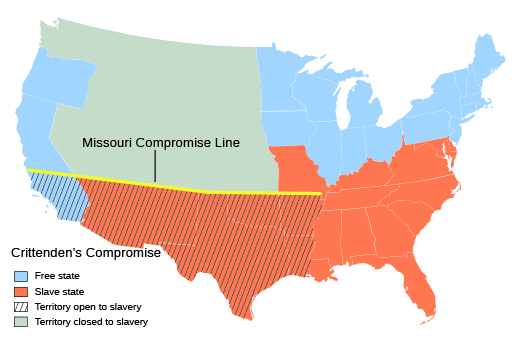
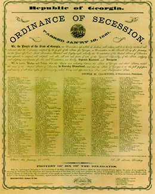
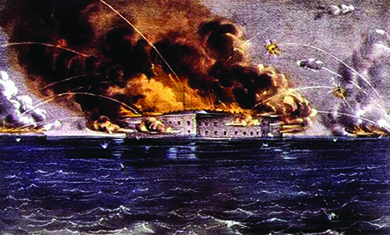

By the end of this section, you will be able to:
* Explain the major events that occurred during the Secession Crisis
* Describe the creation and founding principles of the Confederate States of America

 ![A timeline shows important events of the era. In 1860, South Carolina secedes from the Union. In 1861, Confederate forces fire on Fort Sumter, and the First Battle of Bull Run occurs; a painting of the attack on Fort Sumter and a painting of the Union forces in disarray at Bull Run are shown. In 1862, Confederate forces retreat after the Battle of Shiloh, General Robert E. Lee defends Richmond, and the Battle of Antietam occurs; a print of the Battle of Antietam is shown. In 1863, Abraham Lincoln signs the Emancipation Proclamation, racially motivated riots break out in New York, General Ulysses S. Grant leads the Vicksburg campaign, and the Battle of Gettysburg occurs; an image of the Emancipation Proclamation is shown. In 1864, General William Tecumseh Sherman invades the South, Atlanta falls to Sherman&#x2019;s forces, and Lincoln is reelected; a portrait of William Tecumseh Sherman is shown. In 1865, Confederate general Robert E. Lee surrenders; a painting of Robert E. Lee signing a document before Ulysses S. Grant and a group of Union soldiers is shown.](../resources/CNX_History_15_01_Timeline.jpg "(credit &#x201C;1865&#x201D;: modification of work by &#x201C;Alaskan Dude&#x201D;/Wikimedia Commons)"){: #CNX_History_15_01_Timeline}

The 1860 election of Abraham Lincoln was a turning point for the United States. Throughout the tumultuous 1850s, the Fire-Eaters of the southern states had been threatening to leave the Union. With Lincoln’s election, they prepared to make good on their threats. Indeed, the Republican president-elect appeared to be their worst nightmare. The Republican Party committed itself to keeping slavery out of the territories as the country expanded westward, a position that shocked southern sensibilities. Meanwhile, southern leaders suspected that Republican abolitionists would employ the violent tactics of John Brown to deprive southerners of their slave property. The threat posed by the Republican victory in the election of 1860 spurred eleven southern states to leave the Union to form the Confederate States of America, a new republic dedicated to maintaining and expanding slavery. The Union, led by President Lincoln, was unwilling to accept the departure of these states and committed itself to restoring the country. Beginning in 1861 and continuing until 1865, the United States engaged in a brutal Civil War that claimed the lives of over 600,000 soldiers. By 1863, the conflict had become not only a war to save the Union, but also a war to end slavery in the United States. Only after four years of fighting did the North prevail. The Union was preserved, and the institution of slavery had been destroyed in the nation.

# THE CAUSES OF THE CIVIL WAR

Lincoln’s election sparked the southern secession fever into flame, but it did not cause the Civil War. For decades before Lincoln took office, the sectional divisions in the country had been widening. Both the Northern and southern states engaged in inflammatory rhetoric and agitation, and violent emotions ran strong on both sides. Several factors played into the ultimate split between the North and the South.

One key irritant was the question of slavery’s expansion westward. The debate over whether new states would be slave or free reached back to the controversy over statehood for Missouri beginning in 1819 and Texas in the 1830s and early 1840s. This question arose again after the Mexican-American War (1846–1848), when the government debated whether slavery would be permitted in the territories taken from Mexico. Efforts in Congress to reach a compromise in 1850 fell back on the principle of popular sovereignty—letting the people in the new territories south of the 1820 Missouri Compromise line decide whether to allow slavery. This same principle came to be applied to the Kansas-Nebraska territories in 1854, a move that added fuel to the fire of sectional conflict by destroying the Missouri Compromise boundary and leading to the birth of the Republican Party. In the end, popular sovereignty proved to be no solution at all. This was especially true in “Bleeding Kansas” in the mid-1850s, as pro- and antislavery forces battled each another in an effort to gain the upper hand.

The small but very vocal abolitionist movement further contributed to the escalating tensions between the North and the South. Since the 1830s, abolitionists, led by journalist and reformer William Lloyd Garrison, had cast slavery as a national sin and called for its immediate end. For three decades, the abolitionists—a minority even within the antislavery movement—had had a significant effect on American society by bringing the evils of slavery into the public consciousness. By the 1850s, some of the most radical abolitionists, such as John Brown, had resorted to violence in their efforts to destroy the institution of slavery.

The formation of the Liberty Party (1840), the Free-Soil Party (1848), and the Republican Party (1854), all of which strongly opposed the spread of slavery to the West, brought the question solidly into the political arena. Although not all those who opposed the westward expansion of slavery had a strong abolitionist bent, the attempt to limit slaveholders’ control of their human property stiffened the resolve of southern leaders to defend their society at all costs. Prohibiting slavery’s expansion, they argued, ran counter to fundamental American property rights. Across the country, people of all political stripes worried that the nation’s arguments would cause irreparable rifts in the country.

Despite the ruptures and tensions, by the 1860s, some hope of healing the nation still existed. Before Lincoln took office, John Crittenden, a senator from Kentucky who had helped form the Constitutional Union Party during the 1860 presidential election, attempted to diffuse the explosive situation by offering six constitutional amendments and a series of resolutions, known as the **Crittenden Compromise**{: data-type="term"}. Crittenden’s goal was to keep the South from seceding, and his strategy was to transform the Constitution to explicitly protect slavery forever. Specifically, Crittenden proposed an amendment that would restore the 36°30′ line from the Missouri Compromise and extend it all the way to the Pacific Ocean, protecting and ensuring slavery south of the line while prohibiting it north of the line ([\[link\]](#CNX_History_15_01_Crittenden)). He further proposed an amendment that would prohibit Congress from abolishing slavery anywhere it already existed or from interfering with the interstate slave trade.

 {: #CNX_History_15_01_Crittenden}

Republicans, including President-elect Lincoln, rejected Crittenden’s proposals because they ran counter to the party’s goal of keeping slavery out of the territories. The southern states also rejected Crittenden’s attempts at compromise, because it would prevent slaveholders from taking their human chattel north of the 36°30′ line. On December 20, 1860, only a few days after Crittenden’s proposal was introduced in Congress, South Carolina began the march towards war when it seceded from the United States. Three more states of the Deep South—Mississippi, Florida, and Alabama—seceded before the U.S. Senate rejected Crittenden’s proposal on January 16, 1861. Georgia, Louisiana, and Texas joined them in rapid succession on January 19, January 26, and February 1, respectively ([\[link\]](#CNX_History_15_01_Georgia)). In many cases, these secessions occurred after extremely divided conventions and popular votes. A lack of unanimity prevailed in much of the South.

 {: #CNX_History_15_01_Georgia}

  
Explore the causes, battles, and aftermath of the Civil War at the [interactive website][1] offered by the National Parks Service.

# THE CREATION OF THE CONFEDERATE STATES OF AMERICA

The seven Deep South states that seceded quickly formed a new government. In the opinion of many Southern politicians, the federal Constitution that united the states as one nation was a contract by which individual states had agreed to be bound. However, they maintained, the states had not sacrificed their autonomy and could withdraw their consent to be controlled by the federal government. In their eyes, their actions were in keeping with the nature of the Constitution and the social contract theory of government that had influenced the founders of the American Republic.

The new nation formed by these men would not be a federal union, but a confederation. In a confederation, individual member states agree to unite under a central government for some purposes, such as defense, but to retain autonomy in other areas of government. In this way, states could protect themselves, and slavery, from interference by what they perceived to be an overbearing central government. The constitution of the Confederate States of America (CSA), or the **Confederacy**{: data-type="term"}, drafted at a convention in Montgomery, Alabama, in February 1861, closely followed the 1787 Constitution. The only real difference between the two documents centered on slavery. The Confederate Constitution declared that the new nation existed to defend and perpetuate racial slavery, and the leadership of the slaveholding class. Specifically, the constitution protected the interstate slave trade, guaranteed that slavery would exist in any new territory gained by the Confederacy, and, perhaps most importantly, in Article One, Section Nine, declared that “No . . . law impairing or denying the right of property in negro slaves shall be passed.” Beyond its focus on slavery, the Confederate Constitution resembled the 1787 U.S. Constitution. It allowed for a Congress composed of two chambers, a judicial branch, and an executive branch with a president to serve for six years.

The convention delegates chose Jefferson Davis of Mississippi to lead the new provisional government as president and Alexander Stephens of Georgia to serve as vice president until elections could be held in the spring and fall of 1861. By that time, four new states—Virginia, Arkansas, Tennessee, and North Carolina—had joined the CSA. As 1861 progressed, the Confederacy claimed Missouri and Kentucky, even though no ordinance of secession had been approved in those states. Southern nationalism ran high, and the Confederacy, buoyed by its sense of purpose, hoped that their new nation would achieve eminence in the world.

By the time Lincoln reached Washington, DC, in February 1861, the CSA had already been established. The new president confronted an unprecedented crisis. A conference held that month with delegates from the Southern states failed to secure a promise of peace or to restore the Union. On inauguration day, March 4, 1861, the new president repeated his views on slavery: “I have no purpose, directly or indirectly, to interfere with the institution of slavery in the States where it exists. I believe I have no lawful right to do so, and I have no inclination to do so.” His recognition of slavery in the South did nothing to mollify slaveholders, however, because Lincoln also pledged to keep slavery from expanding into the new western territories. Furthermore, in his inaugural address, Lincoln made clear his commitment to maintaining federal power against the secessionists working to destroy it. Lincoln declared that the Union could not be dissolved by individual state actions, and, therefore, secession was unconstitutional.

  
Read [Lincoln’s entire inaugural address][2] at the Yale Avalon project’s website. How would Lincoln’s audience have responded to this speech?

# FORT SUMTER

President Lincoln made it clear to Southern secessionists that he would fight to maintain federal property and to keep the Union intact. Other politicians, however, still hoped to avoid the use of force to resolve the crisis. In February 1861, in an effort to entice the rebellious states to return to the Union without resorting to force, Thomas Corwin, a representative from Ohio, introduced a proposal to amend the Constitution in the House of Representatives. His was but one of several measures proposed in January and February 1861, to head off the impending conflict and save the United States. The proposed amendment would have made it impossible for Congress to pass any law abolishing slavery. The proposal passed the House on February 28, 1861, and the Senate passed the proposal on March 2, 1861. It was then sent to the states to be ratified. Once ratified by three-quarters of state legislatures, it would become law. In his inaugural address, Lincoln stated that he had no objection to the amendment, and his predecessor James Buchanan had supported it. By the time of Lincoln’s inauguration, however, seven states had already left the Union. Of the remaining states, Ohio ratified the amendment in 1861, and Maryland and Illinois did so in 1862. Despite this effort at reconciliation, the Confederate states did not return to the Union.

Indeed, by the time of the Corwin amendment’s passage through Congress, Confederate forces in the Deep South had already begun to take over federal forts. The loss of **Fort Sumter**{: data-type="term"}, in the harbor of Charleston, South Carolina, proved to be the flashpoint in the contest between the new Confederacy and the federal government. A small Union garrison of fewer than one hundred soldiers and officers held the fort, making it a vulnerable target for the Confederacy. Fire-Eaters pressured Jefferson Davis to take Fort Sumter and thereby demonstrate the Confederate government’s resolve. Some also hoped that the Confederacy would gain foreign recognition, especially from Great Britain, by taking the fort in the South’s most important Atlantic port. The situation grew dire as local merchants refused to sell food to the fort’s Union soldiers, and by mid-April, the garrison’s supplies began to run out. President Lincoln let it be known to Confederate leaders that he planned to resupply the Union forces. His strategy was clear: The decision to start the war would rest squarely on the Confederates, not on the Union. On April 12, 1861, Confederate forces in Charleston began a bombardment of Fort Sumter ([\[link\]](#CNX_History_15_01_Sumter)). Two days later, the Union soldiers there surrendered.

 {: #CNX_History_15_01_Sumter}

The attack on Fort Sumter meant war had come, and on April 15, 1861, Lincoln called upon loyal states to supply armed forces to defeat the rebellion and regain Fort Sumter. Faced with the need to choose between the Confederacy and the Union, border states and those of the Upper South, which earlier had been reluctant to dissolve their ties with the United States, were inspired to take action. They quickly voted for secession. A convention in Virginia that had been assembled earlier to consider the question of secession voted to join the Confederacy on April 17, two days after Lincoln called for troops. Arkansas left the Union on May 6 along with Tennessee one day later. North Carolina followed on May 20.

Not all residents of the border states and the Upper South wished to join the Confederacy, however. Pro-Union feelings remained strong in Tennessee, especially in the eastern part of the state where slaves were few and consisted largely of house servants owned by the wealthy. The state of Virginia—home of revolutionary leaders and presidents such as George Washington, Thomas Jefferson, James Madison, and James Monroe—literally was split on the issue of secession. Residents in the north and west of the state, where few slaveholders resided, rejected secession. These counties subsequently united to form “West Virginia,” which entered the Union as a free state in 1863. The rest of Virginia, including the historic lands along the Chesapeake Bay that were home to such early American settlements as Jamestown and Williamsburg, joined the Confederacy. The addition of this area gave the Confederacy even greater hope and brought General Robert E. Lee, arguably the best military commander of the day, to their side. In addition, the secession of Virginia brought Washington, DC, perilously close to the Confederacy, and fears that the border state of Maryland would also join the CSA, thus trapping the U.S. capital within Confederate territories, plagued Lincoln.

The Confederacy also gained the backing of the Five Civilized Tribes, as they were called, in the Indian Territory. The Five Civilized Tribes comprised the Choctaws, Chickasaws, Creeks, Seminoles, and Cherokees. The tribes supported slavery and many members owned slaves. These Indian slaveholders, who had been forced from their lands in Georgia and elsewhere in the Deep South during the presidency of Andrew Jackson, now found unprecedented common cause with white slaveholders. The CSA even allowed them to send delegates to the Confederate Congress.

While most slaveholding states joined the Confederacy, four crucial slave states remained in the Union ([\[link\]](#CNX_History_15_01_Confed)). Delaware, which was technically a slave state despite its tiny slave population, never voted to secede. Maryland, despite deep divisions, remained in the Union as well. Missouri became the site of vicious fighting and the home of pro-Confederate guerillas but never joined the Confederacy. Kentucky declared itself neutral, although that did little to stop the fighting that occurred within the state. In all, these four states deprived the Confederacy of key resources and soldiers.

 {: #CNX_History_15_01_Confed}

# Section Summary

The election of Abraham Lincoln to the presidency in 1860 proved to be a watershed event. While it did not cause the Civil War, it was the culmination of increasing tensions between the proslavery South and the antislavery North. Before Lincoln had even taken office, seven Deep South states had seceded from the Union to form the CSA, dedicated to maintaining racial slavery and white supremacy. Last-minute efforts to reach a compromise, such as the proposal by Senator Crittenden and the Corwin amendment, went nowhere. The time for compromise had come to an end. With the Confederate attack on Fort Sumter, the Civil War began.

# Review Questions

Which of the following does *not* represent a goal of the Confederate States of America?

1.  to protect slavery from any effort to abolish it
2.  to protect the domestic slave trade
3.  to ensure that slavery would be allowed to spread into western territories
4.  to ensure that the international slave trade would be allowed to continue
{: data-number-style="upper-alpha"}

D

Which was *not* a provision of the Crittenden Compromise?

1.  that the Five Civilized Tribes would be admitted into the Confederacy
2.  that the 36°30′ line from the Missouri Compromise would be restored and extended
3.  that Congress would be prohibited from abolishing slavery where it already existed
4.  that the interstate slave trade would be allowed to continue
{: data-number-style="upper-alpha"}

A

Why did the states of the Deep South secede from the Union sooner than the states of the Upper South and the border states?

Slavery was more deeply entrenched in the Deep South than it was in the Upper South or the border states. The Deep South was home to larger numbers of both slaveholders and slaves. Pro-Union sentiment remained strong in parts of the Upper South and border states, particularly those areas with smaller populations of slaveholders.

## Glossary
{: data-type="glossary-title"}

Confederacy
: the new nation formed by the seceding southern states, also known as the Confederate States of America (CSA)
{: .definition}

Crittenden Compromise
: a compromise, suggested by Kentucky senator John Crittenden, that would restore the 36°30′ line from the Missouri Compromise and extend it to the Pacific Ocean, allowing slavery to expand into the southwestern territories
{: .definition}

Fort Sumter
: a fort in the harbor of Charleston, South Carolina, where the Union garrison came under siege by Confederate forces in an attack on April 12, 1861, beginning the Civil War
{: .definition}

[1]: http://openstaxcollege.org/l/15Causes
[2]: http://openstaxcollege.org/l/15LincAddress
