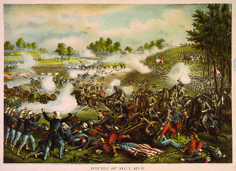

By the end of this section, you will be able to:
* Assess the strengths and weaknesses of the Confederacy and the Union
* Explain the strategic importance of the Battle of Bull Run and the Battle of Shiloh

In 1861, enthusiasm for war ran high on both sides. The North fought to restore the Union, which Lincoln declared could never be broken. The Confederacy, which by the summer of 1861 consisted of eleven states, fought for its independence from the United States. The continuation of slavery was a central issue in the war, of course, although abolitionism and western expansion also played roles, and Northerners and Southerners alike flocked eagerly to the conflict. Both sides thought it would be over quickly. Militarily, however, the North and South were more equally matched than Lincoln had realized, and it soon became clear that the war effort would be neither brief nor painless. In 1861, Americans in both the North and South romanticized war as noble and positive. Soon the carnage and slaughter would awaken them to the horrors of war.

# THE FIRST BATTLE OF BULL RUN

After the fall of Fort Sumter on April 15, 1861, Lincoln called for seventy-five thousand volunteers from state militias to join federal forces. His goal was a ninety-day campaign to put down the Southern rebellion. The response from state militias was overwhelming, and the number of Northern troops exceeded the requisition. Also in April, Lincoln put in place a naval blockade of the South, a move that gave tacit recognition of the Confederacy while providing a legal excuse for the British and the French to trade with Southerners. The Confederacy responded to the blockade by declaring that a state of war existed with the United States. This official pronouncement confirmed the beginning of the Civil War. Men rushed to enlist, and the Confederacy turned away tens of thousands who hoped to defend the new nation.

Many believed that a single, heroic battle would decide the contest. Some questioned how committed Southerners really were to their cause. Northerners hoped that most Southerners would not actually fire on the American flag. Meanwhile, Lincoln and military leaders in the North hoped a quick blow to the South, especially if they could capture the Confederacy’s new capital of Richmond, Virginia, would end the rebellion before it went any further. On July 21, 1861, the two armies met near Manassas, Virginia, along **Bull Run Creek**{: data-type="term" .no-emphasis}, only thirty miles from Washington, DC. So great was the belief that this would be a climactic Union victory that many Washington socialites and politicians brought picnic lunches to a nearby area, hoping to witness history unfolding before them. At the First Battle of Bull Run, also known as First Manassas, some sixty thousand troops assembled, most of whom had never seen combat, and each side sent eighteen thousand into the fray. The Union forces attacked first, only to be pushed back. The Confederate forces then carried the day, sending the Union soldiers and Washington, DC, onlookers scrambling back from Virginia and destroying Union hopes of a quick, decisive victory. Instead, the war would drag on for four long, deadly years ([\[link\]](#CNX_History_15_02_BullRun)).

 {: #CNX_History_15_02_BullRun}

# BALANCE SHEET: THE UNION AND THE CONFEDERACY

As it became clearer that the Union would not be dealing with an easily quashed rebellion, the two sides assessed their strengths and weaknesses. At the onset on the war, in 1861 and 1862, they stood as relatively equal combatants.

The Confederates had the advantage of being able to wage a defensive war, rather than an offensive one. They had to protect and preserve their new boundaries, but they did not have to be the aggressors against the Union. The war would be fought primarily in the South, which gave the Confederates the advantages of the knowledge of the terrain and the support of the civilian population. Further, the vast coastline from Texas to Virginia offered ample opportunities to evade the Union blockade. And with the addition of the Upper South states, especially Virginia, North Carolina, Tennessee, and Arkansas, the Confederacy gained a much larger share of natural resources and industrial might than the Deep South states could muster.

Still, the Confederacy had disadvantages. The South’s economy depended heavily on the export of cotton, but with the naval blockade, the flow of cotton to England, the region’s primary importer, came to an end. The blockade also made it difficult to import manufactured goods. Although the secession of the Upper South added some industrial assets to the Confederacy, overall, the South lacked substantive industry or an extensive railroad infrastructure to move men and supplies. To deal with the lack of commerce and the resulting lack of funds, the Confederate government began printing paper money, leading to runaway inflation ([\[link\]](#CNX_History_15_02_Money)). The advantage that came from fighting on home territory quickly turned to a disadvantage when Confederate armies were defeated and Union forces destroyed Southern farms and towns, and forced Southern civilians to take to the road as refugees. Finally, the population of the South stood at fewer than nine million people, of whom nearly four million were black slaves, compared to over twenty million residents in the North. These limited numbers became a major factor as the war dragged on and the death toll rose.

 {: #CNX_History_15_02_Money}

The Union side held many advantages as well. Its larger population, bolstered by continued immigration from Europe throughout the 1860s, gave it greater manpower reserves to draw upon. The North’s greater industrial capabilities and extensive railroad grid made it far better able to mobilize men and supplies for the war effort. The Industrial Revolution and the transportation revolution, beginning in the 1820s and continuing over the next several decades, had transformed the North. Throughout the war, the North was able to produce more war materials and move goods more quickly than the South. Furthermore, the farms of New England, the Mid-Atlantic, the Old Northwest, and the prairie states supplied Northern civilians and Union troops with abundant food throughout the war. Food shortages and hungry civilians were common in the South, where the best land was devoted to raising cotton, but not in the North.

Unlike the South, however, which could hunker down to defend itself and needed to maintain relatively short supply lines, the North had to go forth and conquer. Union armies had to establish long supply lines, and Union soldiers had to fight on unfamiliar ground and contend with a hostile civilian population off the battlefield. Furthermore, to restore the Union—Lincoln’s overriding goal, in 1861—the United States, after defeating the Southern forces, would then need to pacify a conquered Confederacy, an area of over half a million square miles with nearly nine million residents. In short, although it had better resources and a larger population, the Union faced a daunting task against the well-positioned Confederacy.

# MILITARY STALEMATE

The military forces of the Confederacy and the Union battled in 1861 and early 1862 without either side gaining the upper hand. The majority of military leaders on both sides had received the same military education and often knew one another personally, either from their time as students at West Point or as commanding officers in the Mexican-American War. This familiarity allowed them to anticipate each other’s strategies. Both sides believed in the use of concentrated armies charged with taking the capital city of the enemy. For the Union, this meant the capture of the Confederate capital in Richmond, Virginia, whereas Washington, DC, stood as the prize for Confederate forces. After hopes of a quick victory faded at Bull Run, the months dragged on without any major movement on either side ([\[link\]](#CNX_History_15_02_Inactivity)).

 {: #CNX_History_15_02_Inactivity}

General George B. McClellan, the **general in chief**{: data-type="term"} of the army, responsible for overall control of Union land forces, proved especially reluctant to engage in battle with the Confederates. In direct command of the **Army of the Potomac**{: data-type="term"}, the Union fighting force operating outside Washington, DC, McClellan believed, incorrectly, that Confederate forces were too strong to defeat and was reluctant to risk his troops in battle. His cautious nature made him popular with his men but not with the president or Congress. By 1862, however, both President Lincoln and the new Secretary of War Edwin Stanton had tired of waiting. The Union put forward a new effort to bolster troop strength, enlisting one million men to serve for three-year stints in the Army of the Potomac. In January 1862, Lincoln and Stanton ordered McClellan to invade the Confederacy with the goal of capturing Richmond.

To that end, General McClellan slowly moved 100,000 soldiers of the Army of the Potomac toward Richmond but stopped a few miles outside the city. As he did so, a Confederate force led by Thomas “Stonewall” Jackson moved north to take Washington, DC. To fend off Jackson’s attack, somewhere between one-quarter and one-third of McClellan’s soldiers, led by Major General Irvin McDowell, returned to defend the nation’s capital, a move that Jackson hoped would leave the remaining troops near Richmond more vulnerable. Having succeeding in drawing off a sizable portion of the Union force, he joined General Lee to launch an attack on McClellan’s remaining soldiers near Richmond. From June 25 to July 1, 1862, the two sides engaged in the brutal Seven Days Battles that killed or wounded almost twenty thousand Confederate and ten thousand Union soldiers. McClellan’s army finally returned north, having failed to take Richmond.

General Lee, flush from his success at keeping McClellan out of Richmond, tried to capitalize on the Union’s failure by taking the fighting northward. He moved his forces into northern Virginia, where, at the Second Battle of Bull Run, the Confederates again defeated the Union forces. Lee then pressed into Maryland, where his troops met the much larger Union forces near Sharpsburg, at Antietam Creek. The ensuing one-day battle on September 17, 1862, led to a tremendous loss of life. Although there are varying opinions about the total number of deaths, eight thousand soldiers were killed or wounded, more than on any other single day of combat. Once again, McClellan, mistakenly believing that the Confederate troops outnumbered his own, held back a significant portion of his forces. Lee withdrew from the field first, but McClellan, fearing he was outnumbered, refused to pursue him.

The Union army’s inability to destroy Lee’s army at **Antietam**{: data-type="term" .no-emphasis} made it clear to Lincoln that McClellan would never win the war, and the president was forced to seek a replacement. Lincoln wanted someone who could deliver a decisive Union victory. He also personally disliked McClellan, who referred to the president as a “baboon” and a “gorilla,” and constantly criticized his decisions. Lincoln chose General Ambrose E. Burnside to replace McClellan as commander of the Army of the Potomac, but Burnside’s efforts to push into Virginia failed in December 1862, as Confederates held their position at Fredericksburg and devastated Burnside’s forces with heavy artillery fire. The Union’s defeat at Fredericksburg harmed morale in the North but bolstered Confederate spirits. By the end of 1862, the Confederates were still holding their ground in Virginia. Burnside’s failure led Lincoln to make another change in leadership, and Joseph “Fighting Joe” Hooker took over command of the Army of the Potomac in January 1863.

General Ulysses S. Grant’s **Army of the West**{: data-type="term"}, operating in Kentucky, Tennessee, and the Mississippi River Valley, had been more successful. In the western campaign, the goal of both the Union and the Confederacy was to gain control of the major rivers in the west, especially the Mississippi. If the Union could control the Mississippi, the Confederacy would be split in two. The fighting in this campaign initially centered in Tennessee, where Union forces commanded by Grant pushed Confederate troops back and gained control of the state. The major battle in the western theater took place at Pittsburgh Landing, Tennessee, on April 6 and 7, 1862. Grant’s army was camped on the west side of the Tennessee River near a small log church called Shiloh, which gave the battle its name. On Sunday morning, April 6, Confederate forces under General Albert Sidney Johnston attacked Grant’s encampment with the goal of separating them from their supply line on the Tennessee River and driving them into the swamps on the river’s western side, where they could be destroyed. Union general William Tecumseh Sherman tried to rally the Union forces as Grant, who had been convalescing from an injured leg when the attack began and was unable to walk without crutches, called for reinforcements and tried to mount a defense. Many of Union troops fled in terror.

Unfortunately for the Confederates, Johnston was killed on the afternoon of the first day. Leadership of the Southern forces fell to General P. G. T. Beauregard, who ordered an assault at the end of that day. This assault was so desperate that one of the two attacking columns did not even have ammunition. Heavily reinforced Union forces counterattacked the next day, and the Confederate forces were routed. Grant had maintained the Union foothold in the western part of the Confederacy. The North could now concentrate on its efforts to gain control of the Mississippi River, splitting the Confederacy in two and depriving it of its most important water route.

  
Read a [first-hand account][1] from a Confederate soldier at the Battle at Shiloh, followed by the [perspective of a Union soldier][2] at the same battle.

In the spring and summer of 1862, the Union was successful in gaining control of part of the Mississippi River. In April 1862, the Union navy under Admiral David Farragut fought its way past the forts that guarded New Orleans and fired naval guns upon the below-sea-level city. When it became obvious that New Orleans could no longer be defended, Confederate major general Marshall Lovell sent his artillery upriver to Vicksburg, Mississippi. Armed civilians in New Orleans fought the Union forces that entered the city. They also destroyed ships and military supplies that might be used by the Union. Upriver, Union naval forces also bombarded Fort Pillow, forty miles from Memphis, Tennessee, a Southern industrial center and one of the largest cities in the Confederacy. On June 4, 1862, the Confederate defenders abandoned the fort. On June 6, Memphis fell to the Union after the ships defending it were destroyed.

# Section Summary

Many in both the North and the South believed that a short, decisive confrontation in 1861 would settle the question of the Confederacy. These expectations did not match reality, however, and the war dragged on into a second year. Both sides mobilized, with advantages and disadvantages on each side that led to a rough equilibrium. The losses of battles at Manassas and Fredericksburg, Virginia, kept the North from achieving the speedy victory its generals had hoped for, but the Union did make gains and continued to press forward. While they could not capture the Southern capital of Richmond, they were victorious in the Battle of Shiloh and captured New Orleans and Memphis. Thus, the Confederates lost major ground on the western front.

# Review Questions

All the following were strengths of the Union *except* \_\_\_\_\_\_\_\_.

1.  a large population
2.  substantial industry
3.  an extensive railroad
4.  the ability to fight defensively, rather than offensively
{: data-number-style="upper-alpha"}

D

All the following were strengths of the Confederacy *except* \_\_\_\_\_\_\_\_.

1.  the ability to wage a defensive war
2.  shorter supply lines
3.  the resources of the Upper South states
4.  a strong navy
{: data-number-style="upper-alpha"}

D

What military successes and defeats did the Union experience in 1862?

In the eastern part of the Confederacy, the Army of the Potomac met with mixed success. The Union army failed to capture Richmond and won at Antietam only because the Confederates withdrew from the field first. In the western part of the Confederacy, the Army of the West won the Battle of Shiloh, and the Union navy captured New Orleans and Memphis.

## Glossary
{: data-type="glossary-title"}

Army of the Potomac
: the Union fighting force operating outside Washington, DC
{: .definition}

Army of the West
: the Union fighting force operating in Kentucky, Tennessee, and the Mississippi River Valley
{: .definition}

general in chief
: the commander of army land forces
{: .definition}

[1]: http://openstaxcollege.org/l/15HMStanley
[2]: http://openstaxcollege.org/l/15CFBoyd
