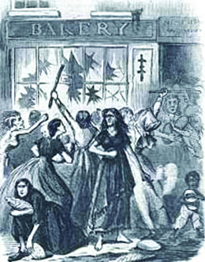
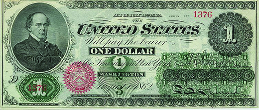
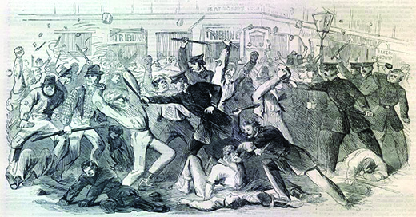
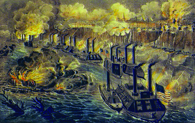

By the end of this section, you will be able to:
* Explain what is meant by the term “total war” and provide examples
* Describe mobilization efforts in the North and the South
* Explain why 1863 was a pivotal year in the war

Wars have their own logic; they last far longer than anyone anticipates at the beginning of hostilities. As they drag on, the energy and zeal that marked the entry into warfare often wane, as losses increase and people on both sides suffer the tolls of war. The American Civil War is a case study of this characteristic of modern war.

Although Northerners and Southerners both anticipated that the battle between the Confederacy and the Union would be settled quickly, it soon became clear to all that there was no resolution in sight. The longer the war continued, the more it began to affect life in both the North and the South. Increased need for manpower, the issue of slavery, and the ongoing challenges of keeping the war effort going changed the way life on both sides as the conflict progressed.

# MASS MOBILIZATION

By late 1862, the course of the war had changed to take on the characteristics of **total war**{: data-type="term"}, in which armies attempt to demoralize the enemy by both striking military targets and disrupting their opponent’s ability to wage war through destruction of their resources. In this type of war, armies often make no distinction between civilian and military targets. Both the Union and Confederate forces moved toward total war, although neither side ever entirely abolished the distinction between military and civilian. Total war also requires governments to mobilize all resources, extending their reach into their citizens’ lives as never before. Another reality of war that became apparent in 1862 and beyond was the influence of combat on the size and scope of government. Both the Confederacy and the Union governments had to continue to grow in order to manage the logistics of recruiting men and maintaining, feeding, and equipping an army.

## Confederate Mobilization

The Confederate government in Richmond, Virginia, exercised sweeping powers to ensure victory, in stark contradiction to the states’ rights sentiments held by many Southern leaders. The initial emotional outburst of enthusiasm for war in the Confederacy waned, and the Confederate government instituted a military draft in April 1862. Under the terms of the draft, all men between the ages of eighteen and thirty-five would serve three years. The draft had a different effect on men of different socioeconomic classes. One loophole permitted men to hire substitutes instead of serving in the Confederate army. This provision favored the wealthy over the poor, and led to much resentment and resistance. Exercising its power over the states, the Confederate Congress denied state efforts to circumvent the draft.

In order to fund the war, the Confederate government also took over the South’s economy. The government ran Southern industry and built substantial transportation and industrial infrastructure to make the weapons of war. Over the objections of slaveholders, it impressed slaves, seizing these workers from their owners and forcing them to work on fortifications and rail lines. Concerned about the resistance to and unhappiness with the government measures, in 1862, the Confederate Congress gave President Davis the power to suspend the writ of **habeas corpus**{: data-type="term"}, the right of those arrested to be brought before a judge or court to determine whether there is cause to hold the prisoner. With a stated goal of bolstering national security in the fledgling republic, this change meant that the Confederacy could arrest and detain indefinitely any suspected enemy without giving a reason. This growth of the Confederate central government stood as a glaring contradiction to the earlier states’ rights argument of pro-Confederate advocates.

The war efforts were costing the new nation dearly. Nevertheless, the Confederate Congress heeded the pleas of wealthy plantation owners and refused to place a tax on slaves or cotton, despite the Confederacy’s desperate need for the revenue that such a tax would have raised. Instead, the Confederacy drafted a taxation plan that kept the Southern elite happy but in no way met the needs of the war. The government also resorted to printing immense amounts of paper money, which quickly led to runaway inflation. Food prices soared, and poor, white Southerners faced starvation. In April 1863, thousands of hungry people rioted in Richmond, Virginia ([\[link\]](#CNX_History_15_03_BreadRiots)). Many of the rioters were mothers who could not feed their children. The riot ended when President Davis threatened to have Confederate forces open fire on the crowds.

 {: #CNX_History_15_03_BreadRiots}

One of the reasons that the Confederacy was so economically devastated was its ill-advised gamble that cotton sales would continue during the war. The government had high hopes that Great Britain and France, which both used cotton as the raw material in their textile mills, would ensure the South’s economic strength—and therefore victory in the war—by continuing to buy. Furthermore, the Confederate government hoped that Great Britain and France would make loans to their new nation in order to ensure the continued flow of raw materials. These hopes were never realized. Great Britain in particular did not wish to risk war with the United States, which would have meant the invasion of Canada. The United States was also a major source of grain for Britain and an important purchaser of British goods. Furthermore, the blockade made Southern trade with Europe difficult. Instead, Great Britain, the major consumer of American cotton, found alternate sources in India and Egypt, leaving the South without the income or alliance it had anticipated.

Dissent within the Confederacy also affected the South’s ability to fight the war. Confederate politicians disagreed over the amount of power that the central government should be allowed to exercise. Many states’ rights advocates, who favored a weak central government and supported the sovereignty of individual states, resented President Davis’s efforts to conscript troops, impose taxation to pay for the war, and requisition necessary resources. Governors in the Confederate states often proved reluctant to provide supplies or troops for the use of the Confederate government. Even Jefferson Davis’s vice president Alexander Stephens opposed conscription, the seizure of slave property to work for the Confederacy, and suspension of habeas corpus. Class divisions also divided Confederates. Poor whites resented the ability of wealthy slaveholders to excuse themselves from military service. Racial tensions plagued the South as well. On those occasions when free blacks volunteered to serve in the Confederate army, they were turned away, and enslaved African Americans were regarded with fear and suspicion, as whites whispered among themselves about the possibility of slave insurrections.

## Union Mobilization

Mobilization for war proved to be easier in the North than it was in the South. During the war, the federal government in Washington, DC, like its Southern counterpart, undertook a wide range of efforts to ensure its victory over the Confederacy. To fund the war effort and finance the expansion of Union infrastructure, Republicans in Congress drastically expanded government activism, impacting citizens’ everyday lives through measures such as new types of taxation. The government also contracted with major suppliers of food, weapons, and other needed materials. Virtually every sector of the Northern economy became linked to the war effort.

In keeping with their longstanding objective of keeping slavery out of the newly settled western territories, the Republicans in Congress (the dominant party) passed several measures in 1862. First, the Homestead Act provided generous inducements for Northerners to relocate and farm in the West. Settlers could lay claim to 160 acres of federal land by residing on the property for five years and improving it. The act not only motivated free-labor farmers to move west, but it also aimed to increase agricultural output for the war effort. The federal government also turned its attention to creating a transcontinental railroad to facilitate the movement of people and goods across the country. Congress chartered two companies, the Union Pacific and the Central Pacific, and provided generous funds for these two businesses to connect the country by rail.

The Republican emphasis on free labor, rather than slave labor, also influenced the 1862 Land Grant College Act, commonly known as the **Morrill Act**{: data-type="term" .no-emphasis} after its author, Vermont Republican senator Justin Smith Morrill. The measure provided for the creation of agricultural colleges, funded through federal grants, to teach the latest agricultural techniques. Each state in the Union would be granted thirty thousand acres of federal land for the use of these institutions of higher education.

Congress paid for the war using several strategies. They levied a tax on the income of the wealthy, as well as a tax on all inheritances. They also put high tariffs in place. Finally, they passed two National Bank Acts, one in 1863 and one in 1864, calling on the U.S. Treasury to issue war bonds and on Union banks to buy the bonds. A Union campaign to convince individuals to buy the bonds helped increase sales. The Republicans also passed the Legal Tender Act of 1862, calling for paper money—known as **greenbacks**{: data-type="term"}—to be printed [\[link\]](#CNX_History_15_03_Greenback)). Some $150 million worth of greenbacks became legal tender, and the Northern economy boomed, although high inflation also resulted.

 {: #CNX_History_15_03_Greenback}

Like the Confederacy, the Union turned to conscription to provide the troops needed for the war. In March 1863, Congress passed the Enrollment Act, requiring all unmarried men between the ages of twenty and twenty-five, and all married men between the ages of thirty-five and forty-five—including immigrants who had filed for citizenship—to register with the Union to fight in the Civil War. All who registered were subject to military service, and draftees were selected by a lottery system ([\[link\]](#CNX_History_15_03_Draft)). As in the South, a loophole in the law allowed individuals to hire substitutes if they could afford it. Others could avoid enlistment by paying $300 to the federal government. In keeping with the Supreme Court decision in *Dred Scott v. Sandford*, African Americans were not citizens and were therefore exempt from the draft.

 ![Two Union recruitment posters are shown. Poster (a), which depicts a soldier mounted on a horse, contains the text &#x201C;Cavalry! To the field! 20 Recruits Wanted / 1st Battalion N.Y. Mounted Rifles!&#x201D; Poster B, which depicts an eagle holding a banner bearing the words &#x201C;The Union / it must and shall / be preserved,&#x201D; contains the text &#x201C;To Arms! To Arms! Your Country Calls. Volunteers for the war are wanted immediately! The Union must and shall be preserved! Those who would escape being drafted after the 10th of August, should enroll in the independent company, now raising for the war! Those who come to their country&#x2019;s call in the hour of her peril will live in the pages of her history. The Roll is now open, and will be found with the undersigned. A meeting will be held at \[blank\]. To be addressed by \[blank\]. The $100 bounty paid by the government, and the advance pay and enlisting premium will be paid to each recruit on being mustered into service. Capt. Bill Yerkes. Principal recruiting office: &#x2013;WM. Fenton&#x2019;s Hotel. Printed at the &#x2018;Democrat&#x2019; office, Doylestown, Bucks County, PA., by W.W.H. Davis.&#x201D;](../resources/CNX_History_15_03_Draft.jpg "The Union tried to provide additional incentives for soldiers, in the form of bounties, to enlist without waiting for the draft, as shown in recruitment posters (a) and (b)."){: #CNX_History_15_03_Draft}

Like the Confederacy, the Union also took the step of suspending habeas corpus rights, so those suspected of pro-Confederate sympathies could be arrested and held without being given the reason. Lincoln had selectively suspended the writ of habeas corpus in the slave state of Maryland, home to many Confederate sympathizers, in 1861 and 1862, in an effort to ensure that the Union capital would be safe. In March 1863, he signed into law the Habeas Corpus Suspension Act, giving him the power to detain suspected Confederate operatives throughout the Union. The Lincoln administration also closed down three hundred newspapers as a national security measure during the war.

In both the North and the South, the Civil War dramatically increased the power of the belligerent governments. Breaking all past precedents in American history, both the Confederacy and the Union employed the power of their central governments to mobilize resources and citizens.

## Women’s Mobilization

As men on both sides mobilized for the war, so did women. In both the North and the South, women were forced to take over farms and businesses abandoned by their husbands as they left for war. Women organized themselves into ladies’ aid societies to sew uniforms, knit socks, and raise money to purchase necessities for the troops. In the South, women took wounded soldiers into their homes to nurse. In the North, women volunteered for the United States Sanitary Commission, which formed in June 1861. They inspected military camps with the goal of improving cleanliness and reducing the number of soldiers who died from disease, the most common cause of death in the war. They also raised money to buy medical supplies and helped with the injured. Other women found jobs in the Union army as cooks and laundresses. Thousands volunteered to care for the sick and wounded in response to a call by reformer Dorothea Dix, who was placed in charge of the Union army’s nurses. According to rumor, Dix sought respectable women over the age of thirty who were “plain almost to repulsion in dress” and thus could be trusted not to form romantic liaisons with soldiers. Women on both sides also acted as spies and, disguised as men, engaged in combat.

# EMANCIPATION

Early in the war, President Lincoln approached the issue of slavery cautiously. While he disapproved of slavery personally, he did not believe that he had the authority to abolish it. Furthermore, he feared that making the abolition of slavery an objective of the war would cause the border slave states to join the Confederacy. His one objective in 1861 and 1862 was to restore the Union.

Lincoln’s Evolving Thoughts on Slavery

President Lincoln wrote the following letter to newspaper editor Horace Greeley on August 22, 1862. In it, Lincoln states his position on slavery, which is notable for being a middle-of-the-road stance. Lincoln’s later public speeches on the issue take the more strident antislavery tone for which he is remembered.

\> I would save the Union. I would save it the shortest way under the Constitution. The sooner the national authority can be restored the nearer the Union will be “the Union as it was.” If there be those who would not save the Union unless they could at the same time save Slavery, I do not agree with them. If there be those who would not save the Union unless they could at the same time destroy Slavery, I do not agree with them. My paramount object in this struggle is to save the Union, and is not either to save or destroy Slavery. If I could save the Union without freeing any slave, I would do it, and if I could save it by freeing all the slaves, I would do it, and if I could save it by freeing some and leaving others alone, I would also do that. What I do about Slavery and the colored race, I do because I believe it helps to save this Union, and what I forbear, I forbear because I do not believe it would help to save the Union. I shall do less whenever I shall believe what I am doing hurts the cause, and I shall do more whenever I shall believe doing more will help the cause. I shall try to correct errors when shown to be errors; and I shall adopt new views so fast as they shall appear to be true views. I have here stated my purpose according to my view of official duty, and I intend no modification of my oft-expressed personal wish that all men, everywhere, could be free. Yours, A. LINCOLN.

How would you characterize Lincoln’s public position in August 1862? What was he prepared to do for slaves, and under what conditions?

Since the beginning of the war, thousands of slaves had fled to the safety of Union lines. In May 1861, Union general Benjamin Butler and others labeled these refugees from slavery **contrabands**{: data-type="term"}. Butler reasoned that since Southern states had left the United States, he was not obliged to follow federal fugitive slave laws. Slaves who made it through the Union lines were shielded by the U.S. military and not returned to slavery. The intent was not only to assist slaves but also to deprive the South of a valuable source of manpower.

Congress began to define the status of these ex-slaves in 1861 and 1862. In August 1861, legislators approved the Confiscation Act of 1861, empowering the Union to seize property, including slaves, used by the Confederacy. The Republican-dominated Congress took additional steps, abolishing slavery in Washington, DC, in April 1862. Congress passed a second Confiscation Act in July 1862, which extended freedom to runaway slaves and those captured by Union armies. In that month, Congress also addressed the issue of slavery in the West, banning the practice in the territories. This federal law made the 1846 Wilmot Proviso and the dreams of the Free-Soil Party a reality. However, even as the Union government took steps to aid individual slaves and to limit the practice of slavery, it passed no measure to address the institution of slavery as a whole.

Lincoln moved slowly and cautiously on the issue of abolition. His primary concern was the cohesion of the Union and the bringing of the Southern states back into the fold. However, as the war dragged on and many thousands of contrabands made their way north, Republicans in Congress continued to call for the end of slavery. Throughout his political career, Lincoln’s plans for former slaves had been to send them to Liberia. As late as August 1862, he had hoped to interest African Americans in building a colony for former slaves in Central America, an idea that found favor neither with black leaders nor with abolitionists, and thus was abandoned by Lincoln. Responding to Congressional demands for an end to slavery, Lincoln presented an ultimatum to the Confederates on September 22, 1862, shortly after the Confederate retreat at Antietam. He gave the Confederate states until January 1, 1863, to rejoin the Union. If they did, slavery would continue in the slave states. If they refused to rejoin, however, the war would continue and all slaves would be freed at its conclusion. The Confederacy took no action. It had committed itself to maintaining its independence and had no interest in the president’s ultimatum.

On January 1, 1863, Lincoln made good on his promise and signed the **Emancipation Proclamation**{: data-type="term"}. It stated “That on the first day of January, in the year of our Lord one thousand eight hundred and sixty-three, all persons held as slaves within any State or designated part of a State, the people whereof shall then be in rebellion against the United States, shall be then, thenceforward, and forever free.” The proclamation did not immediately free the slaves in the Confederate states. Although they were in rebellion against the United States, the lack of the Union army’s presence in such areas meant that the president’s directive could not be enforced. The proclamation also did not free slaves in the border states, because these states were not, by definition, in rebellion. Lincoln relied on his powers as commander-in-chief in issuing the Emancipation Proclamation. He knew the proclamation could be easily challenged in court, but by excluding the territories still outside his control, slaveholders and slave governments could not sue him. Moreover, slave states in the Union, such as Kentucky, could not sue because the proclamation did not apply to them. Slaveholders in Kentucky knew full well that if the institution were abolished throughout the South, it would not survive in a handful of border territories. Despite the limits of the proclamation, Lincoln dramatically shifted the objective of the war increasingly toward ending slavery. The Emancipation Proclamation became a monumental step forward on the road to changing the character of the United States.

  
Read through the full text of the [Emancipation Proclamation][1] at the National Archives website.

The proclamation generated quick and dramatic reactions. The news created euphoria among slaves, as it signaled the eventual end of their bondage. Predictably, Confederate leaders raged against the proclamation, reinforcing their commitment to fight to maintain slavery, the foundation of the Confederacy. In the North, opinions split widely on the issue. Abolitionists praised Lincoln’s actions, which they saw as the fulfillment of their long campaign to strike down an immoral institution. But other Northerners, especially Irish, working-class, urban dwellers loyal to the Democratic Party and others with racist beliefs, hated the new goal of emancipation and found the idea of freed slaves repugnant. At its core, much of this racism had an economic foundation: Many Northerners feared competing with emancipated slaves for scarce jobs.

In New York City, the Emancipation Proclamation, combined with unhappiness over the Union draft, which began in March 1863, fanned the flames of white racism. Many New Yorkers supported the Confederacy for business reasons, and, in 1861, the city’s mayor actually suggested that New York City leave the Union. On July 13, 1863, two days after the first draft lottery took place, this racial hatred erupted into violence. A volunteer fire company whose commander had been drafted initiated a riot, and the violence spread quickly across the city. The rioters chose targets associated either with the Union army or with African Americans. An armory was destroyed, as was a Brooks Brothers’ store, which supplied uniforms to the army. White mobs attacked and killed black New Yorkers and destroyed an African American orphanage ([\[link\]](#CNX_History_15_03_RaceRiot)). On the fourth day of the riots, federal troops dispatched by Lincoln arrived in the city and ended the violence. Millions of dollars in property had been destroyed. More than one hundred people died, approximately one thousand were left injured, and about one-fifth of the city’s African American population fled New York in fear.

 {: #CNX_History_15_03_RaceRiot}

# UNION ADVANCES

The war in the west continued in favor of the North in 1863. At the start of the year, Union forces controlled much of the Mississippi River. In the spring and summer of 1862, they had captured New Orleans—the most important port in the Confederacy, through which cotton harvested from all the Southern states was exported—and Memphis. Grant had then attempted to capture Vicksburg, Mississippi, a commercial center on the bluffs above the Mississippi River. Once Vicksburg fell, the Union would have won complete control over the river. A military bombardment that summer failed to force a Confederate surrender. An assault by land forces also failed in December 1862.

In April 1863, the Union began a final attempt to capture Vicksburg. On July 3, after more than a month of a Union siege, during which Vicksburg’s residents hid in caves to protect themselves from the bombardment and ate their pets to stay alive, Grant finally achieved his objective. The trapped Confederate forces surrendered. The Union had succeeded in capturing Vicksburg and splitting the Confederacy ([\[link\]](#CNX_History_15_03_Vicksburg)). This victory inflicted a serious blow to the Southern war effort.

 {: #CNX_History_15_03_Vicksburg}

As Grant and his forces pounded Vicksburg, Confederate strategists, at the urging of General Lee, who had defeated a larger Union army at Chancellorsville, Virginia, in May 1863, decided on a bold plan to invade the North. Leaders hoped this invasion would force the Union to send troops engaged in the Vicksburg campaign east, thus weakening their power over the Mississippi. Further, they hoped the aggressive action of pushing north would weaken the Union’s resolve to fight. Lee also hoped that a significant Confederate victory in the North would convince Great Britain and France to extend support to Jefferson Davis’s government and encourage the North to negotiate peace.

Beginning in June 1863, General Lee began to move the Army of Northern Virginia north through Maryland. The Union army—the Army of the Potomac—traveled east to end up alongside the Confederate forces. The two armies met at Gettysburg, Pennsylvania, where Confederate forces had gone to secure supplies. The resulting battle lasted three days, July 1–3 ([\[link\]](#CNX_History_15_03_Gettsyburg)) and remains the biggest and costliest battle ever fought in North America. The climax of the Battle of Gettysburg occurred on the third day. In the morning, after a fight lasting several hours, Union forces fought back a Confederate attack on Culp’s Hill, one of the Union’s defensive positions. To regain a perceived advantage and secure victory, Lee ordered a frontal assault, known as Pickett’s Charge (for Confederate general George Pickett), against the center of the Union lines on Cemetery Ridge. Approximately fifteen thousand Confederate soldiers took part, and more than half lost their lives, as they advanced nearly a mile across an open field to attack the entrenched Union forces. In all, more than a third of the Army of Northern Virginia had been lost, and on the evening of July 4, Lee and his men slipped away in the rain. General George Meade did not pursue them. Both sides suffered staggering losses. Total casualties numbered around twenty-three thousand for the Union and some twenty-eight thousand among the Confederates. With its defeats at Gettysburg and Vicksburg, both on the same day, the Confederacy lost its momentum. The tide had turned in favor of the Union in both the east and the west.

 "){: #CNX_History_15_03_Gettsyburg}

Following the Battle of Gettysburg, the bodies of those who had fallen were hastily buried. Attorney David Wills, a resident of Gettysburg, campaigned for the creation of a national cemetery on the site of the battlefield, and the governor of Pennsylvania tasked him with creating it. President Lincoln was invited to attend the cemetery’s dedication. After the featured orator had delivered a two-hour speech, Lincoln addressed the crowd for several minutes. In his speech, known as the **Gettysburg Address**{: data-type="term"}, which he had finished writing while a guest in David Wills’ home the day before the dedication, Lincoln invoked the Founding Fathers and the spirit of the American Revolution. The Union soldiers who had died at Gettysburg, he proclaimed, had died not only to preserve the Union, but also to guarantee freedom and equality for all.

Lincoln’s Gettysburg Address

Several months after the battle at Gettysburg, Lincoln traveled to Pennsylvania and, speaking to an audience at the dedication of the new Soldiers’ National Ceremony near the site of the battle, he delivered his now-famous Gettysburg Address to commemorate the turning point of the war and the soldiers whose sacrifices had made it possible. The two-minute speech was politely received at the time, although press reactions split along party lines. Upon receiving a letter of congratulations from Massachusetts politician and orator William Everett, whose speech at the ceremony had lasted for two hours, Lincoln said he was glad to know that his brief address, now virtually immortal, was not “a total failure.”

\> Four score and seven years ago our fathers brought forth on this continent, a new nation, conceived in Liberty, and dedicated to the proposition that all men are created equal.

 > Now we are engaged in a great civil war, testing whether that nation, or any nation so conceived and so dedicated, can long endure. We are met on a great battle-field of that war. We have come to dedicate a portion of that field, as a final resting place for those who here gave their lives that that nation might live. It is altogether fitting and proper that we should do this.

 > It is for us the living . . . to be here dedicated to the great task remaining before us—that from these honored dead we take increased devotion to that cause for which they gave the last full measure of devotion—that we here highly resolve that these dead shall not have died in vain—that this nation, under God, shall have a new birth of freedom—and that government of the people, by the people, for the people, shall not perish from the earth.
> * * *
> {: data-type="newline"}
> 
> —Abraham Lincoln, Gettysburg Address, November 19, 1863

What did Lincoln mean by “a new birth of freedom”? What did he mean when he said “a government of the people, by the people, for the people, shall not perish from the earth”?

  
Acclaimed filmmaker Ken Burns has created a [documentary][2] about a small boys’ school in Vermont where students memorize the Gettysburg Address. It explores the value the address has in these boys’ lives, and why the words still matter.

# Section Summary

The year 1863 proved decisive in the Civil War for two major reasons. First, the Union transformed the purpose of the struggle from restoring the Union to ending slavery. While Lincoln’s Emancipation Proclamation actually succeeded in freeing few slaves, it made freedom for African Americans a cause of the Union. Second, the tide increasingly turned against the Confederacy. The success of the Vicksburg Campaign had given the Union control of the Mississippi River, and Lee’s defeat at Gettysburg had ended the attempted Confederate invasion of the North.

# Review Questions

Which of the following did the North *not* do to mobilize for war?

1.  institute a military draft
2.  form a military alliance with Great Britain
3.  print paper money
4.  pass the Homestead Act
{: data-number-style="upper-alpha"}

B

Why is 1863 considered a turning point in the Civil War?

At the beginning of 1863, Abraham Lincoln issued the Emancipation Proclamation, which freed all slaves in areas under rebellion. This changed the war from one in which the North fought to preserve the Union to one in which it fought to free enslaved African Americans. On the battlefield, Union forces led by Grant captured Vicksburg, Mississippi, splitting the Confederacy in two and depriving it of a major avenue of transportation. In the east, General Meade stopped a Confederate invasion of the North at Gettysburg, Pennsylvania.

[1]: http://openstaxcollege.org/l/15Emancipation
[2]: http://openstaxcollege.org/l/15Address
