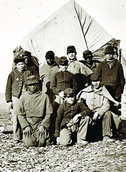
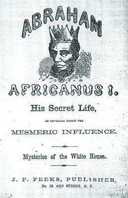

By the end of this section, you will be able to:
* Describe the reasons why many Americans doubted that Abraham Lincoln would be reelected
* Explain how the Union forces overpowered the Confederacy

By the outset of 1864, after three years of war, the Union had mobilized its resources for the ongoing struggle on a massive scale. The government had overseen the construction of new railroad lines and for the first time used standardized rail tracks that allowed the North to move men and materials with greater ease. The North’s economy had shifted to a wartime model. The Confederacy also mobilized, perhaps to a greater degree than the Union, its efforts to secure independence and maintain slavery. Yet the Confederacy experienced ever-greater hardships after years of war. Without the population of the North, it faced a shortage of manpower. The lack of industry, compared to the North, undercut the ability to sustain and wage war. Rampant inflation as well as food shortages in the South lowered morale.

# THE RELATIONSHIP WITH EUROPE

From the beginning of the war, the Confederacy placed great hope in being recognized and supported by Great Britain and France. European intervention in the conflict remained a strong possibility, but when it did occur, it was not in a way anticipated by either the Confederacy or the Union.

Napoleon III of France believed the Civil War presented an opportunity for him to restore a French empire in the Americas. With the United States preoccupied, the time seemed ripe for action. Napoleon’s target was Mexico, and in 1861, a large French fleet took Veracruz. The French then moved to capture Mexico City, but the advance came to an end when Mexican forces defeated the French in 1862. Despite this setback, France eventually did conquer Mexico, establishing a regime that lasted until 1867. Rather than coming to the aid of the Confederacy, France used the Civil War to provide a pretext for efforts to reestablish its former eighteenth-century colonial holdings.

Still, the Confederacy had great confidence that it would find an ally in Great Britain despite the antislavery sentiment there. Southerners hoped Britain’s dependence on cotton for its textile mills would keep the country on their side. The fact that the British proved willing to build and sell ironclad ships intended to smash through the Union naval blockade further raised Southern hopes. The Confederacy purchased two of these armored blockade runners, the CSS *Florida* and the CSS *Alabama*. Both were destroyed during the war.

The Confederacy’s staunch commitment to slavery eventually worked against British recognition and support, since Great Britain had abolished slavery in 1833. The 1863 Emancipation Proclamation ended any doubts the British had about the goals of the Union cause. In the aftermath of the proclamation, many in Great Britain cheered for a Union victory. Ultimately, Great Britain, like France, disappointed the Confederacy’s hope of an alliance, leaving the outnumbered and out-resourced states that had left the Union to fend for themselves.

# AFRICAN AMERICAN SOLDIERS

At the beginning of the war, in 1861 and 1862, Union forces had used contrabands, or escaped slaves, for manual labor. The Emancipation Proclamation, however, led to the enrollment of African American men as Union soldiers. Huge numbers, former slaves as well as free blacks from the North, enlisted, and by the end of the war in 1865, their numbers had swelled to over 190,000. Racism among whites in the Union army ran deep, however, fueling the belief that black soldiers could never be effective or trustworthy. The Union also feared for the fate of captured black soldiers. Although many black soldiers saw combat duty, these factors affected the types of tasks assigned to them. Many black regiments were limited to hauling supplies, serving as cooks, digging trenches, and doing other types of labor, rather than serving on the battlefield ([\[link\]](#CNX_History_15_04_Union)).

 "){: #CNX_History_15_04_Union}

African American soldiers also received lower wages than their white counterparts: ten dollars per month, with three dollars deducted for clothing. White soldiers, in contrast, received thirteen dollars monthly, with no deductions. Abolitionists and their Republican supporters in Congress worked to correct this discriminatory practice, and in 1864, black soldiers began to receive the same pay as white soldiers plus retroactive pay to 1863 ([\[link\]](#CNX_History_15_04_BlackSol)).

 {: #CNX_History_15_04_BlackSol}

For their part, African American soldiers welcomed the opportunity to prove themselves. Some 85 percent were former slaves who were fighting for the liberation of all slaves and the end of slavery. When given the opportunity to serve, many black regiments did so heroically. One such regiment, the Fifty-Fourth Regiment of Massachusetts Volunteers, distinguished itself at Fort Wagner in South Carolina by fighting valiantly against an entrenched Confederate position. They willingly gave their lives for the cause.

The Confederacy, not surprisingly, showed no mercy to African American troops. In April 1864, Southern forces attempted to take Fort Pillow in Tennessee from the Union forces that had captured it in 1862. Confederate troops under Major General Nathan Bedford Forrest, the future founder of the Ku Klux Klan, quickly overran the fort, and the Union defenders surrendered. Instead of taking the African American soldiers prisoner, as they did the white soldiers, the Confederates executed them. The massacre outraged the North, and the Union refused to engage in any future exchanges of prisoners with the Confederacy.

# THE CAMPAIGNS OF 1864 AND 1865

In the final years of the war, the Union continued its efforts on both the eastern and western fronts while bringing the war into the Deep South. Union forces increasingly engaged in total war, not distinguishing between military and civilian targets. They destroyed everything that lay in their path, committed to breaking the will of the Confederacy and forcing an end to the war. General Grant, mastermind of the Vicksburg campaign, took charge of the war effort. He understood the advantage of having large numbers of soldiers at his disposal and recognized that Union soldiers could be replaced, whereas the Confederates, whose smaller population was feeling the strain of the years of war, could not. Grant thus pushed forward relentlessly, despite huge losses of men. In 1864, Grant committed his forces to destroying Lee’s army in Virginia.

In the Virginia campaign, Grant hoped to use his larger army to his advantage. But at the Battle of the Wilderness, fought from May 5 to May 7, Confederate forces stopped Grant’s advance. Rather than retreating, he pushed forward. At the Battle of Spotsylvania on May 8 through 12, Grant again faced determined Confederate resistance, and again his advance was halted. As before, he renewed the Union campaign. At the Battle of Cold Harbor in early June, Grant had between 100,000 and 110,000 soldiers, whereas the Confederates had slightly more than half that number. Again, the Union advance was halted, if only momentarily, as Grant awaited reinforcements. An attack on the Confederate position on June 3 resulted in heavy casualties for the Union, and nine days later, Grant led his army away from Cold Harbor to Petersburg, Virginia, a rail center that supplied Richmond. The immense losses that Grant’s forces suffered severely hurt Union morale. The war seemed unending, and with the tremendous loss of life, many in the North began to question the war and desire peace. Undaunted by the changing opinion in the North and hoping to destroy the Confederate rail network in the Upper South, however, Grant laid siege to Petersburg for nine months. As the months wore on, both sides dug in, creating miles of trenches and gun emplacements.

The other major Union campaigns of 1864 were more successful and gave President Lincoln the advantage that he needed to win reelection in November. In August 1864, the Union navy captured Mobile Bay. General Sherman invaded the Deep South, advancing slowly from Tennessee into Georgia, confronted at every turn by the Confederates, who were commanded by Johnston. When President Davis replaced Johnston with General John B. Hood, the Confederates made a daring but ultimately costly direct attack on the Union army that failed to drive out the invaders. Atlanta fell to Union forces on September 2, 1864. The fall of Atlanta held tremendous significance for the war-weary Union and helped to reverse the North’s sinking morale. In keeping with the logic of total war, Sherman’s forces cut a swath of destruction to Savannah. On **Sherman’s March to the Sea**{: data-type="term"}, the Union army, seeking to demoralize the South, destroyed everything in its path, despite strict instructions regarding the preservation of civilian property. Although towns were left standing, houses and barns were burned. Homes were looted, food was stolen, crops were destroyed, orchards were burned, and livestock was killed or confiscated. Savannah fell on December 21, 1864—a Christmas gift for Lincoln, Sherman proclaimed. In 1865, Sherman’s forces invaded South Carolina, capturing Charleston and Columbia. In Columbia, the state capital, the Union army burned slaveholders’ homes and destroyed much of the city. From South Carolina, Sherman’s force moved north in an effort to join Grant and destroy Lee’s army.

Dolly Sumner Lunt on Sherman’s March to the Sea

The following account is by Dolly Sumner Lunt, a widow who ran her Georgia cotton plantation after the death of her husband. She describes General Sherman’s march to Savannah, where he enacted the policy of total war by burning and plundering the landscape to inhibit the Confederates’ ability to keep fighting.

\> Alas! little did I think while trying to save my house from plunder and fire that they were forcing my boys \[slaves\] from home at the point of the bayonet. One, Newton, jumped into bed in his cabin, and declared himself sick. Another crawled under the floor,—a lame boy he was,—but they pulled him out, placed him on a horse, and drove him off. Mid, poor Mid! The last I saw of him, a man had him going around the garden, looking, as I thought, for my sheep, as he was my shepherd. Jack came crying to me, the big tears coursing down his cheeks, saying they were making him go. I said: ‘Stay in my room.’

 > But a man followed in, cursing him and threatening to shoot him if he did not go; so poor Jack had to yield. . . .

 > Sherman himself and a greater portion of his army passed my house that day. All day, as the sad moments rolled on, were they passing not only in front of my house, but from behind; they tore down my garden palings, made a road through my back-yard and lot field, driving their stock and riding through, tearing down my fences and desolating my home—wantonly doing it when there was no necessity for it. . . .

 > About ten o’clock they had all passed save one, who came in and wanted coffee made, which was done, and he, too, went on. A few minutes elapsed, and two couriers riding rapidly passed back. Then, presently, more soldiers came by, and this ended the passing of Sherman’s army by my place, leaving me poorer by thirty thousand dollars than I was yesterday morning. And a much stronger Rebel!

According to this account, what was the reaction of slaves to the arrival of the Union forces? What did the Union forces do with the slaves? For Lunt, did the strategy of total war work as planned?

# THE ELECTION OF 1864

Despite the military successes for the Union army in 1863, in 1864, Lincoln’s status among many Northern voters plummeted. Citing the suspension of the writ of habeas corpus, many saw him as a dictator, bent on grabbing power while senselessly and uncaringly drafting more young men into combat. Arguably, his greatest liability, however, was the Emancipation Proclamation and the enlistment of African American soldiers. Many whites in the North found this deeply offensive, since they still believed in racial inequality. The 1863 **New York City Draft Riots**{: data-type="term" .no-emphasis} illustrated the depth of white anger.

Northern Democrats railed against Lincoln and the war. Republicans labeled these vocal opponents of the President **Copperheads**{: data-type="term"}, a term that many antiwar Democrats accepted. As the anti-Lincoln poster below illustrates, his enemies tried to paint him as an untrustworthy and suspect leader ([\[link\]](#CNX_History_15_04_Lincoln)). It seemed to most in the North that the Democratic candidate, General George B. McClellan, who did not support abolition and was replaced with another commander by Lincoln, would win the election.

 {: #CNX_History_15_04_Lincoln}

The Republican Party also split over the issue of reelecting Lincoln. Those who found him timid and indecisive, and favored extending full rights to African Americans, as well as completely refashioning the South after its defeat, earned the name Radicals. A moderate faction of Republicans opposed the Radicals. For his part, Lincoln did not align himself with either group.

The tide of the election campaign turned in favor of Lincoln, however, in the fall of 1864. Above all else, Union victories, including the fall of Atlanta in September and General Philip Sheridan’s successes in the Shenandoah Valley of Virginia, bolstered Lincoln’s popularity and his reelection bid. In November 1864, despite earlier forecasts to the contrary, Lincoln was reelected. Lincoln won all but three states—New Jersey and the border states of Delaware and Kentucky. To the chagrin of his opponent, McClellan, even Union army troops voted overwhelmingly for the incumbent President.

# THE WAR ENDS

By the spring of 1865, it had become clear to both sides that the Confederacy could not last much longer. Most of its major cities, ports, and industrial centers—Atlanta, Savannah, Charleston, Columbia, Mobile, New Orleans, and Memphis—had been captured. In April 1865, Lee had abandoned both Petersburg and Richmond. His goal in doing so was to unite his depleted army with Confederate forces commanded by General Johnston. Grant effectively cut him off. On April 9, 1865, Lee surrendered to Grant at Appomattox Court House in Virginia ([\[link\]](#CNX_History_15_04_Surrender)). By that time, he had fewer than 35,000 soldiers, while Grant had some 100,000. Meanwhile, Sherman’s army proceeded to North Carolina, where General Johnston surrendered on April 19, 1865. The Civil War had come to an end. The war had cost the lives of more than 600,000 soldiers. Many more had been wounded. Thousands of women were left widowed. Children were left without fathers, and many parents were deprived of a source of support in their old age. In some areas, where local volunteer units had marched off to battle, never to return, an entire generation of young women was left without marriage partners. Millions of dollars’ worth of property had been destroyed, and towns and cities were laid to waste. With the conflict finally over, the very difficult work of reconciling North and South and reestablishing the United States lay ahead.

  surrendered to Ulysses S. Grant at Appomattox Courthouse. (credit: &#x201C;Alaskan Dude&#x201D;/Wikimedia Commons)"){: #CNX_History_15_04_Surrender}

# Section Summary

Having failed to win the support it expected from either Great Britain or France, the Confederacy faced a long war with limited resources and no allies. Lincoln won reelection in 1864, and continued to pursue the Union campaign, not only in the east and west, but also with a drive into the South under the leadership of General Sherman, whose March to the Sea through Georgia destroyed everything in its path. Cut off and outnumbered, Confederate general Lee surrendered to Union general Grant on April 9 at Appomattox Court House in Virginia. Within days of Lee’s surrender, Confederate troops had lay down their arms, and the devastating war came to a close.

# Review Questions

Which of the following is *not* a reason why many people opposed Lincoln’s reelection in 1864?

1.  He appeared to have overstepped his authority by suspending the writ of habeas corpus.
2.  He issued the Emancipation Proclamation.
3.  He had replaced General George B. McClellan.
4.  He was seen as a power-hungry dictator.
{: data-number-style="upper-alpha"}

C

What was General Sherman’s objective on his March to the Sea?

1.  to destroy military and civilian resources wherever possible
2.  to free black prisoners of war
3.  to join his army to that of General Grant
4.  to capture General Robert E. Lee
{: data-number-style="upper-alpha"}

A

# Critical Thinking Questions

Could the differences between the North and South have been worked out in late 1860 and 1861? Could war have been avoided? Provide evidence to support your answer.

Why did the North prevail in the Civil War? What might have turned the tide of the war *against* the North?

If you were in charge of the Confederate war effort, what strategy or strategies would you have pursued? Conversely, if you had to devise the Union strategy, what would you propose? How does your answer depend on your knowledge of how the war actually played out?

What do you believe to be the enduring qualities of the Gettysburg Address? Why has this two-minute speech so endured?

What role did women and African Americans play in the war?

## Glossary
{: data-type="glossary-title"}

Copperheads
: Democrats who opposed Lincoln in the 1864 election
{: .definition}

Sherman’s March to the Sea
: the scorched-earth campaign employed in Georgia by Union general William Tecumseh Sherman
{: .definition}

