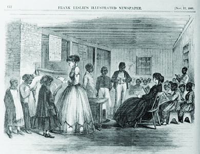

By the end of this section, you will be able to:
* Describe the efforts made by Congress in 1865 and 1866 to bring to life its vision of Reconstruction
* Explain how the Fourteenth Amendment transformed the Constitution

President Johnson and Congress’s views on Reconstruction grew even further apart as Johnson’s presidency progressed. Congress repeatedly pushed for greater rights for freed people and a far more thorough reconstruction of the South, while Johnson pushed for leniency and a swifter reintegration. President Johnson lacked Lincoln’s political skills and instead exhibited a stubbornness and confrontational approach that aggravated an already difficult situation.

### THE FREEDMEN’S BUREAU

Freed people everywhere celebrated the end of slavery and immediately began to take steps to improve their own condition by seeking what had long been denied to them: land, financial security, education, and the ability to participate in the political process. They wanted to be reunited with family members, grasp the opportunity to make their own independent living, and exercise their right to have a say in their own government.

However, they faced the wrath of defeated but un-reconciled southerners who were determined to keep blacks an impoverished and despised underclass. Recognizing the widespread devastation in the South and the dire situation of freed people, Congress created the Bureau of Refugees, Freedmen, and Abandoned Lands in March 1865, popularly known as the **Freedmen’s Bureau**{: data-type="term"}. Lincoln had approved of the bureau, giving it a charter for one year.

The Freedmen’s Bureau engaged in many initiatives to ease the transition from slavery to freedom. It delivered food to blacks and whites alike in the South. It helped freed people gain labor contracts, a significant step in the creation of wage labor in place of slavery. It helped reunite families of freedmen, and it also devoted much energy to education, establishing scores of public schools where freed people and poor whites could receive both elementary and higher education. Respected institutions such as Fisk University, Hampton University, and Dillard University are part of the legacy of the Freedmen’s Bureau.

In this endeavor, the Freedmen’s Bureau received support from Christian organizations that had long advocated for abolition, such as the **American Missionary Association**{: data-type="term" .no-emphasis} (AMA). The AMA used the knowledge and skill it had acquired while working in missions in Africa and with American Indian groups to establish and run schools for freed slaves in the postwar South. While men and women, white and black, taught in these schools, the opportunity was crucially important for participating women ([\[link\]](#CNX_History_16_02_SchoolRoom)). At the time, many opportunities, including admission to most institutes of higher learning, remained closed to women. Participating in these schools afforded these women the opportunities they otherwise may have been denied. Additionally, the fact they often risked life and limb to work in these schools in the South demonstrated to the nation that women could play a vital role in American civic life.

 {: #CNX_History_16_02_SchoolRoom}

The schools that the Freedmen’s Bureau and the AMA established inspired great dismay and resentment among the white populations in the South and were sometimes targets of violence. Indeed, the Freedmen’s Bureau’s programs and its very existence were sources of controversy. Racists and others who resisted this type of federal government activism denounced it as both a waste of federal money and a foolish effort that encouraged laziness among blacks. Congress renewed the bureau’s charter in 1866, but President Johnson, who steadfastly believed that the work of restoring the Union had been completed, vetoed the re-chartering. Radical Republicans continued to support the bureau, igniting a contest between Congress and the president that intensified during the next several years. Part of this dispute involved conflicting visions of the proper role of the federal government. Radical Republicans believed in the constructive power of the federal government to ensure a better day for freed people. Others, including Johnson, denied that the government had any such role to play.

The Freedmen’s Bureau

The image below ([\[link\]](#CNX_History_16_02_Freedman)) shows a campaign poster for Hiester Clymer, who ran for governor of Pennsylvania in 1866 on a platform of white supremacy.

![An illustration shows a highly caricatured black man in tattered clothes reclining in the foreground as white men work his land, thinking, &#x201C;Whar is de use for me to work as long as dey make dese appropriations.&#x201D; Near the white men are the words &#x201C;In the sweat of thy face shalt thou eat thy bread&#x201D; and &#x201C;The white man must work to keep his children and pay his taxes.&#x201D; In the sky, an image of an elegant official building hovers, labeled &#x201C;Freedman&#x2019;s Bureau! Negro Estimate of Freedom!&#x201D; The building is inscribed with the words &#x201C;Freedom and No Work,&#x201D; &#x201C;Candy,&#x201D; &#x201C;Rum, Gin, Whiskey,&#x201D; &#x201C;Sugar Plums,&#x201D; &#x201C;Indolence,&#x201D; &#x201C;White Women,&#x201D; &#x201C;Apathy,&#x201D; &#x201C;White Sugar,&#x201D; &#x201C;Idleness,&#x201D; &#x201C;Fish Balls,&#x201D; &#x201C;Clams,&#x201D; &#x201C;Stews,&#x201D; and &#x201C;Pies.&#x201D; On the right-hand side of the image, the artist provides figures for the funds appropriated by Congress for the Freedmen&#x2019;s Bureau and the bounties of black and white Civil War veterans.](../resources/CNX_History_16_02_Freedman.jpg "The caption of this image reads, &#x201C;The Freedman&#x2019;s Bureau! An agency to keep the Negro in idleness at the expense of the white man. Twice vetoed by the President, and made a law by Congress. Support Congress &amp; you support the Negro. Sustain the President &amp; you protect the white man.&#x201D;"){: #CNX_History_16_02_Freedman}

The image in the foreground shows an indolent black man wondering, “Whar is de use for me to work as long as dey make dese appropriations.” White men toil in the background, chopping wood and plowing a field. The text above them reads, “In the sweat of thy face shall thou eat bread. . . . The white man must work to keep his children and pay his taxes.” In the middle background, the Freedmen’s Bureau looks like the Capitol, and the pillars are inscribed with racist assumptions of things blacks value, like “rum,” “idleness,” and “white women.” On the right are estimates of the costs of the Freedmen’s Bureau and the bounties (fees for enlistment) given to both white and black Union soldiers.

What does this poster indicate about the political climate of the Reconstruction era? How might different people have received this image?

### BLACK CODES

In 1865 and 1866, as Johnson announced the end of Reconstruction, southern states began to pass a series of discriminatory state laws collectively known as **black codes**{: data-type="term"}. While the laws varied in both content and severity from state to state, the goal of the laws remained largely consistent. In effect, these codes were designed to maintain the social and economic structure of racial slavery in the absence of slavery itself. The laws codified white supremacy by restricting the civic participation of freed slaves—depriving them of the right to vote, the right to serve on juries, the right to own or carry weapons, and, in some cases, even the right to rent or lease land.

A chief component of the black codes was designed to fulfill an important economic need in the postwar South. Slavery had been a pillar of economic stability in the region before the war. To maintain agricultural production, the South had relied on slaves to work the land. Now the region was faced with the daunting prospect of making the transition from a slave economy to one where labor was purchased on the open market. Not surprisingly, planters in the southern states were reluctant to make such a transition. Instead, they drafted black laws that would re-create the antebellum economic structure with the façade of a free-labor system.

Black codes used a variety of tactics to tie freed slaves to the land. To work, the freed slaves were forced to sign contracts with their employer. These contracts prevented blacks from working for more than one employer. This meant that, unlike in a free labor market, blacks could not positively influence wages and conditions by choosing to work for the employer who gave them the best terms. The predictable outcome was that freed slaves were forced to work for very low wages. With such low wages, and no ability to supplement income with additional work, workers were reduced to relying on loans from their employers. The debt that these workers incurred ensured that they could never escape from their condition. Those former slaves who attempt to violate these contracts could be fined or beaten. Those who refused to sign contracts at all could be arrested for vagrancy and then made to work for no wages, essentially being reduced to the very definition of a slave.

The black codes left no doubt that the former breakaway Confederate states intended to maintain white supremacy at all costs. These draconian state laws helped spur the congressional Joint Committee on Reconstruction into action. Its members felt that ending slavery with the Thirteenth Amendment did not go far enough. Congress extended the life of the Freedmen’s Bureau to combat the black codes and in April 1866 passed the first Civil Rights Act, which established the citizenship of African Americans. This was a significant step that contradicted the Supreme Court’s 1857 Dred Scott decision, which declared that blacks could never be citizens. The law also gave the federal government the right to intervene in state affairs to protect the rights of citizens, and thus, of African Americans. President Johnson, who continued to insist that restoration of the United States had already been accomplished, vetoed the 1866 Civil Rights Act. However, Congress mustered the necessary votes to override his veto. Despite the Civil Rights Act, the black codes endured, forming the foundation of the racially discriminatory **Jim Crow**{: data-type="term" .no-emphasis} segregation policies that impoverished generations of African Americans.

### THE FOURTEENTH AMENDMENT

Questions swirled about the constitutionality of the Civil Rights Act of 1866. The Supreme Court, in its 1857 decision forbidding black citizenship, had interpreted the Constitution in a certain way; many argued that the 1866 statute, alone, could not alter that interpretation. Seeking to overcome all legal questions, Radical Republicans drafted another constitutional amendment with provisions that followed those of the 1866 Civil Rights Act. In July 1866, the Fourteenth Amendment went to state legislatures for ratification.

The Fourteenth Amendment stated, “All persons born or naturalized in the United States and subject to the jurisdiction thereof, are citizens of the United States and of the State wherein they reside.” It gave citizens equal protection under both the state and federal law, overturning the Dred Scott decision. It eliminated the three-fifths compromise of the 1787 Constitution, whereby slaves had been counted as three-fifths of a free white person, and it reduced the number of House representatives and Electoral College electors for any state that denied suffrage to any adult male inhabitant, black or white. As Radical Republicans had proposed in the Wade-Davis bill, individuals who had “engaged in insurrection or rebellion \[against\] . . . or given aid or comfort to the enemies \[of\]” the United States were barred from holding political (state or federal) or military office unless pardoned by two-thirds of Congress.

The amendment also answered the question of debts arising from the Civil War by specifying that all debts incurred by fighting to defeat the Confederacy would be honored. Confederate debts, however, would not: “\[N\]either the United States nor any State shall assume or pay any debt or obligation incurred in aid of insurrection or rebellion against the United States, or any claim for the loss or emancipation of any slave; but all such debts, obligations and claims shall be held illegal and void.” Thus, claims by former slaveholders requesting compensation for slave property had no standing. Any state that ratified the Fourteenth Amendment would automatically be readmitted. Yet, all former Confederate states refused to ratify the amendment in 1866.

President Johnson called openly for the rejection of the Fourteenth Amendment, a move that drove a further wedge between him and congressional Republicans. In late summer of 1866, he gave a series of speeches, known as the “swing around the circle,” designed to gather support for his mild version of Reconstruction. Johnson felt that ending slavery went far enough; extending the rights and protections of citizenship to freed people, he believed, went much too far. He continued to believe that blacks were inferior to whites. The president’s “swing around the circle” speeches to gain support for his program and derail the Radical Republicans proved to be a disaster, as hecklers provoked Johnson to make damaging statements. Radical Republicans charged that Johnson had been drunk when he made his speeches. As a result, Johnson’s reputation plummeted.

  
Read the text of the [Fourteenth Amendment][1] and then view the [original document][2] at Our Documents.

### Section Summary

The conflict between President Johnson and the Republican-controlled Congress over the proper steps to be taken with the defeated Confederacy grew in intensity in the years immediately following the Civil War. While the president concluded that all that needed to be done in the South had been done by early 1866, Congress forged ahead to stabilize the defeated Confederacy and extend to freed people citizenship and equality before the law. Congress prevailed over Johnson’s vetoes as the friction between the president and the Republicans increased.

### Review Questions

Which of the following was *not* one of the functions of the Freedmen’s Bureau?

1.  collecting taxes
2.  reuniting families
3.  establishing schools
4.  helping workers secure labor contracts
{: type="A"}

A

Which person or group was most responsible for the passage of the Fourteenth Amendment?

1.  President Johnson
2.  northern voters
3.  southern voters
4.  Radical Republicans in Congress
{: type="A"}

D

What was the goal of the black codes?

The black codes in southern states had the goal of keeping blacks impoverished and in debt. Black codes outlawed vagrancy and required all black men to have an annual labor contract, which gave southern states an excuse to arrest those who failed to meet these requirements and put them to hard labor.

### Glossary
{: data-type="glossary-title"}

black codes
: laws some southern states designed to maintain white supremacy by keeping freed people impoverished and in debt
^

Freedmen’s Bureau
: the Bureau of Refugees, Freedmen, and Abandoned Lands, which was created in 1865 to ease blacks’ transition from slavery to freedom

[1]: http://openstax.org/l/15Fourteena
[2]: http://openstax.org/l/15Fourteenb
