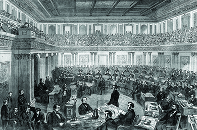
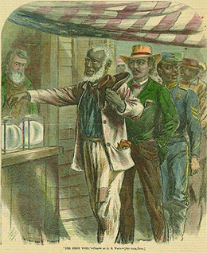
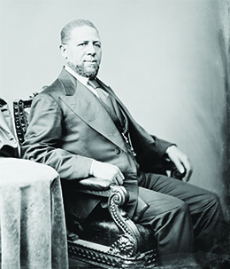

By the end of this section, you will be able to:
* Explain the purpose of the second phase of Reconstruction and some of the key legislation put forward by Congress
* Describe the impeachment of President Johnson
* Discuss the benefits and drawbacks of the Fifteenth Amendment

During the Congressional election in the fall of 1866, Republicans gained even greater victories. This was due in large measure to the northern voter opposition that had developed toward President Johnson because of the inflexible and overbearing attitude he had exhibited in the White House, as well as his missteps during his 1866 speaking tour. Leading Radical Republicans in Congress included Massachusetts senator Charles Sumner (the same senator whom proslavery South Carolina representative Preston Brooks had thrashed with his cane in 1856 during the Bleeding Kansas crisis) and Pennsylvania representative Thaddeus Stevens. These men and their supporters envisioned a much more expansive change in the South. Sumner advocated integrating schools and giving black men the right to vote while disenfranchising many southern voters. For his part, Stevens considered that the southern states had forfeited their rights as states when they seceded, and were no more than conquered territory that the federal government could organize as it wished. He envisioned the redistribution of plantation lands and U.S. military control over the former Confederacy.

Their goals included the transformation of the South from an area built on slave labor to a free-labor society. They also wanted to ensure that freed people were protected and given the opportunity for a better life. Violent race riots in Memphis, Tennessee, and New Orleans, Louisiana, in 1866 gave greater urgency to the second phase of Reconstruction, begun in 1867.

### THE RECONSTRUCTION ACTS

The 1867 Military Reconstruction Act, which encompassed the vision of Radical Republicans, set a new direction for Reconstruction in the South. Republicans saw this law, and three supplementary laws passed by Congress that year, called the **Reconstruction Acts**{: data-type="term" .no-emphasis}, as a way to deal with the disorder in the South. The 1867 act divided the ten southern states that had yet to ratify the Fourteenth Amendment into five military districts (Tennessee had already been readmitted to the Union by this time and so was excluded from these acts). Martial law was imposed, and a Union general commanded each district. These generals and twenty thousand federal troops stationed in the districts were charged with protecting freed people. When a supplementary act extended the right to vote to all freed men of voting age (21 years old), the military in each district oversaw the elections and the registration of voters. Only after new state constitutions had been written and states had ratified the Fourteenth Amendment could these states rejoin the Union. Predictably, President Johnson vetoed the Reconstruction Acts, viewing them as both unnecessary and unconstitutional. Once again, Congress overrode Johnson’s vetoes, and by the end of 1870, all the southern states under military rule had ratified the Fourteenth Amendment and been restored to the Union ([\[link\]](#CNX_History_16_03_Reconst)).

![A map shows the five military districts established by the 1867 Military Reconstruction Act and the date each state rejoined the Union. Texas (Military District 5) rejoined the Union on March 30, 1870. Louisiana (Military District 5) rejoined the Union on June 25, 1868. Arkansas (Military District 4) rejoined the Union on June 22, 1868. Mississippi (Military District 4) rejoined the Union on February 23, 1870. Alabama (Military District 3) rejoined the Union on July 14, 1868. Georgia (Military District 3) rejoined the Union on July 15, 1870. Florida (Military District 3) rejoined the Union on June 25, 1868. Tennessee rejoined the Union on July 24, 1866. South Carolina (Military District 2) rejoined the Union on June 25, 1868. North Carolina (Military District 2) rejoined the Union on June 25, 1868. Virginia (Military District 1) rejoined the Union on January 26, 1870.](../resources/CNX_History_16_03_Reconst.jpg "The map above shows the five military districts established by the 1867 Military Reconstruction Act and the date each state rejoined the Union. Tennessee was not included in the Reconstruction Acts as it had already been readmitted to the Union at the time of their passage."){: #CNX_History_16_03_Reconst}

### THE IMPEACHMENT OF PRESIDENT JOHNSON

President Johnson’s relentless vetoing of congressional measures created a deep rift in Washington, DC, and neither he nor Congress would back down. Johnson’s prickly personality proved to be a liability, and many people found him grating. Moreover, he firmly believed in white supremacy, declaring in his 1868 State of the Union address, “The attempt to place the white population under the domination of persons of color in the South has impaired, if not destroyed, the kindly relations that had previously existed between them; and mutual distrust has engendered a feeling of animosity which leading in some instances to collision and bloodshed, has prevented that cooperation between the two races so essential to the success of industrial enterprise in the southern states.” The president’s racism put him even further at odds with those in Congress who wanted to create full equality between blacks and whites.

The Republican majority in Congress by now despised the president, and they wanted to prevent him from interfering in congressional Reconstruction. To that end, Radical Republicans passed two laws of dubious constitutionality. The Command of the Army Act prohibited the president from issuing military orders except through the commanding general of the army, who could not be relieved or reassigned without the consent of the Senate. The Tenure of Office Act, which Congress passed in 1867, required the president to gain the approval of the Senate whenever he appointed or removed officials. Congress had passed this act to ensure that Republicans who favored Radical Reconstruction would not be barred or stripped of their jobs. In August 1867, President Johnson removed Secretary of War Edwin M. Stanton, who had aligned himself with the Radical Republicans, without gaining Senate approval. He replaced Stanton with Ulysses S. Grant, but Grant resigned and sided with the Republicans against the president. Many Radical Republicans welcomed this blunder by the president as it allowed them to take action to remove Johnson from office, arguing that Johnson had openly violated the Tenure of Office Act. The House of Representatives quickly drafted a resolution to impeach him, a first in American history.

In impeachment proceedings, the House of Representatives serves as the prosecution and the Senate acts as judge, deciding whether the president should be removed from office ([\[link\]](#CNX_History_16_03_Impeach)). The House brought eleven counts against Johnson, all alleging his encroachment on the powers of Congress. In the Senate, Johnson barely survived. Seven Republicans joined the Democrats and independents to support acquittal; the final vote was 35 to 19, one vote short of the required two-thirds majority. The Radicals then dropped the impeachment effort, but the events had effectively silenced President Johnson, and Radical Republicans continued with their plan to reconstruct the South.

 {: #CNX_History_16_03_Impeach}

### THE FIFTEENTH AMENDMENT

In November 1868, Ulysses S. Grant, the Union’s war hero, easily won the presidency in a landslide victory. The Democratic nominee was Horatio Seymour, but the Democrats carried the stigma of disunion. The Republicans, in their campaign, blamed the devastating Civil War and the violence of its aftermath on the rival party, a strategy that southerners called “waving the bloody shirt.”

Though Grant did not side with the Radical Republicans, his victory allowed the continuance of the Radical Reconstruction program. In the winter of 1869, Republicans introduced another constitutional amendment, the third of the Reconstruction era. When Republicans had passed the Fourteenth Amendment, which addressed citizenship rights and equal protections, they were unable to explicitly ban states from withholding the franchise based on race. With the Fifteenth Amendment, they sought to correct this major weakness by finally extending to black men the right to vote. The amendment directed that “\[t\]he right of citizens of the United States to vote shall not be denied or abridged by the United States or by any State on account of race, color, or previous condition of servitude.” Unfortunately, the new amendment had weaknesses of its own. As part of a compromise to ensure the passage of the amendment with the broadest possible support, drafters of the amendment specifically excluded language that addressed literacy tests and poll taxes, the most common ways blacks were traditionally disenfranchised in both the North and the South. Indeed, Radical Republican leader Charles Sumner of Massachusetts, himself an ardent supporter of legal equality without exception to race, refused to vote for the amendment precisely because it did not address these obvious loopholes.

Despite these weaknesses, the language of the amendment did provide for universal manhood suffrage—the right of all men to vote—and crucially identified black men, including those who had been slaves, as deserving the right to vote. This, the third and final of the Reconstruction amendments, was ratified in 1870 ([\[link\]](#CNX_History_16_03_Fifteenth)). With the ratification of the Fifteenth Amendment, many believed that the process of restoring the Union was safely coming to a close and that the rights of freed slaves were finally secure. African American communities expressed great hope as they celebrated what they understood to be a national confirmation of their unqualified citizenship.

 ![An illustration depicts a series of scenes and portraits, shown in gilded frames and surrounded by American flags, relating to black rights and the passage of the Fifteenth Amendment. A large central scene shows the parade celebrating the Fifteenth Amendment&#x2019;s passage. In the upper corners, portraits of Ulysses S. Grant and Schuyler Colfax are shown. Other scenes include a black man reading the Emancipation Proclamation; three black men with Masonic paraphernalia (labeled &#x201C;We Unite in the Bonds of Fellowship with the Whole Human Race&#x201D;); a Bible (labeled &#x201C;Our Charter of Rights&#x201D;); a black classroom scene (labeled &#x201C;Education Will Prove the Equality of the Races&#x201D;); a black pastor preaching to a congregation (labeled &#x201C;The Holy Ordinances of Religion Are Free&#x201D;); two free blacks tilling their own fields; a black officer commanding his troops (labeled &#x201C;We Will Protect Our Country as It Defends Our Rights&#x201D;); a black man reading to his family (labeled &#x201C;Freedom Unites the Family Circle&#x201D;); a black wedding ceremony (labeled &#x201C;Liberty Protects the Marriage Alter&#x201D;); a black man voting (labeled &#x201C;The Ballot Box Is Open To Us&#x201D;); and Hiram Revels in the House of Representatives (labeled &#x201C;Our Representative Sits in the National Legislature&#x201D;). Other individual portraits include Abraham Lincoln, Hiram Revels, Martin Delany, Frederick Douglass, and John Brown.](../resources/CNX_History_16_03_Fifteenth.jpg "The Fifteenth Amendment. Celebrated May 19th, 1870, a commemorative print by Thomas Kelly, celebrates the passage of the Fifteenth Amendment with a series of vignettes highlighting black rights and those who championed them. Portraits include Ulysses S. Grant, Abraham Lincoln, and John Brown, as well as black leaders Martin Delany, Frederick Douglass, and Hiram Revels. Vignettes include the celebratory parade for the amendment&#x2019;s passage, &#x201C;The Ballot Box is open to us,&#x201D; and &#x201C;Our representative Sits in the National Legislature.&#x201D;"){: #CNX_History_16_03_Fifteenth}

  
Visit the [Library of Congress][1] to take a closer look at *The Fifteenth Amendment* by Thomas Kelly. Examine each individual vignette and the accompanying text. Why do you think Kelly chose these to highlight?

### WOMEN’S SUFFRAGE

While the Fifteenth Amendment may have been greeted with applause in many corners, leading women’s rights activists, who had been campaigning for decades for the right to vote, saw it as a major disappointment. More dispiriting still was the fact that many women’s rights activists, such as Susan B. Anthony and Elizabeth Cady Stanton, had played a large part in the abolitionist movement leading up to the Civil War. Following the war, women and men, white and black, formed the **American Equal Rights Association**{: data-type="term" .no-emphasis} (AERA) for the expressed purpose of securing “equal Rights to all American citizens, especially the right of suffrage, irrespective of race, color or sex.” Two years later, with the adoption of the Fourteenth Amendment, section 2 of which specifically qualified the liberties it extended to “male citizens,” it seemed as though the progress made in support of civil rights was not only passing women by but was purposely codifying their exclusion. As Congress debated the language of the Fifteenth Amendment, some held out hope that it would finally extend the franchise to women. Those hopes were dashed when Congress adopted the final language.

The consequence of these frustrated hopes was the effective split of a civil rights movement that had once been united in support of African Americans and women. Seeing this split occur, Frederick Douglass, a great admirer of Stanton, struggled to argue for a piecemeal approach that should prioritize the franchise for black men if that was the only option. He insisted that his support for women’s right to vote was sincere, but that getting black men the right to vote was “of the most urgent necessity.” “The government of this country loves women,” he argued. “They are the sisters, mothers, wives and daughters of our rulers; but the negro is loathed. . . . The negro needs suffrage to protect his life and property, and to ensure him respect and education.”

These appeals were largely accepted by women’s rights leaders and AERA members like Lucy Stone and Henry Browne Blackwell, who believed that more time was needed to bring about female suffrage. Others demanded immediate action. Among those who pressed forward despite the setback were Stanton and Anthony. They felt greatly aggrieved at the fact that other abolitionists, with whom they had worked closely for years, did not demand that women be included in the language of the amendments. Stanton argued that the women’s vote would be necessary to counter the influence of uneducated freedmen in the South and the waves of poor European immigrants arriving in the East.

In 1869, Stanton and Anthony helped organize the National Woman Suffrage Association (NWSA), an organization dedicated to ensuring that women gained the right to vote immediately, not at some future, undetermined date. Some women, including Virginia Minor, a member of the NWSA, took action by trying to register to vote; Minor attempted this in St. Louis, Missouri, in 1872. When election officials turned her away, Minor brought the issue to the Missouri state courts, arguing that the Fourteenth Amendment ensured that she was a citizen with the right to vote. This legal effort to bring about women’s suffrage eventually made its way to the Supreme Court, which declared in 1874 that “the constitution of the United States does not confer the right of suffrage upon any one,” effectively dismissing Minor’s claim.

Constitution of the National Woman Suffrage Association

Despite the Fifteenth Amendment’s failure to guarantee female suffrage, women did gain the right to vote in western territories, with the Wyoming Territory leading the way in 1869. One reason for this was a belief that giving women the right to vote would provide a moral compass to the otherwise lawless western frontier. Extending the right to vote in western territories also provided an incentive for white women to emigrate to the West, where they were scarce. However, Susan B. Anthony, Elizabeth Cady Stanton, and others believed that immediate action on the national front was required, leading to the organization of the NWSA and its resulting constitution. <q>ARTICLE 1.—This organization shall be called the National Woman Suffrage Association.</q> <q>ARTICLE 2.—The object of this Association shall be to secure STATE and NATIONAL protection for women citizens in the exercise of their right to vote.</q> <q>ARTICLE 3.—All citizens of the United States subscribing to this Constitution, and contributing not less than one dollar annually, shall be considered members of the Association, with the right to participate in its deliberations.</q> <q>ARTICLE 4.—The officers of this Association shall be a President, Vice-Presidents from each of the States and Territories, Corresponding and Recording Secretaries, a Treasurer, an Executive Committee of not less than five, and an Advisory Committee consisting of one or more persons from each State and Territory.</q> <q>ARTICLE 5.—All Woman Suffrage Societies throughout the country shall be welcomed as auxiliaries; and their accredited officers or duly appointed representatives shall be recognized as members of the National Association. * * *
{: data-type="newline"}

OFFICERS OF THE NATIONAL WOMAN SUFFRAGE ASSOCIATION.</q> <q id="eip-idp46677584">PRESIDENT. * * *
{: data-type="newline"}

SUSAN B. ANTHONY, Rochester, N. Y.</q>

How was the NWSA organized? How would the fact that it operated at the national level, rather than at the state or local level, help it to achieve its goals?

### BLACK POLITICAL ACHIEVEMENTS

Black voter registration in the late 1860s and the ratification of the Fifteenth Amendment finally brought what Lincoln had characterized as “a new birth of freedom.” **Union Leagues**{: data-type="term"}, fraternal groups founded in the North that promoted loyalty to the Union and the Republican Party during the Civil War, expanded into the South after the war and were transformed into political clubs that served both political and civic functions. As centers of the black communities in the South, the leagues became vehicles for the dissemination of information, acted as mediators between members of the black community and the white establishment, and served other practical functions like helping to build schools and churches for the community they served. As extensions of the Republican Party, these leagues worked to enroll newly enfranchised black voters, campaign for candidates, and generally help the party win elections ([\[link\]](#CNX_History_16_03_FirstVote)).

 {: #CNX_History_16_03_FirstVote}

The political activities of the leagues launched a great many African Americans and former slaves into politics throughout the South. For the first time, blacks began to hold political office, and several were elected to the U.S. Congress. In the 1870s, fifteen members of the House of Representatives and two senators were black. The two senators, Blanche K. Bruce and Hiram Revels, were both from Mississippi, the home state of former U.S. senator and later Confederate president Jefferson Davis. Hiram Revels ([\[link\]](#CNX_History_16_03_Revels)), was a freeborn man from North Carolina who rose to prominence as a minister in the African Methodist Episcopal Church and then as a Mississippi state senator in 1869. The following year he was elected by the state legislature to fill one of Mississippi’s two U.S. Senate seats, which had been vacant since the war. His arrival in Washington, DC, drew intense interest: as the *New York Times* noted, when “the colored Senator from Mississippi, was sworn in and admitted to his seat this afternoon . . . there was not an inch of standing or sitting room in the galleries, so densely were they packed. . . . When the Vice-President uttered the words, ‘The Senator elect will now advance and take the oath,’ a pin might have been heard drop.”

 {: #CNX_History_16_03_Revels}

Senator Revels on Segregated Schools in Washington, DC

Hiram R. Revels became the first African American to serve in the U.S. Senate in 1870. In 1871, he gave the following speech about Washington’s segregated schools before Congress.

> Will establishing such \[desegregated\] schools as I am now advocating in this District harm our white friends? . . . By some it is contended that if we establish mixed schools here a great insult will be given to the white citizens, and that the white schools will be seriously damaged. . . . When I was on a lecturing tour in the state of Ohio . . . \[o\]ne of the leading gentlemen connected with the schools in that town came to see me. . . . He asked me, “Have you been to New England, where they have mixed schools?” I replied, “I have sir.” “Well,” said he, “please tell me this: does not social equality result from mixed schools?” “No, sir; very far from it,” I responded. “Why,” said he, “how can it be otherwise?” I replied, “I will tell you how it can be otherwise, and how it is otherwise. Go to the schools and you see there white children and colored children seated side by side, studying their lessons, standing side by side and reciting their lessons, and perhaps in walking to school they may walk together; but that is the last of it. The white children go to their homes; the colored children go to theirs; and on the Lord’s day you will see those colored children in colored churches, and the white family, you will see the white children there, and the colored children at entertainments given by persons of their color.” I aver, sir, that mixed schools are very far from bringing about social equality.”

According to Senator Revels’s speech, what is “social equality” and why is it important to the issue of desegregated schools? Does Revels favor social equality or social segregation? Did social equality exist in the United States in 1871?

Though the fact of their presence was dramatic and important, as the *New York Times* description above demonstrates, the few African American representatives and senators who served in Congress during Reconstruction represented only a tiny fraction of the many hundreds, possibly thousands, of blacks who served in a great number of capacities at the local and state levels. The South during the early 1870s brimmed with freed slaves and freeborn blacks serving as school board commissioners, county commissioners, clerks of court, board of education and city council members, justices of the peace, constables, coroners, magistrates, sheriffs, auditors, and registrars. This wave of local African American political activity contributed to and was accompanied by a new concern for the poor and disadvantaged in the South. The southern Republican leadership did away with the hated black codes, undid the work of white supremacists, and worked to reduce obstacles confronting freed people.

Reconstruction governments invested in infrastructure, paying special attention to the rehabilitation of the southern railroads. They set up public education systems that enrolled both white and black students. They established or increased funding for hospitals, orphanages, and asylums for the insane. In some states, the state and local governments provided the poor with basic necessities like firewood and even bread. And to pay for these new services and subsidies, the governments levied taxes on land and property, an action that struck at the heart of the foundation of southern economic inequality. Indeed, the land tax compounded the existing problems of white landowners, who were often cash-poor, and contributed to resentment of what southerners viewed as another northern attack on their way of life.

White southerners reacted with outrage at the changes imposed upon them. The sight of once-enslaved blacks serving in positions of authority as sheriffs, congressmen, and city council members stimulated great resentment at the process of Reconstruction and its undermining of the traditional social and economic foundations of the South. Indignant southerners referred to this period of reform as a time of “negro misrule.” They complained of profligate corruption on the part of vengeful freed slaves and greedy northerners looking to fill their pockets with the South’s riches. Unfortunately for the great many honest reformers, southerners did have a handful of real examples of corruption they could point to, such as legislators using state revenues to buy hams and perfumes or giving themselves inflated salaries. Such examples, however, were relatively few and largely comparable to nineteenth-century corruption across the country. Yet these powerful stories, combined with deep-seated racial animosity toward blacks in the South, led to Democratic campaigns to “redeem” state governments. Democrats across the South leveraged planters’ economic power and wielded white vigilante violence to ultimately take back state political power from the Republicans. By the time President Grant’s attentions were being directed away from the South and toward the Indian Wars in the West in 1876, power in the South had largely been returned to whites and Reconstruction was effectively abandoned. By the end of 1876, only South Carolina, Louisiana, and Florida still had Republican governments.

The sense that the South had been unfairly sacrificed to northern vice and black vengeance, despite a wealth of evidence to the contrary, persisted for many decades. So powerful and pervasive was this narrative that by the time D. W. Griffith released his 1915 motion picture, *The Birth of a Nation*, whites around the country were primed to accept the fallacy that white southerners were the frequent victims of violence and violation at the hands of unrestrained blacks. The reality is that the opposite was true. White southerners orchestrated a sometimes violent and generally successful counterrevolution against Reconstruction policies in the South beginning in the 1860s. Those who worked to change and modernize the South typically did so under the stern gaze of exasperated whites and threats of violence. Black Republican officials in the South were frequently terrorized, assaulted, and even murdered with impunity by organizations like the Ku Klux Klan. When not ignoring the Fourteenth and Fifteenth Amendments altogether, white leaders often used trickery and fraud at the polls to get the results they wanted. As Reconstruction came to a close, these methods came to define southern life for African Americans for nearly a century afterward.

### Section Summary

Though President Johnson declared Reconstruction complete less than a year after the Confederate surrender, members of Congress disagreed. Republicans in Congress began to implement their own plan of bringing law and order to the South through the use of military force and martial law. Radical Republicans who advocated for a more equal society pushed their program forward as well, leading to the ratification of the Fifteenth Amendment, which finally gave blacks the right to vote. The new amendment empowered black voters, who made good use of the vote to elect black politicians. It disappointed female suffragists, however, who had labored for years to gain women’s right to vote. By the end of 1870, all the southern states under Union military control had satisfied the requirements of Congress and been readmitted to the Union.

### Review Questions

Under Radical Reconstruction, which of the following did former Confederate states *not* need to do in order to rejoin the Union?

1.  pass the Fourteenth Amendment
2.  pass the Fifteenth Amendment
3.  revise their state constitution
4.  allow all freed men over the age of 21 to vote
{: type="A"}

B

The House of Representatives impeached Andrew Johnson over \_\_\_\_\_\_\_\_.

1.  the Civil Rights Act
2.  the Fourteenth Amendment
3.  the Military Reconstruction Act
4.  the Tenure of Office Act
{: type="A"}

D

What were the benefits and drawbacks of the Fifteenth Amendment?

The Fifteenth Amendment granted the vote to all black men, giving freed slaves and free blacks greater political power than they had ever had in the United States. Blacks in former Confederate states elected a handful of black U.S. congressmen and a great many black local and state leaders who instituted ambitious reform and modernization projects in the South. However, the Fifteenth Amendment continued to exclude women from voting. Women continued to fight for suffrage through the NWSA and AWSA.

### Glossary
{: data-type="glossary-title"}

Union Leagues
: fraternal groups loyal to the Union and the Republican Party that became political and civic centers for blacks in former Confederate states

[1]: http://openstax.org/l/15Fifteen
