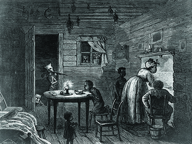
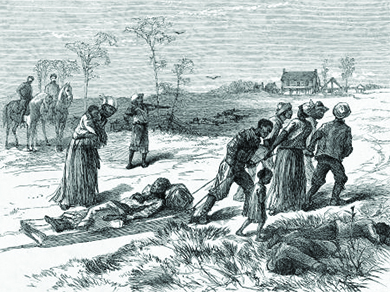

By the end of this section, you will be able to:
* Explain the reasons for the collapse of Reconstruction
* Describe the efforts of white southern “redeemers” to roll back the gains of Reconstruction

The effort to remake the South generated a brutal reaction among southern whites, who were committed to keeping blacks in a subservient position. To prevent blacks from gaining economic ground and to maintain cheap labor for the agricultural economy, an exploitative system of sharecropping spread throughout the South. Domestic terror organizations, most notably the Ku Klux Klan, employed various methods (arson, whipping, murder) to keep freed people from voting and achieving political, social, or economic equality with whites.

### BUILDING BLACK COMMUNITIES

The degraded status of black men and women had placed them outside the limits of what antebellum southern whites considered appropriate gender roles and familial hierarchies. Slave marriages did not enjoy legal recognition. Enslaved men were humiliated and deprived of authority and of the ability to protect enslaved women, who were frequently exposed to the brutality and sexual domination of white masters and vigilantes alike. Slave parents could not protect their children, who could be bought, sold, put to work, brutally disciplined, and abused without their consent; parents, too, could be sold away from their children ([\[link\]](#CNX_History_16_04_FatherSold)). Moreover, the division of labor idealized in white southern society, in which men worked the land and women performed the role of domestic caretaker, was null and void where slaves were concerned. Both slave men and women were made to perform hard labor in the fields.

 {: #CNX_History_16_04_FatherSold}

In the Reconstruction era, African Americans embraced the right to enjoy the family bonds and the expression of gender norms they had been systematically denied. Many thousands of freed black men who had been separated from their families as slaves took to the road to find their long-lost spouses and children and renew their bonds. In one instance, a journalist reported having interviewed a freed slave who traveled over six hundred miles on foot in search of the family that was taken from him while in bondage. Couples that had been spared separation quickly set out to legalize their marriages, often by way of the Freedmen’s Bureau, now that this option was available. Those who had no families would sometimes relocate to southern towns and cities, so as to be part of the larger black community where churches and other mutual aid societies offered help and camaraderie.

### SHARECROPPING

Most freed people stayed in the South on the lands where their families and loved ones had worked for generations as slaves. They hungered to own and farm their own lands instead of the lands of white plantation owners. In one case, former slaves on the Sea Islands off the coast of South Carolina initially had hopes of owning the land they had worked for many decades after General Sherman directed that freed people be granted title to plots of forty acres.

The Freedmen’s Bureau provided additional cause for such hopes by directing that leases and titles to lands in the South be made available to former slaves. However, these efforts ran afoul of President Johnson. In 1865, he ordered the return of land to white landowners, a setback for those freed people, such as those on the South Carolina Sea Islands, who had begun to cultivate the land as their own. Ultimately, there was no redistribution of land in the South.

The end of slavery meant the transition to wage labor. However, this conversion did not entail a new era of economic independence for former slaves. While they no longer faced relentless toil under the lash, freed people emerged from slavery without any money and needed farm implements, food, and other basic necessities to start their new lives. Under the **crop-lien system**{: data-type="term"}, store owners extended credit to farmers under the agreement that the debtors would pay with a portion of their future harvest. However, the creditors charged high interest rates, making it even harder for freed people to gain economic independence.

Throughout the South, **sharecropping**{: data-type="term"} took root, a crop-lien system that worked to the advantage of landowners. Under the system, freed people rented the land they worked, often on the same plantations where they had been slaves. Some landless whites also became sharecroppers. Sharecroppers paid their landlords with the crops they grew, often as much as half their harvest. Sharecropping favored the landlords and ensured that freed people could not attain independent livelihoods. The year-to-year leases meant no incentive existed to substantially improve the land, and high interest payments siphoned additional money away from the farmers. Sharecroppers often became trapped in a never-ending cycle of debt, unable to buy their own land and unable to stop working for their creditor because of what they owed. The consequences of sharecropping affected the entire South for many generations, severely limiting economic development and ensuring that the South remained an agricultural backwater.

### THE “INVISIBLE EMPIRE OF THE SOUTH”

Paramilitary white-supremacist terror organizations in the South helped bring about the collapse of Reconstruction, using violence as their primary weapon. The “Invisible Empire of the South,” or **Ku Klux Klan**{: data-type="term"}, stands as the most notorious. The Klan was founded in 1866 as an oath-bound fraternal order of Confederate veterans in Tennessee, with former Confederate General Nathan Bedford Forrest as its first leader. The organization—its name likely derived from *kuklos*, a Greek word meaning circle—devised elaborate rituals and grandiose names for its ranking members: Grand Wizard, Grand Dragon, Grand Titan, and Grand Cyclops. Soon, however, this fraternal organization evolved into a vigilante terrorist group that vented southern whites’ collective frustration over the loss of the war and the course of Radical Reconstruction through acts of intimidation and violence.

The Klan terrorized newly freed blacks to deter them from exercising their citizenship rights and freedoms. Other anti-black vigilante groups around the South began to adopt the Klan name and perpetrate acts of unspeakable violence against anyone they considered a tool of Reconstruction. Indeed, as historians have noted, Klan units around the South operated autonomously and with a variety of motives. Some may have sincerely believed they were righting wrongs, others merely satisfying their lurid desires for violence. Nor was the Klan the only racist vigilante organization. Other groups, like the Red Shirts from Mississippi and the Knights of the White Camelia and the White League, both from Louisiana, also sprang up at this time. The Klan and similar organizations also worked as an extension of the Democratic Party to win elections.

Despite the great variety in Klan membership, on the whole, the group tended to direct its attention toward persecuting freed people and people they considered **carpetbaggers**{: data-type="term"}, a term of abuse applied to northerners accused of having come to the South to acquire wealth through political power at the expense of southerners. The colorful term captured the disdain of southerners for these people, reflecting the common assumption that these men, sensing great opportunity, packed up all their worldly possessions in carpetbags, a then-popular type of luggage, and made their way to the South. Implied in this definition is the notion that these men came from little and were thus shiftless wanderers motivated only by the desire for quick money. In reality, these northerners tended to be young, idealistic, often well-educated men who responded to northern campaigns urging them to lead the modernization of the South. But the image of them as swindlers taking advantage of the South at its time of need resonated with a white southern population aggrieved by loss and economic decline. Southern whites who supported Reconstruction, known as **scalawags**{: data-type="term"}, also generated great hostility as traitors to the South. They, too, became targets of the Klan and similar groups.

The Klan seized on the pervasive but largely fictional narrative of the northern carpetbagger as a powerful tool for restoring white supremacy and overturning Republican state governments in the South ([\[link\]](#CNX_History_16_04_Committee)). To preserve a white-dominated society, Klan members punished blacks for attempting to improve their station in life or acting “uppity.” To prevent freed people from attaining an education, the Klan burned public schools. In an effort to stop blacks from voting, the Klan murdered, whipped, and otherwise intimidated freed people and their white supporters. It wasn’t uncommon for Klan members to intimidate Union League members and Freedmen’s Bureau workers. The Klan even perpetrated acts of political assassination, killing a sitting U.S. congressman from Arkansas and three state congressmen from South Carolina.

 ![A broadside reads &#x201C;I AM COMMITTEE. 1st. No man shall squat negroes on his place unless they are all under his employ male and female. 2d. Negro women shall be employed by white persons. 3d. All children shall be hired out for something. 4th. Negroes found in cabins to themselves shall suffer the penalty. 5th. Negroes shall not be allowed to hire negroes. 6th. Idle men, women, or children shall suffer the penalty. 7th. All white men found with negroes in secret places shall be dealt with, and those that hire negroes must pay promptly and act with good faith to the negro; I will make the negro do his part, and the white must too. 8th. For the first offence is one hundred lashes; the second is looking up a sapling. 9th. This I do for the benefit of all, young or old, high and tall, black and white. Any one that may not like these rules can try their luck, and see whether or not I will be found doing my duty. 10th. Negroes found stealing from any one, or taking from their employers to other negroes, death is the first penalty. 11th. Running about late of nights shall be strictly dealt with. 12th. White man and negro, I am everywhere; I have friends in every place; do your duty and I will have but little to do.&#x201D;](../resources/CNX_History_16_04_Committee.jpg "The Ku Klux Klan posted circulars such as this 1867 West Virginia broadside to warn blacks and white sympathizers of the power and ubiquity of the Klan."){: #CNX_History_16_04_Committee}

Klan tactics included riding out to victims’ houses, masked and armed, and firing into the homes or burning them down ([\[link\]](#CNX_History_16_04_KlanVisit)). Other tactics relied more on the threat of violence, such as happened in Mississippi when fifty masked Klansmen rode out to a local schoolteacher’s house to express their displeasure with the school tax and to suggest that she consider leaving. Still other tactics intimidated through imaginative trickery. One such method was to dress up as ghosts of slain Confederate soldiers and stage stunts designed to convince their victims of their supernatural abilities.

 {: #CNX_History_16_04_KlanVisit}

Regardless of the method, the general goal of reinstating white supremacy as a foundational principle and returning the South to a situation that largely resembled antebellum conditions remained a constant. The Klan used its power to eliminate black economic independence, decimate blacks’ political rights, reclaim white dominance over black women’s bodies and black men’s masculinity, tear apart black communities, and return blacks to earlier patterns of economic and political subservience and social deference. In this, they were largely successful.

  
Visit [Freedmen’s Bureau Online][1] to view digitized records of attacks on freed people that were reported in Albany, Georgia, between January 1 and October 31, 1868.

The president and Congress, however, were not indifferent to the violence, and they worked to bring it to an end. In 1870, at the insistence of the governor of North Carolina, President Grant told Congress to investigate the Klan. In response, Congress in 1871 created the Joint Select Committee to Inquire into the Condition of Affairs in the Late Insurrectionary States. The committee took testimony from freed people in the South, and in 1872, it published a thirteen-volume report on the tactics the Klan used to derail democracy in the South through the use of violence.

Abram Colby on the Methods of the Ku Klux Klan

The following statements are from the October 27, 1871, testimony of fifty-two-year-old former slave Abram Colby, which the joint select committee investigating the Klan took in Atlanta, Georgia. Colby had been elected to the lower house of the Georgia State legislature in 1868. <q>On the 29th of October, they came to my house and broke my door open, took me out of my bed and took me to the woods and whipped me three hours or more and left me in the woods for dead. They said to me, “Do you think you will ever vote another damned Radical ticket?” I said, “I will not tell you a lie.” They said, “No; don’t tell a lie.” . . . I said, “If there was an election to-morrow, I would vote the Radical ticket.” They set in and whipped me a thousand licks more, I suppose. . . .</q> <q>They said I had influence with the negroes of other counties, and had carried the negroes against them. About two days before they whipped me they offered me $5,000 to turn and go with them, and said they would pay me $2,500 cash if I would turn and let another man go to the legislature in my place. . . .</q> <q>I would have come before the court here last week, but I knew it was no use for me to try to get Ku-Klux condemned by Ku-Klux, and I did not come. Mr. Saunders, a member of the grand jury here last week, is the father of one of the very men I knew whipped me. . . .</q> <q>They broke something inside of me, and the doctor has been attending to me for more than a year. Sometimes I cannot get up and down off my bed, and my left hand is not of much use to me. * * *
{: data-type="newline"}

—Abram Colby testimony, Joint Select Committee Report, 1872</q>

Why did the Klan target Colby? What methods did they use?

Congress also passed a series of three laws designed to stamp out the Klan. Passed in 1870 and 1871, the **Enforcement Acts**{: data-type="term" .no-emphasis} or “Force Acts” were designed to outlaw intimidation at the polls and to give the federal government the power to prosecute crimes against freed people in federal rather than state courts. Congress believed that this last step, a provision in the third Enforcement Act, also called the Ku Klux Klan Act, was necessary in order to ensure that trials would not be decided by white juries in southern states friendly to the Klan. The act also allowed the president to impose martial law in areas controlled by the Klan and gave President Grant the power to suspend the writ of habeas corpus, a continuation of the wartime power granted to President Lincoln. The suspension meant individuals suspected of engaging in Klan activity could be jailed indefinitely.

President Grant made frequent use of the powers granted to him by Congress, especially in South Carolina, where federal troops imposed martial law in nine counties in an effort to derail Klan activities. However, the federal government faced entrenched local organizations and a white population firmly opposed to Radical Reconstruction. Changes came slowly or not at all, and disillusionment set in. After 1872, federal government efforts to put down paramilitary terror in the South waned.

###  “REDEEMERS” AND THE END OF RECONSTRUCTION

While the president and Congress may have seen the Klan and other clandestine white supremacist, terrorist organizations as a threat to stability and progress in the South, many southern whites saw them as an instrument of order in a world turned upside down. Many white southerners felt humiliated by the process of Radical Reconstruction and the way Republicans had upended southern society, placing blacks in positions of authority while taxing large landowners to pay for the education of former slaves. Those committed to rolling back the tide of Radical Reconstruction in the South called themselves **redeemers**{: data-type="term"}, a label that expressed their desire to redeem their states from northern control and to restore the antebellum social order whereby blacks were kept safely under the boot heel of whites. They represented the Democratic Party in the South and worked tirelessly to end what they saw as an era of “negro misrule.” By 1877, they had succeeded in bringing about the “redemption” of the South, effectively destroying the dream of Radical Reconstruction.

Although Ulysses S. Grant won a second term in the presidential election of 1872, the Republican grip on national political power began to slip in the early 1870s. Three major events undermined Republican control. First, in 1873, the United States experienced the start of a long economic downturn, the result of economic instability in Europe that spread to the United States. In the fall of 1873, the bank of Jay Cooke &amp; Company failed to meet its financial obligations and went bankrupt, setting off a panic in American financial markets. An economic depression ensued, which Democrats blamed on Republicans and which lasted much of the decade.

Second, the Republican Party experienced internal squabbles and divided into two factions. Some Republicans began to question the expansive role of the federal government, arguing for limiting the size and scope of federal initiatives. These advocates, known as Liberal Republicans because they followed classical liberalism in championing small government, formed their own breakaway party. Their ideas changed the nature of the debate over Reconstruction by challenging reliance on federal government help to bring about change in the South. Now some Republicans argued for downsizing Reconstruction efforts.

Third, the Grant administration became mired in scandals, further tarnishing the Republicans while giving Democrats the upper hand. One scandal arose over the siphoning off of money from excise taxes on whiskey. The “Whiskey Ring,” as it was called, involved people at the highest levels of the Grant administration, including the president’s personal secretary, Orville Babcock. Another scandal entangled Crédit Mobilier of America, a construction company and part of the important French Crédit Mobilier banking company. The Union Pacific Railroad company, created by the federal government during the Civil War to construct a transcontinental railroad, paid Crédit Mobilier to build the railroad. However, Crédit Mobilier used the funds it received to buy Union Pacific Railroad bonds and resell them at a huge profit. Some members of Congress, as well as Vice President Schuyler Colfax, had accepted funds from Crédit Mobilier in return for forestalling an inquiry. When the scam became known in 1872, Democratic opponents of Reconstruction pointed to Crédit Mobilier as an example of corruption in the Republican-dominated federal government and evidence that smaller government was better.

The Democratic Party in the South made significant advances in the 1870s in its efforts to wrest political control from the Republican-dominated state governments. The Ku Klux Klan, as well as other paramilitary groups in the South, often operated as military wings of the Democratic Party in former Confederate states. In one notorious episode following a contested 1872 gubernatorial election in Louisiana, as many as 150 freedmen loyal to the Republican Party were killed at the Colfax courthouse by armed members of the Democratic Party, even as many of them tried to surrender ([\[link\]](#CNX_History_16_04_Colfax)).

 {: #CNX_History_16_04_Colfax}

In other areas of the South, the Democratic Party gained control over state politics. Texas came under Democratic control by 1873, and in the following year Alabama and Arkansas followed suit. In national politics, too, the Democrats gained ground—especially during the 1874 elections, when they recaptured control of the House of Representatives for the first time since before the Civil War. Every other southern state, with the exception of Florida, South Carolina, and Louisiana—the states where federal troops remained a force—also fell to the Democratic Party and the restoration of white supremacy. Southerners everywhere celebrated their “redemption” from Radical Republican rule.

### THE CONTESTED ELECTION OF 1876

By the time of the 1876 presidential election, Reconstruction had come to an end in most southern states. In Congress, the political power of the Radical Republicans had waned, although some continued their efforts to realize the dream of equality between blacks and whites. One of the last attempts to do so was the passage of the 1875 Civil Rights Act, which required equality in public places and on juries. This law was challenged in court, and in 1883 the Supreme Court ruled it unconstitutional, arguing that the Thirteenth and Fourteenth Amendments did not prohibit discrimination by private individuals. By the 1870s, the Supreme Court had also undercut the letter and the spirit of the Fourteenth Amendment by interpreting it as affording freed people only limited federal protection from the Klan and other terror groups.

The country remained bitterly divided, and this was reflected in the contested election of 1876. While Grant wanted to run for a third term, scandals and Democratic successes in the South dashed those hopes. Republicans instead selected Rutherford B. Hayes, the three-time governor of Ohio. Democrats nominated Samuel Tilden, the reform governor of New York, who was instrumental in ending the Tweed Ring and Tammany Hall corruption in New York City. The November election produced an apparent Democratic victory, as Tilden carried the South and large northern states with a 300,000-vote advantage in the popular vote. However, disputed returns from Louisiana, South Carolina, Florida, and Oregon, whose electoral votes totaled twenty, threw the election into doubt.

Hayes could still win if he gained those twenty electoral votes. As the Constitution did not provide a method to determine the validity of disputed votes, the decision fell to Congress, where Republicans controlled the Senate and Democrats controlled the House of Representatives. In late January 1877, Congress tried to break the deadlock by creating a special electoral commission composed of five senators, five representatives, and five justices of the Supreme Court. The congressional delegation represented both parties equally, with five Democrats and five Republicans. The court delegation had two Democrats, two Republicans, and one independent—David Davis, who resigned from the Supreme Court (and from the commission) when the Illinois legislature elected him to the Senate. After Davis’s resignation, President Grant selected a Republican to take his place, tipping the scales in favor of Hayes. The commission then awarded the disputed electoral votes and the presidency to Hayes, voting on party lines, 8 to 7 ([\[link\]](#CNX_History_16_04_76Election)). The Democrats called foul, threatening to hold up the commission’s decision in the courts.

 ![A map shows the electoral votes cast for Republican candidate Hayes and Democratic candidate Tilden in the 1876 presidential election. Hayes won Oregon (3), Nevada (3), California (6), Colorado (3), Nebraska (3), Minnesota (5), Iowa (11), Wisconsin (10), Illinois (21), Michigan (11), Ohio (22), Louisiana (8), Florida (4), Maine (7), New Hampshire (5), Vermont (5), Massachusetts (13), Rhode Island (4), Pennsylvania (29), and South Carolina (7). Tilden won Texas (8), Missouri (15), Arkansas (6), Indiana (15), Kentucky (12), Tennessee (12), Mississippi (8), Alabama (10), Georgia (11), West Virginia (5), Virginia (11), North Carolina (10), New York (35), Connecticut (6), New Jersey (9), Delaware (3), and Maryland (8). The territories, which did not vote, are also shown on the map. A pie chart alongside the map indicates that each candidate received 50% of the electoral vote: of a total of 369 votes, Hayes received 185 and Tilden, 184. A second pie chart indicates that Hayes received 48% of the popular vote (4,036,298) to Tilden&#x2019;s 51% (4,300,590), for a total of 8,430,783.](../resources/CNX_History_16_04_76Election.jpg "This map illustrates the results of the presidential election of 1876. Tilden, the Democratic candidate, swept the South, with the exception of the contested states of Florida, Louisiana, and South Carolina."){: #CNX_History_16_04_76Election}

In what became known as the **Compromise of 1877**{: data-type="term"}, Republican Senate leaders worked with the Democratic leadership so they would support Hayes and the commission’s decision. The two sides agreed that one Southern Democrat would be appointed to Hayes’s cabinet, Democrats would control federal patronage (the awarding of government jobs) in their areas in the South, and there would be a commitment to generous internal improvements, including federal aid for the Texas and Pacific Railway. Perhaps most important, all remaining federal troops would be withdrawn from the South, a move that effectively ended Reconstruction. Hayes believed that southern leaders would obey and enforce the Reconstruction-era constitutional amendments that protected the rights of freed people. His trust was soon proved to be misguided, much to his dismay, and he devoted a large part of his life to securing rights for freedmen. For their part, the Democrats took over the remaining southern states, creating what became known as the “Solid South”—a region that consistently voted in a bloc for the Democratic Party.

### Section Summary

The efforts launched by Radical Republicans in the late 1860s generated a massive backlash in the South in the 1870s as whites fought against what they considered “negro misrule.” Paramilitary terrorist cells emerged, committing countless atrocities in their effort to “redeem” the South from black Republican rule. In many cases, these organizations operated as an extension of the Democratic Party. Scandals hobbled the Republican Party, as did a severe economic depression. By 1875, Reconstruction had largely come to an end. The contested presidential election the following year, which was decided in favor of the Republican candidate, and the removal of federal troops from the South only confirmed the obvious: Reconstruction had failed to achieve its primary objective of creating an interracial democracy that provided equal rights to all citizens.

### Review Questions

Which of the following is *not* one of the methods the Ku Klux Klan and other terrorist groups used to intimidate blacks and white sympathizers?

1.  burning public schools
2.  petitioning Congress
3.  murdering freedmen who tried to vote
4.  threatening, beating, and killing those who disagreed with them
{: type="A"}

B

Which of the following was the term southerners used for a white southerner who tried to overturn the changes of Reconstruction?

1.  scalawag
2.  carpetbagger
3.  redeemer
4.  white knight
{: type="A"}

C

Why was it difficult for southern free blacks to gain economic independence after the Civil War?

Southern blacks emerged from slavery with no money to begin their new lives, so they had to rely on the crop-lien and sharecropping systems. These systems enabled freed people to get tools and rent land to farm, but the high interest rate (paid in harvested crops) made it difficult for them to rise out of poverty.

### Critical Thinking Questions

How do you think would history have been different if Lincoln had not been assassinated? How might his leadership after the war have differed from that of Andrew Johnson?

Was the Thirteenth Amendment a success or a failure? Discuss the reasons for your answer.

Consider the differences between the Thirteenth and Fourteenth Amendments. What does the Fourteenth Amendment do that the Thirteenth does not?

Consider social, political, and economic equality. In what ways did Radical Reconstruction address and secure these forms of equality? Where did it fall short?

Consider the problem of terrorism during Radical Reconstruction. If you had been an adviser to President Grant, how would you propose to deal with the problem?

### Glossary
{: data-type="glossary-title"}

carpetbagger
: a term used for northerners working in the South during Reconstruction; it implied that these were opportunists who came south for economic or political gain
^

Compromise of 1877
: the agreement between Republicans and Democrats, after the contested election of 1876, in which Rutherford B. Hayes was awarded the presidency in exchange for withdrawing the last of the federal troops from the South
^

crop-lien system
: a loan system in which store owners extended credit to farmers for the purchase of goods in exchange for a portion of their future crops
^

Ku Klux Klan
: a white vigilante organization that engaged in terroristic violence with the aim of stopping Reconstruction
^

redeemers
: a term used for southern whites committed to rolling back the gains of Reconstruction
^

scalawags
: a pejorative term used for southern whites who supported Reconstruction
^

sharecropping
: a crop-lien system in which people paid rent on land they farmed (but did not own) with the crops they grew

[1]: http://openstaxcollege.org/l/15Freedmen
