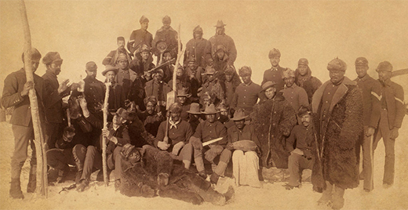

By the end of this section, you will be able to:
* Explain the evolution of American views about westward migration in the mid-nineteenth century
* Analyze the ways in which the federal government facilitated Americans’ westward migration in the mid-nineteenth century

 ![A timeline shows important events of the era. In 1848, the California Gold Rush begins; a photograph of three prospectors panning for gold by a stream is shown. In 1862, the Homestead Act and Pacific Railway Act are passed, and the Dakota War is fought; a photograph of a sod house is shown. In 1869, the first transcontinental railroad is completed; a photograph of the chief engineers of the Central Pacific and Union Pacific Railroads shaking hands at Promontory Point, surrounded by a crowd of workers, is shown. In 1873, barbed wire is invented; a diagram illustrating the construction of barbed wire is shown. In 1876, the Battle of Little Bighorn is fought. In 1882, the Chinese Exclusion Act is passed; a drawing of Chinese and African American railroad workers is shown.](../resources/CNX_History_17_01_Timeline.jpg "(credit &#x201C;barbed wire&#x201D;: modification of work by the U.S. Department of Commerce)"){: #CNX_History_17_01_Timeline}

While a small number of settlers had pushed westward before the mid-nineteenth century, the land west of the Mississippi was largely unexplored. Most Americans, if they thought of it at all, viewed this territory as an arid wasteland suitable only for Indians whom the federal government had displaced from eastern lands in previous generations. The reflections of early explorers who conducted scientific treks throughout the West tended to confirm this belief. Major Stephen Harriman Long, who commanded an expedition through Missouri and into the Yellowstone region in 1819–1820, frequently described the Great Plains as a arid and useless region, suitable as nothing more than a “great American desert.” But, beginning in the 1840s, a combination of economic opportunity and ideological encouragement changed the way Americans thought of the West. The federal government offered a number of incentives, making it viable for Americans to take on the challenge of seizing these rough lands from others and subsequently taming them. Still, most Americans who went west needed some financial security at the outset of their journey; even with government aid, the truly poor could not make the trip. The cost of moving an entire family westward, combined with the risks as well as the questionable chances of success, made the move prohibitive for most. While the economic Panic of 1837 led many to question the promise of urban America, and thus turn their focus to the promise of commercial farming in the West, the Panic also resulted in many lacking the financial resources to make such a commitment. For most, the dream to “Go west, young man” remained unfulfilled.

While much of the basis for westward expansion was economic, there was also a more philosophical reason, which was bound up in the American belief that the country—and the “heathens” who populated it—was destined to come under the civilizing rule of Euro-American settlers and their superior technology, most notably railroads and the telegraph. While the extent to which that belief was a heartfelt motivation held by most Americans, or simply a rationalization of the conquests that followed, remains debatable, the clashes—both physical and cultural—that followed this western migration left scars on the country that are still felt today.

### MANIFEST DESTINY

The concept of **Manifest Destiny**{: data-type="term"} found its roots in the long-standing traditions of territorial expansion upon which the nation itself was founded. This phrase, which implies divine encouragement for territorial expansion, was coined by magazine editor John O’Sullivan in 1845, when he wrote in the *United States Magazine and Democratic Review* that “it was our manifest destiny to overspread the continent allotted by Providence for the free development of our multiplying millions.” Although the context of O’Sullivan’s original article was to encourage expansion into the newly acquired Texas territory, the spirit it invoked would subsequently be used to encourage westward settlement throughout the rest of the nineteenth century. Land developers, railroad magnates, and other investors capitalized on the notion to encourage westward settlement for their own financial benefit. Soon thereafter, the federal government encouraged this inclination as a means to further develop the West during the Civil War, especially at its outset, when concerns over the possible expansion of slavery deeper into western territories was a legitimate fear.

The idea was simple: Americans were destined—and indeed divinely ordained—to expand democratic institutions throughout the continent. As they spread their culture, thoughts, and customs, they would, in the process, “improve” the lives of the native inhabitants who might otherwise resist Protestant institutions and, more importantly, economic development of the land. O’Sullivan may have coined the phrase, but the concept had preceded him: Throughout the 1800s, politicians and writers had stated the belief that the United States was destined to rule the continent. O’Sullivan’s words, which resonated in the popular press, matched the economic and political goals of a federal government increasingly committed to expansion.

Manifest Destiny justified in Americans’ minds their right and duty to govern any other groups they encountered during their expansion, as well as absolved them of any questionable tactics they employed in the process. While the commonly held view of the day was of a relatively empty frontier, waiting for the arrival of the settlers who could properly exploit the vast resources for economic gain, the reality was quite different. Hispanic communities in the Southwest, diverse Indian tribes throughout the western states, as well as other settlers from Asia and Western Europe already lived in many parts of the country. American expansion would necessitate a far more complex and involved exchange than simply filling empty space.

Still, in part as a result of the spark lit by O’Sullivan and others, waves of Americans and recently arrived immigrants began to move west in wagon trains. They travelled along several identifiable trails: first the Oregon Trail, then later the Santa Fe and California Trails, among others. The Oregon Trail is the most famous of these western routes. Two thousand miles long and barely passable on foot in the early nineteenth century, by the 1840s, wagon trains were a common sight. Between 1845 and 1870, considered to be the height of migration along the trail, over 400,000 settlers followed this path west from Missouri ([\[link\]](#CNX_History_17_01_Wagons)).

 "){: #CNX_History_17_01_Wagons}

Who Will Set Limits to Our Onward March?

<q>America is destined for better deeds. It is our unparalleled glory that we have no reminiscences of battle fields, but in defense \[sic\] of humanity, of the oppressed of all nations, of the rights of conscience, the rights of personal enfranchisement. Our annals describe no scenes of horrid carnage, where men were led on by hundreds of thousands to slay one another, dupes and victims to emperors, kings, nobles, demons in the human form called heroes. We have had patriots to defend our homes, our liberties, but no aspirants to crowns or thrones; nor have the American people ever suffered themselves to be led on by wicked ambition to depopulate the land, to spread desolation far and wide, that a human being might be placed on a seat of supremacy. . . .</q>

<q>The expansive future is our arena, and for our history. We are entering on its untrodden space, with the truths of God in our minds, beneficent objects in our hearts, and with a clear conscience unsullied by the past. We are the nation of human progress, and who will, what can, set limits to our onward march? Providence is with us, and no earthly power can.</q>

<q>—John O’Sullivan, 1839</q>

Think about how this quotation resonated with different groups of Americans at the time. When looked at through today’s lens, the actions of the westward-moving settlers were fraught with brutality and racism. At the time, however, many settlers felt they were at the pinnacle of democracy, and that with no aristocracy or ancient history, America was a new world where anyone could succeed. Even then, consider how the phrase “anyone” was restricted by race, gender, and nationality.

  
Visit [Across the Plains in ‘64][1] to follow one family making their way westward from Iowa to Oregon. Click on a few of the entries and see how the author describes their journey, from the expected to the surprising.

### FEDERAL GOVERNMENT ASSISTANCE

To assist the settlers in their move westward and transform the migration from a trickle into a steady flow, Congress passed two significant pieces of legislation in 1862: the Homestead Act and the Pacific Railway Act. Born largely out of President Abraham Lincoln’s growing concern that a potential Union defeat in the early stages of the Civil War might result in the expansion of slavery westward, Lincoln hoped that such laws would encourage the expansion of a “free soil” mentality across the West.

The **Homestead Act**{: data-type="term" .no-emphasis} allowed any head of household, or individual over the age of twenty-one—including unmarried women—to receive a parcel of 160 acres for only a nominal filing fee. All that recipients were required to do in exchange was to “improve the land” within a period of five years of taking possession. The standards for improvement were minimal: Owners could clear a few acres, build small houses or barns, or maintain livestock. Under this act, the government transferred over 270 million acres of public domain land to private citizens.

The Pacific Railway Act was pivotal in helping settlers move west more quickly, as well as move their farm products, and later cattle and mining deposits, back east. The first of many railway initiatives, this act commissioned the Union Pacific Railroad to build new track west from Omaha, Nebraska, while the Central Pacific Railroad moved east from Sacramento, California. The law provided each company with ownership of all public lands within two hundred feet on either side of the track laid, as well as additional land grants and payment through load bonds, prorated on the difficulty of the terrain it crossed. Because of these provisions, both companies made a significant profit, whether they were crossing hundreds of miles of open plains, or working their way through the Sierra Nevada Mountains of California. As a result, the nation’s first transcontinental railroad was completed when the two companies connected their tracks at Promontory Point, Utah, in the spring of 1869. Other tracks, including lines radiating from this original one, subsequently created a network that linked all corners of the nation ([\[link\]](#CNX_History_17_01_Railroad)).

 {: #CNX_History_17_01_Railroad}

In addition to legislation designed to facilitate western settlement, the U.S. government assumed an active role on the ground, building numerous forts throughout the West to protect and assist settlers during their migration. Forts such as Fort Laramie in Wyoming (built in 1834) and Fort Apache in Arizona (1870) served as protection from nearby Indians as well as maintained peace between potential warring tribes. Others located throughout Colorado and Wyoming became important trading posts for miners and fur trappers. Those built in Kansas, Nebraska, and the Dakotas served primarily to provide relief for farmers during times of drought or related hardships. Forts constructed along the California coastline provided protection in the wake of the Mexican-American War as well as during the American Civil War. These locations subsequently serviced the U.S. Navy and provided important support for growing Pacific trade routes. Whether as army posts constructed for the protection of white settlers and to maintain peace among Indian tribes, or as trading posts to further facilitate the development of the region, such forts proved to be vital contributions to westward migration.

### WHO WERE THE SETTLERS?

In the nineteenth century, as today, it took money to relocate and start a new life. Due to the initial cost of relocation, land, and supplies, as well as months of preparing the soil, planting, and subsequent harvesting before any produce was ready for market, the original wave of western settlers along the Oregon Trail in the 1840s and 1850s consisted of moderately prosperous, white, native-born farming families of the East. But the passage of the Homestead Act and completion of the first transcontinental railroad meant that, by 1870, the possibility of western migration was opened to Americans of more modest means. What started as a trickle became a steady flow of migration that would last until the end of the century.

Nearly 400,000 settlers had made the trek westward by the height of the movement in 1870. The vast majority were men, although families also migrated, despite incredible hardships for women with young children. More recent immigrants also migrated west, with the largest numbers coming from Northern Europe and Canada. Germans, Scandinavians, and Irish were among the most common. These ethnic groups tended to settle close together, creating strong rural communities that mirrored the way of life they had left behind. According to U.S. Census Bureau records, the number of Scandinavians living in the United States during the second half of the nineteenth century exploded, from barely 18,000 in 1850 to over 1.1 million in 1900. During that same time period, the German-born population in the United States grew from 584,000 to nearly 2.7 million and the Irish-born population grew from 961,000 to 1.6 million. As they moved westward, several thousand immigrants established homesteads in the Midwest, primarily in Minnesota and Wisconsin, where, as of 1900, over one-third of the population was foreign-born, and in North Dakota, whose immigrant population stood at 45 percent at the turn of the century. Compared to European immigrants, those from China were much less numerous, but still significant. More than 200,000 Chinese arrived in California between 1876 and 1890, albeit for entirely different reasons related to the Gold Rush.

In addition to a significant European migration westward, several thousand African Americans migrated west following the Civil War, as much to escape the racism and violence of the Old South as to find new economic opportunities. They were known as **exodusters**{: data-type="term"}, referencing the biblical flight from Egypt, because they fled the racism of the South, with most of them headed to Kansas from Kentucky, Tennessee, Louisiana, Mississippi, and Texas. Over twenty-five thousand exodusters arrived in Kansas in 1879–1880 alone. By 1890, over 500,000 blacks lived west of the Mississippi River. Although the majority of black migrants became farmers, approximately twelve thousand worked as cowboys during the Texas cattle drives. Some also became “Buffalo Soldiers” in the wars against Indians. “Buffalo Soldiers” were African Americans allegedly so-named by various Indian tribes who equated their black, curly hair with that of the buffalo. Many had served in the Union army in the Civil War and were now organized into six, all-black cavalry and infantry units whose primary duties were to protect settlers from Indian attacks during the westward migration, as well as to assist in building the infrastructure required to support western settlement ([\[link\]](#CNX_History_17_01_Buffalo)).

 {: #CNX_History_17_01_Buffalo}

  
The [Oxford African American Studies Center][2] features photographs and stories about black homesteaders. From exodusters to all-black settlements, the essay describes the largely hidden role that African Americans played in western expansion.

While white easterners, immigrants, and African Americans were moving west, several hundred thousand Hispanics had already settled in the American Southwest prior to the U.S. government seizing the land during its war with Mexico (1846–1848). The Treaty of Guadalupe Hidalgo, which ended the war in 1848, granted American citizenship to those who chose to stay in the United States, as the land switched from Mexican to U.S. ownership. Under the conditions of the treaty, Mexicans retained the right to their language, religion, and culture, as well as the property they held. As for citizenship, they could choose one of three options: 1) declare their intent to live in the United States but retain Mexican citizenship; 2) become U.S. citizens with all rights under the constitution; or 3) leave for Mexico. Despite such guarantees, within one generation, these new Hispanic American citizens found their culture under attack, and legal protection of their property all but non-existent.

### Section Summary

While a few bold settlers had moved westward before the middle of the nineteenth century, they were the exception, not the rule. The “great American desert,” as it was called, was considered a vast and empty place, unfit for civilized people. In the 1840s, however, this idea started to change, as potential settlers began to learn more from promoters and land developers of the economic opportunities that awaited them in the West, and Americans extolled the belief that it was their Manifest Destiny—their divine right—to explore and settle the western territories in the name of the United States.

Most settlers in this first wave were white Americans of means. Whether they sought riches in gold, cattle, or farming, or believed it their duty to spread Protestant ideals to native inhabitants, they headed west in wagon trains along paths such as the Oregon Trail. European immigrants, particularly those from Northern Europe, also made the trip, settling in close-knit ethnic enclaves out of comfort, necessity, and familiarity. African Americans escaping the racism of the South also went west. In all, the newly settled areas were neither a fast track to riches nor a simple expansion into an empty land, but rather a clash of cultures, races, and traditions that defined the emerging new America.

### Review Questions

Which of the following does *not* represent a group that participated significantly in westward migration after 1870?

1.  African American “exodusters” escaping racism and seeking economic opportunities
2.  former Southern slaveholders seeking land and new financial opportunities
3.  recent immigrants from Northern Europe and Canada
4.  recent Chinese immigrants seeking gold in California
{: type="A"}

B

Which of the following represents an action that the U.S. government took to help Americans fulfill the goal of western expansion?

1.  the passage of the Homestead Act
2.  the official creation of the philosophy of Manifest Destiny
3.  the development of stricter immigration policies
4.  the introduction of new irrigation techniques
{: type="A"}

A

Why and how did the U.S. government promote western migration in the midst of fighting the Civil War?

During the first two years of the Civil War—when it appeared that the Confederacy was a formidable opponent—President Lincoln grew concerned that a Union defeat could result in the westward expansion of slavery. Thus, he hoped to facilitate the westward movement of white settlers who promoted the concept of free soil, which would populate the region with allies who opposed slavery. To encourage this process, Congress passed the Homestead Act and the Pacific Railway Act in 1862. The government also constructed and maintained forts that assisted in the process of westward expansion.

### Glossary
{: data-type="glossary-title"}

Manifest Destiny
: the phrase, coined by journalist John O’Sullivan, which came to stand for the idea that white Americans had a calling and a duty to seize and settle the American West with Protestant democratic values
^

exodusters
: a term used to describe African Americans who moved to Kansas from the Old South to escape the racism there

[1]: https://archive.org/details/acrossplainsin6400collrich
[2]: http://openstaxcollege.org/l/homesteads
