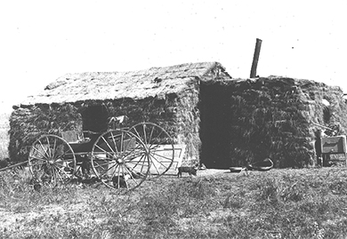

By the end of this section, you will be able to:
* Identify the challenges that farmers faced as they settled west of the Mississippi River
* Describe the unique experiences of women who participated in westward migration

As settlers and homesteaders moved westward to improve the land given to them through the Homestead Act, they faced a difficult and often insurmountable challenge. The land was difficult to farm, there were few building materials, and harsh weather, insects, and inexperience led to frequent setbacks. The prohibitive prices charged by the first railroad lines made it expensive to ship crops to market or have goods sent out. Although many farms failed, some survived and grew into large “bonanza” farms that hired additional labor and were able to benefit enough from economies of scale to grow profitable. Still, small family farms, and the settlers who worked them, were hard-pressed to do more than scrape out a living in an unforgiving environment that comprised arid land, violent weather shifts, and other challenges ([\[link\]](#CNX_History_17_02_MapsMigrat)).

 ![A map shows the trails used in westward migration and the railroad lines constructed after the completion of the first transcontinental railroad. The trails labeled include the Oregon Trail, California Trail, Spanish Trail, Desert Trail, Red River Trail, South Texas Trail, California/Oregon Trail, Santa Fe Trail, and Ft. Smith Trail. The railroad lines labeled include the Great Northern, Northern Pacific, Southern Pacific, Central Pacific, Atlantic &amp; Pacific, Atchison, Topeka &amp; Santa Fe, and Texas &amp; Pacific.](../resources/CNX_History_17_02_MapsMigrat.jpg "This map shows the trails (orange) used in westward migration and the development of railroad lines (blue) constructed after the completion of the first transcontinental railroad."){: #CNX_History_17_02_MapsMigrat}

### THE DIFFICULT LIFE OF THE PIONEER FARMER

Of the hundreds of thousands of settlers who moved west, the vast majority were homesteaders. These pioneers, like the Ingalls family of *Little House on the Prairie* book and television fame (see inset below), were seeking land and opportunity. Popularly known as “sodbusters,” these men and women in the Midwest faced a difficult life on the frontier. They settled throughout the land that now makes up the Midwestern states of Wisconsin, Minnesota, Kansas, Nebraska, and the Dakotas. The weather and environment were bleak, and settlers struggled to eke out a living. A few unseasonably rainy years had led would-be settlers to believe that the “great desert” was no more, but the region’s typically low rainfall and harsh temperatures made crop cultivation hard. Irrigation was a requirement, but finding water and building adequate systems proved too difficult and expensive for many farmers. It was not until 1902 and the passage of the Newlands Reclamation Act that a system finally existed to set aside funds from the sale of public lands to build dams for subsequent irrigation efforts. Prior to that, farmers across the Great Plains relied primarily on dry-farming techniques to grow corn, wheat, and sorghum, a practice that many continued in later years. A few also began to employ windmill technology to draw water, although both the drilling and construction of windmills became an added expense that few farmers could afford.

The Enduring Appeal of *Little House on the Prairie*

The story of western migration and survival has remained a touchstone of American culture, even today. The television show *Frontier Life* on PBS is one example, as are countless other modern-day evocations of the settlers. Consider the enormous popularity of the *Little House* series. The books, originally published in the 1930s and 1940s, have been in print continuously. The television show, *Little House on the Prairie*, ran for over a decade and was hugely successful (and was said to be President Ronald Reagan’s favorite show). The books, although fictional, were based on Laura Ingalls Wilder’s own childhood, as she travelled west with her family via covered wagon, stopping in Kansas, Wisconsin, South Dakota, and beyond ([\[link\]](#CNX_History_17_02_LittleHous)).

 is the celebrated author of the Little House series, which began in 1932 with the publication of Little House in the Big Woods. The third, and best known, book in the series, Little House on the Prairie (b), was published just three years later."){: #CNX_History_17_02_LittleHous}

Wilder wrote of her stories, “As you read my stories of long ago I hope you will remember that the things that are truly worthwhile and that will give you happiness are the same now as they were then. Courage and kindness, loyalty, truth, and helpfulness are always the same and always needed.” While Ingalls makes the point that her stories underscore traditional values that remain the same over time, this is not necessarily the only thing that made these books so popular. Perhaps part of their appeal is that they are adventure stories, with wild weather, wild animals, and wild Indians all playing a role. Does this explain their ongoing popularity? What other factors might make these stories appealing so long after they were originally written?

The first houses built by western settlers were typically made of mud and sod with thatch roofs, as there was little timber for building. Rain, when it arrived, presented constant problems for these **sod houses**{: data-type="term"}, with mud falling into food, and vermin, most notably lice, scampering across bedding ([\[link\]](#CNX_History_17_02_Homestead)). Weather patterns not only left the fields dry, they also brought tornadoes, droughts, blizzards, and insect swarms. Tales of swarms of locusts were commonplace, and the crop-eating insects would at times cover the ground six to twelve inches deep. One frequently quoted Kansas newspaper reported a locust swarm in 1878 during which the insects devoured “everything green, stripping the foliage off the bark and from the tender twigs of the fruit trees, destroying every plant that is good for food or pleasant to the eye, that man has planted.”

 {: #CNX_History_17_02_Homestead}

Farmers also faced the ever-present threat of debt and farm foreclosure by the banks. While land was essentially free under the Homestead Act, all other farm necessities cost money and were initially difficult to obtain in the newly settled parts of the country where market economies did not yet fully reach. Horses, livestock, wagons, wells, fencing, seed, and fertilizer were all critical to survival, but often hard to come by as the population initially remained sparsely settled across vast tracts of land. Railroads charged notoriously high rates for farm equipment and livestock, making it difficult to procure goods or make a profit on anything sent back east. Banks also charged high interest rates, and, in a cycle that replayed itself year after year, farmers would borrow from the bank with the intention of repaying their debt after the harvest. As the number of farmers moving westward increased, the market price of their produce steadily declined, even as the value of the actual land increased. Each year, hard-working farmers produced ever-larger crops, flooding the markets and subsequently driving prices down even further. Although some understood the economics of supply and demand, none could overtly control such forces.

Eventually, the arrival of a more extensive railroad network aided farmers, mostly by bringing much-needed supplies such as lumber for construction and new farm machinery. While John Deere sold a steel-faced plow as early as 1838, it was James Oliver’s improvements to the device in the late 1860s that transformed life for homesteaders. His new, less expensive “chilled plow” was better equipped to cut through the shallow grass roots of the Midwestern terrain, as well as withstand damage from rocks just below the surface. Similar advancements in hay mowers, manure spreaders, and threshing machines greatly improved farm production for those who could afford them. Where capital expense became a significant factor, larger commercial farms—known as “**bonanza farms**{: data-type="term"}”—began to develop. Farmers in Minnesota, North Dakota, and South Dakota hired migrant farmers to grow wheat on farms in excess of twenty thousand acres each. These large farms were succeeding by the end of the century, but small family farms continued to suffer. Although the land was nearly free, it cost close to $1000 for the necessary supplies to start up a farm, and many would-be landowners lured westward by the promise of cheap land became migrant farmers instead, working other peoples’ land for a wage. The frustration of small farmers grew, ultimately leading to a revolt of sorts, discussed in a later chapter.

  
[Frontier House][1] includes information on the logistics of moving across the country as a homesteader. Take a look at the list of supplies and gear. It is easy to understand why, even when the government gave the land away for free, it still took significant resources to make such a journey.

### AN EVEN MORE CHALLENGING LIFE: A PIONEER WIFE

Although the West was numerically a male-dominated society, homesteading in particular encouraged the presence of women, families, and a domestic lifestyle, even if such a life was not an easy one. Women faced all the physical hardships that men encountered in terms of weather, illness, and danger, with the added complication of childbirth. Often, there was no doctor or midwife providing assistance, and many women died from treatable complications, as did their newborns. While some women could find employment in the newly settled towns as teachers, cooks, or seamstresses, they originally did not enjoy many rights. They could not sell property, sue for divorce, serve on juries, or vote. And for the vast majority of women, their work was not in towns for money, but on the farm. As late as 1900, a typical farm wife could expect to devote nine hours per day to chores such as cleaning, sewing, laundering, and preparing food. Two additional hours per day were spent cleaning the barn and chicken coop, milking the cows, caring for the chickens, and tending the family garden. One wife commented in 1879, “\[We are\] not much better than slaves. It is a weary, monotonous round of cooking and washing and mending and as a result the insane asylum is a third filled with wives of farmers.”

Despite this grim image, the challenges of farm life eventually empowered women to break through some legal and social barriers. Many lived more equitably as partners with their husbands than did their eastern counterparts, helping each other through both hard times and good. If widowed, a wife typically took over responsibility for the farm, a level of management that was very rare back east, where the farm would fall to a son or other male relation. Pioneer women made important decisions and were considered by their husbands to be more equal partners in the success of the homestead, due to the necessity that all members had to work hard and contribute to the farming enterprise for it to succeed. Therefore, it is not surprising that the first states to grant women’s rights, including the right to vote, were those in the Pacific Northwest and Upper Midwest, where women pioneers worked the land side by side with men. Some women seemed to be well suited to the challenges that frontier life presented them. Writing to her Aunt Martha from their homestead in Minnesota in 1873, Mary Carpenter refused to complain about the hardships of farm life: “I try to trust in God’s promises, but we can’t expect him to work miracles nowadays. Nevertheless, all that is expected of us is to do the best we can, and that we shall certainly endeavor to do. Even if we do freeze and starve in the way of duty, it will not be a dishonorable death.”

### Section Summary

The concept of Manifest Destiny and the strong incentives to relocate sent hundreds of thousands of people west across the Mississippi. The rigors of this new way of life presented many challenges and difficulties to homesteaders. The land was dry and barren, and homesteaders lost crops to hail, droughts, insect swarms, and more. There were few materials with which to build, and early homes were made of mud, which did not stand up to the elements. Money was a constant concern, as the cost of railroad freight was exorbitant, and banks were unforgiving of bad harvests. For women, life was difficult in the extreme. Farm wives worked at least eleven hours per day on chores and had limited access to doctors or midwives. Still, they were more independent than their eastern counterparts and worked in partnership with their husbands.

As the railroad expanded and better farm equipment became available, by the 1870s, large farms began to succeed through economies of scale. Small farms still struggled to stay afloat, however, leading to a rising discontent among the farmers, who worked so hard for so little success.

### Review Questions

What specific types of hardships did an average American farmer *not* face as he built his homestead in the Midwest?

1.  droughts
2.  insect swarms
3.  hostile Indian attacks
4.  limited building supplies
{: type="A"}

C

What accounts for the success of large, commercial “bonanza farms?” What benefits did they enjoy over their smaller family-run counterparts?

Farmers who were able to invest a significant amount of capital in starting up large farms could acquire necessary supplies with ease. They also had access to new, technologically advanced farm machinery, which greatly improved efficiency and output. Such farmers hired migrant farmers to work their huge amounts of land. These “bonanza farms” were often quite successful, whereas family farms—unable to afford the supplies they needed for success, let alone take advantage of the technological innovations that would make their farms competitive—often failed.

How did everyday life in the American West hasten equality for women who settled the land?

Women who settled the West were considered by their husbands to be more equitable partners in the success or failure of the homestead. Because resources were so limited and the area so sparsely settled, women participated in work that was typically done only by men. Due in part to these efforts, women were able to inherit and run farms if they became widowed, rather than passing the farms along to male relations as they would in the East. The first states to begin granting rights to women, including the right to vote, were in the Pacific Northwest and Upper Midwest, where women homesteaders worked side by side with men to tame the land.

### Glossary
{: data-type="glossary-title"}

bonanza farms
: large farms owned by speculators who hired laborers to work the land; these large farms allowed their owners to benefit from economies of scale and prosper, but they did nothing to help small family farms, which continued to struggle
^

sod house
: a frontier home constructed of dirt held together by thick-rooted prairie grass that was prevalent in the Midwest; sod, cut into large rectangles, was stacked to make the walls of the structure, providing an inexpensive, yet damp, house for western settlers

[1]: http://openstax.org/l/homesteader
