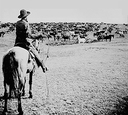

By the end of this section, you will be able to:
* Identify the major discoveries and developments in western gold, silver, and copper mining in the mid-nineteenth century
* Explain why the cattle industry was paramount to the development of the West and how it became the catalyst for violent range wars

Although homestead farming was the primary goal of most western settlers in the latter half of the nineteenth century, a small minority sought to make their fortunes quickly through other means. Specifically, gold (and, subsequently, silver and copper) prospecting attracted thousands of miners looking to “get rich quick” before returning east. In addition, ranchers capitalized on newly available railroad lines to move longhorn steers that populated southern and western Texas. This meat was highly sought after in eastern markets, and the demand created not only wealthy ranchers but an era of cowboys and cattle drives that in many ways defines how we think of the West today. Although neither miners nor ranchers intended to remain permanently in the West, many individuals from both groups ultimately stayed and settled there, sometimes due to the success of their gamble, and other times due to their abject failure.

# THE CALIFORNIA GOLD RUSH AND BEYOND

The allure of gold has long sent people on wild chases; in the American West, the possibility of quick riches was no different. The search for gold represented an opportunity far different from the slow plod that homesteading farmers faced. The discovery of gold at Sutter’s Mill in Coloma, California, set a pattern for such strikes that was repeated again and again for the next decade, in what collectively became known as the **California Gold Rush**{: data-type="term"}. In what became typical, a sudden disorderly rush of prospectors descended upon a new discovery site, followed by the arrival of those who hoped to benefit from the strike by preying off the newly rich. This latter group of camp followers included saloonkeepers, prostitutes, store owners, and criminals, who all arrived in droves. If the strike was significant in size, a town of some magnitude might establish itself, and some semblance of law and order might replace the vigilante justice that typically grew in the small and short-lived mining outposts.

The original Forty-Niners were individual prospectors who sifted gold out of the dirt and gravel through “panning” or by diverting a stream through a sluice box ([\[link\]](#CNX_History_17_03_Panning)). To varying degrees, the original California Gold Rush repeated itself throughout Colorado and Nevada for the next two decades. In 1859, Henry T. P. Comstock, a Canadian-born fur trapper, began gold mining in Nevada with other prospectors but then quickly found a blue-colored vein that proved to be the first significant silver discovery in the United States. Within twenty years, the **Comstock Lode**{: data-type="term"}, as it was called, yielded more than $300 million in shafts that reached hundreds of feet into the mountain. Subsequent mining in Arizona and Montana yielded copper, and, while it lacked the glamour of gold, these deposits created huge wealth for those who exploited them, particularly with the advent of copper wiring for the delivery of electricity and telegraph communication.

 . It didn&#x2019;t take long for the most accessible minerals to be stripped, making way for large mining operations, including hydraulic mining, where high-pressure water jets removed sediment and rocks (b)."){: #CNX_History_17_03_Panning}

By the 1860s and 1870s, however, individual efforts to locate precious metals were less successful. The lowest-hanging fruit had been picked, and now it required investment capital and machinery to dig mine shafts that could reach remaining ore. With a much larger investment, miners needed a larger strike to be successful. This shift led to larger businesses underwriting mining operations, which eventually led to the development of greater urban stability and infrastructure. Denver, Colorado, was one of several cities that became permanent settlements, as businesses sought a stable environment to use as a base for their mining ventures.

For miners who had not yet struck it rich, this development was not a good one. They were now paid a daily or weekly wage to work underground in very dangerous conditions. They worked in shafts where the temperature could rise to above one hundred degrees Fahrenheit, and where poor ventilation might lead to long-term lung disease. They coped with shaft fires, dynamite explosions, and frequent cave-ins. By some historical accounts, close to eight thousand miners died on the frontier during this period, with over three times that number suffering crippling injuries. Some miners organized into unions and led strikes for better conditions, but these efforts were usually crushed by state militias.

Eventually, as the ore dried up, most mining towns turned into ghost towns. Even today, a visit through the American West shows old saloons and storefronts, abandoned as the residents moved on to their next shot at riches. The true lasting impact of the early mining efforts was the resulting desire of the U.S. government to bring law and order to the “Wild West” in order to more efficiently extract natural resources and encourage stable growth in the region. As more Americans moved to the region to seek permanent settlement, as opposed to brief speculative ventures, they also sought the safety and support that government order could bring. Nevada was admitted to the Union as a state in 1864, with Colorado following in 1876, then North Dakota, South Dakota, Montana, and Washington in 1889; and Idaho and Wyoming in 1890.

# THE CATTLE KINGDOM

While the cattle industry lacked the romance of the Gold Rush, the role it played in western expansion should not be underestimated. For centuries, wild cattle roamed the Spanish borderlands. At the end of the Civil War, as many as five million longhorn steers could be found along the Texas frontier, yet few settlers had capitalized on the opportunity to claim them, due to the difficulty of transporting them to eastern markets. The completion of the first transcontinental railroad and subsequent railroad lines changed the game dramatically. Cattle ranchers and eastern businessmen realized that it was profitable to round up the wild steers and transport them by rail to be sold in the East for as much as thirty to fifty dollars per head. These ranchers and businessmen began the rampant speculation in the cattle industry that made, and lost, many fortunes.

So began the impressive cattle drives of the 1860s and 1870s. The famous Chisholm Trail provided a quick path from Texas to railroad terminals in Abilene, Wichita, and Dodge City, Kansas, where cowboys would receive their pay. These “cowtowns,” as they became known, quickly grew to accommodate the needs of cowboys and the cattle industry. Cattlemen like Joseph G. McCoy, born in Illinois, quickly realized that the railroad offered a perfect way to get highly sought beef from Texas to the East. McCoy chose Abilene as a locale that would offer cowboys a convenient place to drive the cattle, and went about building stockyards, hotels, banks, and more to support the business. He promoted his services and encouraged cowboys to bring their cattle through Abilene for good money; soon, the city had grown into a bustling western city, complete with ways for the cowboys to spend their hard-earned pay ([\[link\]](#CNX_History_17_03_Cattle)).

 {: #CNX_History_17_03_Cattle}

Between 1865 and 1885, as many as forty thousand cowboys roamed the Great Plains, hoping to work for local ranchers. They were all men, typically in their twenties, and close to one-third of them were Hispanic or African American. It is worth noting that the stereotype of the American cowboy—and indeed the cowboys themselves—borrowed much from the Mexicans who had long ago settled those lands. The saddles, lassos, chaps, and lariats that define cowboy culture all arose from the Mexican ranchers who had used them to great effect before the cowboys arrived.

Life as a cowboy was dirty and decidedly unglamorous. The terrain was difficult; conflicts with Native Americans, especially in Indian Territory (now Oklahoma), were notoriously deadly. But the longhorn cattle were hardy stock, and could survive and thrive while grazing along the long trail, so cowboys braved the trip for the promise of steady employment and satisfying wages. Eventually, however, the era of the free range ended. Ranchers developed the land, limiting grazing opportunities along the trail, and in 1873, the new technology of barbed wire allowed ranchers to fence off their lands and cattle claims. With the end of the free range, the cattle industry, like the mining industry before it, grew increasingly dominated by eastern businessmen. Capital investors from the East expanded rail lines and invested in ranches, ending the reign of the cattle drives.

Barbed Wire and a Way of Life Gone

Called the “devil’s rope” by Indians, barbed wire had a profound impact on the American West. Before its invention, settlers and ranchers alike were stymied by a lack of building materials to fence off land. Communal grazing and long cattle drives were the norm. But with the invention of barbed wire, large cattle ranchers and their investors were able to cheaply and easily parcel off the land they wanted—whether or not it was legally theirs to contain. As with many other inventions, several people “invented” barbed wire around the same time. In 1873, it was Joseph Glidden, however, who claimed the winning design and patented it. Not only did it spell the end of the free range for settlers and cowboys, it kept more land away from Indian tribes, who had never envisioned a culture that would claim to own land ([\[link\]](#CNX_History_17_03_BarbedWire)).

"){: #CNX_History_17_03_BarbedWire}

In the early twentieth century, songwriter Cole Porter would take a poem by a Montana poet named Bob Fletcher and convert it into a cowboy song called, “Don’t Fence Me In.” As the lyrics below show, the song gave voice to the feeling that, as the fences multiplied, the ethos of the West was forever changed:

\> Oh, give me land, lots of land, under starry skies above
> * * *
> {: data-type="newline"}
> 
> Don\'t fence me in
> * * *
> {: data-type="newline"}
> 
> Let me ride thru the wide-open country that I love
> * * *
> {: data-type="newline"}
> 
> Don\'t fence me in . . .
> * * *
> {: data-type="newline"}
> 
> Just turn me loose
> * * *
> {: data-type="newline"}
> 
> Let me straddle my old saddle underneath the western skies
> * * *
> {: data-type="newline"}
> 
> On my cayuse
> * * *
> {: data-type="newline"}
> 
> Let me wander over yonder till I see the mountains rise
> * * *
> {: data-type="newline"}
> 
> I want to ride to the ridge where the west commences
> * * *
> {: data-type="newline"}
> 
> Gaze at the moon until I lose my senses
> * * *
> {: data-type="newline"}
> 
> I can\'t look at hobbles and I can\'t stand fences
> * * *
> {: data-type="newline"}
> 
> Don\'t fence me in.
> * * *
> {: data-type="newline"}

# VIOLENCE IN THE WILD WEST: MYTH AND REALITY

The popular image of the Wild West portrayed in books, television, and film has been one of violence and mayhem. The lure of quick riches through mining or driving cattle meant that much of the West did indeed consist of rough men living a rough life, although the violence was exaggerated and even glorified in the dime store novels of the day. The exploits of Wyatt Earp, Doc Holiday, and others made for good stories, but the reality was that western violence was more isolated than the stories might suggest. These clashes often occurred as people struggled for the scarce resources that could make or break their chance at riches, or as they dealt with the sudden wealth or poverty that prospecting provided.

Where sporadic violence did erupt, it was concentrated largely in mining towns or during range wars among large and small cattle ranchers. Some mining towns were indeed as rough as the popular stereotype. Men, money, liquor, and disappointment were a recipe for violence. Fights were frequent, deaths were commonplace, and frontier justice reigned. The notorious mining town of Bodie, California, had twenty-nine murders between 1877 and 1883, which translated to a murder rate higher than any other city at that time, and only one person was ever convicted of a crime. The most prolific gunman of the day was John Wesley Hardin, who allegedly killed over twenty men in Texas in various gunfights, including one victim he killed in a hotel for snoring too loudly ([\[link\]](#CNX_History_17_03_Saloon)).

 {: #CNX_History_17_03_Saloon}

Ranching brought with it its own dangers and violence. In the Texas cattle lands, owners of large ranches took advantage of their wealth and the new invention of barbed wire to claim the prime grazing lands and few significant watering holes for their herds. Those seeking only to move their few head of cattle to market grew increasingly frustrated at their inability to find even a blade of grass for their meager herds. Eventually, frustration turned to violence, as several ranchers resorted to vandalizing the barbed wire fences to gain access to grass and water for their steers. Such vandalism quickly led to cattle rustling, as these cowboys were not averse to leading a few of the rancher’s steers into their own herds as they left.

One example of the violence that bubbled up was the infamous **Fence Cutting War**{: data-type="term"} in Clay County, Texas (1883–1884). There, cowboys began destroying fences that several ranchers erected along public lands: land they had no right to enclose. Confrontations between the cowboys and armed guards hired by the ranchers resulted in three deaths—hardly a “war,” but enough of a problem to get the governor’s attention. Eventually, a special session of the Texas legislature addressed the problem by passing laws to outlaw fence cutting, but also forced ranchers to remove fences illegally erected along public lands, as well as to place gates for passage where public areas adjoined private lands.

An even more violent confrontation occurred between large ranchers and small farmers in Johnson County, Wyoming, where cattle ranchers organized a “lynching bee” in 1891–1892 to make examples of cattle rustlers. Hiring twenty-two “invaders” from Texas to serve as hired guns, the ranch owners and their foremen hunted and subsequently killed the two rustlers best known for organizing the owners of the smaller Wyoming farms. Only the intervention of federal troops, who arrested and then later released the invaders, allowing them to return to Texas, prevented a greater massacre.

While there is much talk—both real and mythical—of the rough men who lived this life, relatively few women experienced it. While homesteaders were often families, gold speculators and cowboys tended to be single men in pursuit of fortune. The few women who went to these wild outposts were typically prostitutes, and even their numbers were limited. In 1860, in the Comstock Lode region of Nevada, for example, there were reportedly only thirty women total in a town of twenty-five hundred men. Some of the “painted ladies” who began as prostitutes eventually owned brothels and emerged as businesswomen in their own right; however, life for these young women remained a challenging one as western settlement progressed. A handful of women, numbering no more than six hundred, braved both the elements and male-dominated culture to become teachers in several of the more established cities in the West. Even fewer arrived to support husbands or operate stores in these mining towns.

As wealthy men brought their families west, the lawless landscape began to change slowly. Abilene, Kansas, is one example of a lawless town, replete with prostitutes, gambling, and other vices, transformed when middle-class women arrived in the 1880s with their cattle baron husbands. These women began to organize churches, school, civic clubs, and other community programs to promote family values. They fought to remove opportunities for prostitution and all the other vices that they felt threatened the values that they held dear. Protestant missionaries eventually joined the women in their efforts, and, while they were not widely successful, they did bring greater attention to the problems. As a response, the U.S. Congress passed both the Comstock Law (named after its chief proponent, anti-obscenity crusader Anthony Comstock) in 1873 to ban the spread of “lewd and lascivious literature” through the mail and the subsequent Page Act of 1875 to prohibit the transportation of women into the United States for employment as prostitutes. However, the “houses of ill repute” continued to operate and remained popular throughout the West despite the efforts of reformers.

  
Take a look at the [National Cowboy and Western Heritage Museum][1] to determine whether this site’s portrayal of cowboy culture matches or contradicts the history shared in this chapter.

# Section Summary

While homesteading was the backbone of western expansion, mining and cattle also played significant roles in shaping the West. Much rougher in character and riskier in outcomes than farming, these two opportunities brought forward a different breed of settler than the homesteaders. Many of the long-trail cattle riders were Mexican American or African American, and most of the men involved in both pursuits were individuals willing to risk what little they had in order to strike it rich.

In both the mining and cattle industries, however, individual opportunities slowly died out, as resources—both land for grazing and easily accessed precious metals—disappeared. In their place came big business, with the infrastructure and investments to make a profit. These businesses built up small towns into thriving cities, and the influx of middle-class families sought to drive out some of the violence and vice that characterized the western towns. Slowly but inexorably, the “American” way of life, as envisioned by the eastern establishment who initiated and promoted the concept of Manifest Destiny, was spreading west.

# Review Questions

Which of the following groups was *not* impacted by the invention of barbed wire?ranchers cowboys farmers illegal prostitutes 

D

The American cowboy owes much of its model to what other culture?Mexicans Indians Northern European immigrants Chinese immigrants 

A

How did mining and cattle ranching transform individual “get rich quick” efforts into “big business” efforts when the nineteenth century came to a close?

In the cases of both mining and cattle ranching, diminishing resources played a key role. In mining, the first prospectors were able to pan for gold with crude and inexpensive materials, and therefore, almost anyone could head west and try his luck. Similarly, the quantity of cattle and the amount of grazing land meant that cowboys and would-be cattle barons had ample room to spread out. But as the easiest minerals were stripped away and large-scale ranchers purchased, developed, and fenced off grazing land, opportunities diminished. It took significantly more resources to tunnel down into a mine than it did to pan for gold; instead of individual prospectors, companies would assess a site’s potential and then seek investment to hire workers and drill deep into the earth. Likewise, as the cattle trails were over-grazed, ranchers needed to purchase and privatize large swaths of land to prepare their cattle for market.

[1]: http://openstaxcollege.org/l/natcowboy
