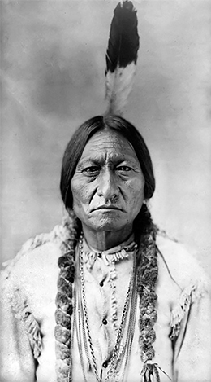
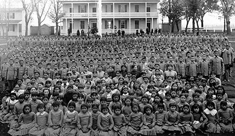

By the end of this section, you will be able to:
* Describe the methods that the U.S. government used to address the “Indian threat” during the settlement of the West
* Explain the process of “Americanization” as it applied to Indians in the nineteenth century

As American settlers pushed westward, they inevitably came into conflict with Indian tribes that had long been living on the land. Although the threat of Indian attacks was quite slim and nowhere proportionate to the number of U.S. Army actions directed against them, the occasional attack—often one of retaliation—was enough to fuel the popular fear of the “savage” Indians. The clashes, when they happened, were indeed brutal, although most of the brutality occurred at the hands of the settlers. Ultimately, the settlers, with the support of local militias and, later, with the federal government behind them, sought to eliminate the tribes from the lands they desired. The result was devastating for the Indian tribes, which lacked the weapons and group cohesion to fight back against such well-armed forces. The Manifest Destiny of the settlers spelled the end of the Indian way of life.

### CLAIMING LAND, RELOCATING LANDOWNERS

Back east, the popular vision of the West was of a vast and empty land. But of course this was an exaggerated depiction. On the eve of westward expansion, as many as 250,000 Indians, representing a variety of tribes, populated the Great Plains. Previous wars against these tribes in the early nineteenth century, as well as the failure of earlier treaties, had led to a general policy of the forcible removal of many tribes in the eastern United States. The Indian Removal Act of 1830 resulted in the infamous “Trail of Tears,” which saw nearly fifty thousand Seminole, Choctaw, Chickasaw, and Creek Indians relocated west of the Mississippi River to what is now Oklahoma between 1831 and 1838. Building upon such a history, the U.S. government was prepared, during the era of western settlement, to deal with tribes that settlers viewed as obstacles to expansion.

As settlers sought more land for farming, mining, and cattle ranching, the first strategy employed to deal with the perceived Indian threat was to negotiate settlements to move tribes out of the path of white settlers. In 1851, the chiefs of most of the Great Plains tribes agreed to the First Treaty of Fort Laramie. This agreement established distinct tribal borders, essentially codifying the reservation system. In return for annual payments of $50,000 to the tribes (originally guaranteed for fifty years, but later revised to last for only ten) as well as the hollow promise of noninterference from westward settlers, Indians agreed to stay clear of the path of settlement. Due to government corruption, many annuity payments never reached the tribes, and some reservations were left destitute and near starving. In addition, within a decade, as the pace and number of western settlers increased, even designated reservations became prime locations for farms and mining. Rather than negotiating new treaties, settlers—oftentimes backed by local or state militia units—simply attacked the tribes out of fear or to force them from the land. Some Indians resisted, only to then face massacres.

In 1862, frustrated and angered by the lack of annuity payments and the continuous encroachment on their reservation lands, Dakota Sioux Indians in Minnesota rebelled in what became known as the Dakota War, killing the white settlers who moved onto their tribal lands. Over one thousand white settlers were captured or killed in the attack, before an armed militia regained control. Of the four hundred Sioux captured by U.S. troops, 303 were sentenced to death, but President Lincoln intervened, releasing all but thirty-eight of the men. The thirty-eight who were found guilty were hanged in the largest mass execution in the country’s history, and the rest of the tribe was banished. Settlers in other regions responded to news of this raid with fear and aggression. In Colorado, Arapahoe and Cheyenne tribes fought back against land encroachment; white militias then formed, decimating even some of the tribes that were willing to cooperate. One of the more vicious examples was near Sand Creek, Colorado, where Colonel John Chivington led a militia raid upon a camp in which the leader had already negotiated a peaceful settlement. The camp was flying both the American flag and the white flag of surrender when Chivington’s troops murdered close to one hundred people, the majority of them women and children, in what became known as the **Sand Creek Massacre**{: data-type="term"}. For the rest of his life, Chivington would proudly display his collection of nearly one hundred Indian scalps from that day. Subsequent investigations by the U.S. Army condemned Chivington’s tactics and their results; however, the raid served as a model for some settlers who sought any means by which to eradicate the perceived Indian threat.

Hoping to forestall similar uprisings and all-out Indian wars, the U.S. Congress commissioned a committee to investigate the causes of such incidents. The subsequent report of their findings led to the passage of two additional treaties: the Second Treaty of Fort Laramie and the Treaty of Medicine Lodge Creek, both designed to move the remaining tribes to even more remote reservations. The Second Treaty of Fort Laramie moved the remaining Sioux to the Black Hills in the Dakota Territory and the Treaty of Medicine Lodge Creek moved the Cheyenne, Arapaho, Kiowa, and Comanche to “Indian Territory,” later to become the State of Oklahoma.

The agreements were short-lived, however. With the subsequent discovery of gold in the Black Hills, settlers seeking their fortune began to move upon the newly granted Sioux lands with support from U.S. cavalry troops. By the middle of 1875, thousands of white prospectors were illegally digging and panning in the area. The Sioux protested the invasion of their territory and the violation of sacred ground. The government offered to lease the Black Hills or to pay $6 million if the Indians were willing to sell the land. When the tribes refused, the government imposed what it considered a fair price for the land, ordered the Indians to move, and in the spring of 1876, made ready to force them onto the reservation.

In the Battle of Little Bighorn, perhaps the most famous battle of the American West, a Sioux chieftain, Sitting Bull, urged Indians from all neighboring tribes to join his men in defense of their lands ([\[link\]](#CNX_History_17_04_SitBull)). At the Little Bighorn River, the U.S. Army’s Seventh Cavalry, led by Colonel George Custer, sought a showdown. Driven by his own personal ambition, on June 25, 1876, Custer foolishly attacked what he thought was a minor Indian encampment. Instead, it turned out to be the main Sioux force. The Sioux warriors—nearly three thousand in strength—surrounded and killed Custer and 262 of his men and support units, in the single greatest loss of U.S. troops to an Indian attack in the era of westward expansion. Eyewitness reports of the attack indicated that the victorious Sioux bathed and wrapped Custer’s body in the tradition of a chieftain burial; however, they dismembered many other soldiers’ corpses in order for a few distant observers from Major Marcus Reno’s wounded troops and Captain Frederick Benteen’s company to report back to government officials about the ferocity of the Sioux enemy.

 {: #CNX_History_17_04_SitBull}

### AMERICAN INDIAN SUBMISSION

Despite their success at Little Bighorn, neither the Sioux nor any other Plains tribe followed this battle with any other armed encounter. Rather, they either returned to tribal life or fled out of fear of remaining troops, until the U.S. Army arrived in greater numbers and began to exterminate Indian encampments and force others to accept payment for forcible removal from their lands. Sitting Bull himself fled to Canada, although he later returned in 1881 and subsequently worked in Buffalo Bill’s Wild West show. In Montana, the Blackfoot and Crow were forced to leave their tribal lands. In Colorado, the Utes gave up their lands after a brief period of resistance. In Idaho, most of the Nez Perce gave up their lands peacefully, although in an incredible episode, a band of some eight hundred Indians sought to evade U.S. troops and escape into Canada.

I Will Fight No More: Chief Joseph’s Capitulation

Chief Joseph, known to his people as “Thunder Traveling to the Loftier Mountain Heights,” was the chief of the Nez Perce tribe, and he had realized that they could not win against the whites. In order to avoid a war that would undoubtedly lead to the extermination of his people, he hoped to lead his tribe to Canada, where they could live freely. He led a full retreat of his people over fifteen hundred miles of mountains and harsh terrain, only to be caught within fifty miles of the Canadian border in late 1877. His speech has remained a poignant and vivid reminder of what the tribe had lost.

<q>Tell General Howard I know his heart. What he told me before, I have it in my heart. I am tired of fighting. Our Chiefs are killed; Looking Glass is dead, Ta Hool Hool Shute is dead. The old men are all dead. It is the young men who say yes or no. He who led on the young men is dead. It is cold, and we have no blankets; the little children are freezing to death. My people, some of them, have run away to the hills, and have no blankets, no food. No one knows where they are—perhaps freezing to death. I want to have time to look for my children, and see how many of them I can find. Maybe I shall find them among the dead. Hear me, my Chiefs! I am tired; my heart is sick and sad. From where the sun now stands I will fight no more forever.</q>

<q>—Chief Joseph, 1877</q>

The final episode in the so-called Indian Wars occurred in 1890, at the **Battle of Wounded Knee**{: data-type="term"} in South Dakota. On their reservation, the Sioux had begun to perform the “Ghost Dance,” which told of an Indian Messiah who would deliver the tribe from its hardship, with such frequency that white settlers began to worry that another uprising would occur. The militia prepared to round up the Sioux. The tribe, after the death of Sitting Bull, who had been arrested, shot, and killed in 1890, prepared to surrender at Wounded Knee, South Dakota, on December 29, 1890. Although the accounts are unclear, an apparent accidental rifle discharge by a young male Indian preparing to lay down his weapon led the U.S. soldiers to begin firing indiscriminately upon the Indians. What little resistance the Indians mounted with a handful of concealed rifles at the outset of the fight diminished quickly, with the troops eventually massacring between 150 and 300 men, women, and children. The U.S. troops suffered twenty-five fatalities, some of which were the result of their own crossfire. Captain Edward Godfrey of the Seventh Cavalry later commented, “I know the men did not aim deliberately and they were greatly excited. I don’t believe they saw their sights. They fired rapidly but it seemed to me only a few seconds till there was not a living thing before us; warriors, squaws, children, ponies, and dogs . . . went down before that unaimed fire.” With this last show of brutality, the Indian Wars came to a close. U.S. government officials had already begun the process of seeking an alternative to the meaningless treaties and costly battles. A more effective means with which to address the public perception of the “Indian threat” was needed. **Americanization**{: data-type="term"} provided the answer.

### AMERICANIZATION

Through the years of the Indian Wars of the 1870s and early 1880s, opinion back east was mixed. There were many who felt, as General Philip Sheridan (appointed in 1867 to pacify the Plains Indians) allegedly said, that the only good Indian was a dead Indian. But increasingly, several American reformers who would later form the backbone of the Progressive Era had begun to criticize the violence, arguing that the Indians should be helped through “Americanization” to become assimilated into American society. Individual land ownership, Christian worship, and education for children became the cornerstones of this new, and final, assault on Indian life and culture.

Beginning in the 1880s, clergymen, government officials, and social workers all worked to assimilate Indians into American life. The government permitted reformers to remove Indian children from their homes and place them in boarding schools, such as the Carlisle Indian School or the Hampton Institute, where they were taught to abandon their tribal traditions and embrace the tools of American productivity, modesty, and sanctity through total immersion. Such schools not only acculturated Indian boys and girls, but also provided vocational training for males and domestic science classes for females. Adults were also targeted by religious reformers, specifically evangelical Protestants as well as a number of Catholics, who sought to convince Indians to abandon their language, clothing, and social customs for a more Euro-American lifestyle ([\[link\]](#CNX_History_17_04_American)).

 {: #CNX_History_17_04_American}

A vital part of the assimilation effort was land reform. During earlier negotiations, the government had respected that the Indian tribes used their land communally. Most Indian belief structures did not allow for the concept of individual land ownership; rather, land was available for all to use, and required responsibility from all to protect it. As a part of their plan to Americanize the tribes, reformers sought legislation to replace this concept with the popular Euro-American notion of real estate ownership and self-reliance. One such law was the Dawes Severalty Act of 1887, named after a reformer and senator from Massachusetts, which struck a deadly blow to the Indian way of life. In what was essentially an Indian version of the original Homestead Act, the Dawes Act permitted the federal government to divide the lands of any tribe and grant 160 acres of farmland or 320 acres of grazing land to each head of family, with lesser amounts to single persons and others. In a nod towards the paternal relationship with which whites viewed Indians—similar to the justification of the previous treatment of African American slaves—the Dawes Act permitted the federal government to hold an individual Indian’s newly acquired land in trust for twenty-five years. Only then would he obtain full title and be granted the citizenship rights that land ownership entailed. It would not be until 1924 that formal citizenship was granted to all Native Americans. Under the Dawes Act, Indians were given the most arid, useless land. Further, inefficiencies and corruption in the government meant that much of the land due to be allotted to Indians was simply deemed “surplus” and claimed by settlers. Once all allotments were determined, the remaining tribal lands—as much as eighty million acres—were sold to white American settlers.

The final element of “Americanization” was the symbolic “last arrow” pageant, which often coincided with the formal redistribution of tribal lands under the Dawes Act. At these events, Indians were forced to assemble in their tribal garb, carrying a bow and arrow. They would then symbolically fire their “last arrow” into the air, enter a tent where they would strip away their Indian clothing, dress in a white farmer’s coveralls, and emerge to take a plow and an American flag to show that they had converted to a new way of life. It was a seismic shift for the Indians, and one that left them bereft of their culture and history.

  
Take a look at the [Carlisle Industrial Indian School][1] where Indian students were “civilized” from 1879 to 1918. It is worth looking through the photographs and records of the school to see how this well-intended program obliterated Indian culture.

### Section Summary

The interaction of the American Indians with white settlers during the western expansion movement was a painful and difficult one. For settlers raised on the notion of Manifest Destiny and empty lands, the Indians added a terrifying element to what was already a difficult and dangerous new world. For the Indians, the arrival of the settlers meant nothing less than the end of their way of life. Rather than cultural exchange, contact led to the virtual destruction of Indian life and culture. While violent acts broke out on both sides, the greatest atrocities were perpetrated by whites, who had superior weapons and often superior numbers, as well as the support of the U.S. government.

The death of the Indian way of life happened as much at the hands of well-intentioned reformers as those who wished to see the Indians exterminated. Individual land ownership, boarding schools, and pleas to renounce Indian gods and culture were all elements of the reformers’ efforts. With so much of their life stripped away, it was ever more difficult for the Indians to maintain their tribal integrity.

### Review Questions

Which of the following was *not* a primary method by which the American government dealt with American Indians during the period of western settlement?

1.  relocation
2.  appeasement
3.  extermination
4.  assimilation
{: type="A"}

B

What did the Last Arrow pageant symbolize?

1.  the continuing fight of the Indians
2.  the total extermination of the Indians from the West
3.  the final step in the Americanization process
4.  the rebellion at Little Bighorn
{: type="A"}

C

### Glossary
{: data-type="glossary-title"}

Americanization
: the process by which an Indian was “redeemed” and assimilated into the American way of life by changing his clothing to western clothing and renouncing his tribal customs in exchange for a parcel of land
^

Battle of Wounded Knee
: an attempt to disarm a group of Lakota Sioux Indians near Wounded Knee, South Dakota, which resulted in members of the Seventh Cavalry of the U.S. Army opening fire and killing over 150 Indians
^

Sand Creek Massacre
: a militia raid led by Colonel Chivington on an Indian camp in Colorado, flying both the American flag and the white flag of surrender; over one hundred men, women, and children were killed

[1]: http://openstax.org/l/carlisleschool
