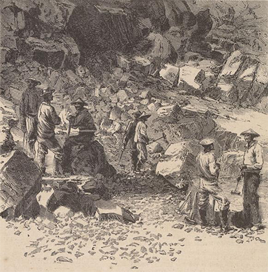
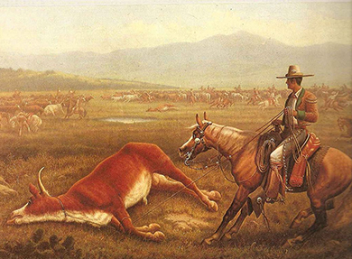

By the end of this section, you will be able to:
* Describe the treatment of Chinese immigrants and Hispanic citizens during the westward expansion of the nineteenth century

As white Americans pushed west, they not only collided with Indian tribes but also with Hispanic Americans and Chinese immigrants. Hispanics in the Southwest had the opportunity to become American citizens at the end of the Mexican-American war, but their status was markedly second-class. Chinese immigrants arrived en masse during the California Gold Rush and numbered in the hundreds of thousands by the late 1800s, with the majority living in California, working menial jobs. These distinct cultural and ethnic groups strove to maintain their rights and way of life in the face of persistent racism and entitlement. But the large number of white settlers and government-sanctioned land acquisitions left them at a profound disadvantage. Ultimately, both groups withdrew into homogenous communities in which their language and culture could survive.

### CHINESE IMMIGRANTS IN THE AMERICAN WEST

The initial arrival of Chinese immigrants to the United States began as a slow trickle in the 1820s, with barely 650 living in the U.S. by the end of 1849. However, as gold rush fever swept the country, Chinese immigrants, too, were attracted to the notion of quick fortunes. By 1852, over 25,000 Chinese immigrants had arrived, and by 1880, over 300,000 Chinese lived in the United States, most in California. While they had dreams of finding gold, many instead found employment building the first transcontinental railroad ([\[link\]](#CNX_History_17_05_ChineseImm)). Some even traveled as far east as the former cotton plantations of the Old South, which they helped to farm after the Civil War. Several thousand of these immigrants booked their passage to the United States using a “credit-ticket,” in which their passage was paid in advance by American businessmen to whom the immigrants were then indebted for a period of work. Most arrivals were men: Few wives or children ever traveled to the United States. As late as 1890, less than 5 percent of the Chinese population in the U.S. was female. Regardless of gender, few Chinese immigrants intended to stay permanently in the United States, although many were reluctantly forced to do so, as they lacked the financial resources to return home.

 {: #CNX_History_17_05_ChineseImm}

Prohibited by law since 1790 from obtaining U.S. citizenship through naturalization, Chinese immigrants faced harsh discrimination and violence from American settlers in the West. Despite hardships like the special tax that Chinese miners had to pay to take part in the Gold Rush, or their subsequent forced relocation into Chinese districts, these immigrants continued to arrive in the United States seeking a better life for the families they left behind. Only when the Chinese Exclusion Act of 1882 forbade further immigration from China for a ten-year period did the flow stop.

The Chinese community banded together in an effort to create social and cultural centers in cities such as San Francisco. In a haphazard fashion, they sought to provide services ranging from social aid to education, places of worship, health facilities, and more to their fellow Chinese immigrants. But only American Indians suffered greater discrimination and racial violence, legally sanctioned by the federal government, than did Chinese immigrants at this juncture in American history. As Chinese workers began competing with white Americans for jobs in California cities, the latter began a system of built-in discrimination. In the 1870s, white Americans formed “anti-coolie clubs” (“coolie” being a racial slur directed towards people of any Asian descent), through which they organized boycotts of Chinese-produced products and lobbied for anti-Chinese laws. Some protests turned violent, as in 1885 in Rock Springs, Wyoming, where tensions between white and Chinese immigrant miners erupted in a riot, resulting in over two dozen Chinese immigrants being murdered and many more injured.

Slowly, racism and discrimination became law. The new California constitution of 1879 denied naturalized Chinese citizens the right to vote or hold state employment. Additionally, in 1882, the U.S. Congress passed the Chinese Exclusion Act, which forbade further Chinese immigration into the United States for ten years. The ban was later extended on multiple occasions until its repeal in 1943. Eventually, some Chinese immigrants returned to China. Those who remained were stuck in the lowest-paying, most menial jobs. Several found assistance through the creation of benevolent associations designed to both support Chinese communities and defend them against political and legal discrimination; however, the history of Chinese immigrants to the United States remained largely one of deprivation and hardship well into the twentieth century.

  
The [Central Pacific Railroad Photographic History Museum][1] provides a context for the role of the Chinese who helped build the railroads. What does the site celebrate, and what, if anything, does it condemn?

The Backs that Built the Railroad

Below is a description of the construction of the railroad in 1867. Note the way it describes the scene, the laborers, and the effort.

<q>The cars now (1867) run nearly to the summit of the Sierras. . . . four thousand laborers were at work—one-tenth Irish, the rest Chinese. They were a great army laying siege to Nature in her strongest citadel. The rugged mountains looked like stupendous ant-hills. They swarmed with Celestials, shoveling, wheeling, carting, drilling and blasting rocks and earth, while their dull, moony eyes stared out from under immense basket-hats, like umbrellas. At several dining camps we saw hundreds sitting on the ground, eating soft boiled rice with chopsticks as fast as terrestrials could with soup-ladles. Irish laborers received thirty dollars per month (gold) and board; Chinese, thirty-one dollars, boarding themselves. After a little experience the latter were quite as efficient and far less troublesome.</q>

<q>—Albert D. Richardson, *Beyond the Mississippi*</q>

Several great American advancements of the nineteenth century were built with the hands of many other nations. It is interesting to ponder how much these immigrant communities felt they were building their own fortunes and futures, versus the fortunes of others. Is it likely that the Chinese laborers, many of whom died due to the harsh conditions, considered themselves part of “a great army”? Certainly, this account reveals the unwitting racism of the day, where workers were grouped together by their ethnicity, and each ethnic group was labeled monolithically as “good workers” or “troublesome,” with no regard for individual differences among the hundreds of Chinese or Irish workers.

### HISPANIC AMERICANS IN THE AMERICAN WEST

The Treaty of Guadalupe Hidalgo, which ended the Mexican-American War in 1848, promised U.S. citizenship to the nearly seventy-five thousand Hispanics now living in the American Southwest; approximately 90 percent accepted the offer and chose to stay in the United States despite their immediate relegation to second-class citizenship status. Relative to the rest of Mexico, these lands were sparsely populated and had been so ever since the country achieved its freedom from Spain in 1821. In fact, New Mexico—not Texas or California—was the center of settlement in the region in the years immediately preceding the war with the United States, containing nearly fifty thousand Mexicans. However, those who did settle the area were proud of their heritage and ability to develop *rancheros* of great size and success. Despite promises made in the treaty, these Californios—as they came to be known—quickly lost their land to white settlers who simply displaced the rightful landowners, by force if necessary. Repeated efforts at legal redress mostly fell upon deaf ears. In some instances, judges and lawyers would permit the legal cases to proceed through an expensive legal process only to the point where Hispanic landowners who insisted on holding their ground were rendered penniless for their efforts.

Much like Chinese immigrants, Hispanic citizens were relegated to the worst-paying jobs under the most terrible working conditions. They worked as *peóns* (manual laborers similar to slaves), *vaqueros* (cattle herders), and cartmen (transporting food and supplies) on the cattle ranches that white landowners possessed, or undertook the most hazardous mining tasks ([\[link\]](#CNX_History_17_05_Cowboys)).

 {: #CNX_History_17_05_Cowboys}

In a few instances, frustrated Hispanic citizens fought back against the white settlers who dispossessed them of their belongings. In 1889–1890 in New Mexico, several hundred Mexican Americans formed ***las Gorras Blancas***{: data-type="term"} (the White Caps) to try and reclaim their land and intimidate white Americans, preventing further land seizures. White Caps conducted raids of white farms, burning homes, barns, and crops to express their growing anger and frustration. However, their actions never resulted in any fundamental changes. Several White Caps were captured, beaten, and imprisoned, whereas others eventually gave up, fearing harsh reprisals against their families. Some White Caps adopted a more political strategy, gaining election to local offices throughout New Mexico in the early 1890s, but growing concerns over the potential impact upon the territory’s quest for statehood led several citizens to heighten their repression of the movement. Other laws passed in the United States intended to deprive Mexican Americans of their heritage as much as their lands. “Sunday Laws” prohibited “noisy amusements” such as bullfights, cockfights, and other cultural gatherings common to Hispanic communities at the time. “Greaser Laws” permitted the imprisonment of any unemployed Mexican American on charges of vagrancy. Although Hispanic Americans held tightly to their cultural heritage as their remaining form of self-identity, such laws did take a toll.

In California and throughout the Southwest, the massive influx of Anglo-American settlers simply overran the Hispanic populations that had been living and thriving there, sometimes for generations. Despite being U.S. citizens with full rights, Hispanics quickly found themselves outnumbered, outvoted, and, ultimately, outcast. Corrupt state and local governments favored whites in land disputes, and mining companies and cattle barons discriminated against them, as with the Chinese workers, in terms of pay and working conditions. In growing urban areas such as Los Angeles, *barrios*, or clusters of working-class homes, grew more isolated from the white American centers. Hispanic Americans, like the Native Americans and Chinese, suffered the fallout of the white settlers’ relentless push west.

### Section Summary

In the nineteenth century, the Hispanic, Chinese, and white populations of the country collided. Whites moved further west in search of land and riches, bolstered by government subsidies and an inherent and unshakable belief that the land and its benefits existed for their use. In some ways, it was a race to the prize: White Americans believed that they deserved the best lands and economic opportunities the country afforded, and did not consider prior claims to be valid.

Neither Chinese immigrants nor Hispanic Americans could withstand the assault on their rights by the tide of white settlers. Sheer numbers, matched with political backing, gave the whites the power they needed to overcome any resistance. Ultimately, both ethnic groups retreated into urban enclaves, where their language and traditions could survive.

### Review Questions

What brought the majority of Chinese immigrants to the U.S.?

1.  gold
2.  work opportunities on the railroads
3.  the Homestead Act
4.  Chinese benevolent associations
{: type="A"}

A

How were Hispanic citizens deprived of their wealth and land in the course of western settlement?

1.  Indian raids
2.  land seizures
3.  prisoner of war status
4.  infighting
{: type="A"}

B

Compare and contrast the treatment of Chinese immigrants and Hispanic citizens to that of Indians during the period of western settlement.

In all three cases, white settlers felt that they were superior to these ethnic groups and morally correct in their exploitation of the groups’ land and labor. Whether mining sacred Sioux reservation lands for gold or forcing Chinese immigrants to pay a special fine to mine for gold, white settlers were confident that their goal of Manifest Destiny gave them the right to do as they wished. Hispanic Americans, unlike Chinese immigrants and Indians, were allowed citizenship rights, although racist laws and corrupt judges severely curtailed these rights. Chinese immigrants were ultimately denied entry to the United States through the Chinese Exclusion Act.

### Critical Thinking Questions

Describe the philosophy of Manifest Destiny. What effect did it have on Americans’ westward migration? How might the different groups that migrated have sought to apply this philosophy to their individual circumstances?

Compare the myth of the “Wild West” with its reality. What elements of truth would these stories have contained, and what was fabricated or left out? What was life actually like for cowboys, ranchers, and the few women present in mining towns or along the cattle range?

What were the primary methods that the U.S. government, as well as individual reformers, used to deal with the perceived Indian threat to westward settlement? In what ways were these methods successful and unsuccessful? What were their short-term and long-term effects on Native Americans?

Describe the ways in which the U.S. government, local governments, and/or individuals attempted to interfere with the specific cultural traditions and customs of Indians, Hispanics, and Chinese immigrants. What did these efforts have in common? How did each group respond?

In what ways did westward expansion provide new opportunities for women and African Americans? In what ways did it limit these opportunities?

### Glossary
{: data-type="glossary-title"}

las Gorras Blancas
: the Spanish name for White Caps, the rebel group of Hispanic Americans who fought back against the appropriation of Hispanic land by whites; for a period in 1889–1890, they burned farms, homes, and crops to express their growing anger at the injustice of the situation

[1]: http://openstax.org/l/railroadchina
