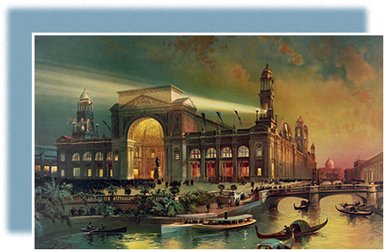

* Inventors of the Age
* From Invention to Industrial Growth
* Building Industrial America on the Backs of Labor
* A New American Consumer Culture

<?cnx.eoc class="summary" title="Summary"?>

<?cnx.eoc class="review-questions" title="Review Questions"?>

<?cnx.eoc class="critical-thinking" title="Critical Thinking Questions"?>

<?cnx.eoc class="references" title="References"?>

 {: #CNX_History_18_00_Chicago}

“The electric age was ushered into being in this last decade of the nineteenth century today when President Cleveland, by pressing a button, started the mighty machinery, rushing waters and revolving wheels in the World’s Columbian exhibition.” With this announcement about the official start of the Chicago World’s Fair in 1893 ([\[link\]](#CNX_History_18_00_Chicago)), the *Salt Lake City Herald* captured the excitement and optimism of the machine age. “In the previous expositions,” the editorial continued, “the possibilities of electricity had been limited to the mere starting of the engines in the machinery hall, but in this it made thousands of servants do its bidding . . . the magic of electricity did the duty of the hour.”

The fair, which commemorated the four hundredth anniversary of Columbus’s journey to America, was a potent symbol of the myriad inventions that changed American life and contributed to the significant economic growth of the era, as well as the new wave of industrialization that swept the country. While businessmen capitalized upon such technological innovations, the new industrial working class faced enormous challenges. Ironically, as the World’s Fair welcomed its first visitors, the nation was spiraling downward into the worst depression of the century. Subsequent frustrations among working-class Americans laid the groundwork for the country’s first significant labor movement.

