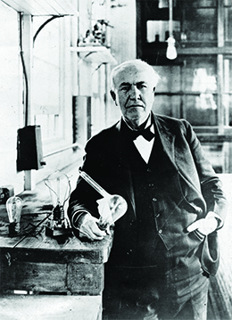

By the end of this section, you will be able to:
* Explain how the ideas and products of late nineteenth-century inventors contributed to the rise of big business
* Explain how the inventions of the late nineteenth century changed everyday American life

 ![A timeline shows important events of the era. In 1870, John D. Rockefeller founds Standard Oil; a photograph of Rockefeller is shown. In 1873, Andrew Carnegie founds Carnegie Steel, and the Panic of 1873 triggers extended depression; a drawing of the Carnegie Steel factory is shown. In 1876, Alexander Graham Bell patents the telephone; a photograph of Bell is shown. In 1877, the Great Railroad Strike lasts forty-five days; a drawing of the strike is shown. In 1879, Thomas Edison invents the light bulb; a diagram of Edison&#x2019;s incandescent light bulb is shown. In 1886, a labor rally at Haymarket Square erupts in violence, and the American Federation of Labor is founded; an engraving depicting the Haymarket violence is shown. In 1892, the Homestead Steel Strike occurs; a magazine cover with a drawing of the newly surrendered strikers is shown.](../resources/CNX_History_18_01_Timeline.jpg){: #CNX_History_18_01_Timeline}

The late nineteenth century was an energetic era of inventions and entrepreneurial spirit. Building upon the mid-century Industrial Revolution in Great Britain, as well as answering the increasing call from Americans for efficiency and comfort, the country found itself in the grip of invention fever, with more people working on their big ideas than ever before. In retrospect, harnessing the power of steam and then electricity in the nineteenth century vastly increased the power of man and machine, thus making other advances possible as the century progressed.

Facing an increasingly complex everyday life, Americans sought the means by which to cope with it. Inventions often provided the answers, even as the inventors themselves remained largely unaware of the life-changing nature of their ideas. To understand the scope of this zeal for creation, consider the U.S. Patent Office, which, in 1790—its first decade of existence—recorded only 276 inventions. By 1860, the office had issued a total of 60,000 patents. But between 1860 and 1890, that number exploded to nearly 450,000, with another 235,000 in the last decade of the century. While many of these patents came to naught, some inventions became lynchpins in the rise of big business and the country’s move towards an industrial-based economy, in which the desire for efficiency, comfort, and abundance could be more fully realized by most Americans.

### AN EXPLOSION OF INVENTIVE ENERGY

From corrugated rollers that could crack hard, homestead-grown wheat into flour to refrigerated train cars and garment-sewing machines ([\[link\]](#CNX_History_18_01_HosieryAd)), new inventions fueled industrial growth around the country. As late as 1880, fully one-half of all Americans still lived and worked on farms, whereas fewer than one in seven—mostly men, except for long-established textile factories in which female employees tended to dominate—were employed in factories. However, the development of commercial electricity by the close of the century, to complement the steam engines that already existed in many larger factories, permitted more industries to concentrate in cities, away from the previously essential water power. In turn, newly arrived immigrants sought employment in new urban factories. Immigration, urbanization, and industrialization coincided to transform the face of American society from primarily rural to significantly urban. From 1880 to 1920, the number of industrial workers in the nation quadrupled from 2.5 million to over 10 million, while over the same period urban populations doubled, to reach one-half of the country’s total population.

 {: #CNX_History_18_01_HosieryAd}

In offices, worker productivity benefited from the typewriter, invented in 1867, the cash register, invented in 1879, and the adding machine, invented in 1885. These tools made it easier than ever to keep up with the rapid pace of business growth. Inventions also slowly transformed home life. The vacuum cleaner arrived during this era, as well as the flush toilet. These indoor “water closets” improved public health through the reduction in contamination associated with outhouses and their proximity to water supplies and homes. Tin cans and, later, Clarence Birdseye’s experiments with frozen food, eventually changed how women shopped for, and prepared, food for their families, despite initial health concerns over preserved foods. With the advent of more easily prepared food, women gained valuable time in their daily schedules, a step that partially laid the groundwork for the modern women’s movement. Women who had the means to purchase such items could use their time to seek other employment outside of the home, as well as broaden their knowledge through education and reading. Such a transformation did not occur overnight, as these inventions also increased expectations for women to remain tied to the home and their domestic chores; slowly, the culture of domesticity changed.

Perhaps the most important industrial advancement of the era came in the production of steel. Manufacturers and builders preferred steel to iron, due to its increased strength and durability. After the Civil War, two new processes allowed for the creation of furnaces large enough and hot enough to melt the wrought iron needed to produce large quantities of steel at increasingly cheaper prices. The Bessemer process, named for English inventor Henry Bessemer, and the open-hearth process, changed the way the United States produced steel and, in doing so, led the country into a new industrialized age. As the new material became more available, builders eagerly sought it out, a demand that steel mill owners were happy to supply.

In 1860, the country produced thirteen thousand tons of steel. By 1879, American furnaces were producing over one million tons per year; by 1900, this figure had risen to ten million. Just ten years later, the United States was the top steel producer in the world, at over twenty-four million tons annually. As production increased to match the overwhelming demand, the price of steel dropped by over 80 percent. When quality steel became cheaper and more readily available, other industries relied upon it more heavily as a key to their growth and development, including construction and, later, the automotive industry. As a result, the steel industry rapidly became the cornerstone of the American economy, remaining the primary indicator of industrial growth and stability through the end of World War II.

### ALEXANDER GRAHAM BELL AND THE TELEPHONE

Advancements in communications matched the pace of growth seen in industry and home life. Communication technologies were changing quickly, and they brought with them new ways for information to travel. In 1858, British and American crews laid the first transatlantic cable lines, enabling messages to pass between the United States and Europe in a matter of hours, rather than waiting the few weeks it could take for a letter to arrive by steamship. Although these initial cables worked for barely a month, they generated great interest in developing a more efficient telecommunications industry. Within twenty years, over 100,000 miles of cable crisscrossed the ocean floors, connecting all the continents. Domestically, Western Union, which controlled 80 percent of the country’s telegraph lines, operated nearly 200,000 miles of telegraph routes from coast to coast. In short, people were connected like never before, able to relay messages in minutes and hours rather than days and weeks.

One of the greatest advancements was the telephone, which Alexander Graham **Bell**{: data-type="term" .no-emphasis} patented in 1876 ([\[link\]](#CNX_History_18_01_Patent)). While he was not the first to invent the concept, Bell was the first one to capitalize on it; after securing the patent, he worked with financiers and businessmen to create the National Bell Telephone Company. Western Union, which had originally turned down Bell’s machine, went on to commission Thomas Edison to invent an improved version of the telephone. It is actually Edison’s version that is most like the modern telephone used today. However, Western Union, fearing a costly legal battle they were likely to lose due to Bell’s patent, ultimately sold Edison’s idea to the Bell Company. With the communications industry now largely in their control, along with an agreement from the federal government to permit such control, the Bell Company was transformed into the American Telephone and Telegraph Company, which still exists today as AT&amp;T. By 1880, fifty thousand telephones were in use in the United States, including one at the White House. By 1900, that number had increased to 1.35 million, and hundreds of American cities had obtained local service for their citizens. Quickly and inexorably, technology was bringing the country into closer contact, changing forever the rural isolation that had defined America since its beginnings.

 "){: #CNX_History_18_01_Patent}

  
Visit the [Library of Congress][1] to examine the controversy over the invention of the telephone. While Alexander Graham Bell is credited with the invention, several other inventors played a role in its development; however, Bell was the first to patent the device.

### THOMAS EDISON AND ELECTRIC LIGHTING

Although Thomas Alva **Edison**{: data-type="term" .no-emphasis} ([\[link\]](#CNX_History_18_01_Edison)) is best known for his contributions to the electrical industry, his experimentation went far beyond the light bulb. Edison was quite possibly the greatest inventor of the turn of the century, saying famously that he “hoped to have a minor invention every ten days and a big thing every month or so.” He registered 1,093 patents over his lifetime and ran a world-famous laboratory, Menlo Park, which housed a rotating group of up to twenty-five scientists from around the globe.

Edison became interested in the telegraph industry as a boy, when he worked aboard trains selling candy and newspapers. He soon began tinkering with telegraph technology and, by 1876, had devoted himself full time to lab work as an inventor. He then proceeded to invent a string of items that are still used today: the phonograph, the mimeograph machine, the motion picture projector, the dictaphone, and the storage battery, all using a factory-oriented assembly line process that made the rapid production of inventions possible.

 {: #CNX_History_18_01_Edison}

In 1879, Edison invented the item that has led to his greatest fame: the incandescent light bulb. He allegedly explored over six thousand different materials for the filament, before stumbling upon tungsten as the ideal substance. By 1882, with financial backing largely from financier J. P. Morgan, he had created the Edison Electric Illuminating Company, which began supplying electrical current to a small number of customers in New York City. Morgan guided subsequent mergers of Edison’s other enterprises, including a machine works firm and a lamp company, resulting in the creation of the Edison General Electric Company in 1889.

The next stage of invention in electric power came about with the contribution of George Westinghouse. Westinghouse was responsible for making electric lighting possible on a national scale. While Edison used “direct current” or DC power, which could only extend two miles from the power source, in 1886, Westinghouse invented “alternating current” or AC power, which allowed for delivery over greater distances due to its wavelike patterns. The Westinghouse Electric Company delivered AC power, which meant that factories, homes, and farms—in short, anything that needed power—could be served, regardless of their proximity to the power source. A public relations battle ensued between the Westinghouse and Edison camps, coinciding with the invention of the electric chair as a form of prisoner execution. Edison publicly proclaimed AC power to be best adapted for use in the chair, in the hope that such a smear campaign would result in homeowners becoming reluctant to use AC power in their houses. Although Edison originally fought the use of AC power in other devices, he reluctantly adapted to it as its popularity increased.

  
Not all of Edison’s ventures were successful. Read about [Edison’s Folly][2] to learn the story behind his greatest failure. Was there some benefit to his efforts? Or was it wasted time and money?

### Section Summary

Inventors in the late nineteenth century flooded the market with new technological advances. Encouraged by Great Britain’s Industrial Revolution, and eager for economic development in the wake of the Civil War, business investors sought the latest ideas upon which they could capitalize, both to transform the nation as well as to make a personal profit. These inventions were a key piece of the massive shift towards industrialization that followed. For both families and businesses, these inventions eventually represented a fundamental change in their way of life. Although the technology spread slowly, it did spread across the country. Whether it was a company that could now produce ten times more products with new factories, or a household that could communicate with distant relations, the old way of doing things was disappearing.

Communication technologies, electric power production, and steel production were perhaps the three most significant developments of the time. While the first two affected both personal lives and business development, the latter influenced business growth first and foremost, as the ability to produce large steel elements efficiently and cost-effectively led to permanently changes in the direction of industrial growth.

### Review Questions

Which of these was *not* a successful invention of the era?

1.  high-powered sewing machines
2.  movies with sound
3.  frozen foods
4.  typewriters
{: type="A"}

B

What was the major advantage of Westinghouse’s “alternating current” power invention?

1.  It was less prone to fire.
2.  It cost less to produce.
3.  It allowed machines to be farther from the power source.
4.  It was not under Edison’s control.
{: type="A"}

C

How did the burst of new inventions during this era fuel the process of urbanization?

New inventions fueled industrial growth, and the development of commercial electricity—along with the use of steam engines—allowed industries that had previously situated themselves close to sources of water power to shift away from those areas and move their production into cities. Immigrants sought employment in these urban factories and settled nearby, transforming the country’s population from mostly rural to largely urban.

[1]: http://openstaxcollege.org/l/telephone
[2]: http://openstaxcollege.org/l/edisonfail
