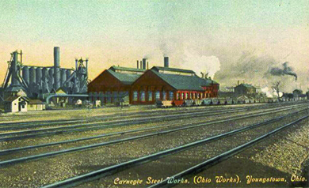

By the end of this section, you will be able to:
* Explain how the inventions of the late nineteenth century contributed directly to industrial growth in America
* Identify the contributions of Andrew Carnegie, John Rockefeller, and J. P. Morgan to the new industrial order emerging in the late nineteenth century
* Describe the visions, philosophies, and business methods of the leaders of the new industrial order

As discussed previously, new processes in steel refining, along with inventions in the fields of communications and electricity, transformed the business landscape of the nineteenth century. The exploitation of these new technologies provided opportunities for tremendous growth, and business entrepreneurs with financial backing and the right mix of business acumen and ambition could make their fortunes. Some of these new millionaires were known in their day as **robber barons**{: data-type="term"}, a negative term that connoted the belief that they exploited workers and bent laws to succeed. Regardless of how they were perceived, these businessmen and the companies they created revolutionized American industry.

# RAILROADS AND ROBBER BARONS

Earlier in the nineteenth century, the first transcontinental railroad and subsequent spur lines paved the way for rapid and explosive railway growth, as well as stimulated growth in the iron, wood, coal, and other related industries. The railroad industry quickly became the nation’s first “big business.” A powerful, inexpensive, and consistent form of transportation, railroads accelerated the development of virtually every other industry in the country. By 1890, railroad lines covered nearly every corner of the United States, bringing raw materials to industrial factories and finished goods to consumer markets. The amount of track grew from 35,000 miles at the end of the Civil War to over 200,000 miles by the close of the century. Inventions such as car couplers, air brakes, and Pullman passenger cars allowed the volume of both freight and people to increase steadily. From 1877 to 1890, both the amount of goods and the number of passengers traveling the rails tripled.

Financing for all of this growth came through a combination of private capital and government loans and grants. Federal and state loans of cash and land grants totaled $150 million and 185 million acres of public land, respectively. Railroads also listed their stocks and bonds on the New York Stock Exchange to attract investors from both within the United States and Europe. Individual investors consolidated their power as railroads merged and companies grew in size and power. These individuals became some of the wealthiest Americans the country had ever known. Midwest farmers, angry at large railroad owners for their exploitative business practices, came to refer to them as “robber barons,” as their business dealings were frequently shady and exploitative. Among their highly questionable tactics was the practice of differential shipping rates, in which larger business enterprises received discounted rates to transport their goods, as opposed to local producers and farmers whose higher rates essentially subsidized the discounts.

Jay Gould was perhaps the first prominent railroad magnate to be tarred with the “robber baron” brush. He bought older, smaller, rundown railroads, offered minimal improvements, and then capitalized on factory owners’ desires to ship their goods on this increasingly popular and more cost-efficient form of transportation. His work with the Erie Railroad was notorious among other investors, as he drove the company to near ruin in a failed attempt to attract foreign investors during a takeover attempt. His model worked better in the American West, where the railroads were still widely scattered across the country, forcing farmers and businesses to pay whatever prices Gould demanded in order to use his trains. In addition to owning the Union Pacific Railroad that helped to construct the original transcontinental railroad line, Gould came to control over ten thousand miles of track across the United States, accounting for 15 percent of all railroad transportation. When he died in 1892, Gould had a personal worth of over $100 million, although he was a deeply unpopular figure.

In contrast to Gould’s exploitative business model, which focused on financial profit more than on tangible industrial contributions, Commodore Cornelius Vanderbilt was a “robber baron” who truly cared about the success of his railroad enterprise and its positive impact on the American economy. Vanderbilt consolidated several smaller railroad lines, called trunk lines, to create the powerful New York Central Railroad Company, one of the largest corporations in the United States at the time ([\[link\]](#CNX_History_18_02_Vanderbilt)). He later purchased stock in the major rail lines that would connect his company to Chicago, thus expanding his reach and power while simultaneously creating a railroad network to connect Chicago to New York City. This consolidation provided more efficient connections from Midwestern suppliers to eastern markets. It was through such consolidation that, by 1900, seven major railroad tycoons controlled over 70 percent of all operating lines. Vanderbilt’s personal wealth at his death (over $100 million in 1877), placed him among the top three wealthiest individuals in American history.

 {: #CNX_History_18_02_Vanderbilt}

# GIANTS OF WEALTH: CARNEGIE, ROCKEFELLER, AND MORGAN

The post-Civil War inventors generated ideas that transformed the economy, but they were not big businessmen. The evolution from technical innovation to massive industry took place at the hands of the entrepreneurs whose business gambles paid off, making them some of the richest Americans of their day. Steel magnate Andrew Carnegie, oil tycoon John D. Rockefeller, and business financier J. P. Morgan were all businessmen who grew their respective businesses to a scale and scope that were unprecedented. Their companies changed how Americans lived and worked, and they themselves greatly influenced the growth of the country.

## Andrew Carnegie and *The Gospel of Wealth*

Andrew Carnegie, steel magnate, has the prototypical rags-to-riches story. Although such stories resembled more myth than reality, they served to encourage many Americans to seek similar paths to fame and fortune. In Carnegie, the story was one of few derived from fact. Born in Scotland, Carnegie immigrated with his family to Pennsylvania in 1848. Following a brief stint as a “bobbin boy,” changing spools of thread at a Pittsburgh clothing manufacturer at age thirteen, he subsequently became a telegram messenger boy. As a messenger, he spent much of his time around the Pennsylvania Railroad office and developed parallel interests in railroads, bridge building, and, eventually, the steel industry.

Ingratiating himself to his supervisor and future president of the Pennsylvania Railroad, Tom Scott, Carnegie worked his way into a position of management for the company and subsequently began to invest some of his earnings, with Scott’s guidance. One particular investment, in the booming oil fields of northwest Pennsylvania in 1864, resulted in Carnegie earning over $1 million in cash dividends, thus providing him with the capital necessary to pursue his ambition to modernize the iron and steel industries, transforming the United States in the process. Having seen firsthand during the Civil War, when he served as Superintendent of Military Railways and telegraph coordinator for the Union forces, the importance of industry, particularly steel, to the future growth of the country, Carnegie was convinced of his strategy. His first company was the J. Edgar Thompson Steel Works, and, a decade later, he bought out the newly built Homestead Steel Works from the Pittsburgh Bessemer Steel Company. By the end of the century, his enterprise was running an annual profit in excess of $40 million ([\[link\]](#CNX_History_18_02_Carnegie)).

 {: #CNX_History_18_02_Carnegie}

Although not a scientific expert in steel, Carnegie was an excellent promoter and salesman, able to locate financial backing for his enterprise. He was also shrewd in his calculations on consolidation and expansion, and was able to capitalize on smart business decisions. Always thrifty with the profits he earned, a trait owed to his upbringing, Carnegie saved his profits during prosperous times and used them to buy out other steel companies at low prices during the economic recessions of the 1870s and 1890s. He insisted on up-to-date machinery and equipment, and urged the men who worked at and managed his steel mills to constantly think of innovative ways to increase production and reduce cost.

Carnegie, more than any other businessman of the era, championed the idea that America’s leading tycoons owed a debt to society. He believed that, given the circumstances of their successes, they should serve as benefactors to the less fortunate public. For Carnegie, poverty was not an abstract concept, as his family had been a part of the struggling masses. He desired to set an example of philanthropy for all other prominent industrialists of the era to follow. Carnegie’s famous essay, *The Gospel of Wealth*, featured below, expounded on his beliefs. In it, he borrowed from Herbert Spencer’s theory of **social Darwinism**{: data-type="term"}, which held that society developed much like plant or animal life through a process of evolution in which the most fit and capable enjoyed the greatest material and social success.

Andrew Carnegie on Wealth

Carnegie applauded American capitalism for creating a society where, through hard work, ingenuity, and a bit of luck, someone like himself could amass a fortune. In return for that opportunity, Carnegie wrote that the wealthy should find proper uses for their wealth by funding hospitals, libraries, colleges, the arts, and more. *The Gospel of Wealth* spelled out that responsibility.

\> Poor and restricted are our opportunities in this life; narrow our horizon; our best work most imperfect; but rich men should be thankful for one inestimable boon. They have it in their power during their lives to busy themselves in organizing benefactions from which the masses of their fellows will derive lasting advantage, and thus dignify their own lives. . . .

\> This, then, is held to be the duty of the man of Wealth: First, to set an example of modest, unostentatious living, shunning display or extravagance; to provide moderately for the legitimate wants of those dependent upon him; and after doing so to consider all surplus revenues which come to him simply as trust funds, which he is called upon to administer, and strictly bound as a matter of duty to administer in the manner which, in his judgment, is best calculated to produce the most beneficial results for the community—the man of wealth thus becoming the mere agent and trustee for his poorer brethren, bringing to their service his superior wisdom, experience and ability to administer, doing for them better than they would or could do for themselves. . . .

\> In bestowing charity, the main consideration should be to help those who will help themselves; to provide part of the means by which those who desire to improve may do so; to give those who desire to use the aids by which they may rise; to assist, but rarely or never to do all. Neither the individual nor the race is improved by alms-giving. Those worthy of assistance, except in rare cases, seldom require assistance. The really valuable men of the race never do, except in cases of accident or sudden change. Every one has, of course, cases of individuals brought to his own knowledge where temporary assistance can do genuine good, and these he will not overlook. But the amount which can be wisely given by the individual for individuals is necessarily limited by his lack of knowledge of the circumstances connected with each. He is the only true reformer who is as careful and as anxious not to aid the unworthy as he is to aid the worthy, and, perhaps, even more so, for in alms-giving more injury is probably done by rewarding vice than by relieving virtue.

\> —Andrew Carnegie, *The Gospel of Wealth*

Social Darwinism added a layer of pseudoscience to the idea of the self-made man, a desirable thought for all who sought to follow Carnegie’s example. The myth of the rags-to-riches businessman was a potent one. Author Horatio Alger made his own fortune writing stories about young enterprising boys who beat poverty and succeeded in business through a combination of “luck and pluck.” His stories were immensely popular, even leading to a board game ([\[link\]](#CNX_History_18_02_Horatio)) where players could hope to win in the same way that his heroes did.

 {: #CNX_History_18_02_Horatio}

## John D. Rockefeller and Business Integration Models

Like Carnegie, John D. Rockefeller was born in 1839 of modest means, with a frequently absent traveling salesman of a father who sold medicinal elixirs and other wares. Young Rockefeller helped his mother with various chores and earned extra money for the family through the sale of family farm products. When the family moved to a suburb of Cleveland in 1853, he had an opportunity to take accounting and bookkeeping courses while in high school and developed a career interest in business. While living in Cleveland in 1859, he learned of Colonel Edwin Drake who had struck “black gold,” or oil, near Titusville, Pennsylvania, setting off a boom even greater than the California Gold Rush of the previous decade. Many sought to find a fortune through risky and chaotic “wildcatting,” or drilling exploratory oil wells, hoping to strike it rich. But Rockefeller chose a more certain investment: refining crude oil into kerosene, which could be used for both heating and lamps. As a more efficient source of energy, as well as less dangerous to produce, kerosene quickly replaced whale oil in many businesses and homes. Rockefeller worked initially with family and friends in the refining business located in the Cleveland area, but by 1870, Rockefeller ventured out on his own, consolidating his resources and creating the Standard Oil Company of Ohio, initially valued at $1 million.

Rockefeller was ruthless in his pursuit of total control of the oil refining business. As other entrepreneurs flooded the area seeking a quick fortune, Rockefeller developed a plan to crush his competitors and create a true **monopoly**{: data-type="term"} in the refining industry. Beginning in 1872, he forged agreements with several large railroad companies to obtain discounted freight rates for shipping his product. He also used the railroad companies to gather information on his competitors. As he could now deliver his kerosene at lower prices, he drove his competition out of business, often offering to buy them out for pennies on the dollar. He hounded those who refused to sell out to him, until they were driven out of business. Through his method of growth via mergers and acquisitions of similar companies—known as **horizontal integration**{: data-type="term"} —Standard Oil grew to include almost all refineries in the area. By 1879, the Standard Oil Company controlled nearly 95 percent of all oil refining businesses in the country, as well as 90 percent of all the refining businesses in the world. Editors of the *New York World* lamented of Standard Oil in 1880 that, “When the nineteenth century shall have passed into history, the impartial eyes of the reviewers will be amazed to find that the U.S. . . . tolerated the presence of the most gigantic, the most cruel, impudent, pitiless and grasping monopoly that ever fastened itself upon a country.”

Seeking still more control, Rockefeller recognized the advantages of controlling the transportation of his product. He next began to grow his company through **vertical integration**{: data-type="term"}, wherein a company handles all aspects of a product’s lifecycle, from the creation of raw materials through the production process to the delivery of the final product. In Rockefeller’s case, this model required investment and acquisition of companies involved in everything from barrel-making to pipelines, tanker cars to railroads. He came to own almost every type of business and used his vast power to drive competitors from the market through intense price wars. Although vilified by competitors who suffered from his takeovers and considered him to be no better than a robber baron, several observers lauded Rockefeller for his ingenuity in integrating the oil refining industry and, as a result, lowering kerosene prices by as much as 80 percent by the end of the century. Other industrialists quickly followed suit, including Gustavus Swift, who used vertical integration to dominate the U.S. meatpacking industry in the late nineteenth century.

In order to control the variety of interests he now maintained in industry, Rockefeller created a new legal entity, known as a **trust**{: data-type="term"}. In this arrangement, a small group of trustees possess legal ownership of a business that they operate for the benefit of other investors. In 1882, all thirty-seven stockholders in the various Standard Oil enterprises gave their stock to nine trustees who were to control and direct all of the company’s business ventures. State and federal challenges arose, due to the obvious appearance of a monopoly, which implied sole ownership of all enterprises composing an entire industry. When the Ohio Supreme Court ruled that the Standard Oil Company must dissolve, as its monopoly control over all refining operations in the U.S. was in violation of state and federal statutes, Rockefeller shifted to yet another legal entity, called a **holding company**{: data-type="term"} model. The holding company model created a central corporate entity that controlled the operations of multiple companies by holding the majority of stock for each enterprise. While not technically a “trust” and therefore not vulnerable to anti-monopoly laws, this consolidation of power and wealth into one entity was on par with a monopoly; thus, progressive reformers of the late nineteenth century considered holding companies to epitomize the dangers inherent in capitalistic big business, as can be seen in the political cartoon below ([\[link\]](#CNX_History_18_02_Rockefell)). Impervious to reformers’ misgivings, other businessmen followed Rockefeller’s example. By 1905, over three hundred business mergers had occurred in the United States, affecting more than 80 percent of all industries. By that time, despite passage of federal legislation such as the Sherman Anti-Trust Act in 1890, 1 percent of the country’s businesses controlled over 40 percent of the nation’s economy.

 {: #CNX_History_18_02_Rockefell}

  
The PBS video on [Robber Barons or Industrial Giants][1] presents a lively discussion of whether the industrialists of the nineteenth century were really “robber barons” or if they were “industrial giants.”

## J. Pierpont Morgan

Unlike Carnegie and Rockefeller, J. P. Morgan was no rags-to-riches hero. He was born to wealth and became much wealthier as an investment banker, making wise financial decisions in support of the hard-working entrepreneurs building their fortunes. Morgan’s father was a London banker, and Morgan the son moved to New York in 1857 to look after the family’s business interests there. Once in America, he separated from the London bank and created the J. Pierpont Morgan and Company financial firm. The firm bought and sold stock in growing companies, investing the family’s wealth in those that showed great promise, turning an enormous profit as a result. Investments from firms such as his were the key to the success stories of up-and-coming businessmen like Carnegie and Rockefeller. In return for his investment, Morgan and other investment bankers demanded seats on the companies’ boards, which gave them even greater control over policies and decisions than just investment alone. There were many critics of Morgan and these other bankers, particularly among members of a U.S. congressional subcommittee who investigated the control that financiers maintained over key industries in the country. The subcommittee referred to Morgan’s enterprise as a form of “money trust” that was even more powerful than the trusts operated by Rockefeller and others. Morgan argued that his firm, and others like it, brought stability and organization to a hypercompetitive capitalist economy, and likened his role to a kind of public service.

Ultimately, Morgan’s most notable investment, and greatest consolidation, was in the steel industry, when he bought out Andrew Carnegie in 1901. Initially, Carnegie was reluctant to sell, but after repeated badgering by Morgan, Carnegie named his price: an outrageously inflated sum of $500 million. Morgan agreed without hesitation, and then consolidated Carnegie’s holdings with several smaller steel firms to create the U.S. Steel Corporation. U.S. Steel was subsequently capitalized at $1.4 billion. It was the country’s first billion-dollar firm. Lauded by admirers for the efficiency and modernization he brought to investment banking practices, as well as for his philanthropy and support of the arts, Morgan was also criticized by reformers who subsequently blamed his (and other bankers’) efforts for contributing to the artificial bubble of prosperity that eventually burst in the Great Depression of the 1930s. What none could doubt was that Morgan’s financial aptitude and savvy business dealings kept him in good stead. A subsequent U.S. congressional committee, in 1912, reported that his firm held 341 directorships in 112 corporations that controlled over $22 billion in assets. In comparison, that amount of wealth was greater than the assessed value of all the land in the United States west of the Mississippi River.

# Section Summary

As the three tycoons profiled in this section illustrate, the end of the nineteenth century was a period in history that offered tremendous financial rewards to those who had the right combination of skill, ambition, and luck. Whether self-made millionaires like Carnegie or Rockefeller, or born to wealth like Morgan, these men were the lynchpins that turned inventors’ ideas into industrial growth. Steel production, in particular, but also oil refining techniques and countless other inventions, changed how industries in the country could operate, allowing them to grow in scale and scope like never before.

It is also critical to note how these different men managed their businesses and ambition. Where Carnegie felt strongly that it was the job of the wealthy to give back in their lifetime to the greater community, his fellow tycoons did not necessarily agree. Although he contributed to many philanthropic efforts, Rockefeller’s financial success was built on the backs of ruined and bankrupt companies, and he came to be condemned by progressive reformers who questioned the impact on the working class as well as the dangers of consolidating too much power and wealth into one individual’s hands. Morgan sought wealth strictly through the investment in, and subsequent purchase of, others’ hard work. Along the way, the models of management they adopted—horizontal and vertical integration, trusts, holding companies, and investment brokerages—became commonplace in American businesses. Very quickly, large business enterprises fell under the control of fewer and fewer individuals and trusts. In sum, their ruthlessness, their ambition, their generosity, and their management made up the workings of America’s industrial age.

# Review Questions

Which of the following “robber barons” was notable for the exploitative way he made his fortune in railroads?

Jay Gould

Cornelius Vanderbilt

Andrew Carnegie

J. Pierpont Morgan

A

Which of the following does *not* represent one of the management strategies that John D. Rockefeller used in building his empire?

horizontal integration

vertical integration

social Darwinism

the holding company model

C

Why was Rockefeller’s use of horizontal integration such an effective business tool at this time? Were his choices legal? Why or why not?

Horizontal integration enabled Rockefeller to gain tremendous control over the oil industry and use that power to influence vendors and competitors. For example, he could pressure railroads into giving him lower rates because of the volume of his products. He undercut competitors, forcing them to set their prices so low that they could barely stay in business—at which point he could buy them out. Through horizontal integration, he was able to create a virtual monopoly and set the terms for business. While his business model of a holding company was technically legal, it held as much power as a monopoly and did not allow for other businesses to grow and compete.

What differentiated a “robber baron” from other “captains of industry” in late nineteenth-century America?

“Captains of industry” (such as Carnegie or Rockefeller) are noted for their new business models, entrepreneurial approaches, and, to varying degrees, philanthropic efforts, all of which transformed late nineteenth-century America. “Robber barons” (such as Gould) are noted for their self-centered drive for profit at the expense of workers and the general public, who seldom benefitted to any great degree. The terms, however, remain a gray area, as one could characterize the ruthless business practices of Rockefeller, or some of Carnegie’s tactics with regard to workers’ efforts to organize, as similar to the methods of robber barons. Nevertheless, “captains of industry” are noted for contributions that fundamentally changed and typically improved the nation, whereas “robber barons” can seldom point to such concrete contributions.

## Glossary
{: data-type="glossary-title"}

holding company
: a central corporate entity that controls the operations of multiple companies by holding the majority of stock for each enterprise
{: .definition}

horizontal integration
: method of growth wherein a company grows through mergers and acquisitions of similar companies
{: .definition}

monopoly
: the ownership or control of all enterprises comprising an entire industry
{: .definition}

robber baron
: a negative term for the big businessmen who made their fortunes in the massive railroad boom of the late nineteenth century
{: .definition}

social Darwinism
: Herbert Spencer’s theory, based upon Charles Darwin’s scientific theory, which held that society developed much like plant or animal life through a process of evolution in which the most fit and capable enjoyed the greatest material and social success
{: .definition}

trust
: a legal arrangement where a small group of trustees have legal ownership of a business that they operate for the benefit of other investors
{: .definition}

vertical integration
: a method of growth where a company acquires other companies that include all aspects of a product’s lifecycle from the creation of the raw materials through the production process to the delivery of the final product
{: .definition}

[1]: http://openstaxcollege.org/l/barons1
