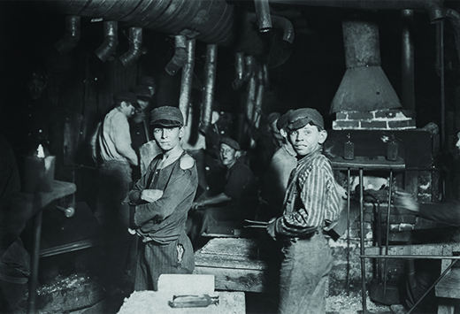
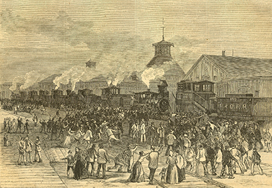
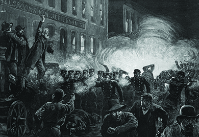
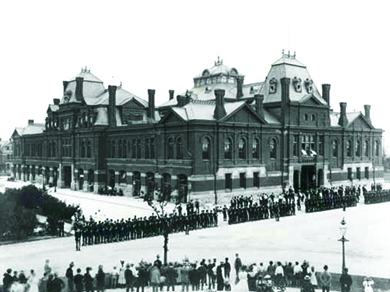

By the end of this section, you will be able to:
* Explain the qualities of industrial working-class life in the late nineteenth century
* Analyze both workers’ desire for labor unions and the reasons for unions’ inability to achieve their goals

The growth of the American economy in the last half of the nineteenth century presented a paradox. The standard of living for many American workers increased. As Carnegie said in *The Gospel of Wealth*, “the poor enjoy what the rich could not before afford. What were the luxuries have become the necessaries of life. The laborer has now more comforts than the landlord had a few generations ago.” In many ways, Carnegie was correct. The decline in prices and the cost of living meant that the industrial era offered many Americans relatively better lives in 1900 than they had only decades before. For some Americans, there were also increased opportunities for upward mobility. For the multitudes in the working class, however, conditions in the factories and at home remained deplorable. The difficulties they faced led many workers to question an industrial order in which a handful of wealthy Americans built their fortunes on the backs of workers.

# WORKING-CLASS LIFE

Between the end of the Civil War and the turn of the century, the American workforce underwent a transformative shift. In 1865, nearly 60 percent of Americans still lived and worked on farms; by the early 1900s, that number had reversed itself, and only 40 percent still lived in rural areas, with the remainder living and working in urban and early suburban areas. A significant number of these urban and suburban dwellers earned their wages in factories. Advances in farm machinery allowed for greater production with less manual labor, thus leading many Americans to seek job opportunities in the burgeoning factories in the cities. Not surprisingly, there was a concurrent trend of a decrease in American workers being self-employed and an increase of those working for others and being dependent on a factory wage system for their living.

Yet factory wages were, for the most part, very low. In 1900, the average factory wage was approximately twenty cents per hour, for an annual salary of barely six hundred dollars. According to some historical estimates, that wage left approximately 20 percent of the population in industrialized cities at, or below, the poverty level. An average factory work week was sixty hours, ten hours per day, six days per week, although in steel mills, the workers put in twelve hours per day, seven days a week. Factory owners had little concern for workers’ safety. According to one of the few available accurate measures, as late as 1913, nearly 25,000 Americans lost their lives on the job, while another 700,000 workers suffered from injuries that resulted in at least one missed month of work. Another element of hardship for workers was the increasingly dehumanizing nature of their work. Factory workers executed repetitive tasks throughout the long hours of their shifts, seldom interacting with coworkers or supervisors. This solitary and repetitive work style was a difficult adjustment for those used to more collaborative and skill-based work, whether on farms or in crafts shops. Managers embraced Fredrick Taylor’s principles of **scientific management**{: data-type="term"}, also called “stop-watch management,” where he used stop-watch studies to divide manufacturing tasks into short, repetitive segments. A mechanical engineer by training, Taylor encouraged factory owners to seek efficiency and profitability over any benefits of personal interaction. Owners adopted this model, effectively making workers cogs in a well-oiled machine.

One result of the new breakdown of work processes was that factory owners were able to hire women and children to perform many of the tasks. From 1870 through 1900, the number of women working outside the home tripled. By the end of this period, five million American women were wage earners, with one-quarter of them working factory jobs. Most were young, under twenty-five, and either immigrants themselves or the daughters of immigrants. Their foray into the working world was not seen as a step towards empowerment or equality, but rather a hardship born of financial necessity. Women’s factory work tended to be in clothing or textile factories, where their appearance was less offensive to men who felt that heavy industry was their purview. Other women in the workforce worked in clerical positions as bookkeepers and secretaries, and as salesclerks. Not surprisingly, women were paid less than men, under the pretense that they should be under the care of a man and did not require a living wage.

Factory owners used the same rationale for the exceedingly low wages they paid to children. Children were small enough to fit easily among the machines and could be hired for simple work for a fraction of an adult man’s pay. The image below ([\[link\]](#CNX_History_18_03_Factory)) shows children working the night shift in a glass factory. From 1870 through 1900, child labor in factories tripled. Growing concerns among progressive reformers over the safety of women and children in the workplace would eventually result in the development of political lobby groups. Several states passed legislative efforts to ensure a safe workplace, and the lobby groups pressured Congress to pass protective legislation. However, such legislation would not be forthcoming until well into the twentieth century. In the meantime, many working-class immigrants still desired the additional wages that child and women labor produced, regardless of the harsh working conditions.

 {: #CNX_History_18_03_Factory}

# WORKER PROTESTS AND VIOLENCE

Workers were well aware of the vast discrepancy between their lives and the wealth of the factory owners. Lacking the assets and legal protection needed to organize, and deeply frustrated, some working communities erupted in spontaneous violence. The coal mines of eastern Pennsylvania and the railroad yards of western Pennsylvania, central to both respective industries and home to large, immigrant, working enclaves, saw the brunt of these outbursts. The combination of violence, along with several other factors, blunted any significant efforts to organize workers until well into the twentieth century.

Business owners viewed organization efforts with great mistrust, capitalizing upon widespread anti-union sentiment among the general public to crush unions through open shops, the use of strikebreakers, yellow-dog contracts (in which the employee agrees to not join a union as a pre-condition of employment), and other means. Workers also faced obstacles to organization associated with race and ethnicity, as questions arose on how to address the increasing number of low-paid African American workers, in addition to the language and cultural barriers introduced by the large wave of southeastern European immigration to the United States. But in large part, the greatest obstacle to effective unionization was the general public’s continued belief in a strong work ethic and that an individual work ethic—not organizing into radical collectives—would reap its own rewards. As violence erupted, such events seemed only to confirm widespread popular sentiment that radical, un-American elements were behind all union efforts.

In the 1870s, Irish coal miners in eastern Pennsylvania formed a secret organization known as the **Molly Maguires**{: data-type="term"}, named for the famous Irish patriot. Through a series of scare tactics that included kidnappings, beatings, and even murder, the Molly Maguires sought to bring attention to the miners’ plight, as well as to cause enough damage and concern to the mine owners that the owners would pay attention to their concerns. Owners paid attention, but not in the way that the protesters had hoped. They hired detectives to pose as miners and mingle among the workers to obtain the names of the Molly Maguires. By 1875, they had acquired the names of twenty-four suspected Maguires, who were subsequently convicted of murder and violence against property. All were convicted and ten were hanged in 1876, at a public “Day of the Rope.” This harsh reprisal quickly crushed the remaining Molly Maguires movement. The only substantial gain the workers had from this episode was the knowledge that, lacking labor organization, sporadic violent protest would be met by escalated violence.

Public opinion was not sympathetic towards labor’s violent methods as displayed by the Molly Maguires. But the public was further shocked by some of the harsh practices employed by government agents to crush the labor movement, as seen the following year in the Great Railroad Strike of 1877. After incurring a significant pay cut earlier that year, railroad workers in West Virginia spontaneously went on strike and blocked the tracks ([\[link\]](#CNX_History_18_03_Blockade)). As word spread of the event, railroad workers across the country joined in sympathy, leaving their jobs and committing acts of vandalism to show their frustration with the ownership. Local citizens, who in many instances were relatives and friends, were largely sympathetic to the railroad workers’ demands.

 {: #CNX_History_18_03_Blockade}

The most significant violent outbreak of the railroad strike occurred in Pittsburgh, beginning on July 19. The governor ordered militiamen from Philadelphia to the Pittsburgh roundhouse to protect railroad property. The militia opened fire to disperse the angry crowd and killed twenty individuals while wounding another twenty-nine. A riot erupted, resulting in twenty-four hours of looting, violence, fire, and mayhem, and did not die down until the rioters wore out in the hot summer weather. In a subsequent skirmish with strikers while trying to escape the roundhouse, militiamen killed another twenty individuals. Violence erupted in Maryland and Illinois as well, and President Hayes eventually sent federal troops into major cities to restore order. This move, along with the impending return of cooler weather that brought with it the need for food and fuel, resulted in striking workers nationwide returning to the railroad. The strike had lasted for forty-five days, and they had gained nothing but a reputation for violence and aggression that left the public less sympathetic than ever. Dissatisfied laborers began to realize that there would be no substantial improvement in their quality of life until they found a way to better organize themselves.

# WORKER ORGANIZATION AND THE STRUGGLES OF UNIONS

Prior to the Civil War, there were limited efforts to create an organized labor movement on any large scale. With the majority of workers in the country working independently in rural settings, the idea of organized labor was not largely understood. But, as economic conditions changed, people became more aware of the inequities facing factory wage workers. By the early 1880s, even farmers began to fully recognize the strength of unity behind a common cause.

## Models of Organizing: The Knights of Labor and American Federation of Labor

In 1866, seventy-seven delegates representing a variety of different occupations met in Baltimore to form the National Labor Union (NLU). The NLU had ambitious ideas about equal rights for African Americans and women, currency reform, and a legally mandated eight-hour workday. The organization was successful in convincing Congress to adopt the eight-hour workday for federal employees, but their reach did not progress much further. The Panic of 1873 and the economic recession that followed as a result of overspeculation on railroads and the subsequent closing of several banks—during which workers actively sought any employment regardless of the conditions or wages—as well as the death of the NLU’s founder, led to a decline in their efforts.

A combination of factors contributed to the debilitating Panic of 1873, which triggered what the public referred to at the time as the “Great Depression” of the 1870s. Most notably, the railroad boom that had occurred from 1840 to 1870 was rapidly coming to a close. Overinvestment in the industry had extended many investors’ capital resources in the form of railroad bonds. However, when several economic developments in Europe affected the value of silver in America, which in turn led to a de facto gold standard that shrunk the U.S. monetary supply, the amount of cash capital available for railroad investments rapidly declined. Several large business enterprises were left holding their wealth in all but worthless railroad bonds. When Jay Cooke &amp; Company, a leader in the American banking industry, declared bankruptcy on the eve of their plans to finance the construction of a new transcontinental railroad, the panic truly began. A chain reaction of bank failures culminated with the New York Stock Exchange suspending all trading for ten days at the end of September 1873. Within a year, over one hundred railroad enterprises had failed; within two years, nearly twenty thousand businesses had failed. The loss of jobs and wages sent workers throughout the United States seeking solutions and clamoring for scapegoats.

Although the NLU proved to be the wrong effort at the wrong time, in the wake of the Panic of 1873 and the subsequent frustration exhibited in the failed Molly Maguires uprising and the national railroad strike, another, more significant, labor organization emerged. The Knights of Labor (KOL) was more able to attract a sympathetic following than the Molly Maguires and others by widening its base and appealing to more members. Philadelphia tailor Uriah Stephens grew the KOL from a small presence during the Panic of 1873 to an organization of national importance by 1878. That was the year the KOL held their first general assembly, where they adopted a broad reform platform, including a renewed call for an eight-hour workday, equal pay regardless of gender, the elimination of convict labor, and the creation of greater cooperative enterprises with worker ownership of businesses. Much of the KOL’s strength came from its concept of “One Big Union”—the idea that it welcomed all wage workers, regardless of occupation, with the exception of doctors, lawyers, and bankers. It welcomed women, African Americans, Native Americans, and immigrants, of all trades and skill levels. This was a notable break from the earlier tradition of craft unions, which were highly specialized and limited to a particular group. In 1879, a new leader, Terence V. Powderly, joined the organization, and he gained even more followers due to his marketing and promotional efforts. Although largely opposed to strikes as effective tactics, through their sheer size, the Knights claimed victories in several railroad strikes in 1884–1885, including one against notorious “robber baron” Jay Gould, and their popularity consequently rose among workers. By 1886, the KOL had a membership in excess of 700,000.

In one night, however, the KOL’s popularity—and indeed the momentum of the labor movement as a whole—plummeted due to an event known as the **Haymarket affair**{: data-type="term"}, which occurred on May 4, 1886, in Chicago’s Haymarket Square ([\[link\]](#CNX_History_18_03_Haymarket)). There, an anarchist group had gathered in response to a death at an earlier nationwide demonstration for the eight-hour workday. At the earlier demonstration, clashes between police and strikers at the International Harvester Company of Chicago led to the death of a striking worker. The anarchist group decided to hold a protest the following night in Haymarket Square, and, although the protest was quiet, the police arrived armed for conflict. Someone in the crowd threw a bomb at the police, killing one officer and injuring another. The seven anarchists speaking at the protest were arrested and charged with murder. They were sentenced to death, though two were later pardoned and one committed suicide in prison before his execution.

 {: #CNX_History_18_03_Haymarket}

The press immediately blamed the KOL as well as Powderly for the Haymarket affair, despite the fact that neither the organization nor Powderly had anything to do with the demonstration. Combined with the American public’s lukewarm reception to organized labor as a whole, the damage was done. The KOL saw its membership decline to barely 100,000 by the end of 1886. Nonetheless, during its brief success, the Knights illustrated the potential for success with their model of “industrial unionism,” which welcomed workers from all trades.

The Haymarket Rally

On May 1, 1886, recognized internationally as a day for labor celebration, labor organizations around the country engaged in a national rally for the eight-hour workday. While the number of striking workers varied around the country, estimates are that between 300,000 and 500,000 workers protested in New York, Detroit, Chicago, and beyond. In Chicago, clashes between police and protesters led the police to fire into the crowd, resulting in fatalities. Afterward, angry at the deaths of the striking workers, organizers quickly organized a “mass meeting,” per the poster below ([\[link\]](#CNX_History_18_03_Rally)).

{: #CNX_History_18_03_Rally}

While the meeting was intended to be peaceful, a large police presence made itself known, prompting one of the event organizers to state in his speech, “There seems to prevail the opinion in some quarters that this meeting has been called for the purpose of inaugurating a riot, hence these warlike preparations on the part of so-called ‘law and order.’ However, let me tell you at the beginning that this meeting has not been called for any such purpose. The object of this meeting is to explain the general situation of the eight-hour movement and to throw light upon various incidents in connection with it.” The mayor of Chicago later corroborated accounts of the meeting, noted that it was a peaceful rally, but as it was winding down, the police marched into the crowd, demanding they disperse. Someone in the crowd threw a bomb, killing one policeman immediately and wounding many others, some of whom died later. Despite the aggressive actions of the police, public opinion was strongly against the striking laborers. The *New York Times*, after the events played out, reported on it with the headline “Rioting and Bloodshed in the Streets of Chicago: Police Mowed Down with Dynamite.” Other papers echoed the tone and often exaggerated the chaos, undermining organized labor’s efforts and leading to the ultimate conviction and hanging of the rally organizers. Labor activists considered those hanged after the Haymarket affair to be martyrs for the cause and created an informal memorial at their gravesides in Park Forest, Illinois.

  
This article about the [“Rioting and Bloodshed in the Streets of Chicago”][1] reveals how the *New York Times* reported on the Haymarket affair. Assess whether the article gives evidence of the information it lays out. Consider how it portrays the events, and how different, more sympathetic coverage might have changed the response of the general public towards immigrant workers and labor unions.

During the effort to establish industrial unionism in the form of the KOL, craft unions had continued to operate. In 1886, twenty different craft unions met to organize a national federation of autonomous craft unions. This group became the American Federation of Labor (AFL), led by Samuel Gompers from its inception until his death in 1924. More so than any of its predecessors, the AFL focused almost all of its efforts on economic gains for its members, seldom straying into political issues other than those that had a direct impact upon working conditions. The AFL also kept a strict policy of not interfering in each union’s individual business. Rather, Gompers often settled disputes between unions, using the AFL to represent all unions of matters of federal legislation that could affect all workers, such as the eight-hour workday.

By 1900, the AFL had 500,000 members; by 1914, its numbers had risen to one million, and by 1920 they claimed four million working members. Still, as a federation of craft unions, it excluded many factory workers and thus, even at its height, represented only 15 percent of the nonfarm workers in the country. As a result, even as the country moved towards an increasingly industrial age, the majority of American workers still lacked support, protection from ownership, and access to upward mobility.

## The Decline of Labor: The Homestead and Pullman Strikes

While workers struggled to find the right organizational structure to support a union movement in a society that was highly critical of such worker organization, there came two final violent events at the close of the nineteenth century. These events, the Homestead Steel Strike of 1892 and the Pullman Strike of 1894, all but crushed the labor movement for the next forty years, leaving public opinion of labor strikes lower than ever and workers unprotected.

At the Homestead factory of the Carnegie Steel Company, workers represented by the Amalgamated Association of Iron and Steel Workers enjoyed relatively good relations with management until Henry C. Frick became the factory manager in 1889. When the union contract was up for renewal in 1892, Carnegie—long a champion of living wages for his employees—had left for Scotland and trusted Frick—noted for his strong anti-union stance—to manage the negotiations. When no settlement was reached by June 29, Frick ordered a lockout of the workers and hired three hundred Pinkerton detectives to protect company property. On July 6, as the Pinkertons arrived on barges on the river, union workers along the shore engaged them in a gunfight that resulted in the deaths of three Pinkertons and six workers. One week later, the Pennsylvania militia arrived to escort strike-breakers into the factory to resume production. Although the lockout continued until November, it ended with the union defeated and individual workers asking for their jobs back. A subsequent failed assassination attempt by anarchist Alexander Berkman on Frick further strengthened public animosity towards the union.

Two years later, in 1894, the Pullman Strike was another disaster for unionized labor. The crisis began in the company town of Pullman, Illinois, where Pullman “sleeper” cars were manufactured for America’s railroads. When the depression of 1893 unfolded in the wake of the failure of several northeastern railroad companies, mostly due to overconstruction and poor financing, company owner George Pullman fired three thousand of the factory’s six thousand employees, cut the remaining workers’ wages by an average of 25 percent, and then continued to charge the same high rents and prices in the company homes and store where workers were required to live and shop. Workers began the strike on May 11, when Eugene V. Debs, the president of the American Railway Union, ordered rail workers throughout the country to stop handling any trains that had Pullman cars on them. In practicality, almost all of the trains fell into this category, and, therefore, the strike created a nationwide train stoppage, right on the heels of the depression of 1893. Seeking justification for sending in federal troops, President Grover Cleveland turned to his attorney general, who came up with a solution: Attach a mail car to every train and then send in troops to ensure the delivery of the mail. The government also ordered the strike to end; when Debs refused, he was arrested and imprisoned for his interference with the delivery of U.S. mail. The image below ([\[link\]](#CNX_History_18_03_Pullman)) shows the standoff between federal troops and the workers. The troops protected the hiring of new workers, thus rendering the strike tactic largely ineffective. The strike ended abruptly on July 13, with no labor gains and much lost in the way of public opinion.

 {: #CNX_History_18_03_Pullman}

George Estes on the Order of Railroad Telegraphers

The following excerpt is a reflection from George Estes, an organizer and member of the Order of Railroad Telegraphers, a labor organization at the end of the nineteenth century. His perspective on the ways that labor and management related to each other illustrates the difficulties at the heart of their negotiations. He notes that, in this era, the two groups saw each other as enemies and that any gain by one was automatically a loss by the other.

\> I have always noticed that things usually have to get pretty bad before they get any better. When inequities pile up so high that the burden is more than the underdog can bear, he gets his dander up and things begin to happen. It was that way with the telegraphers’ problem. These exploited individuals were determined to get for themselves better working conditions—higher pay, shorter hours, less work which might not properly be classed as telegraphy, and the high and mighty Mr. Fillmore \[railroad company president\] was not going to stop them. It was a bitter fight. At the outset, Mr. Fillmore let it be known, by his actions and comments, that he held the telegraphers in the utmost contempt.

\> With the papers crammed each day with news of labor strife—and with two great labor factions at each other’s throats, I am reminded of a parallel in my own early and more active career. Shortly before the turn of the century, in 1898 and 1899 to be more specific, I occupied a position with regard to a certain class of skilled labor, comparable to that held by the Lewises and Greens of today. I refer, of course, to the telegraphers and station agents. These hard-working gentlemen—servants of the public—had no regular hours, performed a multiplicity of duties, and, considering the service they rendered, were sorely and inadequately paid. A telegrapher’s day included a considerable number of chores that present-day telegraphers probably never did or will do in the course of a day’s work. He used to clean and fill lanterns, block lights, etc. Used to do the janitor work around the small town depot, stoke the pot-bellied stove of the waiting-room, sweep the floors, picking up papers and waiting-room litter. . . .

\> Today, capital and labor seem to understand each other better than they did a generation or so ago. Capital is out to make money. So is labor—and each is willing to grant the other a certain amount of tolerant leeway, just so he doesn’t go too far. In the old days there was a breach as wide as the Pacific separating capital and labor. It wasn’t money altogether in those days, it was a matter of principle. Capital and labor couldn’t see eye to eye on a single point. Every gain that either made was at the expense of the other, and was fought tooth and nail. No difference seemed ever possible of amicable settlement. Strikes were riots. Murder and mayhem was common. Railroad labor troubles were frequent. The railroads, in the nineties, were the country’s largest employers. They were so big, so powerful, so perfectly organized themselves—I mean so in accord among themselves as to what treatment they felt like offering the man who worked for them—that it was extremely difficult for labor to gain a single advantage in the struggle for better conditions.

\> —George Estes, interview with Andrew Sherbert, 1938

# Section Summary

After the Civil War, as more and more people crowded into urban areas and joined the ranks of wage earners, the landscape of American labor changed. For the first time, the majority of workers were employed by others in factories and offices in the cities. Factory workers, in particular, suffered from the inequity of their positions. Owners had no legal restrictions on exploiting employees with long hours in dehumanizing and poorly paid work. Women and children were hired for the lowest possible wages, but even men’s wages were barely enough upon which to live.

Poor working conditions, combined with few substantial options for relief, led workers to frustration and sporadic acts of protest and violence, acts that rarely, if ever, gained them any lasting, positive effects. Workers realized that change would require organization, and thus began early labor unions that sought to win rights for all workers through political advocacy and owner engagement. Groups like the National Labor Union and Knights of Labor both opened their membership to any and all wage earners, male or female, black or white, regardless of skill. Their approach was a departure from the craft unions of the very early nineteenth century, which were unique to their individual industries. While these organizations gained members for a time, they both ultimately failed when public reaction to violent labor strikes turned opinion against them. The American Federation of Labor, a loose affiliation of different unions, grew in the wake of these universal organizations, although negative publicity impeded their work as well. In all, the century ended with the vast majority of American laborers unrepresented by any collective or union, leaving them vulnerable to the power wielded by factory ownership.

# Review Questions

What was one of the key goals for which striking workers fought in the late nineteenth century?health insurance disability pay an eight-hour workday women’s right to hold factory jobs 

C

Which of the following was *not* a key goal of the Knights of Labor?an end to convict labor a graduated income tax on personal wealth equal pay regardless of gender the creation of cooperative business enterprises 

B

What were the core differences in the methods and agendas of the Knights of Labor and the American Federation of Labor?

The Knights of Labor (KOL) had a broad and open base, inviting all types of workers, including women and African Americans, into their ranks. The KOL also sought political gains for workers throughout the country, regardless of their membership. In contrast, the American Federation of Labor (AFL) was a loose affiliation of separate unions, with each group remaining intact and distinct. The AFL did not advocate for national labor issues, but restricted its efforts to helping improve economic conditions for its members.

[1]: http://openstaxcollege.org/l/haymarket
