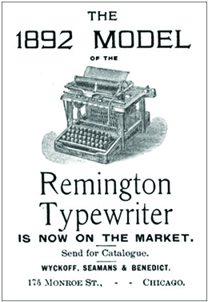

By the end of this section, you will be able to:
* Describe the characteristics of the new consumer culture that emerged at the end of the nineteenth century

Despite the challenges workers faced in their new roles as wage earners, the rise of industry in the United States allowed people to access and consume goods as never before. The rise of big business had turned America into a culture of consumers desperate for time-saving and leisure commodities, where people could expect to find everything they wanted in shops or by mail order. Gone were the days where the small general store was the only option for shoppers; at the end of the nineteenth century, people could take a train to the city and shop in large department stores like Macy’s in New York, Gimbel’s in Philadelphia, and Marshall Fields in Chicago. Chain stores, like A&amp;P and Woolworth’s, both of which opened in the 1870s, offered options to those who lived farther from major urban areas and clearly catered to classes other than the wealthy elite. Industrial advancements contributed to this proliferation, as new construction techniques permitted the building of stores with higher ceilings for larger displays, and the production of larger sheets of plate glass lent themselves to the development of larger store windows, glass countertops, and display cases where shoppers could observe a variety of goods at a glance. L. Frank Baum, of *Wizard of Oz* fame, later founded the National Association of Window Trimmers in 1898, and began publishing *The Store Window* journal to advise businesses on space usage and promotion.

Even families in rural America had new opportunities to purchase a greater variety of products than ever before, at ever decreasing prices. Those far from chain stores could benefit from the newly developed business of mail-order catalogs, placing orders by telephone. Aaron Montgomery Ward established the first significant mail-order business in 1872, with Sears, Roebuck &amp; Company following in 1886. Sears distributed over 300,000 catalogs annually by 1897, and later broke the one million annual mark in 1907. Sears in particular understood that farmers and rural Americans sought alternatives to the higher prices and credit purchases they were forced to endure at small-town country stores. By clearly stating the prices in his catalog, Richard Sears steadily increased his company’s image of their catalog serving as “the consumer’s bible.” In the process, Sears, Roebuck &amp; Company supplied much of America’s hinterland with products ranging from farm supplies to bicycles, toilet paper to automobiles, as seen below in a page from the catalog ([\[link\]](#CNX_History_18_04_AdvOrgan)).

 {: #CNX_History_18_04_AdvOrgan}

The tremendous variety of goods available for sale required businesses to compete for customers in ways they had never before imagined. Suddenly, instead of a single option for clothing or shoes, customers were faced with dozens, whether ordered by mail, found at the local chain store, or lined up in massive rows at department stores. This new level of competition made advertising a vital component of all businesses. By 1900, American businesses were spending almost $100 million annually on advertising. Competitors offered “new and improved” models as frequently as possible in order to generate interest. From toothpaste and mouthwash to books on entertaining guests, new goods were constantly offered. Newspapers accommodated the demand for advertising by shifting their production to include full-page advertisements, as opposed to the traditional column width, agate-type advertisements that dominated mid-nineteenth century newspapers (similar to classified advertisements in today’s publications). Likewise, professional advertising agencies began to emerge in the 1880s, with experts in consumer demand bidding for accounts with major firms.

It may seem strange that, at a time when wages were so low, people began buying readily; however, the slow emergence of a middle class by the end of the century, combined with the growing practice of buying on credit, presented more opportunities to take part in the new consumer culture. Stores allowed people to open accounts and purchase on credit, thus securing business and allowing consumers to buy without ready cash. Then, as today, the risks of buying on credit led many into debt. As advertising expert Roland Marchand described in his *Parable on the Democracy of Goods*, in an era when access to products became more important than access to the means of production, Americans quickly accepted the notion that they could live a better lifestyle by purchasing the right clothes, the best hair cream, and the shiniest shoes, regardless of their class. For better or worse, American consumerism had begun.

Advertising in the Industrial Age: Credit, Luxury, and the Advent of “New and Improved”

Before the industrial revolution, most household goods were either made at home or purchased locally, with limited choices. By the end of the nineteenth century, factors such as the population’s move towards urban centers and the expansion of the railroad changed how Americans shopped for, and perceived, consumer goods. As mentioned above, advertising took off, as businesses competed for customers.

Many of the elements used widely in nineteenth-century advertisements are familiar. Companies sought to sell luxury, safety, and, as the ad for the typewriter below shows ([\[link\]](#CNX_History_18_04_Typewriter)), the allure of the new-and-improved model. One advertising tactic that truly took off in this era was the option to purchase on credit. For the first time, mail order and mass production meant that the aspiring middle class could purchase items that could only be owned previously by the wealthy. While there was a societal stigma for buying everyday goods on credit, certain items, such as fine furniture or pianos, were considered an investment in the move toward entry into the middle class.

{: #CNX_History_18_04_Typewriter}

Additionally, farmers and housewives purchased farm equipment and sewing machines on credit, considering these items investments rather than luxuries. For women, the purchase of a sewing machine meant that a shirt could be made in one hour, instead of fourteen. The Singer Sewing Machine Company was one of the most aggressive at pushing purchase on credit. They advertised widely, and their “Dollar Down, Dollar a Week” campaign made them one of the fastest-growing companies in the country.

For workers earning lower wages, these easy credit terms meant that the middle-class lifestyle was within their reach. Of course, it also meant they were in debt, and changes in wages, illness, or other unexpected expenses could wreak havoc on a household’s tenuous finances. Still, the opportunity to own new and luxurious products was one that many Americans, aspiring to improve their place in society, could not resist.

# Section Summary

While tensions between owners and workers continued to grow, and wage earners struggled with the challenges of industrial work, the culture of American consumerism was changing. Greater choice, easier access, and improved goods at lower prices meant that even lower-income Americans, whether rural and shopping via mail order, or urban and shopping in large department stores, had more options. These increased options led to a rise in advertising, as businesses competed for customers. Furthermore, the opportunity to buy on credit meant that Americans could have their goods, even without ready cash. The result was a population that had a better standard of living than ever before, even as they went into debt or worked long factory hours to pay for it.

# Review Questions

Which of the following did *not* contribute to the growth of a consumer culture in the United States at the close of the nineteenth century?personal credit advertising greater disposable income mail-order catalogs 

C

Briefly explain Roland Marchand’s argument in the *Parable of the Democracy of Goods*.

Marchand argues that in the new era of consumerism, workers’ desire for access to consumer goods replaces their desire for access to the means of production of those goods. So long as Americans could buy products that advertisers convinced them would make them look and feel wealthy, they did not need to fight for access to the means of wealth.

# Critical Thinking Questions

Consider the fact that the light bulb and the telephone were invented only three years apart. Although it took many more years for such devices to find their way into common household use, they eventually wrought major changes in a relatively brief period of time. What effects did these inventions have on the lives of those who used them? Are there contemporary analogies in your lifetime of significant changes due to inventions or technological innovations?

Industrialization, immigration, and urbanization all took place on an unprecedented scale during this era. What were the relationships of these processes to one another? How did each process serve to catalyze and fuel the others?

Describe the various attempts at labor organization in this era, from the Molly Maguires to the Knights of Labor and American Federation of Labor. How were the goals, philosophies, and tactics of these groups similar and different? How did their agendas represent the concerns and grievances of their members and of workers more generally?

Describe the various violent clashes between labor and management that occurred during this era. What do these events reveal about how each group had come to view the other?

How did the new industrial order represent both new opportunities and new limitations for rural and working-class urban Americans?

How did the emergent consumer culture change what it meant to be “American” at the turn of the century?

