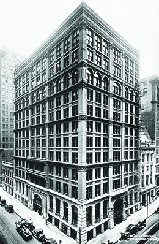
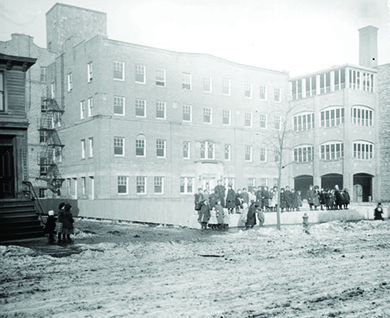

By the end of this section, you will be able to:
* Explain the growth of American cities in the late nineteenth century
* Identify the key challenges that Americans faced due to urbanization, as well as some of the possible solutions to those challenges

 ![A timeline shows important events of the era. In 1876, professional baseball begins with the founding of the National League; Boston&#x2019;s Fenway Park is shown. In 1885, Chicago builds the first ten-story skyscraper; Chicago&#x2019;s Home Insurance Building is shown. In 1887, Frank Sprague invents the electric trolley. In 1889, Jane Addams opens Hull House in Chicago; Hull House is shown. In 1890, Jacob Riis publishes How the Other Half Lives, and Carnegie Hall opens in New York. In 1893, the City Beautiful movement begins; a city plan is shown. In 1895, the Coney Island amusement parks open; an amusement park is shown.](../resources/CNX_History_19_01_Timeline.jpg){: #CNX_History_19_01_Timeline}

**Urbanization**{: data-type="term" .no-emphasis} occurred rapidly in the second half of the nineteenth century in the United States for a number of reasons. The new technologies of the time led to a massive leap in industrialization, requiring large numbers of workers. New electric lights and powerful machinery allowed factories to run twenty-four hours a day, seven days a week. Workers were forced into grueling twelve-hour shifts, requiring them to live close to the factories.

While the work was dangerous and difficult, many Americans were willing to leave behind the declining prospects of preindustrial agriculture in the hope of better wages in industrial labor. Furthermore, problems ranging from famine to religious persecution led a new wave of immigrants to arrive from central, eastern, and southern Europe, many of whom settled and found work near the cities where they first arrived. Immigrants sought solace and comfort among others who shared the same language and customs, and the nation’s cities became an invaluable economic and cultural resource.

Although cities such as Philadelphia, Boston, and New York sprang up from the initial days of colonial settlement, the explosion in urban population growth did not occur until the mid-nineteenth century ([\[link\]](#CNX_History_19_01_PopGrowth)). At this time, the attractions of city life, and in particular, employment opportunities, grew exponentially due to rapid changes in industrialization. Before the mid-1800s, factories, such as the early textile mills, had to be located near rivers and seaports, both for the transport of goods and the necessary water power. Production became dependent upon seasonal water flow, with cold, icy winters all but stopping river transportation entirely. The development of the steam engine transformed this need, allowing businesses to locate their factories near urban centers. These factories encouraged more and more people to move to urban areas where jobs were plentiful, but hourly wages were often low and the work was routine and grindingly monotonous.

 . Much of this new growth took place in urban areas (defined by the census as twenty-five hundred people or more), and this urban population, particularly that of major cities (b), dealt with challenges and opportunities that were unknown in previous generations."){: #CNX_History_19_01_PopGrowth}

Eventually, cities developed their own unique characters based on the core industry that spurred their growth. In Pittsburgh, it was steel; in Chicago, it was meat packing; in New York, the garment and financial industries dominated; and Detroit, by the mid-twentieth century, was defined by the automobiles it built. But all cities at this time, regardless of their industry, suffered from the universal problems that rapid expansion brought with it, including concerns over housing and living conditions, transportation, and communication. These issues were almost always rooted in deep class inequalities, shaped by racial divisions, religious differences, and ethnic strife, and distorted by corrupt local politics.

  
This [ 1884 Bureau of Labor Statistics report ][1] from Boston looks in detail at the wages, living conditions, and moral code of the girls who worked in the clothing factories there.

### THE KEYS TO SUCCESSFUL URBANIZATION

As the country grew, certain elements led some towns to morph into large urban centers, while others did not. The following four innovations proved critical in shaping urbanization at the turn of the century: electric lighting, communication improvements, intracity transportation, and the rise of skyscrapers. As people migrated for the new jobs, they often struggled with the absence of basic urban infrastructures, such as better transportation, adequate housing, means of communication, and efficient sources of light and energy. Even the basic necessities, such as fresh water and proper sanitation—often taken for granted in the countryside—presented a greater challenge in urban life.

#### Electric Lighting

Thomas Edison patented the incandescent light bulb in 1879. This development quickly became common in homes as well as factories, transforming how even lower- and middle-class Americans lived. Although slow to arrive in rural areas of the country, electric power became readily available in cities when the first commercial power plants began to open in 1882. When Nikola Tesla subsequently developed the AC (alternating current) system for the Westinghouse Electric &amp; Manufacturing Company, power supplies for lights and other factory equipment could extend for miles from the power source. AC power transformed the use of electricity, allowing urban centers to physically cover greater areas. In the factories, electric lights permitted operations to run twenty-four hours a day, seven days a week. This increase in production required additional workers, and this demand brought more people to cities.

Gradually, cities began to illuminate the streets with electric lamps to allow the city to remain alight throughout the night. No longer did the pace of life and economic activity slow substantially at sunset, the way it had in smaller towns. The cities, following the factories that drew people there, stayed open all the time.

#### Communications Improvements

The telephone, patented in 1876, greatly transformed communication both regionally and nationally. The telephone rapidly supplanted the telegraph as the preferred form of communication; by 1900, over 1.5 million telephones were in use around the nation, whether as private lines in the homes of some middle- and upper-class Americans, or as jointly used “party lines” in many rural areas. By allowing instant communication over larger distances at any given time, growing telephone networks made urban sprawl possible.

In the same way that electric lights spurred greater factory production and economic growth, the telephone increased business through the more rapid pace of demand. Now, orders could come constantly via telephone, rather than via mail-order. More orders generated greater production, which in turn required still more workers. This demand for additional labor played a key role in urban growth, as expanding companies sought workers to handle the increasing consumer demand for their products.

#### Intracity Transportation

As cities grew and sprawled outward, a major challenge was efficient travel within the city—from home to factories or shops, and then back again. Most transportation infrastructure was used to connect cities to each other, typically by rail or canal. Prior to the 1880s, the most common form of transportation within cities was the omnibus. This was a large, horse-drawn carriage, often placed on iron or steel tracks to provide a smoother ride. While omnibuses worked adequately in smaller, less congested cities, they were not equipped to handle the larger crowds that developed at the close of the century. The horses had to stop and rest, and horse manure became an ongoing problem.

In 1887, Frank Sprague invented the electric trolley, which worked along the same concept as the omnibus, with a large wagon on tracks, but was powered by electricity rather than horses. The electric trolley could run throughout the day and night, like the factories and the workers who fueled them. But it also modernized less important industrial centers, such as the southern city of Richmond, Virginia. As early as 1873, San Francisco engineers adopted pulley technology from the mining industry to introduce cable cars and turn the city’s steep hills into elegant middle-class communities. However, as crowds continued to grow in the largest cities, such as Chicago and New York, trolleys were unable to move efficiently through the crowds of pedestrians ([\[link\]](#CNX_History_19_01_Streetcar)). To avoid this challenge, city planners elevated the trolley lines above the streets, creating elevated trains, or L-trains, as early as 1868 in New York City, and quickly spreading to Boston in 1887 and Chicago in 1892. Finally, as skyscrapers began to dominate the air, transportation evolved one step further to move underground as subways. Boston’s subway system began operating in 1897, and was quickly followed by New York and other cities.

 . To avoid overcrowded streets, trolleys soon went underground, as at the Public Gardens Portal in Boston (b), where three different lines met to enter the Tremont Street Subway, the oldest subway tunnel in the United States, opening on September 1, 1897."){: #CNX_History_19_01_Streetcar}

#### The Rise of Skyscrapers

The last limitation that large cities had to overcome was the ever-increasing need for space. Eastern cities, unlike their midwestern counterparts, could not continue to grow outward, as the land surrounding them was already settled. Geographic limitations such as rivers or the coast also hampered sprawl. And in all cities, citizens needed to be close enough to urban centers to conveniently access work, shops, and other core institutions of urban life. The increasing cost of real estate made upward growth attractive, and so did the prestige that towering buildings carried for the businesses that occupied them. Workers completed the first skyscraper in Chicago, the ten-story Home Insurance Building, in 1885 ([\[link\]](#CNX_History_19_01_Skyscraper)). Although engineers had the capability to go higher, thanks to new steel construction techniques, they required another vital invention in order to make taller buildings viable: the elevator. In 1889, the Otis Elevator Company, led by inventor James Otis, installed the first electric elevator. This began the skyscraper craze, allowing developers in eastern cities to build and market prestigious real estate in the hearts of crowded eastern metropoles.

{: #CNX_History_19_01_Skyscraper}

Jacob Riis and the Window into “How the Other Half Lives”

Jacob Riis was a Danish immigrant who moved to New York in the late nineteenth century and, after experiencing poverty and joblessness first-hand, ultimately built a career as a police reporter. In the course of his work, he spent much of his time in the slums and tenements of New York’s working poor. Appalled by what he found there, Riis began documenting these scenes of squalor and sharing them through lectures and ultimately through the publication of his book, *How the Other Half Lives*, in 1890 ([\[link\]](#CNX_History_19_01_Riis)).

, taken on Mulberry Street in the infamous Five Points neighborhood of Manhattan&#x2019;s Lower East Side, Jacob Riis documented the plight of New York City slums in the late nineteenth century."){: #CNX_History_19_01_Riis}

By most contemporary accounts, Riis was an effective storyteller, using drama and racial stereotypes to tell his stories of the ethnic slums he encountered. But while his racial thinking was very much a product of his time, he was also a reformer; he felt strongly that upper and middle-class Americans could and should care about the living conditions of the poor. In his book and lectures, he argued against the immoral landlords and useless laws that allowed dangerous living conditions and high rents. He also suggested remodeling existing tenements or building new ones. He was not alone in his concern for the plight of the poor; other reporters and activists had already brought the issue into the public eye, and Riis’s photographs added a new element to the story.

To tell his stories, Riis used a series of deeply compelling photographs. Riis and his group of amateur photographers moved through the various slums of New York, laboriously setting up their tripods and explosive chemicals to create enough light to take the photographs. His photos and writings shocked the public, made Riis a well-known figure both in his day and beyond, and eventually led to new state legislation curbing abuses in tenements.

### THE IMMEDIATE CHALLENGES OF URBAN LIFE

Congestion, pollution, crime, and disease were prevalent problems in all urban centers; city planners and inhabitants alike sought new solutions to the problems caused by rapid urban growth. Living conditions for most working-class urban dwellers were atrocious. They lived in crowded tenement houses and cramped apartments with terrible ventilation and substandard plumbing and sanitation. As a result, disease ran rampant, with typhoid and cholera common. Memphis, Tennessee, experienced waves of cholera (1873) followed by yellow fever (1878 and 1879) that resulted in the loss of over ten thousand lives. By the late 1880s, New York City, Baltimore, Chicago, and New Orleans had all introduced sewage pumping systems to provide efficient waste management. Many cities were also serious fire hazards. An average working-class family of six, with two adults and four children, had at best a two-bedroom tenement. By one 1900 estimate, in the New York City borough of Manhattan alone, there were nearly fifty thousand tenement houses. The photographs of these tenement houses are seen in Jacob Riis’s book, *How the Other Half Lives*, discussed in the feature above. Citing a study by the New York State Assembly at this time, Riis found New York to be the most densely populated city in the world, with as many as eight hundred residents per square acre in the Lower East Side working-class slums, comprising the Eleventh and Thirteenth Wards.

  
Visit [New York City, Tenement Life][2] to get an impression of the everyday life of tenement dwellers on Manhattan’s Lower East Side.

Churches and civic organizations provided some relief to the challenges of working-class city life. Churches were moved to intervene through their belief in the concept of the **social gospel**{: data-type="term"}. This philosophy stated that all Christians, whether they were church leaders or social reformers, should be as concerned about the conditions of life in the secular world as the afterlife, and the Reverend Washington Gladden was a major advocate. Rather than preaching sermons on heaven and hell, Gladden talked about social changes of the time, urging other preachers to follow his lead. He advocated for improvements in daily life and encouraged Americans of all classes to work together for the betterment of society. His sermons included the message to “love thy neighbor” and held that all Americans had to work together to help the masses. As a result of his influence, churches began to include gymnasiums and libraries as well as offer evening classes on hygiene and health care. Other religious organizations like the Salvation Army and the Young Men’s Christian Association (YMCA) expanded their reach in American cities at this time as well. Beginning in the 1870s, these organizations began providing community services and other benefits to the urban poor.

In the secular sphere, the **settlement house movement**{: data-type="term"} of the 1890s provided additional relief. Pioneering women such as Jane Addams in Chicago and Lillian Wald in New York led this early progressive reform movement in the United States, building upon ideas originally fashioned by social reformers in England. With no particular religious bent, they worked to create settlement houses in urban centers where they could help the working class, and in particular, working-class women, find aid. Their help included child daycare, evening classes, libraries, gym facilities, and free health care. Addams opened her now-famous Hull House ([\[link\]](#CNX_History_19_01_HullHouse)) in Chicago in 1889, and Wald’s Henry Street Settlement opened in New York six years later. The movement spread quickly to other cities, where they not only provided relief to working-class women but also offered employment opportunities for women graduating college in the growing field of social work. Oftentimes, living in the settlement houses among the women they helped, these college graduates experienced the equivalent of living social classrooms in which to practice their skills, which also frequently caused friction with immigrant women who had their own ideas of reform and self-improvement.

 {: #CNX_History_19_01_HullHouse}

The success of the settlement house movement later became the basis of a political agenda that included pressure for housing laws, child labor laws, and worker’s compensation laws, among others. Florence Kelley, who originally worked with Addams in Chicago, later joined Wald’s efforts in New York; together, they created the National Child Labor Committee and advocated for the subsequent creation of the Children’s Bureau in the U.S. Department of Labor in 1912. Julia Lathrop—herself a former resident of Hull House—became the first woman to head a federal government agency, when President William Howard Taft appointed her to run the bureau. Settlement house workers also became influential leaders in the women’s suffrage movement as well as the antiwar movement during World War I.

Jane Addams Reflects on the Settlement House Movement

Jane Addams was a social activist whose work took many forms. She is perhaps best known as the founder of Hull House in Chicago, which later became a model for settlement houses throughout the country. Here, she reflects on the role that the settlement played.

<q>Life in the Settlement discovers above all what has been called ‘the extraordinary pliability of human nature,’ and it seems impossible to set any bounds to the moral capabilities which might unfold under ideal civic and educational conditions. But in order to obtain these conditions, the Settlement recognizes the need of cooperation, both with the radical and the conservative, and from the very nature of the case the Settlement cannot limit its friends to any one political party or economic school.</q> <q id="eip-idp140557165073120">The Settlement casts side none of those things which cultivated men have come to consider reasonable and goodly, but it insists that those belong as well to that great body of people who, because of toilsome and underpaid labor, are unable to procure them for themselves. Added to this is a profound conviction that the common stock of intellectual enjoyment should not be difficult of access because of the economic position of him who would approach it, that those ‘best results of civilization’ upon which depend the finer and freer aspects of living must be incorporated into our common life and have free mobility through all elements of society if we would have our democracy endure.</q> <q id="eip-idp140557165074464">The educational activities of a Settlement, as well its philanthropic, civic, and social undertakings, are but differing manifestations of the attempt to socialize democracy, as is the very existence of the Settlement itself. </q>

In addition to her pioneering work in the settlement house movement, Addams also was active in the women’s suffrage movement as well as an outspoken proponent for international peace efforts. She was instrumental in the relief effort after World War I, a commitment that led to her winning the Nobel Peace Prize in 1931.

### Section Summary

Urbanization spread rapidly in the mid-nineteenth century due to a confluence of factors. New technologies, such as electricity and steam engines, transformed factory work, allowing factories to move closer to urban centers and away from the rivers that had previously been vital sources of both water power and transportation. The growth of factories—as well as innovations such as electric lighting, which allowed them to run at all hours of the day and night—created a massive need for workers, who poured in from both rural areas of the United States and from eastern and southern Europe. As cities grew, they were unable to cope with this rapid influx of workers, and the living conditions for the working class were terrible. Tight living quarters, with inadequate plumbing and sanitation, led to widespread illness. Churches, civic organizations, and the secular settlement house movement all sought to provide some relief to the urban working class, but conditions remained brutal for many new city dwellers.

### Review Questions

Which of the following four elements was *not* essential for creating massive urban growth in late nineteenth-century America?

1.  electric lighting
2.  communication improvements
3.  skyscrapers
4.  settlement houses
{: type="A"}

D

Which of the following did the settlement house movement offer as a means of relief for working-class women?

1.  childcare
2.  job opportunities
3.  political advocacy
4.  relocation services
{: type="A"}

A

What technological and economic factors combined to lead to the explosive growth of American cities at this time?

At the end of the nineteenth century, a confluence of events made urban life more desirable and more possible. Technologies such as electricity and the telephone allowed factories to build and grow in cities, and skyscrapers enabled the relatively small geographic areas to continue expanding. The new demand for workers spurred a massive influx of job-seekers from both rural areas of the United States and from eastern and southern Europe. Urban housing—as well as services such as transportation and sanitation—expanded accordingly, though cities struggled to cope with the surging demand. Together, technological innovations and an exploding population led American cities to grow as never before.

### Glossary
{: data-type="glossary-title"}

settlement house movement
: an early progressive reform movement, largely spearheaded by women, which sought to offer services such as childcare and free healthcare to help the working poor
^

social gospel
: the belief that the church should be as concerned about the conditions of people in the secular world as it was with their afterlife

[1]: http://openstaxcollege.org/l/clothingfact
[2]: http://openstaxcollege.org/l/tenement
