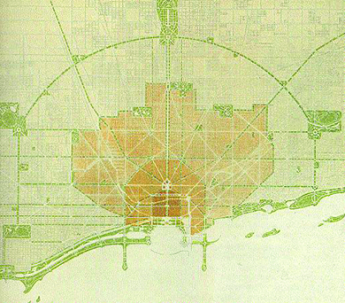

By the end of this section, you will be able to:
* Identify how each class of Americans—working class, middle class, and upper class—responded to the challenges associated with urban life
* Explain the process of machine politics and how it brought relief to working-class Americans

Settlement houses and religious and civic organizations attempted to provide some support to working-class city dwellers through free health care, education, and leisure opportunities. Still, for urban citizens, life in the city was chaotic and challenging. But how that chaos manifested and how relief was sought differed greatly, depending on where people were in the social caste—the working class, the upper class, or the newly emerging professional middle class—in addition to the aforementioned issues of race and ethnicity. While many communities found life in the largest American cities disorganized and overwhelming, the ways they answered these challenges were as diverse as the people who lived there. Broad solutions emerged that were typically class specific: The rise of machine politics and popular culture provided relief to the working class, higher education opportunities and suburbanization benefitted the professional middle class, and reminders of their elite status gave comfort to the upper class. And everyone, no matter where they fell in the class system, benefited from the efforts to improve the physical landscapes of the fast-growing urban environment.

# THE LIFE AND STRUGGLES OF THE URBAN WORKING CLASS

For the working-class residents of America’s cities, one practical way of coping with the challenges of urban life was to take advantage of the system of machine politics, while another was to seek relief in the variety of popular culture and entertainment found in and around cities. Although neither of these forms of relief was restricted to the working class, they were the ones who relied most heavily on them.

## Machine Politics

The primary form of relief for working-class urban Americans, and particularly immigrants, came in the form of **machine politics**{: data-type="term"}. This phrase referred to the process by which every citizen of the city, no matter their ethnicity or race, was a ward resident with an alderman who spoke on their behalf at city hall. When everyday challenges arose, whether sanitation problems or the need for a sidewalk along a muddy road, citizens would approach their alderman to find a solution. The aldermen knew that, rather than work through the long bureaucratic process associated with city hall, they could work within the “machine” of local politics to find a speedy, mutually beneficial solution. In machine politics, favors were exchanged for votes, votes were given in exchange for fast solutions, and the price of the solutions included a kickback to the boss. In the short term, everyone got what they needed, but the process was neither transparent nor democratic, and it was an inefficient way of conducting the city’s business.

One example of a machine political system was the Democratic political machine **Tammany Hall**{: data-type="term"} in New York, run by machine boss William Tweed with assistance from George Washington Plunkitt ([\[link\]](#CNX_History_19_03_Tweed)). There, citizens knew their immediate problems would be addressed in return for their promise of political support in future elections. In this way, machines provided timely solutions for citizens and votes for the politicians. For example, if in Little Italy there was a desperate need for sidewalks in order to improve traffic to the stores on a particular street, the request would likely get bogged down in the bureaucratic red tape at city hall. Instead, store owners would approach the machine. A district captain would approach the “boss” and make him aware of the problem. The boss would contact city politicians and strongly urge them to appropriate the needed funds for the sidewalk in exchange for the promise that the boss would direct votes in their favor in the upcoming election. The boss then used the funds to pay one of his friends for the sidewalk construction, typically at an exorbitant cost, with a financial kickback to the boss, which was known as **graft**{: data-type="term"}. The sidewalk was built more quickly than anyone hoped, in exchange for the citizens’ promises to vote for machine-supported candidates in the next elections. Despite its corrupt nature, Tammany Hall essentially ran New York politics from the 1850s until the 1930s. Other large cities, including Boston, Philadelphia, Cleveland, St. Louis, and Kansas City, made use of political machines as well.

 {: #CNX_History_19_03_Tweed}

## Popular Culture and Entertainment

Working-class residents also found relief in the diverse and omnipresent offerings of popular culture and entertainment in and around cities. These offerings provided an immediate escape from the squalor and difficulties of everyday life. As improved means of internal transportation developed, working-class residents could escape the city and experience one of the popular new forms of entertainment—the amusement park. For example, Coney Island on the Brooklyn shoreline consisted of several different amusement parks, the first of which opened in 1895 ([\[link\]](#CNX_History_19_03_Coney)). At these parks, New Yorkers enjoyed wild rides, animal attractions, and large stage productions designed to help them forget the struggles of their working-day lives. Freak “side” shows fed the public’s curiosity about physical deviance. For a mere ten cents, spectators could watch a high-diving horse, take a ride to the moon to watch moon maidens eat green cheese, or witness the electrocution of an elephant, a spectacle that fascinated the public both with technological marvels and exotic wildlife. The treatment of animals in many acts at Coney Island and other public amusement parks drew the attention of middle-class reformers such as the American Society for the Prevention of Cruelty to Animals. Despite questions regarding the propriety of many of the acts, other cities quickly followed New York’s lead with similar, if smaller, versions of Coney Island’s attractions.

 {: #CNX_History_19_03_Coney}

  
The [American Experience Timeline of Coney Island][1] shows a timeline, photo gallery, and other elements of Coney Island. Look to see what elements of American culture, from the hot dog to the roller coaster, debuted there.

Another common form of popular entertainment was vaudeville—large stage variety shows that included everything from singing, dancing, and comedy acts to live animals and magic. The vaudeville circuit gave rise to several prominent performers, including magician Harry Houdini, who began his career in these variety shows before his fame propelled him to solo acts. In addition to live theater shows, it was primarily working-class citizens who enjoyed the advent of the nickelodeon, a forerunner to the movie theater. The first nickelodeon opened in Pittsburgh in 1905, where nearly one hundred visitors packed into a storefront theater to see a traditional vaudeville show interspersed with one-minute film clips. Several theaters initially used the films as “chasers” to indicate the end of the show to the live audience so they would clear the auditorium. However, a vaudeville performers’ strike generated even greater interest in the films, eventually resulting in the rise of modern movie theaters by 1910.

One other major form of entertainment for the working class was professional baseball ([\[link\]](#CNX_History_19_03_Baseball)). Club teams transformed into professional baseball teams with the Cincinnati Red Stockings, now the Cincinnati Reds, in 1869. Soon, professional teams sprang up in several major American cities. Baseball games provided an inexpensive form of entertainment, where for less than a dollar, a person could enjoy a double-header, two hot dogs, and a beer. But more importantly, the teams became a way for newly relocated Americans and immigrants of diverse backgrounds to develop a unified civic identity, all cheering for one team. By 1876, the National League had formed, and soon after, cathedral-style ballparks began to spring up in many cities. Fenway Park in Boston (1912), Forbes Field in Pittsburgh (1909), and the Polo Grounds in New York (1890) all became touch points where working-class Americans came together to support a common cause.

 {: #CNX_History_19_03_Baseball}

Other popular sports included prize-fighting, which attracted a predominantly male, working- and middle-class audience who lived vicariously through the triumphs of the boxers during a time where opportunities for individual success were rapidly shrinking, and college football, which paralleled a modern corporation in its team hierarchy, divisions of duties, and emphasis on time management.

# THE UPPER CLASS IN THE CITIES

The American financial elite did not need to crowd into cities to find work, like their working-class counterparts. But as urban centers were vital business cores, where multi-million-dollar financial deals were made daily, those who worked in that world wished to remain close to the action. The rich chose to be in the midst of the chaos of the cities, but they were also able to provide significant measures of comfort, convenience, and luxury for themselves.

Wealthy citizens seldom attended what they considered the crass entertainment of the working class. Instead of amusement parks and baseball games, urban elites sought out more refined pastimes that underscored their knowledge of art and culture, preferring classical music concerts, fine art collections, and social gatherings with their peers. In New York, Andrew Carnegie built Carnegie Hall in 1891, which quickly became the center of classical music performances in the country. Nearby, the Metropolitan Museum of Art opened its doors in 1872 and still remains one of the largest collections of fine art in the world. Other cities followed suit, and these cultural pursuits became a way for the upper class to remind themselves of their elevated place amid urban squalor.

As new opportunities for the middle class threatened the austerity of upper-class citizens, including the newer forms of transportation that allowed middle-class Americans to travel with greater ease, wealthier Americans sought unique ways to further set themselves apart in society. These included more expensive excursions, such as vacations in Newport, Rhode Island, winter relocation to sunny Florida, and frequent trips aboard steamships to Europe. For those who were not of the highly respected “old money,” but only recently obtained their riches through business ventures, the relief they sought came in the form of one book—the annual ***Social Register***{: data-type="term"}. First published in 1886 by Louis Keller in New York City, the register became a directory of the wealthy socialites who populated the city. Keller updated it annually, and people would watch with varying degrees of anxiety or complacency to see their names appear in print. Also called the *Blue Book*, the register was instrumental in the planning of society dinners, balls, and other social events. For those of newer wealth, there was relief found simply in the notion that they and others witnessed their wealth through the publication of their names in the register.

# A NEW MIDDLE CLASS

While the working class were confined to tenement houses in the cities by their need to be close to their work and the lack of funds to find anyplace better, and the wealthy class chose to remain in the cities to stay close to the action of big business transactions, the emerging **middle class**{: data-type="term" .no-emphasis} responded to urban challenges with their own solutions. This group included the managers, salesmen, engineers, doctors, accountants, and other salaried professionals who still worked for a living, but were significantly better educated and compensated than the working-class poor. For this new middle class, relief from the trials of the cities came through education and suburbanization.

In large part, the middle class responded to the challenges of the city by physically escaping it. As transportation improved and outlying communities connected to urban centers, the middle class embraced a new type of community—the suburbs. It became possible for those with adequate means to work in the city and escape each evening, by way of a train or trolley, to a house in the suburbs. As the number of people moving to the suburbs grew, there also grew a perception among the middle class that the farther one lived from the city and the more amenities one had, the more affluence one had achieved.

Although a few suburbs existed in the United States prior to the 1880s (such as Llewellyn Park, New Jersey), the introduction of the electric railway generated greater interest and growth during the last decade of the century. The ability to travel from home to work on a relatively quick and cheap mode of transportation encouraged more Americans of modest means to consider living away from the chaos of the city. Eventually, Henry Ford’s popularization of the automobile, specifically in terms of a lower price, permitted more families to own cars and thus consider suburban life. Later in the twentieth century, both the advent of the interstate highway system, along with federal legislation designed to allow families to construct homes with low-interest loans, further sparked the suburban phenomenon.

## New Roles for Middle-Class Women

Social norms of the day encouraged middle-class women to take great pride in creating a positive home environment for their working husbands and school-age children, which reinforced the business and educational principles that they practiced on the job or in school. It was at this time that the magazines *Ladies Home Journal* and *Good Housekeeping* began distribution, to tremendous popularity ([\[link\]](#CNX_History_19_03_Housekeep)).

 {: #CNX_History_19_03_Housekeep}

While the vast majority of middle-class women took on the expected role of housewife and homemaker, some women were finding paths to college. A small number of men’s colleges began to open their doors to women in the mid-1800s, and co-education became an option. Some of the most elite universities created affiliated women’s colleges, such as Radcliffe College with Harvard, and Pembroke College with Brown University. But more importantly, the first women’s colleges opened at this time. Mount Holyoke, Vassar, Smith, and Wellesley Colleges, still some of the best known women’s schools, opened their doors between 1865 and 1880, and, although enrollment was low (initial class sizes ranged from sixty-one students at Vassar to seventy at Wellesley, seventy-one at Smith, and up to eighty-eight at Mount Holyoke), the opportunity for a higher education, and even a career, began to emerge for young women. These schools offered a unique, all-women environment in which professors and a community of education-seeking young women came together. While most college-educated young women still married, their education offered them new opportunities to work outside the home, most frequently as teachers, professors, or in the aforementioned settlement house environments created by Jane Addams and others.

## Education and the Middle Class

Since the children of the professional class did not have to leave school and find work to support their families, they had opportunities for education and advancement that would solidify their position in the middle class. They also benefited from the presence of stay-at-home mothers, unlike working-class children, whose mothers typically worked the same long hours as their fathers. Public school enrollment exploded at this time, with the number of students attending public school tripling from seven million in 1870 to twenty-one million in 1920. Unlike the old-fashioned one-room schoolhouses, larger schools slowly began the practice of employing different teachers for each grade, and some even began hiring discipline-specific instructors. High schools also grew at this time, from one hundred high schools nationally in 1860 to over six thousand by 1900.

The federal government supported the growth of higher education with the Morrill Acts of 1862 and 1890. These laws set aside public land and federal funds to create land-grant colleges that were affordable to middle-class families, offering courses and degrees useful in the professions, but also in trade, commerce, industry, and agriculture ([\[link\]](#CNX_History_19_03_Landgrant)). Land-grant colleges stood in contrast to the expensive, private Ivy League universities such as Harvard and Yale, which still catered to the elite. Iowa became the first state to accept the provisions of the original Morrill Act, creating what later became Iowa State University. Other states soon followed suit, and the availability of an affordable college education encouraged a boost in enrollment, from 50,000 students nationwide in 1870 to over 600,000 students by 1920.

 {: #CNX_History_19_03_Landgrant}

College curricula also changed at this time. Students grew less likely to take traditional liberal arts classes in rhetoric, philosophy, and foreign language, and instead focused on preparing for the modern work world. Professional schools for the study of medicine, law, and business also developed. In short, education for the children of middle-class parents catered to class-specific interests and helped ensure that parents could establish their children comfortably in the middle class as well.

# “CITY BEAUTIFUL”

While the working poor lived in the worst of it and the wealthy elite sought to avoid it, all city dwellers at the time had to deal with the harsh realities of urban sprawl. Skyscrapers rose and filled the air, streets were crowded with pedestrians of all sorts, and, as developers worked to meet the always-increasing demand for space, the few remaining green spaces in the city quickly disappeared. As the U.S. population became increasingly centered in urban areas while the century drew to a close, questions about the quality of city life—particularly with regard to issues of aesthetics, crime, and poverty—quickly consumed many reformers’ minds. Those middle-class and wealthier urbanites who enjoyed the costlier amenities presented by city life—including theaters, restaurants, and shopping—were free to escape to the suburbs, leaving behind the poorer working classes living in squalor and unsanitary conditions. Through the **City Beautiful**{: data-type="term"} movement, leaders such as Frederick Law Olmsted and Daniel Burnham sought to champion middle- and upper-class progressive reforms. They improved the quality of life for city dwellers, but also cultivated middle-class-dominated urban spaces in which Americans of different ethnicities, racial origins, and classes worked and lived.

Olmsted, one of the earliest and most influential designers of urban green space, and the original designer of Central Park in New York, worked with Burnham to introduce the idea of the City Beautiful movement at the Columbian Exposition in 1893. There, they helped to design and construct the “White City”—so named for the plaster of Paris construction of several buildings that were subsequently painted a bright white—an example of landscaping and architecture that shone as an example of perfect city planning. From wide-open green spaces to brightly painted white buildings, connected with modern transportation services and appropriate sanitation, the “White City” set the stage for American urban city planning for the next generation, beginning in 1901 with the modernization of Washington, DC. This model encouraged city planners to consider three principal tenets: First, create larger park areas inside cities; second, build wider boulevards to decrease traffic congestion and allow for lines of trees and other greenery between lanes; and third, add more suburbs in order to mitigate congested living in the city itself ([\[link\]](#CNX_History_19_03_CityBeauti)). As each city adapted these principles in various ways, the City Beautiful movement became a cornerstone of urban development well into the twentieth century.

 {: #CNX_History_19_03_CityBeauti}

# Section Summary

The burgeoning cities brought together both rich and poor, working class and upper class; however, the realities of urban dwellers’ lives varied dramatically based on where they fell in the social chain. Entertainment and leisure-time activities were heavily dependent on one’s status and wealth. For the working poor, amusement parks and baseball games offered inexpensive entertainment and a brief break from the squalor of the tenements. For the emerging middle class of salaried professionals, an escape to the suburbs kept them removed from the city’s chaos outside of working hours. And for the wealthy, immersion in arts and culture, as well as inclusion in the *Social Register*, allowed them to socialize exclusively with those they felt were of the same social status. The City Beautiful movement benefitted all city dwellers, with its emphasis on public green spaces, and more beautiful and practical city boulevards. In all, these different opportunities for leisure and pleasure made city life manageable for the citizens who lived there.

# Review Questions

Which of the following was a popular pastime for working-class urban dwellers? football games opera museums amusement parks 

D

Which of the following was a disadvantage of machine politics? Immigrants did not have a voice. Taxpayers ultimately paid higher city taxes due to graft. Only wealthy parts of the city received timely responses. Citizens who voiced complaints were at risk for their safety. 

B

In what way did education play a crucial role in the emergence of the middle class?

Better public education and the explosion of high schools meant that the children of the middle class were better educated than any previous generation. While college had previously been mostly restricted to children of the upper class, the creation of land-grant colleges made college available on a wide scale. The curricula at these new colleges matched the needs of the middle class, offering practical professional training rather than the liberal arts focus that the Ivy League schools embraced. Thus, children of the emerging middle class were able to access the education and training needed to secure their place in the professional class for generations to come.

[1]: http://openstaxcollege.org/l/coney
