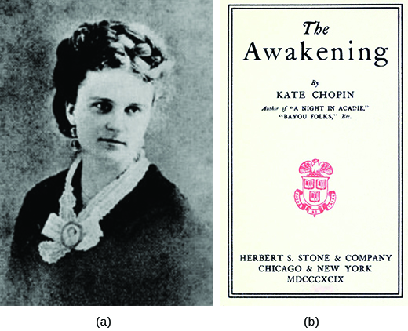

By the end of this section, you will be able to:
* Explain how American writers, both fiction and nonfiction, helped Americans to better understand the changes they faced in the late nineteenth and early twentieth centuries
* Identify some of the influential women and African American writers of the era

In the late nineteenth century, Americans were living in a world characterized by rapid change. Western expansion, dramatic new technologies, and the rise of big business drastically influenced society in a matter of a few decades. For those living in the fast-growing urban areas, the pace of change was even faster and harder to ignore. One result of this time of transformation was the emergence of a series of notable authors, who, whether writing fiction or nonfiction, offered a lens through which to better understand the shifts in American society.

### UNDERSTANDING SOCIAL PROGRESS

One key idea of the nineteenth century that moved from the realm of science to the murkier ground of social and economic success was Charles Darwin’s theory of evolution. Darwin was a British naturalist who, in his 1859 work *On the Origin of Species*, made the case that species develop and evolve through natural selection, not through divine intervention. The idea quickly drew fire from the Anglican Church (although a liberal branch of Anglicans embraced the notion of natural selection being part of God’s plan) and later from many others, both in England and abroad, who felt that the theory directly contradicted the role of God in the earth’s creation. Although biologists, botanists, and most of the scientific establishment widely accepted the theory of evolution at the time of Darwin’s publication, which they felt synthesized much of the previous work in the field, the theory remained controversial in the public realm for decades.

Political philosopher Herbert Spencer took Darwin’s theory of evolution further, coining the actual phrase “survival of the fittest,” and later helping to popularize the phrase **social Darwinism**{: data-type="term" .no-emphasis} to posit that society evolved much like a natural organism, wherein some individuals will succeed due to racially and ethnically inherent traits, and their ability to adapt. This model allowed that a collection of traits and skills, which could include intelligence, inherited wealth, and so on, mixed with the ability to adapt, would let all Americans rise or fall of their own accord, so long as the road to success was accessible to all. William Graham Sumner, a sociologist at Yale, became the most vocal proponent of social Darwinism. Not surprisingly, this ideology, which Darwin himself would have rejected as a gross misreading of his scientific discoveries, drew great praise from those who made their wealth at this time. They saw their success as proof of biological fitness, although critics of this theory were quick to point out that those who did not succeed often did not have the same opportunities or equal playing field that the ideology of social Darwinism purported. Eventually, the concept fell into disrepute in the 1930s and 1940s, as eugenicists began to utilize it in conjunction with their racial theories of genetic superiority.

Other thinkers of the day took Charles Darwin’s theories in a more nuanced direction, focusing on different theories of **realism**{: data-type="term"} that sought to understand the truth underlying the changes in the United States. These thinkers believed that ideas and social constructs must be proven to work before they could be accepted. Philosopher William James was one of the key proponents of the closely related concept of **pragmatism**{: data-type="term"}, which held that Americans needed to experiment with different ideas and perspectives to find the truth about American society, rather than assuming that there was truth in old, previously accepted models. Only by tying ideas, thoughts, and statements to actual objects and occurrences could one begin to identify a coherent truth, according to James. His work strongly influenced the subsequent avant-garde and modernist movements in literature and art, especially in understanding the role of the observer, artist, or writer in shaping the society they attempted to observe. John Dewey built on the idea of pragmatism to create a theory of **instrumentalism**{: data-type="term"}, which advocated the use of education in the search for truth. Dewey believed that education, specifically observation and change through the scientific method, was the best tool by which to reform and improve American society as it continued to grow ever more complex. To that end, Dewey strongly encouraged educational reforms designed to create an informed American citizenry that could then form the basis for other, much-needed progressive reforms in society.

In addition to the new medium of photography, popularized by Riis, novelists and other artists also embraced realism in their work. They sought to portray vignettes from real life in their stories, partly in response to the more sentimental works of their predecessors. Visual artists such as George Bellows, Edward Hopper, and Robert Henri, among others, formed the Ashcan School of Art, which was interested primarily in depicting the urban lifestyle that was quickly gripping the United States at the turn of the century. Their works typically focused on working-class city life, including the slums and tenement houses, as well as working-class forms of leisure and entertainment ([\[link\]](#CNX_History_19_04_Ashcan)).

 "){: #CNX_History_19_04_Ashcan}

Novelists and journalists also popularized realism in literary works. Authors such as Stephen Crane, who wrote stark stories about life in the slums or during the Civil War, and Rebecca Harding Davis, who in 1861 published *Life in the Iron Mills*, embodied this popular style. Mark Twain also sought realism in his books, whether it was the reality of the pioneer spirit, seen in *The Adventures of Huckleberry Finn*, published in 1884, or the issue of corruption in *The Gilded Age*, co-authored with Charles Dudley Warner in 1873. The narratives and visual arts of these realists could nonetheless be highly stylized, crafted, and even fabricated, since their goal was the effective portrayal of social realities they thought required reform. Some authors, such as Jack London, who wrote *The Call of the Wild*, embraced a school of thought called **naturalism**{: data-type="term"}, which concluded that the laws of nature and the natural world were the only truly relevant laws governing humanity ([\[link\]](#CNX_History_19_04_JackLondon)).

. The cover of Jack London&#x2019;s The Call of the Wild (b) shows the dogs in the brutal environment of the Klondike. The book tells the story of Buck, a dog living happily in California until he is sold to be a sled dog in Canada. There, he must survive harsh conditions and brutal behavior, but his innate animal nature takes over and he prevails. The story clarifies the struggle between humanity&#x2019;s nature versus the nurturing forces of society."){: #CNX_History_19_04_JackLondon}

Kate Chopin, widely regarded as the foremost woman short story writer and novelist of her day, sought to portray a realistic view of women’s lives in late nineteenth-century America, thus paving the way for more explicit feminist literature in generations to come. Although Chopin never described herself as a feminist per se, her reflective works on her experiences as a southern woman introduced a form of creative nonfiction that captured the struggles of women in the United States through their own individual experiences. She also was among the first authors to openly address the race issue of miscegenation. In her work *Desiree’s Baby*, Chopin specifically explores the Creole community of her native Louisiana in depths that exposed the reality of racism in a manner seldom seen in literature of the time.

African American poet, playwright, and novelist of the realist period, Paul Laurence Dunbar dealt with issues of race at a time when most reform-minded Americans preferred to focus on other issues. Through his combination of writing in both standard English and black dialect, Dunbar delighted readers with his rich portrayals of the successes and struggles associated with African American life. Although he initially struggled to find the patronage and financial support required to develop a full-time literary career, Dunbar’s subsequent professional relationship with literary critic and *Atlantic Monthly* editor William Dean Howells helped to firmly cement his literary credentials as the foremost African American writer of his generation. As with Chopin and Harding, Dunbar’s writing highlighted parts of the American experience that were not well understood by the dominant demographic of the country. In their work, these authors provided readers with insights into a world that was not necessarily familiar to them and also gave hidden communities—be it iron mill workers, southern women, or African American men—a sense of voice.

  
Mark Twain’s [lampoon of author Horatio Alger][1] demonstrates Twain’s commitment to realism by mocking the myth set out by Alger, whose stories followed a common theme in which a poor but honest boy goes from rags to riches through a combination of “luck and pluck.” See how Twain twists Alger’s hugely popular storyline in this piece of satire.

Kate Chopin: An Awakening in an Unpopular Time

Author Kate Chopin grew up in the American South and later moved to St. Louis, where she began writing stories to make a living after the death of her husband. She published her works throughout the late 1890s, with stories appearing in literary magazines and local papers. It was her second novel, *The Awakening*, which gained her notoriety and criticism in her lifetime, and ongoing literary fame after her death ([\[link\]](#CNX_History_19_04_Chopin)).

{: #CNX_History_19_04_Chopin}

*The Awakening*, set in the New Orleans society that Chopin knew well, tells the story of a woman struggling with the constraints of marriage who ultimately seeks her own fulfillment over the needs of her family. The book deals far more openly than most novels of the day with questions of women’s sexual desires. It also flouted nineteenth-century conventions by looking at the protagonist’s struggles with the traditional role expected of women.

While a few contemporary reviewers saw merit in the book, most criticized it as immoral and unseemly. It was censored, called “pure poison,” and critics railed against Chopin herself. While Chopin wrote squarely in the tradition of realism that was popular at this time, her work covered ground that was considered “too real” for comfort. After the negative reception of the novel, Chopin retreated from public life and discontinued writing. She died five years after its publication. After her death, Chopin’s work was largely ignored, until scholars rediscovered it in the late twentieth century, and her books and stories came back into print. *The Awakening* in particular has been recognized as vital to the earliest edges of the modern feminist movement.

  
Excerpts from [interviews][2] with David Chopin, Kate Chopin’s grandson, and a scholar who studies her work provide interesting perspectives on the author and her views.

### CRITICS OF MODERN AMERICA

While many Americans at this time, both everyday working people and theorists, felt the changes of the era would lead to improvements and opportunities, there were critics of the emerging social shifts as well. Although less popular than Twain and London, authors such as Edward Bellamy, Henry George, and Thorstein Veblen were also influential in spreading critiques of the industrial age. While their critiques were quite distinct from each other, all three believed that the industrial age was a step in the wrong direction for the country.

In the 1888 novel *Looking Backward, 2000-1887*, Edward Bellamy portrays a utopian America in the year 2000, with the country living in peace and harmony after abandoning the capitalist model and moving to a socialist state. In the book, Bellamy predicts the future advent of credit cards, cable entertainment, and “super-store” cooperatives that resemble a modern day Wal-Mart. *Looking Backward* proved to be a popular bestseller (third only to *Uncle Tom’s Cabin* and *Ben Hur* among late nineteenth-century publications) and appealed to those who felt the industrial age of big business was sending the country in the wrong direction. Eugene Debs, who led the national Pullman Railroad Strike in 1894, later commented on how Bellamy’s work influenced him to adopt socialism as the answer to the exploitative industrial capitalist model. In addition, Bellamy’s work spurred the publication of no fewer than thirty-six additional books or articles by other writers, either supporting Bellamy’s outlook or directly criticizing it. In 1897, Bellamy felt compelled to publish a sequel, entitled *Equality*, in which he further explained ideas he had previously introduced concerning educational reform and women’s equality, as well as a world of vegetarians who speak a universal language.

Another author whose work illustrated the criticisms of the day was nonfiction writer Henry George, an economist best known for his 1879 work *Progress and Poverty*, which criticized the inequality found in an industrial economy. He suggested that, while people should own that which they create, all land and natural resources should belong to all equally, and should be taxed through a “single land tax” in order to disincentivize private land ownership. His thoughts influenced many economic progressive reformers, as well as led directly to the creation of the now-popular board game, Monopoly.

Another critique of late nineteenth-century American capitalism was Thorstein Veblen, who lamented in *The Theory of the Leisure Class* (1899) that capitalism created a middle class more preoccupied with its own comfort and consumption than with maximizing production. In coining the phrase “conspicuous consumption,” Veblen identified the means by which one class of nonproducers exploited the working class that produced the goods for their consumption. Such practices, including the creation of business trusts, served only to create a greater divide between the haves and have-nots in American society, and resulted in economic inefficiencies that required correction or reform.

### Section Summary

Americans were overwhelmed by the rapid pace and scale of change at the close of the nineteenth century. Authors and thinkers tried to assess the meaning of the country’s seismic shifts in culture and society through their work. Fiction writers often used realism in an attempt to paint an accurate portrait of how people were living at the time. Proponents of economic developments and cultural changes cited social Darwinism as an acceptable model to explain why some people succeeded and others failed, whereas other philosophers looked more closely at Darwin’s work and sought to apply a model of proof and pragmatism to all ideas and institutions. Other sociologists and philosophers criticized the changes of the era, citing the inequities found in the new industrial economy and its negative effects on workers.

### Review Questions

Which of the following statements accurately represents Thorstein Veblen’s argument in *The Theory of the Leisure Class*?

1.  All citizens of an industrial society would rise or fall based on their own innate merits.
2.  The tenets of naturalism were the only laws through which society should be governed.
3.  The middle class was overly focused on its own comfort and consumption.
4.  Land and natural resources should belong equally to all citizens.
{: type="A"}

C

Which of the following was *not* an element of realism?

1.  social Darwinism
2.  instrumentalism
3.  naturalism
4.  pragmatism
{: type="A"}

A

In what ways did writers, photographers, and visual artists begin to embrace more realistic subjects in their work? How were these responses to the advent of the industrial age and the rise of cities?

The growth of the industrial economy and the dramatic growth of cities created new, harsh realities that were often hidden from the public eye. Writers and artists, responding both to this fact and to the sentimentalism that characterized the writing and art of their predecessors, began to depict subjects that reflected the new truth. Photographers like Jacob Riis sought to present to the public the realities of working-class life and labor. Novelists began to portray true-to-life vignettes in their stories. Visual artists such as George Bellows, Edward Hopper, and Robert Henri formed the Ashcan School of Art, which depicted the often gritty realities of working-class city life, leisure, and entertainment.

### Critical Thinking Questions

What triumphs did the late nineteenth century witness in the realms of industrial growth, urbanization, and technological innovation? What challenges did these developments pose for urban dwellers, workers, and recent immigrants? How did city officials and everyday citizens respond to these challenges?

What were the effects of urbanization on the working, middle, and elite classes of American society? Conversely, how did the different social classes and their activities change the scope, character, and use of urban spaces?

How do you think that different classes of city dwellers would have viewed the City Beautiful movement? What potential benefits and drawbacks of this new direction in urban planning might members of each class have cited?

How was Darwin’s work on the evolution of species exploited by proponents of the industrial age? Why might they have latched on to this idea in particular?

Historians often mine the arts for clues to the social, cultural, political, and intellectual shifts that characterized a given era. How do the many works of visual art, literature, and social philosophy that emerged from this period reflect the massive changes that were taking place? How were Americans—both those who created these works and those who read or viewed them—struggling to understand the new reality through art, literature, and scholarship?

### Glossary
{: data-type="glossary-title"}

instrumentalism
: a theory promoted by John Dewey, who believed that education was key to the search for the truth about ideals and institutions
^

naturalism
: a theory of realism that states that the laws of nature and the natural world were the only relevant laws governing humanity
^

pragmatism
: a doctrine supported by philosopher William James, which held that Americans needed to experiment and find the truth behind underlying institutions, religions, and ideas in American life, rather than accepting them on faith
^

realism
: a collection of theories and ideas that sought to understand the underlying changes in the United States during the late nineteenth century

[1]: http://openstaxcollege.org/l/twain1
[2]: http://openstaxcollege.org/l/katechopin
