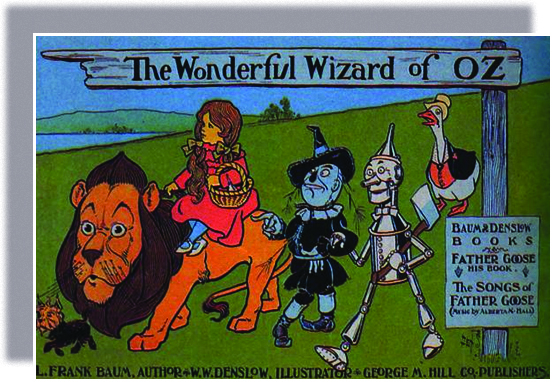

<cnx-pi data-type="cnx.flag.introduction"> class="introduction" </cnx-pi>

* Political Corruption in Postbellum America
* Key Political Issues: Patronage, Tariffs, and Gold
* Farmers Revolt in the Populist Era
* Social and Labor Unrest in the 1890s

<cnx-pi data-type="cnx.eoc">class="summary" title="Summary"</cnx-pi>

<cnx-pi data-type="cnx.eoc">class="review-questions" title="Review Questions"</cnx-pi>

<cnx-pi data-type="cnx.eoc">class="critical-thinking" title="Critical Thinking Questions"</cnx-pi>

<cnx-pi data-type="cnx.eoc">class="references" title="References"</cnx-pi>

 {: #Figure_20_00_WizardOz}

L. Frank Baum was a journalist who rose to prominence at the end of the nineteenth century. Baum\'s most famous story, *The Wizard of Oz* ([\[link\]](#Figure_20_00_WizardOz)), was published in 1900, but “Oz” first came into being years earlier, when he told a story to a group of schoolchildren visiting his newspaper office in South Dakota. He made up a tale of a wonderful land, and, searching for a name, he allegedly glanced down at his file cabinet, where the bottom drawer was labeled “O-Z.” Thus was born the world of Oz, where a girl from struggling Kansas hoped to get help from a “wonderful wizard” who proved to be a fraud. Since then, many have speculated that the story reflected Baum\'s political sympathies for the Populist Party, which galvanized midwestern and southern farmers\' demands for federal reform. Whether he intended the story to act as an allegory for the plight of farmers and workers in late nineteenth-century America, or whether he simply wanted to write an “American fairy tale” set in the heartland, Populists looked for answers much like Dorothy did. And the government in Washington proved to be meek rather than magical.

