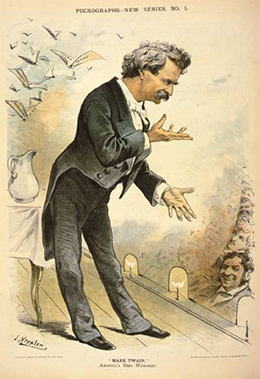
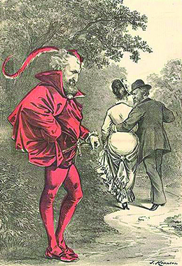

By the end of this section, you will be able to:
* Discuss the national political scene during the Gilded Age
* Analyze why many critics considered the Gilded Age a period of ineffective national leadership

 ![A timeline shows important events of the era. In 1873, Mark Twain and Charles Dudley Warner publish The Gilded Age; an illustration from The Gilded Age is shown. In 1877, the Compromise of 1877 results in Rutherford B. Hayes&#x2019;s presidency; Hayes&#x2019;s campaign poster is shown. In 1881, Charles Guiteau assassinates President James Garfield; an illustration of Garfield&#x2019;s assassination is shown. In 1883, Congress passes the Pendleton Civil Service Act. In 1891, the Populist Party emerges out of the Farmers&#x2019; Alliance movement; a gathering of People&#x2019;s Party members at their nominating convention is shown. In 1894, Coxey&#x2019;s Army marches on Washington, and the Pullman Strike paralyzes railroad traffic; a photograph of Coxey&#x2019;s Army is shown. In 1896, William McKinley defeats William Jennings Bryan for president.](../resources/CNX_History_20_01_Timeline.jpg){: #Figure_20_01_Timeline}

The challenges Americans faced in the post-Civil War era extended far beyond the issue of Reconstruction and the challenge of an economy without slavery. Political and social repair of the nation was paramount, as was the correlative question of race relations in the wake of slavery. In addition, farmers faced the task of cultivating arid western soils and selling crops in an increasingly global commodities market, while workers in urban industries suffered long hours and hazardous conditions at stagnant wages.

Farmers, who still composed the largest percentage of the U.S. population, faced mounting debts as agricultural prices spiraled downward. These lower prices were due in large part to the cultivation of more acreage using more productive farming tools and machinery, global market competition, as well as price manipulation by commodity traders, exorbitant railroad freight rates, and costly loans upon which farmers depended. For many, their hard work resulted merely in a continuing decline in prices and even greater debt. These farmers, and others who sought leaders to heal the wounds left from the Civil War, organized in different states, and eventually into a national third-party challenge, only to find that, with the end of Reconstruction, federal political power was stuck in a permanent partisan stalemate, and corruption was widespread at both the state and federal levels.

As the **Gilded Age**{: data-type="term"} unfolded, presidents had very little power, due in large part to highly contested elections in which relative popular majorities were razor-thin. Two presidents won the Electoral College without a popular majority. Further undermining their efficacy was a Congress comprising mostly politicians operating on the principle of political patronage. Eventually, frustrated by the lack of leadership in Washington, some Americans began to develop their own solutions, including the establishment of new political parties and organizations to directly address the problems they faced. Out of the frustration wrought by war and presidential political impotence, as well as an overwhelming pace of industrial change, farmers and workers formed a new grassroots reform movement that, at the end of the century, was eclipsed by an even larger, mostly middle-class, Progressive movement. These reform efforts did bring about change—but not without a fight.

# THE GILDED AGE

Mark Twain coined the phrase “Gilded Age” in a book he co-authored with Charles Dudley Warner in 1873, *The Gilded Age: A Tale of Today*. The book satirized the corruption of post-Civil War society and politics. Indeed, popular excitement over national growth and industrialization only thinly glossed over the stark economic inequalities and various degrees of corruption of the era ([\[link\]](#Figure_20_01_GildedAge)). Politicians of the time largely catered to business interests in exchange for political support and wealth. Many participated in graft and bribery, often justifying their actions with the excuse that corruption was too widespread for a successful politician to resist. The machine politics of the cities, specifically Tammany Hall in New York, illustrate the kind of corrupt, but effective, local and national politics that dominated the era.

{: #Figure_20_01_GildedAge}

Nationally, between 1872 and 1896, the lack of clear popular mandates made presidents reluctant to venture beyond the interests of their traditional supporters. As a result, for nearly a quarter of a century, presidents had a weak hold on power, and legislators were reluctant to tie their political agendas to such weak leaders. On the contrary, weakened presidents were more susceptible to support various legislators’ and lobbyists’ agendas, as they owed tremendous favors to their political parties, as well as to key financial contributors, who helped them garner just enough votes to squeak into office through the Electoral College. As a result of this relationship, the rare pieces of legislation passed were largely responses to the desires of businessmen and industrialists whose support helped build politicians’ careers.

What was the result of this political malaise? Not surprisingly, almost nothing was accomplished on the federal level. However, problems associated with the tremendous economic growth during this time continued to mount. More Americans were moving to urban centers, which were unable to accommodate the massive numbers of working poor. Tenement houses with inadequate sanitation led to widespread illness. In rural parts of the country, people fared no better. Farmers were unable to cope with the challenges of low prices for their crops and exorbitant costs for everyday goods. All around the country, Americans in need of solutions turned further away from the federal government for help, leading to the rise of fractured and corrupt political groups.

Mark Twain and the Gilded Age

Mark Twain ([\[link\]](#Figure_20_01_Twain)) wrote *The Gilded Age: A Tale of Today* with his neighbor, Charles Dudley Warner, as a satire about the corrupt politics and lust for power that he felt characterized American society at the time. The book, the only novel Twain ever co-authored, tells of the characters’ desire to sell their land to the federal government and become rich. It takes aim at both the government in Washington and those Americans, in the South and elsewhere, whose lust for money and status among the newly rich in the nation’s capital leads them to corrupt and foolish choices.

{: #Figure_20_01_Twain}

In the following conversation from Chapter Fifty-One of the book, Colonel Sellers instructs young Washington Hawkins on the routine practices of Congress:

\> “Now let’s figure up a little on, the preliminaries. I think Congress always tries to do as near right as it can, according to its lights. A man can’t ask any fairer than that. The first preliminary it always starts out on, is to clean itself, so to speak. It will arraign two or three dozen of its members, or maybe four or five dozen, for taking bribes to vote for this and that and the other bill last winter.”
> * * *
> {: data-type="newline"}
> 
> “It goes up into the dozens, does it?”
> * * *
> {: data-type="newline"}
> 
> “Well, yes; in a free country likes ours, where any man can run for Congress and anybody can vote for him, you can’t expect immortal purity all the time—it ain’t in nature. Sixty or eighty or a hundred and fifty people are bound to get in who are not angels in disguise, as young Hicks the correspondent says; but still it is a very good average; very good indeed. . . . Well, after they have finished the bribery cases, they will take up cases of members who have bought their seats with money. That will take another four weeks.”
> * * *
> {: data-type="newline"}
> 
> “Very good; go on. You have accounted for two-thirds of the session.”
> * * *
> {: data-type="newline"}
> 
> “Next they will try each other for various smaller irregularities, like the sale of appointments to West Point cadetships, and that sort of thing— . . . ”
> * * *
> {: data-type="newline"}
> 
> “How long does it take to disinfect itself of these minor impurities?”
> * * *
> {: data-type="newline"}
> 
> “Well, about two weeks, generally.”
> * * *
> {: data-type="newline"}
> 
> “So Congress always lies helpless in quarantine ten weeks of a session. That’s encouraging.”

The book was a success, in part because it amused people even as it excoriated the politics of the day. For this humor, as well as its astute analysis, Twain and Warner’s book still offers entertainment and insight today.

  
Visit the [PBS Scrap Book][1] for information on Mark Twain’s life and marriage at the time he wrote *The Gilded Age: A Tale of Today*.

# THE ELECTION OF 1876 SETS THE TONE

In many ways, the presidential election of 1876 foreshadowed the politics of the era, in that it resulted in one of the most controversial results in all of presidential history. The country was in the middle of the economic downturn caused by the Panic of 1873, a downturn that would ultimately last until 1879, all but assuring that Republican incumbent Ulysses S. Grant would not be reelected. Instead, the Republican Party nominated a three-time governor from Ohio, Rutherford B. Hayes. Hayes was a popular candidate who advocated for both “hard money”—an economy based upon gold currency transactions—to protect against inflationary pressures and **civil service**{: data-type="term"} reform, that is, recruitment based upon merit and qualifications, which was to replace the practice of handing out government jobs as “spoils.” Most importantly, he had no significant political scandals in his past, unlike his predecessor Grant, who suffered through the **Crédit Mobilier of America scandal**{: data-type="term" .no-emphasis}. In this most notorious example of Gilded Age corruption, several congressmen accepted cash and stock bribes in return for appropriating inflated federal funds for the construction of the transcontinental railroad.

The Democrats likewise sought a candidate who could champion reform against growing political corruption. They found their man in Samuel J. Tilden, governor of New York and a self-made millionaire, who had made a successful political career fighting corruption in New York City, including spearheading the prosecution against Tammany Hall Boss William Tweed, who was later jailed. Both parties tapped into the popular mood of the day, each claiming to champion reform and promising an end to the corruption that had become rampant in Washington ([\[link\]](#Figure_20_01_CampaignAB)). Likewise, both parties promised an end to post-Civil War Reconstruction.

 ![Two campaign posters are shown. Poster (a) contains illustrations of Rutherford B. Hayes and William A. Wheeler, labeled &#x201C;Gov. Rutherford B. Hayes/For President&#x201D; and &#x201C;Hon. W.M.A. Wheeler/For Vice President.&#x201D; Above them, an eagle bears a flag and the label &#x201C;Liberty and Union.&#x201D; Poster (b) is headed &#x201C;The Champions of the People&#x2019;s Rights. Economy, Honesty, and Reform. Prosperity &amp; Happiness for Our People.&#x201D; Below, two illustrations are labeled &#x201C;Samuel J. Tilden/Democratic Candidate for President&#x201D; and &#x201C;Thomas A. Hendricks/Democratic Candidate for Vice-President.&#x201D; The candidates&#x2019; portraits are surrounded by illustrations of three gowned women, the third bearing an American flag, and lush greenery.](../resources/CNX_History_20_01_CampaignAB.jpg "These campaign posters for Rutherford B. Hayes (a) and Samuel Tilden (b) underscore the tactics of each party, which remained largely unchanged, regardless of the candidates. The Republican placard highlights the party&#x2019;s role in preserving &#x201C;liberty and union&#x201D; in the wake of the Civil War, hoping to tap into the northern voters&#x2019; pride in victory over secession. The Democratic poster addresses the economic turmoil and corruption of the day, specifically that of the Grant administration, promising &#x201C;honesty, reform, and prosperity&#x201D; for all."){: #Figure_20_01_CampaignAB}

The campaign was a typical one for the era: Democrats shone a spotlight on earlier Republican scandals, such as the Crédit Mobilier affair, and Republicans relied upon the **bloody shirt campaign**{: data-type="term"}, reminding the nation of the terrible human toll of the war against southern confederates who now reappeared in national politics under the mantle of the Democratic Party. President Grant previously had great success with the “bloody shirt” strategy in the 1868 election, when Republican supporters attacked Democratic candidate Horatio Seymour for his sympathy with New York City draft rioters during the war. In 1876, true to the campaign style of the day, neither Tilden nor Hayes actively campaigned for office, instead relying upon supporters and other groups to promote their causes.

Fearing a significant African American and white Republican voter turnout in the South, particularly in the wake of the Civil Rights Act of 1875, which further empowered African Americans with protection in terms of public accommodations, Democrats relied upon white supremacist terror organizations to intimidate blacks and Republicans, including physically assaulting many while they attempted to vote. The Redshirts, based in Mississippi and the Carolinas, and the White League in Louisiana, relied upon intimidation tactics similar to the Ku Klux Klan but operated in a more open and organized fashion with the sole goal of restoring Democrats to political predominance in the South. In several instances, Redshirts would attack freedmen who attempted to vote, whipping them openly in the streets while simultaneously hosting barbecues to attract Democratic voters to the polls. Women throughout South Carolina began to sew red flannel shirts for the men to wear as a sign of their political views; women themselves began wearing red ribbons in their hair and bows about their waists.

The result of the presidential election, ultimately, was close. Tilden won the popular vote by nearly 300,000 votes; however, he had only 184 electoral votes, with 185 needed to proclaim formal victory. Three states, Florida, Louisiana, and South Carolina, were in dispute due to widespread charges of voter fraud and miscounting. Questions regarding the validity of one of the three electors in Oregon cast further doubt on the final vote; however, that state subsequently presented evidence to Congress confirming all three electoral votes for Hayes.

As a result of the disputed election, the House of Representatives established a special electoral commission to determine which candidate won the challenged electoral votes of these three states. In what later became known as the Compromise of 1877, Republican Party leaders offered southern Democrats an enticing deal. The offer was that if the commission found in favor of a Hayes victory, Hayes would order the withdrawal of the remaining U.S. troops from those three southern states, thus allowing the collapse of the radical Reconstruction governments of the immediate post-Civil War era. This move would permit southern Democrats to end federal intervention and control their own states’ fates in the wake of the end of slavery ([\[link\]](#Figure_20_01_Compromise)).

 {: #Figure_20_01_Compromise}

After weeks of deliberation, the electoral commission voted eight to seven along straight party lines, declaring Hayes the victor in each of the three disputed states. As a result, Hayes defeated Tilden in the electoral vote by a count of 185–184 and became the next president. By April of that year, radical Reconstruction ended as promised, with the removal of federal troops from the final two Reconstruction states, South Carolina and Louisiana. Within a year, Redeemers—largely Southern Democrats—had regained control of the political and social fabric of the South.

Although unpopular among the voting electorate, especially among African Americans who referred to it as “The Great Betrayal,” the compromise exposed the willingness of the two major political parties to avoid a “stand-off” via a southern Democrat filibuster, which would have greatly prolonged the final decision regarding the election. Democrats were largely satisfied to end Reconstruction and maintain “home rule” in the South in exchange for control over the White House. Likewise, most realized that Hayes would likely be a one-term president at best and prove to be as ineffectual as his pre-Civil War predecessors.

Perhaps most surprising was the lack of even greater public outrage over such a transparent compromise, indicative of the little that Americans expected of their national government. In an era where voter turnout remained relatively high, the two major political parties remained largely indistinguishable in their agendas as well as their propensity for questionable tactics and backroom deals. Likewise, a growing belief in laissez-faire principles as opposed to reforms and government intervention (which many Americans believed contributed to the outbreak of the Civil War) led even more Americans to accept the nature of an inactive federal government ([\[link\]](#Figure_20_01_Mephisto)).

 {: #Figure_20_01_Mephisto}

# Section Summary

In the years following the Civil War, American politics were disjointed, corrupt, and, at the federal level, largely ineffective in terms of addressing the challenges that Americans faced. Local and regional politics, and the bosses who ran the political machines, dominated through systematic graft and bribery. Americans around the country recognized that solutions to the mounting problems they faced would not come from Washington, DC, but from their local political leaders. Thus, the cycle of federal ineffectiveness and machine politics continued through the remainder of the century relatively unabated.

Meanwhile, in the Compromise of 1877, an electoral commission declared Rutherford B. Hayes the winner of the contested presidential election in exchange for the withdrawal of federal troops from South Carolina, Louisiana, and Florida. As a result, Southern Democrats were able to reestablish control over their home governments, which would have a tremendous impact on the direction of southern politics and society in the decades to come.

# Review Questions

Mark Twain’s *Gilded Age* is a reference to \_\_\_\_\_\_\_\_.

1.  conditions in the South in the pre-Civil War era
2.  the corrupt politics of the post-Civil War era
3.  the populist movement
4.  the Republican Party
{: data-number-style="upper-alpha"}

B

How did the Great Compromise of 1877 influence the election?

1.  It allowed a bilateral government agreement.
2.  It gave new power to northern Republicans.
3.  It encouraged southern states to support Hayes.
4.  It gave the federal government new powers.
{: data-number-style="upper-alpha"}

C

What accounted for the relative weakness of the federal government during this era?

The contested elections of the Gilded Age, in which margins were slim and two presidents were elected without winning the popular vote, meant that incumbent presidents often had only a weak hold on their power and were able to achieve little on the federal level. Some Americans began to establish new political parties and organizations to address their concerns, undermining the federal government further. Meanwhile, despite the widespread corruption that kept them running, urban political machines continued to achieve results for their constituents and maintain political strongholds on many cities.

[1]: http://openstaxcollege.org/l/gage
