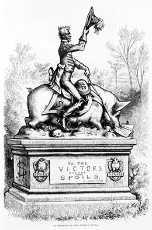
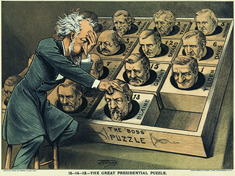
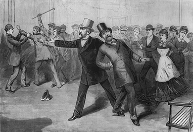

By the end of this section, you will be able to:
* Explain the difference between the spoils system and civil service, and discuss the importance of this issue in the period from 1872 to 1896
* Recognize the ways in which the issue of tariffs impacted different sectors of the economy in late nineteenth-century America
* Explain why Americans were split on the issue of a national gold standard versus free coinage of silver
* Explain why political patronage was a key issue for political parties in the late nineteenth century

Although Hayes’ questionable ascendancy to the presidency did not create political corruption in the nation’s capital, it did set the stage for politically motivated agendas and widespread inefficiency in the White House for the next twenty-four years. Weak president after weak president took office, and, as mentioned above, not one incumbent was reelected. The populace, it seemed, preferred the devil they *didn’t* know to the one they did. Once elected, presidents had barely enough power to repay the political favors they owed to the individuals who ensured their narrow victories in cities and regions around the country. Their four years in office were spent repaying favors and managing the powerful relationships that put them in the White House. Everyday Americans were largely left on their own. Among the few political issues that presidents routinely addressed during this era were ones of patronage, tariffs, and the nation’s monetary system.

### PATRONAGE: THE SPOILS SYSTEM VS CIVIL SERVICE

At the heart of each president’s administration was the protection of the spoils system, that is, the power of the president to practice widespread political patronage. Patronage, in this case, took the form of the president naming his friends and supporters to various political posts. Given the close calls in presidential elections during the era, the maintenance of political machinery and repaying favors with patronage was important to all presidents, regardless of party affiliation. This had been the case since the advent of a two-party political system and universal male suffrage in the Jacksonian era. For example, upon assuming office in March 1829, President Jackson immediately swept employees from over nine hundred political offices, amounting to 10 percent of all federal appointments. Among the hardest-hit was the U.S. Postal Service, which saw Jackson appoint his supporters and closest friends to over four hundred positions in the service ([\[link\]](#Figure_20_02_SpoilsSyst)).

 {: #Figure_20_02_SpoilsSyst}

As can be seen in the table below ([\[link\]](#Table_20_01_PresVote)), every single president elected from 1876 through 1892 won despite receiving less than 50 percent of the popular vote. This established a repetitive cycle of relatively weak presidents who owed many political favors, which could be repaid through one prerogative power: patronage. As a result, the spoils system allowed those with political influence to ascend to powerful positions within the government, regardless of their level of experience or skill, thus compounding both the inefficiency of government as well as enhancing the opportunities for corruption.

<table id="Table_20_01_PresVote" summary="A table containing five columns and nineteen rows shows the popular and electoral votes for various presidential candidates from 1876-1896. From left to right, the first row&#x2019;s five cells contain the following labels: Year; Candidates; Popular Vote; Percentage; and Electoral Vote. The data in rows two through nineteen corresponds with these five labels, respectively. From left to right, row two reads: 1876; Rutherford B. Hayes; 4,034,132; 47.9%; and 185. Row three, which also covers 1876, reads: Samuel Tilden; 4,286,808; 50.9%; and 184. Row four, which also covers 1876, reads: Others; 97,709; 1.2%; and 0. Row five reads: 1880; James Garfield; 4,453,337; 48.3%; and 214. Row six, which also covers 1880, reads: Winfield Hancock; 4,444,267; 48.2%; and 155. Row seven, which also covers 1880, reads: Others; 319,806; 3.5%; and 0. Row eight reads: 1884; Grover Cleveland; 4,914,482; 48.8%; and 219. Row nine, which also covers 1884, reads: James Blaine; 4,856,903; 48.3%; and 182. Row ten, which also covers 1884, reads: Others; 288,660; 2.9%; and 0. Row eleven reads: 1888; Benjamin Harrison; 5,443,663; 47.8%; and 233. Row twelve, which also covers 1888, reads: Grover Cleveland; 5,538,163; 48.6%; and 168. Row thirteen, which also covers 1888, reads: Others; 407,050; 3.6%; and 0. Row fourteen reads: 1892; Grover Cleveland; 5,553,898; 46.0%; and 277. Row fifteen, which also covers 1892, reads: Benjamin Harrison; 5,190,799; 43.0%; and 145. Row sixteen, which also covers 1892, reads: Others; 1,323,330; 11.0%; and 22. Row seventeen reads: 1896; William McKinley; 7,112,138; 51.0%; and 271. Row eighteen, which also covers 1896, reads: William Jennings Bryan; 6,510,807; 46.7%; and 176. Row nineteen, which also covers 1896, reads: Others; 315,729; 2.3%; and 0."><caption>U.S. Presidential Election Results (1876–1896)</caption><thead>
<tr>
<th data-align="center">Year</th>
<th data-align="center">Candidates</th>
<th data-align="center">Popular Vote</th>
<th data-align="center">Percentage</th>
<th data-align="center">Electoral Vote</th>
</tr>
</thead><tbody>
<tr>
<td data-align="center">1876</td>
<td data-align="center">Rutherford B. Hayes</td>
<td data-align="center">4,034,132</td>
<td data-align="center">47.9%</td>
<td data-align="center">185</td>
</tr>
<tr>
<td />
<td data-align="center">Samuel Tilden</td>
<td data-align="center">4,286,808</td>
<td data-align="center">50.9%</td>
<td data-align="center">184</td>
</tr>
<tr>
<td />
<td data-align="center">Others</td>
<td data-align="center">97,709</td>
<td data-align="center">1.2%</td>
<td data-align="center">0</td>
</tr>
<tr>
<td data-align="center">1880</td>
<td data-align="center">James Garfield</td>
<td data-align="center">4,453,337</td>
<td data-align="center">48.3%</td>
<td data-align="center">214</td>
</tr>
<tr>
<td />
<td data-align="center">Winfield Hancock</td>
<td data-align="center">4,444,267</td>
<td data-align="center">48.2%</td>
<td data-align="center">155</td>
</tr>
<tr>
<td />
<td data-align="center">Others</td>
<td data-align="center">319,806</td>
<td data-align="center">3.5%</td>
<td data-align="center">0</td>
</tr>
<tr>
<td data-align="center">1884</td>
<td data-align="center">Grover Cleveland</td>
<td data-align="center">4,914,482</td>
<td data-align="center">48.8%</td>
<td data-align="center">219</td>
</tr>
<tr>
<td />
<td data-align="center">James Blaine</td>
<td data-align="center">4,856,903</td>
<td data-align="center">48.3%</td>
<td data-align="center">182</td>
</tr>
<tr>
<td />
<td data-align="center">Others</td>
<td data-align="center">288,660</td>
<td data-align="center">2.9%</td>
<td data-align="center">0</td>
</tr>
<tr>
<td data-align="center">1888</td>
<td data-align="center">Benjamin Harrison</td>
<td data-align="center">5,443,663</td>
<td data-align="center">47.8%</td>
<td data-align="center">233</td>
</tr>
<tr>
<td />
<td data-align="center">Grover Cleveland</td>
<td data-align="center">5,538,163</td>
<td data-align="center">48.6%</td>
<td data-align="center">168</td>
</tr>
<tr>
<td />
<td data-align="center">Others</td>
<td data-align="center">407,050</td>
<td data-align="center">3.6%</td>
<td data-align="center">0</td>
</tr>
<tr>
<td data-align="center">1892</td>
<td data-align="center">Grover Cleveland</td>
<td data-align="center">5,553,898</td>
<td data-align="center">46.0%</td>
<td data-align="center">277</td>
</tr>
<tr>
<td />
<td data-align="center">Benjamin Harrison</td>
<td data-align="center">5,190,799</td>
<td data-align="center">43.0%</td>
<td data-align="center">145</td>
</tr>
<tr>
<td />
<td data-align="center">Others</td>
<td data-align="center">1,323,330</td>
<td data-align="center">11.0%</td>
<td data-align="center">22</td>
</tr>
<tr>
<td data-align="center">1896</td>
<td data-align="center">William McKinley</td>
<td data-align="center">7,112,138</td>
<td data-align="center">51.0%</td>
<td data-align="center">271</td>
</tr>
<tr>
<td />
<td data-align="center">William Jennings Bryan</td>
<td data-align="center">6,510,807</td>
<td data-align="center">46.7%</td>
<td data-align="center">176</td>
</tr>
<tr>
<td />
<td data-align="center">Others</td>
<td data-align="center">315,729</td>
<td data-align="center">2.3%</td>
<td data-align="center">0</td>
</tr>
</tbody></table>

At the same time, a movement emerged in support of reforming the practice of political appointments. As early as 1872, civil service reformers gathered to create the Liberal Republican Party in an effort to unseat incumbent President Grant. Led by several midwestern Republican leaders and newspaper editors, this party provided the impetus for other reform-minded Republicans to break free from the party and actually join the Democratic Party ranks. With newspaper editor Horace Greeley as their candidate, the party called for a “thorough reform of the civil service as one the most pressing necessities” facing the nation. Although easily defeated in the election that followed, the work of the Liberal Republican Party set the stage for an even stronger push for patronage reform.

Clearly owing favors to his Republican handlers for his surprise compromise victory by the slimmest of margins in 1876, President Hayes was ill-prepared to heed those cries for reform, despite his own stated preference for a new civil service system. In fact, he accomplished little during his four years in office other than granting favors, as dictated by Republic Party handlers. Two powerful Republican leaders attempted to control the president. The first was Roscoe Conkling, Republican senator from New York and leader of the **Stalwarts**{: data-type="term"}, a group that strongly supported continuation of the current spoils system ([\[link\]](#Figure_20_02_Conkling)). Long supporting former President Grant, Conkling had no sympathy for some of Hayes’ early appeals for civil service reform. The other was James G. Blaine, Republican senator from Maine and leader of the **Half-Breeds**{: data-type="term"}. The Half-Breeds, who received their derogatory nickname from Stalwart supporters who considered Blaine’s group to be only “half-Republican,” advocated for some measure of civil service reform.

 {: #Figure_20_02_Conkling}

With his efforts towards ensuring African American civil rights stymied by a Democratic Congress, and his decision to halt the coinage of silver merely adding to the pressures of the economic **Panic of 1873**{: data-type="term" .no-emphasis}, Hayes failed to achieve any significant legislation during his presidency. However, he did make a few overtures towards civil service reform. First, he adopted a new patronage rule, which held that a person appointed to an office could be dismissed only in the interest of efficient government operation but not for overtly political reasons. Second, he declared that party leaders could have no official say in political appointments, although Conkling sought to continue his influence. Finally, he decided that government appointees were ineligible to manage campaign elections. Although not sweeping reforms, these were steps in a civil service direction.

Hayes’ first target in his meager reform effort was to remove Chester A. Arthur, a strong Conkling man, from his post as head of the New York City Customs House. Arthur had been notorious for using his post as customs collector to gain political favors for Conkling. When Hayes forcibly removed him from the position, even Half-Breeds questioned the wisdom of the move and began to distance themselves from Hayes. The loss of his meager public support due to the Compromise of 1877 and the declining Congressional faction together sealed Hayes fate and made his reelection impossible.

### AN ASSASSIN’S BULLET SETS THE STAGE FOR CIVIL SERVICE REFORM

In the wake of President Hayes’ failure, Republicans began to battle over a successor for the 1880 presidential election. Initially, Stalwarts favored Grant’s return to the White House, while Half-Breeds promoted their leader, James Blaine. Following an expected convention deadlock, both factions agreed to a compromise presidential candidate, Senator James A. Garfield of Ohio, with Chester Arthur as his vice-presidential running mate. The Democratic Party turned to Winfield Scott Hancock, a former Union commander who was a hero of the Battle of Gettysburg, as their candidate.

Garfield won a narrow victory over Hancock by forty thousand votes, although he still did not win a majority of the popular vote. But less than four months into his presidency, events pushed civil service reform on the fast track. On July 2, 1881, Charles Guiteau shot and killed Garfield ([\[link\]](#Figure_20_02_Garfield)), allegedly uttering at the time, “I am a Stalwart of Stalwarts!” Guiteau himself had wanted to be rewarded for his political support—he had written a speech for the Garfield campaign—with an ambassadorship to France. His actions at the time were largely blamed on the spoils system, prompting more urgent cries for change.

 {: #Figure_20_02_Garfield}

The Assassination of a President

<q>I executed* * *
{: data-type="newline"}

 the Divine command.* * *
{: data-type="newline"}

 And Garfield did remove,* * *
{: data-type="newline"}

 To save my party,* * *
{: data-type="newline"}

 and my country* * *
{: data-type="newline"}

 From the bitter fate of War.* * *
{: data-type="newline"}

 —Charles Guiteau</q>

Charles Guiteau was a lawyer and supporter of the Republican Party, although not particularly well known in either area. But he gave a few speeches, to modest crowds, in support of the Republican nominee James Garfield, and ultimately deluded himself that his speeches influenced the country enough to cause Garfield’s victory. After the election, Guiteau immediately began pressuring the new president, requesting a post as ambassador. When his queries went unanswered, Guiteau, out of money and angry that his supposed help had been ignored, planned to kill the president.

He spent significant time planning his attack and considered weapons as diverse as dynamite and a stiletto before deciding on a gun, stating, “I wanted it done in an American manner.” He followed the president around the Capitol and let several opportunities pass, unwilling to kill Garfield in front of his wife or son. Frustrated with himself, Guiteau recommitted to the plan and wrote a letter to the White House, explaining how this act would “unite the Republican Party and save the Republic.”

Guiteau shot the president from behind and continued to shoot until police grabbed him and hauled him away. He went to jail, and, the following November after Garfield had died, he stood trial for murder. His poor mental health, which had been evident for some time, led to eccentric courtroom behavior that the newspapers eagerly reported and the public loved. He defended his case with a poem that used religious imagery and suggested that God had ordered him to commit the murder. He defended himself in court by saying, “The doctors killed Garfield, I just shot him.” While this in fact was true, it did not save him. Guiteau was convicted and hanged in the summer of 1882.

  
Take a look at [America’s Story][1] from the Library of Congress, which highlights the fact that Guiteau in fact did not kill the president, but rather infection from his medical treatment did.

Surprising both his party and the Democrats when he assumed the office of president, Chester Arthur immediately distanced himself from the Stalwarts. Although previously a loyal party man, Arthur understood that he owed his current position to no particular faction or favor. He was in the unique position to usher in a wave a civil service reform unlike any other political candidate, and he chose to do just that. In 1883, he signed into law the Pendleton Civil Service Act, the first significant piece of antipatronage legislation. This law created the Civil Service Commission, which listed all government patronage jobs and then set aside approximately 10 percent of the list as appointments to be determined through a competitive civil service examination process. Furthermore, to prevent future presidents from undoing this reform, the law declared that future presidents could enlarge the list but could never shrink it by moving a civil service job back into the patronage column.

### TARIFFS IN THE GILDED AGE

In addition to civil service, President Arthur also carried the reformist spirit into the realm of tariffs, or taxes on international imports to the United States. Tariffs had long been a controversial topic in the United States, especially as the nineteenth century came to a close. Legislators appeared to be bending to the will of big businessmen who desired higher tariffs in order to force Americans to buy their domestically produced goods rather than higher-priced imports. Lower tariffs, on the other hand, would reduce prices and lower the average American’s cost of living, and were therefore favored by many working-class families and farmers, to the extent that any of them fully understood such economic forces beyond the prices they paid at stores. Out of growing concern for the latter group, Arthur created the U.S. Tariff Commission in 1882 to investigate the propriety of increasingly high tariffs. Despite his concern, along with the commission’s recommendation for a 25 percent rollback in most tariffs, the most Arthur could accomplish was the “Mongrel Tariff” of 1883, which lowered tariff rates by barely 5 percent.

Such bold attempts at reform further convinced Republican Party leaders, as the 1884 election approached, that Arthur was not their best option to continue in the White House. Arthur quickly found himself a man without a party. As the 1884 election neared, the Republican Party again searched their ranks for a candidate who could restore some semblance of the spoils system while maintaining a reformist image. Unable to find such a man, the predominant Half-Breeds again turned to their own leader, Senator Blaine. However, when news of his many personal corrupt bargains began to surface, a significant portion of the party chose to break from the traditional Stalwarts-versus-Half-Breeds debate and form their own faction, the **Mugwumps**{: data-type="term"}, a name taken from the Algonquin phrase for “great chief.”

Anxious to capitalize on the disarray within the Republican Party, as well as to return to the White House for the first time in nearly thirty years, the Democratic Party chose to court the Mugwump vote by nominating Grover Cleveland, the reform governor from New York who had built a reputation by attacking machine politics in New York City. Despite several personal charges against him for having fathered a child out of wedlock, Cleveland managed to hold on for a close victory with a margin of less than thirty thousand votes.

Cleveland’s record on civil service reform added little to the initial blows struck by President Arthur. After electing the first Democratic president since 1856, the Democrats could actually make great use of the spoils system. Cleveland was, however, a notable reform president in terms of business regulation and tariffs. When the U.S. Supreme Court ruled in 1886 that individual states could not regulate interstate transportation, Cleveland urged Congress to pass the Interstate Commerce Act of 1887. Among several other powers, this law created the Interstate Commerce Commission (ICC) to oversee railroad prices and ensure that they remained reasonable to all customers. This was an important shift. In the past, railroads had granted special rebates to big businesses, such as John D. Rockefeller’s Standard Oil, while charging small farmers with little economic muscle exorbitant rates. Although the act eventually provided for real regulation of the railroad industry, initial progress was slow due to the lack of enforcement power held by the ICC. Despite its early efforts to regulate railroad rates, the U.S. Supreme Court undermined the commission in *Interstate Commerce Commission v. Cincinnati, New Orleans, and Texas Pacific Railway Cos.* in 1897. Rate regulations were limits on profits that, in the opinion of a majority of the justices, violated the Fourteenth Amendment protection against depriving persons of their property without due process of the law.

As for tariff reform, Cleveland agreed with Arthur’s position that tariffs remained far too high and were clearly designed to protect big domestic industries at the expense of average consumers who could benefit from international competition. While the general public applauded Cleveland’s efforts at both civil service and tariff reform, influential businessmen and industrialists remained adamant that the next president must restore the protective tariffs at all costs.

To counter the Democrats’ re-nomination of Cleveland, the Republican Party turned to Benjamin Harrison, grandson of former president William Henry Harrison. Although Cleveland narrowly won the overall popular vote, Harrison rode the influential coattails of several businessmen and party bosses to win the key electoral states of New York and New Jersey, where party officials stressed Harrison’s support for a higher tariff, and thus secure the White House. Not surprisingly, after Harrison’s victory, the United States witnessed a brief return to higher tariffs and a strengthening of the spoils system. In fact, the McKinley Tariff raised some rates as much as 50 percent, which was the highest tariff in American history to date.

Some of Harrison’s policies were intended to offer relief to average Americans struggling with high costs and low wages, but remained largely ineffective. First, the Sherman Anti-Trust Act of 1890 sought to prohibit business monopolies as “conspiracies in restraint of trade,” but it was seldom enforced during the first decade of its existence. Second, the Sherman Silver Purchase Act of the same year required the U.S. Treasury to mint over four million ounces of silver into coins each month to circulate more cash into the economy, raise prices for farm goods, and help farmers pay their way out of debt. But the measure could not undo the previous “hard money” policies that had deflated prices and pulled farmers into well-entrenched cycles of debt. Other measures proposed by Harrison intended to support African Americans, including a Force Bill to protect voters in the South, as well as an Education Bill designed to support public education and improve literacy rates among African Americans, also met with defeat.

### MONETARY POLICIES AND THE ISSUE OF GOLD VS SILVER

Although political corruption, the spoils system, and the question of tariff rates were popular discussions of the day, none were more relevant to working-class Americans and farmers than the issue of the nation’s monetary policy and the ongoing debate of gold versus silver ([\[link\]](#Figure_20_02_Gold)). There had been frequent attempts to establish a bimetallic standard, which in turn would have created inflationary pressures and placed more money into circulation that could have subsequently benefitted farmers. But the government remained committed to the gold standard, including the official demonetizing of silver altogether in 1873. Such a stance greatly benefitted prominent businessmen engaged in foreign trade while forcing more farmers and working-class Americans into greater debt.

 ![A poster shows a happy worker and child on the left, with a factory in the background and the label &#x201C;Bimetalism, 1872.&#x201D; On the right, a poor worker is shown with his wife and child; all appear emaciated and wear tattered clothes. Behind them is a fenced-off factory with a sign reading &#x201C;This Factory is Closed on Account for a Lack of Funds.&#x201D; A label reads &#x201C;Monometalism, 1894.&#x201D; Between the images, a young boy in a suit stands upon a block labeled &#x201C;Silver,&#x201D; with the words &#x201C;Take Your Choice.&#x201D;](../resources/CNX_History_20_02_Gold.jpg "This cartoon illustrates the potential benefits of a bimetal system, but the benefits did not actually extend to big business, which preferred the gold standard and worked to keep it."){: #Figure_20_02_Gold}

As farmers and working-class Americans sought the means by which to pay their bills and other living expenses, especially in the wake of increased tariffs as the century came to a close, many saw adherence to a strict gold standard as their most pressing problem. With limited gold reserves, the money supply remained constrained. At a minimum, a return to a bimetallic policy that would include the production of silver dollars would provide some relief. However, the aforementioned Sherman Silver Purchase Act was largely ineffective to combat the growing debts that many Americans faced. Under the law, the federal government purchased 4.5 million ounces of silver on a monthly basis in order to mint silver dollars. However, many investors exchanged the bank notes with which the government purchased the silver for gold, thus severely depleting the nation’s gold reserve. Fearing the latter, President Grover Cleveland signed the act’s repeal in 1893. This lack of meaningful monetary measures from the federal government would lead one group in particular who required such assistance—American farmers—to attempt to take control over the political process itself.

### Section Summary

All told, from 1872 through 1892, Gilded Age politics were little more than political showmanship. The political issues of the day, including the spoils system versus civil service reform, high tariffs versus low, and business regulation, all influenced politicians more than the country at large. Very few measures offered direct assistance to Americans who continued to struggle with the transformation into an industrial society; the inefficiency of a patronage-driven federal government, combined with a growing laissez-faire attitude among the American public, made the passage of effective legislation difficult. Some of Harrison’s policies, such as the Sherman Anti-Trust Act and the Sherman Silver Purchase Act, aimed to provide relief but remained largely ineffective.

### Review Questions

A Mugwump is \_\_\_\_\_\_\_\_.

1.  a supporter of the spoils system
2.  a liberal Democrat
3.  a former member of the Republican Party
4.  a moderate Stalwart
{: type="A"}

C

Which president made significant steps towards civil service reform?

1.  Chester A. Arthur
2.  Benjamin Harrison
3.  Grover Cleveland
4.  Roscoe Conkling
{: type="A"}

A

Why were U.S. presidents (with few exceptions) so adamant about protecting the spoils system of patronage during the late nineteenth century?

Politics of the day were fiercely fought and won with razor-thin margins. While presidents may have wanted to see the system change, few were in a position to effect such change. They owed their presidencies to the various party leaders and political operatives who had gotten them there, and they were expected to repay the favors with political positions. Any candidate who spoke out firmly against patronage virtually guaranteed that he would not receive the support of local or regional politicians, or machine bosses. Without such support, a candidate’s chances of being elected were virtually nonexistent. Therefore, they continued to work within the system.

### Glossary
{: data-type="glossary-title"}

Half-Breeds
: the group of Republicans led by James G. Blaine, named because they supported some measure of civil service reform and were thus considered to be only “half Republican”
^

Mugwumps
: a portion of the Republican Party that broke away from the Stalwart-versus-Half-Breed debate due to disgust with their candidate’s corruption
^

Stalwarts
: the group of Republicans led by Roscoe Conkling who strongly supported the continuation of the patronage system

[1]: http://openstax.org/l/guiteau
