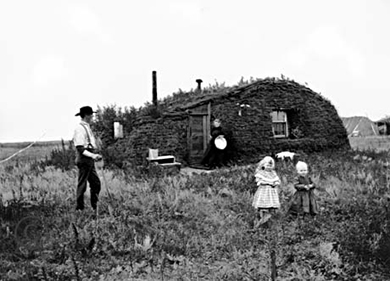
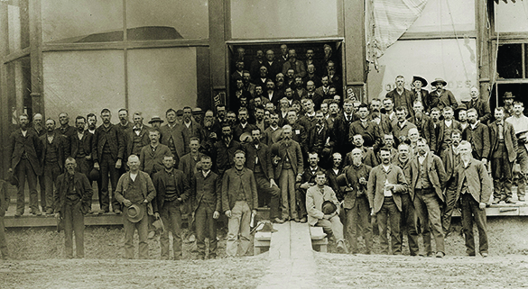

By the end of this section, you will be able to:
* Understand how the economic and political climate of the day promoted the formation of the farmers’ protest movement in the latter half of the nineteenth century
* Explain how the farmers’ revolt moved from protest to politics

The challenges that many American farmers faced in the last quarter of the nineteenth century were significant. They contended with economic hardships born out of rapidly declining farm prices, prohibitively high tariffs on items they needed to purchase, and foreign competition. One of the largest challenges they faced was overproduction, where the glut of their products in the marketplace drove the price lower and lower.

Overproduction of crops occurred in part due to the westward expansion of homestead farms and in part because industrialization led to new farm tools that dramatically increased crop yields. As farmers fell deeper into debt, whether it be to the local stores where they bought supplies or to the railroads that shipped their produce, their response was to increase crop production each year in the hope of earning more money with which to pay back their debt. The more they produced, the lower prices dropped. To a hard-working farmer, the notion that their own overproduction was the greatest contributing factor to their debt was a completely foreign concept ([\[link\]](#Figure_20_03_Farmer)).

 {: #Figure_20_03_Farmer}

In addition to the cycle of overproduction, tariffs were a serious problem for farmers. Rising tariffs on industrial products made purchased items more expensive, yet tariffs were *not* being used to keep farm prices artificially high as well. Therefore, farmers were paying inflated prices but not receiving them. Finally, the issue of gold versus silver as the basis of U.S. currency was a very real problem to many farmers. Farmers needed more money in circulation, whether it was paper or silver, in order to create inflationary pressure. Inflationary pressure would allow farm prices to increase, thus allowing them to earn more money that they could then spend on the higher-priced goods in stores. However, in 1878, federal law set the amount of paper money in circulation, and, as mentioned above, Harrison’s Sherman Silver Act, intended to increase the amount of silver coinage, was too modest to do any real good, especially in light of the unintended consequence of depleting the nation’s gold reserve. In short, farmers had a big stack of bills and wanted a big stack of money—be it paper or silver—to pay them. Neither was forthcoming from a government that cared more about issues of patronage and how to stay in the White House for more than four years at a time.

### FARMERS BEGIN TO ORGANIZE

The initial response by increasingly frustrated and angry farmers was to organize into groups that were similar to early labor unions. Taking note of how the industrial labor movement had unfolded in the last quarter of the century, farmers began to understand that a collective voice could create significant pressure among political leaders and produce substantive change. While farmers had their own challenges, including that of geography and diverse needs among different types of famers, they believed this model to be useful to their cause.

One of the first efforts to organize farmers came in 1867 with Oliver Hudson Kelly’s creation of the Patrons of Husbandry, more popularly known as the **Grange**{: data-type="term"}. In the wake of the Civil War, the Grangers quickly grew to over 1.5 million members in less than a decade ([\[link\]](#Figure_20_03_Granger)). Kelly believed that farmers could best help themselves by creating farmers’ cooperatives in which they could pool resources and obtain better shipping rates, as well as prices on seeds, fertilizer, machinery, and other necessary inputs. These cooperatives, he believed, would let them self-regulate production as well as collectively obtain better rates from railroad companies and other businesses.

 ![A poster shows a farmer at its center, surrounded by trees and idyllic country views. Happy scenes of farm life surround him, including the &#x201C;Farmers Fireside,&#x201D; an image of the &#x201C;Grange in Session,&#x201D; and a &#x201C;Harvest Dance.&#x201D; The bottom panel, headed &#x201C;I Pay for All,&#x201D; contains the words &#x201C;Faith, Hope, Charity, Fidelity&#x201D; and shows an illustration of a ruined cabin, whose barren trees contain signs reading &#x201C;Ignorance&#x201D; and &#x201C;Sloth.&#x201D; The top of the poster reads &#x201C;Gift for the Grangers;&#x201D; beneath the title, three gowned women carry flowers, fruit, grains, and a scythe.](../resources/CNX_History_20_03_Granger.jpg "This print from the early 1870s, with scenes of farm life, was a promotional poster for the Grangers, one of the earliest farmer reform groups."){: #Figure_20_03_Granger}

At the state level, specifically in Wisconsin, Minnesota, Illinois, and Iowa, the Patrons of Husbandry did briefly succeed in urging the passage of Granger Laws, which regulated some railroad rates along with the prices charged by grain elevator operators. The movement also created a political party—the **Greenback Party**{: data-type="term" .no-emphasis}, so named for its support of print currency (or “greenbacks”) not based upon a gold standard—which saw brief success with the election of fifteen congressmen. However, such successes were short-lived and had little impact on the lives of everyday farmers. In the Wabash case of 1886, brought by the Wabash, St. Louis, and Pacific Railroad Company, the U.S. Supreme Court ruled against the State of Illinois for passing Granger Laws controlling railroad rates; the court found such laws to be unconstitutional. Their argument held that states did not have the authority to control interstate commerce. As for the Greenback Party, when only seven delegates appeared at an 1888 national convention of the group, the party faded from existence.

  
Explore [Rural Life in the Late Nineteenth Century][1] to study photographs, firsthand reports, and other information about how farmers lived and struggled at the end of the nineteenth century.

The **Farmers’ Alliance**{: data-type="term"}, a conglomeration of three regional alliances formed in the mid-1880s, took root in the wake of the Grange movement. In 1890, Dr. Charles Macune, who led the Southern Alliance, which was based in Texas and had over 100,000 members by 1886, urged the creation of a national alliance between his organization, the Northwest Alliance, and the Colored Alliance, the largest African American organization in the United States. Led by Tom Watson, the Colored Alliance, which was founded in Texas but quickly spread throughout the Old South, counted over one million members. Although they originally advocated for self-help, African Americans in the group soon understood the benefits of political organization and a unified voice to improve their plight, regardless of race. While racism kept the alliance splintered among the three component branches, they still managed to craft a national agenda that appealed to their large membership. All told, the Farmers’ Alliance brought together over 2.5 million members, 1.5 million white and 1 million black ([\[link\]](#Figure_20_03_Alliance)).

 {: #Figure_20_03_Alliance}

The alliance movement, and the subsequent political party that emerged from it, also featured prominent roles for women. Nearly 250,000 women joined the movement due to their shared interest in the farmers’ worsening situation as well as the promise of being a full partner with political rights within the group, which they saw as an important step towards advocacy for women’s suffrage on a national level. The ability to vote and stand for office within the organization encouraged many women who sought similar rights on the larger American political scene. Prominent alliance spokeswoman, Mary Elizabeth Lease of Kansas, often spoke of membership in the Farmers’ Alliance as an opportunity to “raise less corn and more hell!”

  
The [Conner Prairie Interactive History Park][2] discusses the role of women in rural America and how it changed throughout the end of the nineteenth century.

The alliance movement had several goals similar to those of the original Grange, including greater regulation of railroad prices and the creation of an inflationary national monetary policy. However, most creative among the solutions promoted by the Farmers’ Alliance was the call for a subtreasury plan. Under this plan, the federal government would store farmers’ crops in government warehouses for a brief period of time, during which the government would provide loans to farmers worth 80 percent of the current crop prices. Thus, farmers would have immediate cash on hand with which to settle debts and purchase goods, while their crops sat in warehouses and farm prices increased due to this control over supply at the market. When market prices rose sufficiently high enough, the farmer could withdraw his crops, sell at the higher price, repay the government loan, and still have profit remaining.

Economists of the day thought the plan had some merit; in fact, a greatly altered version would subsequently be adopted during the Great Depression of the 1930s, in the form of the Agricultural Adjustment Act. However, the federal government never seriously considered the plan, as congressmen questioned the propriety of the government serving as a rural creditor making loans to farmers with no assurance that production controls would result in higher commodity prices. The government’s refusal to act on the proposal left many farmers wondering what it would take to find solutions to their growing indebtedness.

### FROM ORGANIZATION TO POLITICAL PARTY

Angry at the federal government’s continued unwillingness to substantively address the plight of the average farmer, Charles Macune and the Farmers’ Alliance chose to create a political party whose representatives—if elected—could enact real change. Put simply, if the government would not address the problem, then it was time to change those elected to power.

In 1891, the alliance formed the **Populist Party**{: data-type="term"}, or People’s Party, as it was more widely known. Beginning with nonpresidential-year elections, the Populist Party had modest success, particularly in Kansas, Nebraska, and the Dakotas, where they succeeded in electing several state legislators, one governor, and a handful of congressmen. As the 1892 presidential election approached, the Populists chose to model themselves after the Democratic and Republican Parties in the hope that they could shock the country with a “third-party” victory.

At their national convention that summer in Omaha, Nebraska, they wrote the Omaha Platform to more fully explain to all Americans the goals of the new party ([\[link\]](#Figure_20_03_PeoplesPar)). Written by Ignatius Donnelly, the platform statement vilified railroad owners, bankers, and big businessmen as all being part of a widespread conspiracy to control farmers. As for policy changes, the platform called for adoption of the subtreasury plan, government control over railroads, an end to the national bank system, the creation of a federal income tax, the direct election of U.S. senators, and several other measures, all of which aimed at a more proactive federal government that would support the economic and social welfare of all Americans. At the close of the convention, the party nominated James B. Weaver as its presidential candidate.

 {: #Figure_20_03_PeoplesPar}

In a rematch of the 1888 election, the Democrats again nominated Grover Cleveland, while Republicans went with Benjamin Harrison. Despite the presence of a third-party challenger, Cleveland won another close popular vote to become the first U.S. president to be elected to nonconsecutive terms. Although he finished a distant third, Populist candidate Weaver polled a respectable one million votes. Rather than being disappointed, several Populists applauded their showing—especially for a third party with barely two years of national political experience under its belt. They anxiously awaited the 1896 election, believing that if the rest of the country, in particular industrial workers, experienced hardships similar to those that farmers already faced, a powerful alliance among the two groups could carry the Populists to victory.

### Section Summary

Factors such as overproduction and high tariffs left the country’s farmers in increasingly desperate straits, and the federal government’s inability to address their concerns left them disillusioned and worried. Uneven responses from state governments had many farmers seeking an alternative solution to their problems. Taking note of the labor movements growing in industrial cities around the country, farmers began to organize into alliances similar to workers’ unions; these were models of cooperation where larger numbers could offer more bargaining power with major players such as railroads. Ultimately, the alliances were unable to initiate widespread change for their benefit. Still, drawing from the cohesion of purpose, farmers sought to create change from the inside: through politics. They hoped the creation of the Populist Party in 1891 would lead to a president who put the people—and in particular the farmers—first.

### Review Questions

Which of the following was *not* a vehicle for the farmers’ protest?

1.  the Mugwumps
2.  the Grange
3.  the Farmers’ Alliance
4.  the People’s Party
{: type="A"}

A

Which of the following contributed directly to the plight of farmers?

1.  machine politics
2.  labor unions
3.  overproduction
4.  inadequate supply
{: type="A"}

C

What were women’s roles within the Farmer’s Alliance?

Women were able to play key roles in the alliance movement. The alliance provided them with political rights, including the ability to vote and hold office within the organization, which many women hoped would be a positive step in their struggle for national women’s rights and suffrage. In the end, nearly 250,000 women joined the movement.

### Glossary
{: data-type="glossary-title"}

Farmers’ Alliance
: a national conglomeration of different regional farmers’ alliances that joined together in 1890 with the goal of furthering farmers’ concerns in politics
^

Grange
: a farmers’ organization, launched in 1867, which grew to over 1.5 million members in less than a decade
^

Populist Party
: a political party formed in 1890 that sought to represent the rights of primarily farmers but eventually all workers in regional and federal elections
^

subtreasury plan
: a plan that called for storing crops in government warehouses for a brief period of time, during which the federal government would provide loans to farmers worth 80 percent of the current crop prices, releasing the crops for sale when prices rose

[1]: http://openstax.org/l/rurallife
[2]: http://openstax.org/l/ruralwomen
