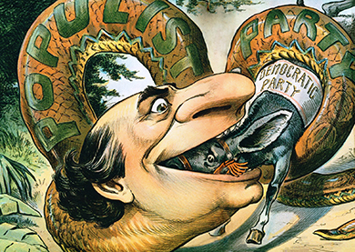

By the end of this section, you will be able to:
* Explain how the Depression of 1893 helped the Populist Party to grow in popularity in the 1890s
* Understand the forces that contributed to the Populist Party’s decline following the 1896 presidential election

Insofar as farmers wanted the rest of the country to share their plight, they got their wish. Soon after Cleveland’s election, the nation catapulted into the worst economic depression in its history to date. As the government continued to fail in its efforts to address the growing problems, more and more Americans sought relief outside of the traditional two-party system. To many industrial workers, the Populist Party began to seem like a viable solution.

### FROM FARMERS’ HARDSHIPS TO A NATIONAL DEPRESSION

The late 1880s and early 1890s saw the American economy slide precipitously. As mentioned above, farmers were already struggling with economic woes, and the rest of the country followed quickly. Following a brief rebound from the speculation-induced Panic of 1873, in which bank investments in railroad bonds spread the nation’s financial resources too thin—a rebound due in large part to the protective tariffs of the 1880s—a greater economic catastrophe hit the nation, as the decade of the 1890s began to unfold.

The causes of the **Depression of 1893**{: data-type="term" .no-emphasis} were manifold, but one major element was the speculation in railroads over the previous decades. The rapid proliferation of railroad lines created a false impression of growth for the economy as a whole. Banks and investors fed the growth of the railroads with fast-paced investment in industry and related businesses, not realizing that the growth they were following was built on a bubble. When the railroads began to fail due to expenses outpacing returns on their construction, the supporting businesses, from banks to steel mills, failed also.

Beginning with the closure of the Philadelphia &amp; Reading Railroad Company in 1893, several railroads ceased their operations as a result of investors cashing in their bonds, thus creating a ripple effect throughout the economy. In a single year, from 1893 to 1894, unemployment estimates increased from 3 percent to nearly 19 percent of all working-class Americans. In some states, the unemployment rate soared even higher: over 35 percent in New York State and 43 percent in Michigan. At the height of this depression, over three million American workers were unemployed. By 1895, Americans living in cities grew accustomed to seeing the homeless on the streets or lining up at soup kitchens.

Immediately following the economic downturn, people sought relief through their elected federal government. Just as quickly, they learned what farmers had been taught in the preceding decades: A weak, inefficient government interested solely in patronage and the spoils system in order to maintain its power was in no position to help the American people face this challenge. The federal government had little in place to support those looking for work or to provide direct aid to those in need. Of course, to be fair, the government had seldom faced these questions before. Americans had to look elsewhere.

A notable example of the government’s failure to act was the story of **Coxey’s Army**{: data-type="term"}. In the spring of 1894, businessman Jacob Coxey led a march of unemployed Ohioans from Cincinnati to Washington, DC, where leaders of the group urged Congress to pass public works legislation for the federal government to hire unemployed workers to build roads and other public projects. From the original one hundred protesters, the march grew five hundred strong as others joined along the route to the nation’s capital. Upon their arrival, not only were their cries for federal relief ignored, but Coxey and several other marchers were arrested for trespassing on the grass outside the U.S. Capitol. Frustration over the event led many angry works to consider supporting the Populist Party in subsequent elections.

L. Frank Baum: Did Coxey’s Army inspire Dorothy and the Wizard of Oz?

Scholars, historians, and economists have long argued inconclusively that L. Frank Baum intended the story of *The Wizard of Oz* as an allegory for the politics of the day. Whether that actually was Baum’s intention is up for debate, but certainly the story could be read as support for the Populist Party’s crusade on behalf of American farmers. In 1894, Baum witnessed Coxey’s Army’s march firsthand, and some feel it may have influenced the story ([\[link\]](#Figure_20_04_CoxeyArmy)).

{: #Figure_20_04_CoxeyArmy}

According to this theory, the Scarecrow represents the American farmer, the Tin Woodman is the industrial worker, and the Cowardly Lion is William Jennings Bryan, a prominent “Silverite” (strong supporters of the Populist Party who advocated for the free coinage of silver) who, in 1900 when the book was published, was largely criticized by the Republicans as being cowardly and indecisive. In the story, the characters march towards Oz, much as Coxey’s Army marched to Washington. Like Dorothy and her companions, Coxey’s Army gets in trouble, before being turned away with no help.

Following this reading, the seemingly powerful but ultimately impotent Wizard of Oz is a representation of the president, and Dorothy only finds happiness by wearing the silver slippers—they only became ruby slippers in the later movie version—along the Yellow Brick Road, a reference to the need for the country to move from the gold standard to a two-metal silver and gold plan. While no literary theorists or historians have proven this connection to be true, it is possible that Coxey’s Army inspired Baum to create Dorothy’s journey on the yellow brick road.

Several strikes also punctuated the growing depression, including a number of violent uprisings in the coal regions of Ohio and Pennsylvania. But the infamous Pullman Strike of 1894 was most notable for its nationwide impact, as it all but shut down the nation’s railroad system in the middle of the depression. The strike began immediately on the heels of the Coxey’s Army march when, in the summer of 1894, company owner George Pullman fired over two thousand employees at Pullman Co.—which made railroad cars, such as Pullman sleeper cars—and reduced the wages of the remaining three thousand workers. Since the factory operated in the company town of Pullman, Illinois, where workers rented homes from George Pullman and shopped at the company store owned by him as well, unemployment also meant eviction. Facing such harsh treatment, all of the Pullman workers went on strike to protest the decisions. Eugene V. Debs, head of the American Railway Union, led the strike.

In order to bring the plight of Pullman, Illinois, to Americans all around the country, Debs adopted the strike strategy of ordering all American Railroad Union members to refuse to handle any train that had Pullman cars on it. Since virtually every train in the United States operated with Pullman cars, the strike truly brought the transportation industry to its knees. Fearful of his ability to end the economic depression with such a vital piece of the economy at a standstill, President Cleveland turned to his attorney general for the answer. The attorney general proposed a solution: use federal troops to operate the trains under the pretense of protecting the delivery of the U.S. mail that was typically found on all trains. When Debs and the American Railway Union refused to obey the court injunction prohibiting interference with the mail, the troops began operating the trains, and the strike quickly ended. Debs himself was arrested, tried, convicted, and sentenced to six months in prison for disobeying the court injunction. The American Railway Union was destroyed, leaving workers even less empowered than before, and Debs was in prison, contemplating alternatives to a capitalist-based national economy. The Depression of 1893 left the country limping towards the next presidential election with few solutions in sight.

### THE ELECTION OF 1896

As the final presidential election of the nineteenth century unfolded, all signs pointed to a possible Populist victory. Not only had the ongoing economic depression convinced many Americans—farmers and factory workers alike—of the inability of either major political party to address the situation, but also the Populist Party, since the last election, benefited from four more years of experience and numerous local victories. As they prepared for their convention in St. Louis that summer, the Populists watched with keen interest as the Republicans and Democrats hosted their own conventions.

The Republicans remained steadfast in their defense of a gold-based standard for the American economy, as well as high protective tariffs. They turned to William McKinley, former congressman and current governor of Ohio, as their candidate. At their convention, the Democrats turned to William Jennings Bryan—a congressman from Nebraska. Bryan defended the importance of a silver-based monetary system and urged the government to coin more silver. Furthermore, being from farm country, he was very familiar with the farmers’ plight and saw some merit in the subtreasury system proposal. In short, Bryan could have been the ideal Populist candidate, but the Democrats got to him first. The Populist Party subsequently endorsed Bryan as well, with their party’s nomination three weeks later ([\[link\]](#Figure_20_04_Bryan)).

 {: #Figure_20_04_Bryan}

  
Browse through the cartoons and commentary at [1896][1] at Vassar College, a site that contains a wealth of information about the major players and themes of the presidential election of 1896.

As the Populist convention unfolded, the delegates had an important decision to make: either locate another candidate, even though Bryan would have been an excellent choice, or join the Democrats and support Bryan as the best candidate but risk losing their identity as a third political party as a result. The Populist Party chose the latter and endorsed Bryan’s candidacy. However, they also nominated their own vice-presidential candidate, Georgia Senator Tom Watson, as opposed to the Democratic nominee, Arthur Sewall, presumably in an attempt to maintain some semblance of a separate identity.

The race was a heated one, with McKinley running a typical nineteenth-century style “front porch” campaign, during which he espoused the long-held Republican Party principles to visitors who would call on him at his Ohio home. Bryan, to the contrary, delivered speeches all throughout the country, bringing his message to the people that Republicans “shall not crucify mankind on a cross of gold.”

William Jennings Bryan and the “Cross of Gold”

William Jennings Bryan was a politician and speechmaker in the late nineteenth century, and he was particularly well known for his impassioned argument that the country move to a bimetal or silver standard. He received the Democratic presidential nomination in 1896, and, at the nominating convention, he gave his most famous speech. He sought to argue against Republicans who stated that the gold standard was the only way to ensure stability and prosperity for American businesses. In the speech he said:

<q>We say to you that you have made the definition of a business man too limited in its application. The man who is employed for wages is as much a business man as his employer; the attorney in a country town is as much a business man as the corporation counsel in a great metropolis; the merchant at the cross-roads store is as much a business man as the merchant of New York; the farmer who goes forth in the morning and toils all day, who begins in spring and toils all summer, and who by the application of brain and muscle to the natural resources of the country creates wealth, is as much a business man as the man who goes upon the Board of Trade and bets upon the price of grain; . . . We come to speak of this broader class of business men.</q>

This defense of working Americans as critical to the prosperity of the country resonated with his listeners, as did his passionate ending when he stated, “Having behind us the producing masses of this nation and the world, supported by the commercial interests, the laboring interests, and the toilers everywhere, we will answer their demand for a gold standard by saying to them: ‘You shall not press down upon the brow of labor this crown of thorns; you shall not crucify mankind upon a cross of gold.’”

The speech was an enormous success and played a role in convincing the Populist Party that he was the candidate for them.

The result was a close election that finally saw a U.S. president win a majority of the popular vote for the first time in twenty-four years. McKinley defeated Bryan by a popular vote of 7.1 million to 6.5 million. Bryan’s showing was impressive by any standard, as his popular vote total exceeded that of any other presidential candidate in American history to that date—winner or loser. He polled nearly one million more votes than did the previous Democratic victor, Grover Cleveland; however, his campaign also served to split the Democratic vote, as some party members remained convinced of the propriety of the gold standard and supported McKinley in the election.

Amid a growing national depression where Americans truly recognized the importance of a strong leader with sound economic policies, McKinley garnered nearly two million more votes than his Republican predecessor Benjamin Harrison. Put simply, the American electorate was energized to elect a strong candidate who could adequately address the country’s economic woes. Voter turnout was the largest in American history to that date; while both candidates benefitted, McKinley did more so than Bryan ([\[link\]](#Figure_20_04_Electoral)).

 {: #Figure_20_04_Electoral}

In the aftermath, it is easy to say that it was Bryan’s defeat that all but ended the rise of the Populist Party. Populists had thrown their support to the Democrats who shared similar ideas for the economic rebound of the country and lost. In choosing principle over distinct party identity, the Populists aligned themselves to the growing two-party American political system and would have difficulty maintaining party autonomy afterwards. Future efforts to establish a separate party identity would be met with ridicule by critics who would say that Populists were merely “Democrats in sheep’s clothing.”

But other factors also contributed to the decline of Populism at the close of the century. First, the discovery of vast gold deposits in Alaska during the Klondike Gold Rush of 1896–1899 (also known as the “Yukon Gold Rush”) shored up the nation’s weakening economy and made it possible to thrive on a gold standard. Second, the impending Spanish-American War, which began in 1898, further fueled the economy and increased demand for American farm products. Still, the Populist spirit remained, although it lost some momentum at the close of the nineteenth century. As will be seen in a subsequent chapter, the reformist zeal took on new forms as the twentieth century unfolded.

### Section Summary

As the economy worsened, more Americans suffered; as the federal government continued to offer few solutions, the Populist movement began to grow. Populist groups approached the 1896 election anticipating that the mass of struggling Americans would support their movement for change. When Democrats chose William Jennings Bryan for their candidate, however, they chose a politician who largely fit the mold of the Populist platform—from his birthplace of Nebraska to his advocacy of the silver standard that most farmers desired. Throwing their support behind Bryan as well, Populists hoped to see a candidate in the White House who would embody the Populist goals, if not the party name. When Bryan lost to Republican William McKinley, the Populist Party lost much of its momentum. As the country climbed out of the depression, the interest in a third party faded away, although the reformist movement remained intact.

### Review Questions

How were members of Coxey’s Army received when they arrived in Washington?

1.  They were given an audience with the president.
2.  They were given an audience with members of Congress.
3.  They were ignored.
4.  They were arrested.
{: type="A"}

D

Which of the following does *not* represent one of the ways in which William Jennings Bryan appealed to Populists?

1.  He came from farm country.
2.  He supported free silver.
3.  He supported the subtreasury system.
4.  He advocated for higher tariffs.
{: type="A"}

D

### Critical Thinking Questions

How does the term “Gilded Age” characterize American society in the late nineteenth century? In what ways is this characterization accurate or inaccurate?

With farmers still representing a significant segment of American society, why did government officials—Democrats and Republicans alike—prove unwilling to help find solutions to farmers’ problems?

Upon reflection, did the Populist Party make a wise decision in choosing to support the Democratic Party’s candidate in the 1896 presidential election? Why or why not?

Despite its relative weakness during this period, the federal government made several efforts to provide a measure of relief for struggling Americans. What were these initiatives? In what ways were they more or less successful?

### Glossary
{: data-type="glossary-title"}

Coxey’s Army
: an 1894 protest, led by businessman Jacob Coxey, to advocate for public works jobs for the unemployed by marching on Washington, DC

[1]: http://openstaxcollege.org/l/1896election
