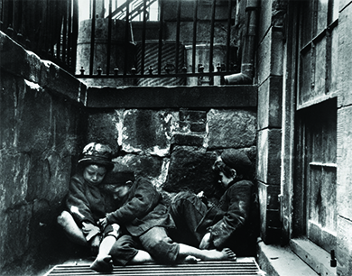

By the end of this section, you will be able to:
* Describe the role that muckrakers played in catalyzing the Progressive Era
* Explain the main features of Progressivism

 ![A timeline shows important events of the era. In 1901, President William McKinley is assassinated, and Theodore Roosevelt assumes the presidency; an illustration of McKinley\'s assassination is shown. In 1906, the Meat Inspection Act passes, and the Pure Food and Drug Act is enacted. In 1910, an interracial coalition founds the National Association for the Advancement of Colored People (NAACP). In 1911, the Triangle Shirtwaist Factory fire triggers the first inspection laws; a photograph of firefighters hosing the Triangle Shirtwaist Factory blaze is shown. In 1912, Roosevelt founds the Progressive Party; a photograph of Roosevelt is shown. In 1913, the Sixteenth Amendment authorizes the federal income tax, and the Seventeenth Amendment subjects U.S. senators to a popular vote. In 1920, the Eighteenth Amendment prohibits the manufacture and sale of alcoholic beverages, and the Nineteenth Amendment guarantees women the right to vote; a photograph shows Speaker of the House Frederick Gillett signing a bill providing for the Nineteenth Amendment.](../resources/CNX_History_21_01_Timeline.jpg){:}

The Progressive Era was a time of wide-ranging causes and varied movements, where activists and reformers from diverse backgrounds and with very different agendas pursued their goals of a better America. These reformers were reacting to the challenges that faced the country at the end of the nineteenth century: rapid urban sprawl, immigration, corruption, industrial working conditions, the growth of large corporations, women’s rights, and surging anti-black violence and white supremacy in the South. Investigative journalists of the day uncovered social inequality and encouraged Americans to take action. The campaigns of the Progressives were often grassroots in their origin. While different causes shared some underlying elements, each movement largely focused on its own goals, be it the right of women to vote, the removal of alcohol from communities, or the desire for a more democratic voting process.

# THE MUCKRAKERS

A group of journalists and writers collectively known as **muckrakers**{: data-type="term"} provided an important spark that ignited the Progressive movement. Unlike the “yellow journalists” who were interested only in sensationalized articles designed to sell newspapers, muckrakers exposed problems in American society and urged the public to identify solutions. Whether those problems were associated with corrupt machine politics, poor working conditions in factories, or the questionable living conditions of the working class (among others), muckrakers shined a light on the problem and provoked outraged responses from Americans. President Theodore Roosevelt knew many of these investigative journalists well and considered himself a Progressive. Yet, unhappy with the way they forced agendas into national politics, he was the one who first gave them the disparaging nickname “muckrakers,” invoking an ill-spirited character obsessed with filth from *The Pilgrim’s Progress*, a 1678 Christian allegory written by John Bunyan.

Beginning in the second half of the nineteenth century, these Progressive journalists sought to expose critical social problems and exhort the public to take action. In his book, *How the Other Half Lives* (1890), journalist and photographer Jacob Riis used **photojournalism**{: data-type="term" .no-emphasis} to capture the dismal and dangerous living conditions in working-class tenements in New York City ([\[link\]](#fs-idm21536608)). Ida Tarbell, perhaps the most well-known female muckraker, wrote a series of articles on the dangers of John D. Rockefeller’s powerful monopoly, Standard Oil. Her articles followed Henry Demarest Lloyd’s book, *Wealth Against Commonwealth*, published in 1894, which examined the excesses of Standard Oil. Other writers, like Lincoln Steffens, explored corruption in city politics, or, like Ray Standard Baker, researched unsafe working conditions and low pay in the coal mines.

{:}

The work of the muckrakers not only revealed serious problems in American society, but also agitated, often successfully, for change. Their articles, in magazines such as *McClure’s*, as well as books garnered attention for issues such as child labor, anti-trust, big business break-ups, and health and safety. Progressive activists took up these causes and lobbied for legislation to address some of the ills troubling industrial America.

  
To learn more about one of the most influential muckrakers of the late nineteenth century, peruse the photographs, writings, and more at the [Ida M. Tarbell archives][1]{: target="_window"} that are housed at Tarbell’s alma mater, Allegheny College, where she matriculated in 1876 as the only woman in her class.

# THE FEATURES OF PROGRESSIVISM

Muckrakers drew public attention to some of the most glaring inequities and scandals that grew out of the social ills of the Gilded Age and the hands-off approach of the federal government since the end of Reconstruction. These writers by and large addressed a white, middle-class and elite, native-born audience, even though Progressive movements and organizations involved a diverse range of Americans. What united these Progressives beyond their different backgrounds and causes was a set of uniting principles, however. Most strove for a perfection of democracy, which required the expansion of suffrage to worthy citizens and the restriction of political participation for those considered “unfit” on account of health, education, or race. Progressives also agreed that democracy had to be balanced with an emphasis on efficiency, a reliance on science and technology, and deference to the expertise of professionals. They repudiated party politics but looked to government to regulate the modern market economy. And they saw themselves as the agents of social justice and reform, as well as the stewards and guides of workers and the urban poor. Often, reformers’ convictions and faith in their own expertise led them to dismiss the voices of the very people they sought to help.

The expressions of these Progressive principles developed at the grassroots level. It was not until Theodore Roosevelt unexpectedly became president in 1901 that the federal government would engage in Progressive reforms. Before then, **Progressivism**{: data-type="term"} was work done by the people, for the people. What knit Progressives together was the feeling that the country was moving at a dangerous pace in a dangerous direction and required the efforts of everyday Americans to help put it back on track.

# Section Summary

In its first decade, the Progressive Era was a grassroots effort that ushered in reforms at state and local levels. At the beginning of the twentieth century, however, Progressive endeavors captured the attention of the federal government. The challenges of the late nineteenth century were manifold: fast-growing cities that were ill-equipped to house the working poor, hands-off politicians shackled into impotence by their system of political favors, and rural Americans struggling to keep their farms afloat. The muckraking journalists of the era published books and articles highlighting the social inequities of the day and extolling everyday Americans to help find solutions. Educated, middle-class, Anglo-Saxon Protestants dominated the movement, but Progressives were not a homogenous group: The movement counted African Americans, both women and men, and urban as well as rural dwellers among its ranks. Progressive causes ranged from anti-liquor campaigns to fair pay. Together, Progressives sought to advance the spread of democracy, improve efficiency in government and industry, and promote social justice.

# Review Questions

Ida Tarbell wrote publicly about

1.  the need for better housing in rural America
2.  the sinister business practices of Standard Oil
3.  the need for a national temperance movement
4.  the women’s suffrage cause in the American West
{: data-number-style="upper-alpha"}

B

Which of the following was *not* a key area of focus for the Progressives?

1.  land reform
2.  democracy
3.  business regulation
4.  social justice
{: data-number-style="upper-alpha"}

A

How did muckrakers help initiate the Progressive Era?

The muckrakers played a pivotal role in initiating the Progressive Era, because they spurred everyday Americans to action. Unlike earlier sensationalist journalists, the muckrakers told their stories with the explicit goal of galvanizing their readers and encouraging them to take steps to address the issues. With photographs and descriptions of real-life scenarios of which many Americans were unaware, the muckrakers brought the tribulations of child factory workers, the urban poor, and others into the living rooms of the middle class.

[1]: http://openstaxcollege.org/l/tarbell
