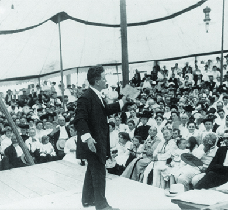
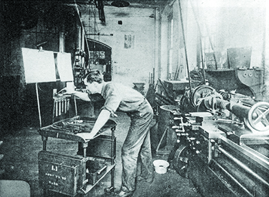
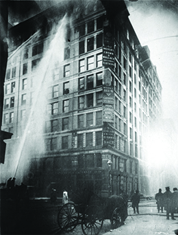
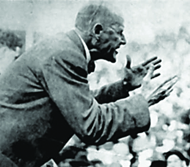

By the end of this section, you will be able to:
* Identify specific examples of grassroots Progressivism relating to the spread of democracy, efficiency in government, and social justice
* Describe the more radical movements associated with the Progressive Era

A wide variety of causes fell under the Progressive label. For example, Wisconsin’s Robert M. (“Fighting Bob”) La Follette, one of the most Progressive politicians of his day, fought hard to curb the power of special interests in politics and reform the democratic process at state and local levels. Others sought out safer working conditions for factory workers. Different groups prioritized banning the sale of alcohol, which, they believed, was the root of much of the trouble for the working poor. No matter what the cause, Progressive campaigns often started with issues brought to the public’s attention by muckraking journalists.

### EXPANDING DEMOCRACY

One of the key ideals that Progressives considered vital to the growth and health of the country was the concept of a perfected democracy. They felt, quite simply, that Americans needed to exert more control over their government. This shift, they believed, would ultimately lead to a system of government that was better able to address the needs of its citizens. Grassroots Progressives pushed forward their agenda of direct democracy through the passage of three **state-level reforms**{: data-type="term" .no-emphasis}.

The first law involved the creation of the **direct primary**{: data-type="term"}. Prior to this time, the only people who had a hand in selecting candidates for elections were delegates at conventions. Direct primaries allowed party members to vote directly for a candidate, with the nomination going to the one with the most votes. This was the beginning of the current system of holding a primary election before a general election. South Carolina adopted this system for statewide elections in 1896; in 1901, Florida became the first state to use the direct primary in nominations for the presidency. It is the method currently used in three-quarters of U.S. states.

Another series of reforms pushed forward by Progressives that sought to sidestep the power of special interests in state legislatures and restore the democratic political process were three election innovations—the **initiative**{: data-type="term"}, **referendum**{: data-type="term"}, and **recall**{: data-type="term"}. The first permitted voters to enact legislation by petitioning to place an idea, or initiative, on the ballot. In 1898, South Dakota became the first state to allow initiatives to appear on a ballot. By 1920, twenty states had adopted the procedure. The second innovation allowed voters to counteract legislation by holding a referendum—that is, putting an existing law on the ballot for voters to either affirm or reject. Currently twenty-four states allow some form of initiative and referendum. The third element of this direct democracy agenda was the recall. The recall permitted citizens to remove a public official from office through a process of petition and vote, similar to the initiative and referendum. While this measure was not as widely adopted as the others, Oregon, in 1910, became the first state to allow recalls. By 1920, twelve states had adopted this tool. It has only been used successfully a handful of times on the statewide level, for example, to remove the governor of North Dakota in 1921, and, more recently, the governor of California in 2003.

Progressives also pushed for democratic reform that affected the federal government. In an effort to achieve a fairer representation of state constituencies in the U.S. Congress, they lobbied for approval of the Seventeenth Amendment to the U.S. Constitution, which mandated the direct election of U.S. senators. The Seventeenth Amendment replaced the previous system of having state legislatures choose senators. William Jennings Bryan, the 1896 Democratic presidential candidate who received significant support from the Populist Party, was among the leading Progressives who championed this cause.

### EXPERTISE AND EFFICIENCY

In addition to making government more directly accountable to the voters, Progressives also fought to rid politics of inefficiency, waste, and corruption. Progressives in large cities were particularly frustrated with the corruption and favoritism of machine politics, which wasted enormous sums of taxpayer money and ultimately stalled the progress of cities for the sake of entrenched politicians, like the notorious Democratic Party Boss William Tweed in New York’s Tammany Hall. Progressives sought to change this corrupt system and had success in places like Galveston, Texas, where, in 1901, they pushed the city to adopt a commission system. A hurricane the previous year ([\[link\]](#fs-idm84315696)) had led to the collapse of the old city government, which had proved incapable of leading the city through the natural disaster. The storm claimed over eight thousand lives—the highest death toll from a natural disaster in the history of the country—and afterwards, the community had no faith that the existing government could rebuild. The commission system involved the election of a number of commissioners, each responsible for one specific operation of the city, with titles like water commissioner, fire commissioner, police commissioner, and so on. With no single political “boss” in charge, the prevalence of graft and corruption greatly decreased. The commissioner system is widely used in modern cities throughout the United States.

{:}

Another model of municipal government reform took shape in Staunton, Virginia, in 1908, where the citizens switched to the city manager form of government. Designed to avoid the corruption inherent in political machines, the city manager system separated the daily operations of the city from both the electoral process and political parties. In this system, citizens elected city councilors who would pass laws and handle all legislative issues. However, their first job was to hire a city manager to deal with the daily management operation of the city. This person, unlike the politicians, was an engineer or businessman who understood the practical elements of city operations and oversaw city workers. Currently, over thirty-seven hundred cities have adopted the city manager system, including some of the largest cities in the country, such as Austin, Dallas, and Phoenix.

At the state level, perhaps the greatest advocate of Progressive government was Robert La Follette ([\[link\]](#fs-idp47815328)). During his time as governor, from 1901 through 1906, La Follette introduced the **Wisconsin Idea**{: data-type="term"}, wherein he hired experts to research and advise him in drafting legislation to improve conditions in his state. “Fighting Bob” supported numerous Progressive ideas while governor: He signed into law the first workman’s compensation system, approved a minimum wage law, developed a **progressive tax**{: data-type="term" .no-emphasis} law, adopted the direct election of U.S. senators before the subsequent constitutional amendment made it mandatory, and advocated for women’s suffrage. La Follette subsequently served as a popular U.S. senator from Wisconsin from 1906 through 1925, and ran for president on the Progressive Party ticket in 1924.

{:}

  
Read how [Robert La Follette’s legacy][1]{: target="_window"} still inspires progressives in Wisconsin.

Many Progressive reformers were also committed to the principle of efficiency in business as well as in government. The growth of large corporations at the time fostered the emergence of a class of professional managers. Fredrick Winslow Taylor, arguably the first American management consultant, laid out his argument of increased industrial efficiency through improvements in human productivity in his book *The Principles of Scientific Management* (1911). Through time-motion studies and the principles of standardization, Taylor sought to place workers in the most efficient positions of the industrial process. Management, he argued, should determine the work routine, leaving workers to simply execute the task at hand. The image below ([\[link\]](#fs-idm15010656)) shows a machinist in a factory where Taylor had consulted; he is alone and focused solely on his job. Progressive in its emphasis on efficiency, the use of science, and the reliance on experts, **Taylorism**{: data-type="term"}, as scientific management became known, was not widely popular among workers who resented managerial authority and the loss of autonomy over their work. Many workers went on strikes in response, although some favored Taylor’s methods, since their pay was directly linked to the productivity increases that his methods achieved and since increased efficiency allowed companies to charge consumers lower prices.

{:}

### SOCIAL JUSTICE

The Progressives’ work towards social justice took many forms. In some cases, it was focused on those who suffered due to pervasive inequality, such as African Americans, other ethnic groups, and women. In others, the goal was to help those who were in desperate need due to circumstance, such as poor immigrants from southern and eastern Europe who often suffered severe discrimination, the working poor, and those with ill health. Women were in the vanguard of social justice reform. Jane Addams, Lillian Wald, and Ellen Gates Starr, for example, led the settlement house movement of the 1880s (discussed in a previous chapter). Their work to provide social services, education, and health care to working-class women and their children was among the earliest Progressive grassroots efforts in the country.

Building on the successes of the settlement houses, social justice reformers took on other, related challenges. The National Child Labor Committee (NCLC), formed in 1904, urged the passage of labor legislation to ban child labor in the industrial sector. In 1900, U.S. census records indicated that one out of every six children between the ages of five and ten were working, a 50-percent increase over the previous decade. If the sheer numbers alone were not enough to spur action, the fact that managers paid child workers noticeably less for their labor gave additional fuel to the NCLC’s efforts to radically curtail child labor. The committee employed photographer Lewis Hine to engage in a decade-long pictorial campaign to educate Americans on the plight of children working in factories ([\[link\]](#fs-idm46377776)).

, a twelve-year-old spinner working in a mill in Vermont in 1910, and these young boys working at Bibb Mill No. 1 in Macon, Georgia in 1909 (b). Working ten- to twelve-hour shifts, children often worked large machines where they could reach into gaps and remove lint and other debris, a practice that caused plenty of injuries. (credit a/b: modification of work by Library of Congress)"){:}

Although low-wage industries fiercely opposed any federal restriction on child labor, the NCLC did succeed in 1912, urging President William Howard Taft to sign into law the creation of the U.S. Children’s Bureau. As a branch of the Department of Labor, the bureau worked closely with the NCLC to bring greater awareness to the issue of child labor. In 1916, the pressure from the NCLC and the general public resulted in the passage of the Keating-Owen Act, which prohibited the interstate trade of any goods produced with child labor. Although the U.S. Supreme Court later declared the law unconstitutional, Keating-Owen reflected a significant shift in the public perception of child labor. Finally, in 1938, the passage of the Fair Labor Standards Act signaled the victory of supporters of Keating-Owen. This new law outlawed the interstate trade of any products produced by children under the age of sixteen.

Florence Kelley, a Progressive supporter of the NCLC, championed other social justice causes as well. As the first general secretary of the National Consumers League, which was founded in 1899 by Jane Addams and others, Kelley led one of the original battles to try and secure safety in factory working conditions. She particularly opposed sweatshop labor and urged the passage of an eight-hour-workday law in order to specifically protect women in the workplace. Kelley’s efforts were initially met with strong resistance from factory owners who exploited women’s labor and were unwilling to give up the long hours and low wages they paid in order to offer the cheapest possible product to consumers. But in 1911, a tragedy turned the tide of public opinion in favor of Kelley’s cause. On March 25 of that year, a fire broke out at the Triangle Shirtwaist Company on the eighth floor of the Asch building in New York City, resulting in the deaths of 146 garment workers, most of them young, immigrant women ([\[link\]](#fs-idp52893008)). Management had previously blockaded doors and fire escapes in an effort to control workers and keep out union organizers; in the blaze, many died due to the crush of bodies trying to evacuate the building. Others died when they fell off the flimsy fire escape or jumped to their deaths to escape the flames. This tragedy provided the National Consumers League with the moral argument to convince politicians of the need to pass workplace safety laws and codes.

 {:}

William Shepherd on the Triangle Shirtwaist Factory Fire

The tragedy of the Triangle Shirtwaist Factory fire was a painful wake-up call to a country that was largely ignoring issues of poor working conditions and worker health and safety. While this fire was far from the only instance of worker death, the sheer number of people killed—almost one hundred fifty—and the fact they were all young women, made a strong impression. Furthering the power of this tragedy was the first-hand account shared by William Shepherd, a United Press reporter who was on the scene, giving his eyewitness account over a telephone. His account appeared, just two days later, in the *Milwaukee Journal*, and word of the tragedy spread from there. Public outrage over their deaths was enough to give the National Consumers League the power it needed to push politicians to get involved.

<q> I saw every feature of the tragedy visible from outside the building. I learned a new sound—a more horrible sound than description can picture. It was the thud of a speeding, living body on a stone sidewalk. * * *
{: data-type="newline"}

 Thud-dead, thud-dead, thud-dead, thud-dead.Sixty-two thud-deads. I call them that, because the sound and the thought of death came to me each time, at the same instant. There was plenty of chance to watch them as they came down. The height was eighty feet. * * *
{: data-type="newline"}

 The first ten thud-deads shocked me. I looked up—saw that there were scores of girls at the windows. The flames from the floor below were beating in their faces. Somehow I knew that they, too, must come down. . . . * * *
{: data-type="newline"}

 A policeman later went about with tags, which he fastened with wires to the wrists of the dead girls, numbering each with a lead pencil, and I saw him fasten tag no. 54 to the wrist of a girl who wore an engagement ring. A fireman who came downstairs from the building told me that there were at least fifty bodies in the big room on the seventh floor. Another fireman told me that more girls had jumped down an air shaft in the rear of the building. I went back there, into the narrow court, and saw a heap of dead girls. . . . * * *
{: data-type="newline"}

 The floods of water from the firemen’s hose that ran into the gutter were actually stained red with blood. I looked upon the heap of dead bodies and I remembered these girls were the shirtwaist makers. I remembered their great strike of last year in which these same girls had demanded more sanitary conditions and more safety precautions in the shops. These dead bodies were the answer. </q>

What do you think about William Shepherd’s description? What effect do you think it had on newspaper readers in the Midwest?

Another cause that garnered support from a key group of Progressives was the prohibition of liquor. This crusade, which gained followers through the Women’s Christian Temperance Union (WCTU) and the Anti-Saloon League, directly linked Progressivism with morality and Christian reform initiatives, and saw in alcohol both a moral vice and a practical concern, as workingmen spent their wages on liquor and saloons, often turning violent towards each other or their families at home. The WCTU and Anti-Saloon League moved the efforts to eliminate the sale of alcohol from a bar-to-bar public opinion campaign to one of city-to-city and state-by-state votes ([\[link\]](#fs-idm16767040)). Through local option votes and subsequent statewide initiatives and referendums, the Anti-Saloon League succeeded in urging 40 percent of the nation’s counties to “go dry” by 1906, and a full dozen states to do the same by 1909. Their political pressure culminated in the passage of the Eighteenth Amendment to the U.S. Constitution, ratified in 1919, which prohibited the manufacture, sale, and transportation of alcoholic beverages nationwide.

"){:}

### RADICAL PROGRESSIVES

The Progressive Era also witnessed a wave of radicalism, with leaders who believed that America was beyond reform and that only a complete revolution of sorts would bring about the necessary changes. The radicals had early roots in the labor and political movements of the mid-nineteenth century but soon grew to feel that the more moderate Progressive ideals were inadequate. Conversely, one reason mainstream why Progressives felt the need to succeed on issues of social inequity was because radicals offered remedies that middle-class Americans considered far more dangerous. The two most prominent radical movements to emerge at the beginning of the century were the Socialist Party of America (SPA), founded in 1901, and the Industrial Workers of the World (IWW), founded in 1905, whose emphasis on worker empowerment deviated from the more paternalistic approach of Progressive reformers.

Labor leader Eugene Debs, disenchanted with the failures of the labor movement, was a founding member and prominent leader of the SPA ([\[link\]](#fs-idm18494192)). Advocating for change via the ballot box, the SPA sought to elect Socialists to positions at the local, state, and federal levels in order to initiate change from within. Between 1901 and 1918, the SPA enjoyed tremendous success, electing over seventy Socialist mayors, over thirty state legislators, and two U.S. congressmen, Victor Berger from Wisconsin and Meyer London from New York. Debs himself ran for president as the SPA candidate in five elections between 1900 and 1920, twice earning nearly one million votes.

 {:}

As had been true for the Populist and Progressive movements, the radical movement suffered numerous fissures. Although Debs established a tenuous relationship with Samuel Gompers and the American Federation of Labor, some within the Socialist Party favored a more radical political stance than Debs’s craft union structure. As a result, William “Big Bill” Haywood formed the more radical IWW, or **Wobblies**{: data-type="term"}, in 1905. Although he remained an active member of the Socialist Party until 1919, Haywood appreciated the outcry of the more radical arm of the party that desired an industrial union approach to labor organization. The IWW advocated for direct action and, in particular, the general strike, as the most effective revolutionary method to overthrow the capitalist system. By 1912, the Wobblies had played a significant role in a number of major strikes, including the Paterson Silk Strike, the Lawrence Textile Strike, and the Mesabi Range Iron Strike. The government viewed the Wobblies as a significant threat, and in a response far greater than their actions warranted, targeted them with arrests, tar-and-featherings, shootings, and lynchings.

Both the Socialist Party and the IWW reflected elements of the Progressive desire for democracy and social justice. The difference was simply that for this small but vocal minority in the United States, the corruption of government at all levels meant that the desire for a better life required a different approach. What they sought mirrored the work of all grassroots Progressives, differing only in degree and strategy.

### Section Summary

Progressive campaigns stretched from the hurricane-ruined townships of Texas to the slums of New York, from the factory floor to the saloon door. But what tied together these disparate causes and groups was the belief that the country was in dire need of reform, and that answers were to be found within the activism and expertise of predominantly middle-class Americans on behalf of troubled communities. Some efforts, such as the National Child Labor Committee, pushed for federal legislation; however, most Progressive initiatives took place at the state and local levels, as Progressives sought to harness public support to place pressure on politicians.

At the beginning of the twentieth century, a more radical, revolutionary breed of Progressivism began to evolve. While these radical Progressives generally shared the goals of their more mainstream counterparts, their strategies differed significantly. Mainstream Progressives and many middle-class Americans feared groups such as the Socialist Party of America and the Industrial Workers of the World, which emphasized workers’ empowerment and direct action.

### Review Questions

What system did the direct primary replace?

1.  candidate selection by secret ballots
2.  candidate selection by machine bosses
3.  candidate selection by convention delegates
4.  an indirect primary
{: type="A"}

C

Which of the following is *not* an example of social justice Progressivism?

1.  anti-liquor campaigns
2.  referendums
3.  workplace safety initiatives
4.  improvements in education
{: type="A"}

B

### Glossary
{: data-type="glossary-title"}

direct primary
: a political reform that allowed for the nomination of candidates through a direct vote by party members, rather than by the choice of delegates at conventions; in the South, this strengthened all-white solidarity within the Democratic Party
^

initiative
: a proposed law, or initiative, placed on the ballot by public petition
^

recall
: to remove a public official from office by virtue of a petition and vote process
^

referendum
: a process that allows voters to counteract legislation by putting an existing law on the ballot for voters to either affirm or reject
^

Taylorism
: a system named for Fredrick Winslow Taylor, aimed at improving factory efficiency rates through the principle of standardization; Taylor’s model limited workers to repetitive tasks, reducing human contact and opportunities to think or collaborate
^

Wisconsin Idea
: a political system created by Robert La Follette, governor of Wisconsin, that embodied many progressive ideals; La Follette hired experts to advise him on improving conditions in his state
^

Wobblies
: a nickname for the Industrial Workers of the World, a radical Progressive group that grew out of the earlier labor movement and desired an industrial union model of labor organization

[1]: http://openstax.org/l/follette
