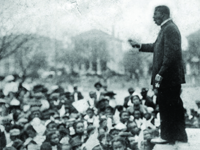

By the end of this section, you will be able to:
* Understand the origins and growth of the women’s rights movement
* Identify the different strands of the early African American civil rights movement

The Progressive drive for a more perfect democracy and social justice also fostered the growth of two new movements that attacked the oldest and most long-standing betrayals of the American promise of equal opportunity and citizenship—the disfranchisement of women and civil rights for African Americans. African Americans across the nation identified an agenda for civil rights and economic opportunity during the Progressive Era, but they disagreed strongly on how to meet these goals in the face of universal discrimination and disfranchisement, segregation, and racial violence in the South. And beginning in the late nineteenth century, the women’s movement cultivated a cadre of new leaders, national organizations, and competing rationales for women’s rights—especially the right to vote.

# LEADERS EMERGE IN THE WOMEN’S MOVEMENT

Women like Jane Addams and Florence Kelley were instrumental in the early Progressive settlement house movement, and female leaders dominated organizations such as the WCTU and the Anti-Saloon League. From these earlier efforts came new leaders who, in their turn, focused their efforts on the key goal of the Progressive Era as it pertained to women: the right to vote.

Women had first formulated their demand for the right to vote in the Declaration of Sentiments at a convention in Seneca Falls, New York, in 1848, and saw their first opportunity of securing suffrage during Reconstruction when legislators—driven by racial animosity—sought to enfranchise women to counter the votes of black men following the ratification of the Fifteenth Amendment. By 1900, the western frontier states of Colorado, Idaho, Utah, and Wyoming had already responded to women’s movements with the right to vote in state and local elections, regardless of gender. They conceded to the suffragists’ demands, partly in order to attract more women to these male-dominated regions. But women’s lives in the West also rarely fit with the nineteenth-century ideology of “separate spheres” that had legitimized the exclusion of women from the rough-and-tumble party competitions of public politics. In 1890, the National American Women’s Suffrage Association (NAWSA) organized several hundred state and local chapters to urge the passage of a federal amendment to guarantee a woman’s right to vote. Its leaders, Elizabeth Cady Stanton and Susan B. Anthony, were veterans of the women’s suffrage movement and had formulated the first demand for the right to vote at Seneca Falls in 1848 ([\[link\]](#fs-idm11458064)). Under the subsequent leadership of Carrie Chapman Catt, beginning in 1900, the group decided to make suffrage its first priority. Soon, its membership began to grow. Using modern marketing efforts like celebrity endorsements to attract a younger audience, the NAWSA became a significant political pressure group for the passage of an amendment to the U.S. Constitution.

{:}

For some in the NAWSA, however, the pace of change was too slow. Frustrated with the lack of response by state and national legislators, Alice Paul, who joined the organization in 1912, sought to expand the scope of the organization as well as to adopt more direct protest tactics to draw greater media attention. When others in the group were unwilling to move in her direction, Paul split from the NAWSA to create the Congressional Union for Woman Suffrage, later renamed the National Woman’s Party, in 1913. Known as the **Silent Sentinels**{: data-type="term"} ([\[link\]](#fs-idp31018800)), Paul and her group picketed outside the White House for nearly two years, starting in 1917. In the latter stages of their protests, many women, including Paul, were arrested and thrown in jail, where they staged a hunger strike as self-proclaimed political prisoners. Prison guards ultimately force-fed Paul to keep her alive. At a time—during World War I—when women volunteered as army nurses, worked in vital defense industries, and supported Wilson’s campaign to “make the world safe for democracy,” the scandalous mistreatment of Paul embarrassed President Woodrow Wilson. Enlightened to the injustice toward all American women, he changed his position in support of a woman’s constitutional right to vote.

{:}

While Catt and Paul used different strategies, their combined efforts brought enough pressure to bear for Congress to pass the Nineteenth Amendment, which prohibited voter discrimination on the basis of sex, during a special session in the summer of 1919. Subsequently, the required thirty-six states approved its adoption, with Tennessee doing so in August of 1920, in time for that year’s presidential election.

The Anti-Suffragist Movement

The early suffragists may have believed that the right to vote was a universal one, but they faced waves of discrimination and ridicule from both men and women. The image below ([\[link\]](#fs-idp7169472)) shows one of the organizations pushing back against the suffragist movement, but much of the anti-suffrage campaign was carried out through ridiculing postcards and signs that showed suffragists as sexually wanton, grasping, irresponsible, or impossibly ugly. Men in anti-suffragist posters were depicted as henpecked, crouching to clean the floor, while their suffragist wives marched out the door to campaign for the vote. They also showed cartoons of women gambling, drinking, and smoking cigars, that is, taking on men’s vices, once they gained voting rights.

{:}

Other anti-suffragists believed that women could better influence the country from outside the realm of party politics, through their clubs, petitions, and churches. Many women also opposed women’s suffrage because they thought the dirty world of politics was a morass to which ladies should not be exposed. The National Association Opposed to Woman Suffrage formed in 1911; around the country, state representatives used the organization’s speakers, funds, and literature to promote the anti-suffragist cause. As the link below illustrates, the suffragists endured much prejudice and backlash in their push for equal rights.

  
Browse this [collection of anti-suffragist cartoons][1]{: target="_window"} to see examples of the stereotypes and fear-mongering that the anti-suffragist campaign promoted.

# LEADERS EMERGE IN THE EARLY CIVIL RIGHTS MOVEMENT

Racial mob violence against African Americans permeated much of the “New South”—and, to a lesser extent, the West, where Mexican Americans and other immigrant groups also suffered severe discrimination and violence—by the late nineteenth century. The Ku Klux Klan and a system of Jim Crow laws governed much of the South (discussed in a previous chapter). White middle-class reformers were appalled at the violence of race relations in the nation but typically shared the belief in racial characteristics and the superiority of Anglo-Saxon whites over African Americans, Asians, “ethnic” Europeans, Indians, and Latin American populations. Southern reformers considered segregation a Progressive solution to racial violence; across the nation, educated middle-class Americans enthusiastically followed the work of **eugenicists**{: data-type="term" .no-emphasis} who identified virtually all human behavior as inheritable traits and issued awards at county fairs to families and individuals for their “racial fitness.” It was against this tide that African American leaders developed their own voice in the Progressive Era, working along diverse paths to improve the lives and conditions of African Americans throughout the country.

Born into slavery in Virginia in 1856, Booker T. Washington became an influential African American leader at the outset of the Progressive Era. In 1881, he became the first principal for the Tuskegee Normal and Industrial Institute in Alabama, a position he held until he died in 1915. Tuskegee was an all-black “normal school”—an old term for a teachers’ college—teaching African Americans a curriculum geared towards practical skills such as cooking, farming, and housekeeping. Graduates would often then travel through the South, teaching new farming and industrial techniques to rural communities. Washington extolled the school’s graduates to focus on the black community’s self-improvement and prove that they were productive members of society even in freedom—something white Americans throughout the nation had always doubted.

In a speech delivered at the Cotton States and International Exposition in Atlanta in 1895, which was meant to promote the economy of a “New South,” Washington proposed what came to be known as the **Atlanta Compromise**{: data-type="term"} ([\[link\]](#fs-idp27465424)). Speaking to a racially mixed audience, Washington called upon African Americans to work diligently for their own uplift and prosperity rather than preoccupy themselves with political and civil rights. Their success and hard work, he implied, would eventually convince southern whites to grant these rights. Not surprisingly, most whites liked Washington’s model of race relations, since it placed the burden of change on blacks and required nothing of them. Wealthy industrialists such as Andrew Carnegie and John D. Rockefeller provided funding for many of Washington’s self-help programs, as did Sears, Roebuck &amp; Co. co-founder Julius Rosenwald, and Washington was the first African American invited to the White House by President Roosevelt in 1901. At the same time, his message also appealed to many in the black community, and some attribute this widespread popularity to his consistent message that social and economic growth, even within a segregated society, would do more for African Americans than an all-out agitation for equal rights on all fronts.

{:}

  
Visit George Mason University’s History Matters website for the text and audio of Booker T. Washington’s famous [Atlanta Compromise][2]{: target="_window"} speech.

Yet, many African Americans disagreed with Washington’s approach. Much in the same manner that Alice Paul felt the pace of the struggle for women’s rights was moving too slowly under the NAWSA, some within the African American community felt that immediate agitation for the rights guaranteed under the Thirteenth, Fourteenth, and Fifteenth Amendments, established during the immediate aftermath of the Civil War, was necessary. In 1905, a group of prominent civil rights leaders, led by W. E. B. Du Bois, met in a small hotel on the Canadian side of Niagara Falls—where segregation laws did not bar them from hotel accommodations—to discuss what immediate steps were needed for equal rights ([\[link\]](#fs-idp61876224)). Du Bois, a professor at the all-black Atlanta University and the first African American with a doctorate from Harvard, emerged as the prominent spokesperson for what would later be dubbed the **Niagara Movement**{: data-type="term"}. By 1905, he had grown wary of Booker T. Washington’s calls for African Americans to accommodate white racism and focus solely on self-improvement. Du Bois, and others alongside him, wished to carve a more direct path towards equality that drew on the political leadership and litigation skills of the black, educated elite, which he termed the “talented tenth.”

{:}

At the meeting, Du Bois led the others in drafting the “Declaration of Principles,” which called for immediate political, economic, and social equality for African Americans. These rights included universal suffrage, compulsory education, and the elimination of the convict lease system in which tens of thousands of blacks had endured slavery-like conditions in southern road construction, mines, prisons, and penal farms since the end of Reconstruction. Within a year, Niagara chapters had sprung up in twenty-one states across the country. By 1908, internal fights over the role of women in the fight for African American equal rights lessened the interest in the Niagara Movement. But the movement laid the groundwork for the creation of the National Association for the Advancement of Colored People (**NAACP**{: data-type="term"}), founded in 1909. Du Bois served as the influential director of publications for the NAACP from its inception until 1933. As the editor of the journal *The Crisis*, Du Bois had a platform to express his views on a variety of issues facing African Americans in the later Progressive Era, as well as during World War I and its aftermath.

In both Washington and Du Bois, African Americans found leaders to push forward the fight for their place in the new century, each with a very different strategy. Both men cultivated ground for a new generation of African American spokespeople and leaders who would then pave the road to the modern civil rights movement after World War II.

# Section Summary

The Progressive commitment to promoting democracy and social justice created an environment within which the movements for women’s and African American rights grew and flourished. Emergent leaders such as Elizabeth Cady Stanton, Susan B. Anthony, Carrie Chapman Catt, and Alice Paul spread the cause of woman suffrage, drawing in other activists and making the case for a constitutional amendment ensuring a woman’s right to vote. African Americans—guided by leaders such as Booker T. Washington and W. E. B. Du Bois—strove for civil rights and economic opportunity, although their philosophies and strategies differed significantly. In the women’s and civil rights movements alike, activists both advanced their own causes and paved the way for later efforts aimed at expanding equal opportunity and citizenship.

# Review Questions

Which of the following was *not* a feature of Booker T. Washington’s strategy to improve the lives of African Americans?

1.  self-help
2.  accommodating/tolerating white racism
3.  immediate protests for equal rights
4.  learning new trades/skills
{: data-number-style="upper-alpha"}

C

Who were the “Silent Sentinels”?

1.  a group of progressive African Americans who drafted the Declaration of Principles
2.  anti-suffrage women
3.  an offshoot of the Industrial Workers of the World
4.  suffragists who protested outside the White House
{: data-number-style="upper-alpha"}

D

Describe the philosophy and strategies of the Niagara Movement. How did it differ from Washington’s way of thinking?

W. E. B. Du Bois sought to push for civil rights directly, through legal and political channels, drawing on the education and skills of the “talented tenth” to advance the Niagara Movement’s agenda. The movement’s Declaration of Principles called for immediate political, economic, and social equality for African Americans, including universal suffrage, education, and an end to the convict-lease system. This represented, in many ways, a rejection of Booker T. Washington’s advocacy of accommodation and self-improvement.

[1]: http://openstaxcollege.org/l/postcard
[2]: http://openstaxcollege.org/l/booker
