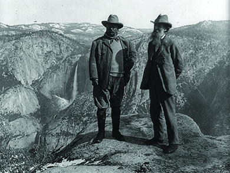

By the end of this section, you will be able to:
* Explain the key features of Theodore Roosevelt’s “Square Deal”
* Explain the key features of William Howard Taft’s Progressive agenda
* Identify the main pieces of legislation that Woodrow Wilson’s “New Freedom” agenda comprised

Progressive groups made tremendous strides on issues involving democracy, efficiency, and social justice. But they found that their grassroots approach was ill-equipped to push back against the most powerful beneficiaries of growing inequality, economic concentration, and corruption—big business. In their fight against the trusts, Progressives needed the leadership of the federal government, and they found it in Theodore Roosevelt in 1901, through an accident of history.

In 1900, a sound economic recovery, a unifying victory in the Spanish-American War, and the annexation of the Philippines had helped President William McKinley secure his reelection with the first solid popular majority since 1872. His new vice president was former New York Governor and Assistant Secretary of the Navy, Theodore Roosevelt. But when an assassin shot and killed President McKinley in 1901 ([\[link\]](#fs-idp126685344)) at the Pan-American Exposition in Buffalo, New York, Theodore Roosevelt unexpectedly became the youngest president in the nation’s history. More importantly, it ushered in a new era of progressive national politics and changed the role of the presidency for the twentieth century.

  at the hands of an anarchist made Theodore Roosevelt (b) the country&#x2019;s youngest president."){:}

# BUSTING THE TRUSTS

Roosevelt’s early career showed him to be a dynamic leader with a Progressive agenda. Many Republican Party leaders disliked Roosevelt’s Progressive ideas and popular appeal and hoped to end his career with a nomination to the vice presidency—long considered a dead end in politics. When an assassin’s bullet toppled this scheme, Mark Hanna, a prominent Republican senator and party leader, lamented, “Now look! That damned cowboy is now president!”

As the new president, however, Roosevelt moved cautiously with his agenda while he finished out McKinley’s term. Roosevelt kept much of McKinley’s cabinet intact, and his initial message to Congress gave only one overriding Progressive goal for his presidency: to eliminate business trusts. In the three years prior to Roosevelt’s presidency, the nation had witnessed a wave of mergers and the creation of mega-corporations. To counter this trend, Roosevelt created the Department of Commerce and Labor in 1903, which included the Bureau of Corporations, whose job it was to investigate trusts. He also asked the Department of Justice to resume prosecutions under the Sherman Antitrust Act of 1890. Intended to empower federal prosecutors to ban monopolies as conspiracies against interstate trade, the law had run afoul of a conservative Supreme Court.

In 1902, Roosevelt launched his administration’s first antitrust suit against the Northern Securities Trust Company, which included powerful businessmen, like John D. Rockefeller and J. P. Morgan, and controlled many of the large midwestern railroads. The suit wound through the judicial system, all the way to the U.S. Supreme Court. In 1904, the highest court in the land ultimately affirmed the ruling to break up the trust in a narrow five-to-four vote. For Roosevelt, that was enough of a mandate; he immediately moved against other corporations as well, including the American Tobacco Company and—most significantly—Rockefeller’s Standard Oil Company.

Although Roosevelt enjoyed the nickname “the Trustbuster,” he did not consider all trusts dangerous to the public welfare. The “good trusts,” Roosevelt reasoned, used their power in the marketplace and economies of scale to deliver goods and services to customers more cheaply. For example, he allowed Morgan’s U.S. Steel Corporation to continue its operations and let it take over smaller steel companies. At the same time, Roosevelt used the presidency as a “bully pulpit” to publicly denounce “bad trusts”—those corporations that exploited their market positions for short-term gains—before he ordered prosecutions by the Justice Department. In total, Roosevelt initiated over two dozen successful anti-trust suits, more than any president before him.

Roosevelt also showed in other contexts that he dared to face the power of corporations. When an anthracite coal strike gripped the nation for much of the year in 1902, Roosevelt directly intervened in the dispute and invited both sides to the White House to negotiate a deal that included minor wage increases and a slight improvement in working hours. For Roosevelt, his intervention in the matter symbolized his belief that the federal government should adopt a more proactive role and serve as a steward of all Americans ([\[link\]](#fs-idm15615536)). This stood in contrast to his predecessors, who had time and again bolstered industrialists in their fight against workers’ rights with the deployment of federal troops.

 {:}

# THE SQUARE DEAL

Roosevelt won his second term in 1904 with an overwhelming 57 percent of the popular vote. After the election, he moved quickly to enact his own brand of Progressivism, which he called a **Square Deal**{: data-type="term"} for the American people. Early in his second term, Roosevelt read muckraker Upton Sinclair’s 1905 novel and exposé on the meatpacking industry, *The Jungle*. Although Roosevelt initially questioned the book due to Sinclair’s professed Socialist leanings, a subsequent presidential commission investigated the industry and corroborated the deplorable conditions under which Chicago’s meatpackers processed meats for American consumers. Alarmed by the results and under pressure from an outraged public disgusted with the revelations, Roosevelt moved quickly to protect public health. He urged the passage of two laws to do so. The first, the Meat Inspection Act of 1906, established a system of government inspection for meat products, including grading the meat based on its quality. This standard was also used for imported meats. The second was the Pure Food and Drug Act of 1906, which required labels on all food and drug products that clearly stated the materials in the product. The law also prohibited any “adulterated” products, a measure aimed at some specific, unhealthy food preservatives. For Sinclair, this outcome was a disappointment nonetheless, since he had sought to draw attention to the plight of workers in the slaughterhouses, not the poor quality of the meat products. “I aimed at the public’s heart, and by accident I hit it in the stomach,” he concluded with frustration.

Another key element of Roosevelt’s Progressivism was the protection of public land ([\[link\]](#fs-idp69684384)). Roosevelt was a longtime outdoorsman, with an interest that went back to his childhood and college days, as well as his time cattle ranching in the West, and he chose to appoint his good friend Gifford Pinchot as the country’s first chief of the newly created U.S. Forestry Service. Under Pinchot’s supervision, the department carved out several nature habitats on federal land in order to preserve the nation’s environmental beauty and protect it from development or commercial use. Apart from national parks like Oregon’s Crater Lake or Colorado’s Mesa Verde, and monuments designed for preservation, Roosevelt conserved public land for regulated use for future generations. To this day, the 150 national forests created under Roosevelt’s stewardship carry the slogan “land of many uses.” In all, Roosevelt established eighteen national monuments, fifty-one federal bird preserves, five national parks, and over one hundred fifty national forests, which amounted to about 230 million acres of public land.

{:}

In his second term in office, Roosevelt signed legislation on Progressive issues such as factory inspections, child labor, and business regulation. He urged the passage of the Elkins Act of 1903 and the Hepburn Act of 1906, both of which strengthened the position of the Interstate Commerce Commission to regulate railroad prices. These laws also extended the Commission’s authority to regulate interstate transportation on bridges, ferries, and even oil pipelines.

As the 1908 election approached, Roosevelt was at the height of popularity among the American public, if not among the big businesses and conservative leaders of his own Republican Party. Nonetheless, he promised on the night of his reelection in 1904 that he would not seek a third term. Roosevelt stepped aside as the election approached, but he did hand-pick a successor—Secretary of War and former Governor General of the Philippines William Howard Taft of Ohio—a personal friend who, he assured the American public, would continue the path of the “Square Deal” ([\[link\]](#fs-idm4282784)). With such a ringing endorsement, Taft easily won the 1908 presidential election, defeating three-time Democratic presidential nominee William Jennings Bryan, whose ideas on taxes and corporate regulations reminded voters of the more far-reaching Populist platforms of Bryan’s past candidacies.

 of Theodore Roosevelt (left) and his hand-picked successor William Howard Taft (right) just before Taft&#x2019;s inauguration in 1909, was echoed in a Puck magazine cartoon (b) where &#x201C;cowboy&#x201D; Roosevelt hands off his &#x201C;Policies&#x201D; baby to &#x201C;nurse-maid&#x201D; Taft. Taft was seen, initially at least, as being a president who would continue Roosevelt&#x2019;s same policies."){:}

  
Explore [American Experience: TR][1]{: target="_window"} at PBS for a wealth of information on Theodore Roosevelt, including details of his early life before the presidency and transcripts from several of his speeches.

# THE TAFT PRESIDENCY

Although six feet tall and nearly 340 pounds, as Roosevelt’s successor, Taft had big shoes to fill. The public expected much from Roosevelt’s hand-picked replacement, as did Roosevelt himself, who kept a watchful eye over Taft’s presidency.

The new president’s background suggested he would be a strong administrator. He had previously served as the governor of the Philippines following the **Spanish-American War**{: data-type="term" .no-emphasis}, had a distinguished judicial career, and served as Roosevelt’s Secretary of War from 1904 to 1908. Republican leaders, however, were anxious to reestablish tighter control over the party after Roosevelt’s departure, and they left Taft little room to maneuver. He stayed the course of his predecessor by signing the Mann-Elkins Act of 1910, which extended the authority of the Interstate Commerce Commission over telephones and telegraphs. Additionally, during his tenure, Congress proposed constitutional amendments to authorize a federal income tax and mandate the direct election of U.S. senators. But even though Taft initiated twice as many antitrust suits against big business as Roosevelt, he lacked the political negotiating skills and focus on the public good of his predecessor, who felt betrayed when Taft took J.P. Morgan’s U.S. Steel Corporation to court over an acquisition that Roosevelt had promised Morgan would not result in a prosecution.

Political infighting within his own party exposed the limitations of Taft’s presidential authority, especially on the issue of protective tariffs. When House Republicans passed a measure to significantly reduce tariffs on several imported goods, Taft endorsed the Senate version, later known as the Payne-Aldrich Act of 1909, which raised tariff rates on over eight hundred products in the original bill. Taft also angered Progressives in his own party when he created the U.S. Chamber of Commerce in 1912, viewed by many as an attempt to offset the growing influence of the labor union movement at the time. The rift between Taft and his party’s Progressives widened when the president supported conservative party candidates for the 1910 House and Senate elections.

Taft’s biggest political blunder came in the area of land conservation. In 1909, Taft’s Secretary of the Interior, Richard Ballinger, approved the sale of millions of acres of federal land to a company for which he had previously worked over Gifford Pinchot’s objections. Pinchot publicly criticized the secretary for violating the principle of conservation and for his conflict of interest—a charge that in the public debate also reflected on the president. Taft fired Pinchot, a move that widened the gap between him and the former president. Upon his return from Africa, Roosevelt appeared primed to attack. He referred to the sitting president as a “fathead” and a “puzzlewit,” and announced his intention to “throw my hat in the ring for the 1912 presidential election.”

# THE 1912 PRESIDENTIAL ELECTION

Although not as flamboyant or outwardly progressive as Roosevelt, Taft’s organizational skills and generally solid performance as president aligned with the party leadership’s concerns over another Roosevelt presidency and secured for him the Republican Party’s nomination. Angry over this snub, in 1912, Roosevelt and the other Progressive Republicans bolted the Republican Party and formed the **Progressive Party**{: data-type="term"}. His popularity had him hoping to win the presidential race as a third-party candidate. When he survived an assassination attempt in Milwaukee, Wisconsin, in October 1912—the assassin’s bullet hit his eyeglass case and only injured him superficially—he turned the near-death experience into a political opportunity. Insisting upon delivering the speech before seeking medical attention, he told the crowd, “It takes more than a bullet to kill a bull moose!” The moniker stuck, and Roosevelt’s Progressive Party would be known as the Bull Moose Party for the remainder of the campaign ([\[link\]](#fs-idm65668016)).

{:}

The Democrats realized that a split Republican Party gave them a good chance of regaining the White House for the first time since 1896. They found their candidate in the Progressive governor of New Jersey, Woodrow Wilson. A former history professor and president at Princeton University, Wilson had an academic demeanor that appealed to many Progressive reformers. Many Democrats also viewed Wilson as a Washington outsider who had made far fewer political enemies than Roosevelt and Taft.

Taft never truly campaigned for the post, did not deliver a single speech, and did not seem like a serious contender. In their campaigns, Roosevelt and Wilson formulated competing Progressive platforms. Wilson described his more moderate approach as one of **New Freedom**{: data-type="term"}, which stood for a smaller federal government to protect public interests from the evils associated with big businesses and banks. Roosevelt campaigned on the promise of **New Nationalism**{: data-type="term"}, a charge that he said required a vigorous and powerful federal government to protect public interests. He sought to capitalize on the stewardship approach that he had made famous during his previous administration.

Wilson won the 1912 election with over six million votes, with four million votes going to Roosevelt and three and one-half million for Taft. The internal split among Republicans not only cost them the White House but control of the Senate as well—and Democrats had already won a House majority in 1910. Wilson won the presidency with just 42 percent of the popular vote, which meant that he would have to sway a large number of voters should he have any aspirations for a second term.

The Unprecedented Election of 1912

In his 2002 article on the 1912 election, historian Sidney M. Milkis writes,

\> The Progressive Party’s “compromise” with public opinion in the United States points to its legacy for American politics and government. Arguably, the failure of the 1912 experiment and the Progressive Party’s demise underscore the incoherence of the Progressive movement. Nevertheless, it was neither the Democrats, nor the Republicans, nor the Socialists who set the tone of the 1912 campaign. It was the Progressives. Beyond the 1912 election, their program of political and social reform has been an enduring feature of American political discourse and electoral struggle. The Progressive Party forged a path of reform that left both social democracy and conservatism—Taft’s constitutional sobriety—behind. Similarly, T.R.’s celebrity, and the popularity of the Progressive doctrine of the people’s right to rule, tended to subordinate the more populist to the more plebiscitary schemes in the platform, such as the initiative, the referendum, and the direct primary, which exalted not the “grass roots” but mass opinion. Indeed, in the wake of the excitement aroused by the Progressive Party, Wilson, whose New Freedom campaign was far more sympathetic to the decentralized state of courts and parties than T.R.’s, felt compelled, as president, to govern as a New Nationalist Progressive.

It is interesting to think of how this most unusual election—one with three major candidates that pitted a former president against an incumbent and a major party contender—related to the larger Progressive movement. The cartoon below is only one of many cartoons of that era that sought to point out the differences between the candidates ([\[link\]](#fs-idp58692544)). While Roosevelt and the Progressive Party ultimately lost the election, they required the dialogue of the campaign to remain on the goals of Progressivism, particularly around more direct democracy and business regulation. The American public responded with fervor to Roosevelt’s campaign, partly because of his immense popularity, but partly also because he espoused a kind of direct democracy that gave people a voice in federal politics. Although Wilson and his New Freedom platform won the election, his presidency undertook a more activist role than his campaign suggested. The American public had made clear that, no matter who sat in the White House, they were seeking a more progressive America.

![A cartoon contains three panels. In the first, an angry-looking Roosevelt holds a sign that reads &quot;If I am elected I will call an extra session of Congress, at once, to enact laws for human perfection. T.R.&quot; In the lower corner, a man labeled &quot;voter&quot; says &quot;Extra session? Oh!&quot; In the second panel, Wilson holds a sign that reads &quot;If elected I will immediately call an extra session of Congress and revise the tariff, schedule by schedule&#x2014;Woodrow Wilson.&quot; The &quot;voter&quot; says &quot;Extra session? Wow!&quot; In the third panel, a heavy, grinning Taft pats his stomach and says &quot;If re-elected I will at once call on Aunt Delia Torrey and have another piece of that excellent apple pie. President Taft.&quot; The &quot;voter&quot; says nothing. ](../resources/CNX_History_21_04_Cartoon.jpg "This cartoon, from the 1912 election, parodies how the voters might perceive the three major candidates. As can be seen, Taft was never a serious contender."){:}

# WILSON’S NEW FREEDOM

When Wilson took office in March 1913, he immediately met with Congress to outline his New Freedom agenda for how progressive interests could be best preserved. His plan was simple: regulate the banks and big businesses, and lower tariff rates to increase international trade, increasing competition in the interest of consumers. Wilson took the unusual step of calling a special session of Congress in April 1913 to tackle the tariff question, which resulted in the Revenue Act of 1913, also known as the Underwood Tariff Act. This legislation lowered tariff rates across the board by approximately 15 percent and completely eliminated tariffs on several imports, including steel, iron ore, woolen products, and farm tools. To offset the potential loss of federal revenue, this new law reinstituted the federal income tax, which followed the ratification of the Sixteenth Amendment. This first income tax required married couples who earned $4000 or more, and single people who earned $3000 or more, to pay a 1-percent, graduated income tax, with the tax rate getting progressively higher for those who earned more.

Late in 1913, Wilson signed the Federal Reserve Act to regulate the banking industry and establish a federal banking system ([\[link\]](#fs-idp30448)). Designed to remove power over interest rates from the hands of private bankers, the new system created twelve privately owned regional reserve banks regulated by a presidentially appointed Federal Reserve Board. The Board, known informally as the Fed, regulated the interest rate at which reserve banks loaned or distributed money to other banks around the country. Thus, when economic times were challenging, such as during a recession, the Fed could lower this “discount rate” and encourage more borrowing, which put more currency in circulation for people to spend or invest. Conversely, the Fed could curb inflationary trends with interest hikes that discouraged borrowing. This system is still the basis for the country’s modern banking model.

![Image (a) shows the front page of a newspaper that reads &quot;President&#x2019;s Signature Enacts Currency Law. Wilson Declares It the First of Series of Constructive Acts to Aid Business. Makes Speech to Group of Democratic Leaders. Conference Report Adopted in Senate by Vote of 43 to 25. Banks All Over the Country Hasten to Enter Federal Reserve Session. Gov-Elect Walsh Calls Passage of Bill a Fine Christmas Present. Wilson Sees Dawn of New Era in Business. Aims to Make Prosperity Free to Have Unimpeded Momentum.&quot; Photograph (b) is a portrait of Nelson Aldrich.](../resources/CNX_History_21_04_FedReserve.jpg "With the creation of the Federal Reserve Board, President Wilson set the stage for the modern banking system (a). This restructuring of the American financial system, which included the authorization of a federal income tax, was supported in large part by an influential Republican senator from Rhode Island, Nelson Aldrich (b), co-author of the Payne-Aldrich Act of 1909."){:}

  
The [history of the Federal Reserve Act][2]{: target="_window"} is explored in *The Washington Post*, reflecting back on the act one hundred years later.

In early 1914, Wilson completed his New Freedom agenda with the passage of the Clayton Antitrust Act. This law expanded the power of the original Sherman Antitrust Act in order to allow the investigation and dismantling of more monopolies. The new act also took on the “interlocking directorates”—competing companies that still operated together in a form of oligopoly or conspiracy to restrain trade. His New Freedom agenda complete, Wilson turned his attention to foreign affairs, as war was quickly encompassing Europe.

# THE FINAL VESTIGES OF PROGRESSIVISM

As the 1916 election approached, Wilson’s focus on foreign affairs, as well as the natural effect of his small government agenda, left the 60 percent of the American public who had not voted for him the first time disinclined to change their minds and keep him in office. Realizing this, Wilson began a flurry of new Progressive reforms that impressed the voting public and ultimately proved to be the last wave of the Progressive Era. Some of the important measures that Wilson undertook to pass included the Federal Farm Act, which provided oversight of low-interest loans to millions of farmers in need of debt relief; the Keating-Owen Child Labor Act, which, although later deemed unconstitutional by the U.S. Supreme Court, prohibited the interstate distribution of products by child workers under the age of fourteen; and the Adamson Act, which put in place the first federally mandated eight-hour workday for railroad workers.

Wilson also gained significant support from Jewish voters with his 1916 appointment of the first Jewish U.S. Supreme Court justice, Louis D. Brandeis. Popular among social justice Progressives, Brandeis went on to become one of the most renowned justices on the court for his defense of freedom of speech and right to privacy issues. Finally, Wilson gained the support of many working-class voters with his defense of labor and union rights during a violent coal strike in Ludlow, Colorado, as well as his actions to forestall a potential railroad strike with the passage of the aforementioned Adamson Act.

Wilson’s actions in 1916 proved enough, but barely. In a close presidential election, he secured a second term by defeating former New York governor Charles Evans Hughes by a scant twenty-three electoral votes, and less than 600,000 popular votes. Influential states like Minnesota and New Hampshire were decided by less than four hundred votes.

Despite the fact that he ran for reelection with the slogan, “He Kept Us Out of the War,” Wilson could not avoid the reach of World War I much longer. For Wilson and the American public, the Progressive Era was rapidly winding down. Although a few Progressive achievements were still to come in the areas of women’s suffrage and prohibition, the country would soon be gripped by the war that Wilson had tried to avoid during his first term in office. When he took the oath for his second term, on March 4, 1917, Wilson was barely five weeks away from leading the United States in declaring war on Germany, a move that would put an end to the Progressive Era.

# Section Summary

Theodore Roosevelt became president only by historical accident, but his activism in the executive branch spoke to the Progressive spirit in the nation and transformed the president’s office for the twentieth century. The courage he displayed in his confrontation of big business and willingness to side with workers in capital-labor disputes, as well as his commitment to the preservation of federal lands, set an agenda his successors had to match. Like Roosevelt, William Howard Taft pushed antitrust rulings and expanded federal oversight of interstate commerce. But estrangement from his predecessor and mentor left Taft in a difficult position for reelection. Roosevelt’s third-party challenge as a Progressive split the Republican vote and handed Woodrow Wilson the presidency in 1912.

A Progressive like his predecessors, Wilson was also a political creature who understood the need to do more in order to ensure his reelection. He, too, sought to limit the power of big businesses and stabilize the economy, and he ushered in a wave of Progressive legislation that grassroots Progressives had long called for. The nation’s entanglement in World War I, however, soon shunted the Progressive goals of democracy, efficiency, regulation, and social justice to the back burner. The nation’s new priorities included national security and making the world “safe for democracy.”

# Review Questions

How did Roosevelt intercede in the Anthracite Coal Strike of 1902?

1.  He invited strikers and workers to the White House.
2.  He urged the owners to negotiate a deal.
3.  He threatened to send in the army to work the mines.
4.  He ordered the National Guard to protect the strikers.
{: data-number-style="upper-alpha"}

A

Which of the following was a key Progressive item passed by Taft?

1.  the Pure Food and Drug Act
2.  the U.S. Forestry Service
3.  the Mann-Elkins Act
4.  the Payne-Aldrich Act
{: data-number-style="upper-alpha"}

D

Which of the following was *not* an outcome of the Underwood Tariff Act?

1.  It reduced tariffs 15 percent across all imports.
2.  It eliminated tariffs for steel.
3.  It eliminated tariffs for iron ore.
4.  It established a federal banking system to oversee tariffs.
{: data-number-style="upper-alpha"}

D

Explain the fundamental differences between Roosevelt’s “New Nationalism” and Wilson’s “New Freedom.”

The major difference between Roosevelt’s New Nationalism and Wilson’s New Freedom concerned the candidates’ beliefs about the necessary size of the federal government. Wilson believed that a small federal government could keep bad businesses in check while allowing the country to grow. Roosevelt, in contrast, believed that the country required a large and involved federal government to safeguard the interests of the American people.

Why did Wilson’s “New Freedom” agenda come in two distinct phases (1913 and 1916)?

Wilson’s actions were limited by his belief in his New Freedom platform, which promised voters a small government. Still, he took a number of steps in the first year of his presidency to shore up the economy and push back against destructive trusts. With those goals accomplished, he largely left the Progressive agenda alone. As the 1916 election season approached, however, Wilson realized that his hands-off policy was not endearing him to voters, and he ended his first term in a flurry of Progressive legislation that reminded the voting public of all he could do for them.

# Critical Thinking Questions

Which of the primary features of grassroots Progressivism was the most essential to the continued growth and success of the reformist movement? Why?

Describe the multiple groups and leaders that emerged in the fight for the Progressive agenda, including women’s rights, African American rights, and workers’ rights. How were the philosophies, agendas, strategies, and approaches of these leaders and organizations similar and different? What made it difficult for all Progressive activists to present a united front?

How did President Theodore Roosevelt’s “Square Deal” epitomize the notion that the federal government should serve as a steward protecting the public’s interests?

How did the goals and reform agenda of the Progressive Era manifest themselves during the presidential administrations of Roosevelt, Taft, and Wilson?

What vestiges of Progressivism can we see in our modern lives—politically, economically, and socially? Which of our present-day political processes, laws, institutions, and attitudes have roots in this era? Why have they had such staying power?

[1]: http://openstaxcollege.org/l/TR
[2]: http://openstaxcollege.org/l/Fedreserve
