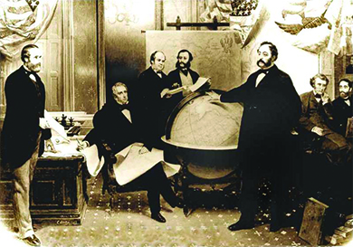
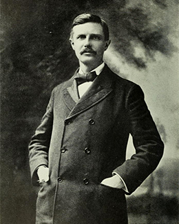

By the end of this section, you will be able to:
* Explain the evolution of American interest in foreign affairs from the end of the Civil War through the early 1890s
* Identify the contributions of Frederick Jackson Turner and Alfred Thayer Mahan to the conscious creation of an American empire

 ![A timeline shows important events of the era. In 1893, Turner presents his Frontier Thesis; a photograph of Frederick Jackson Turner is shown. In 1898, the U.S. annexes Hawaii, Puerto Rico, and the Philippines, and fights the Spanish-American War; a photograph of Queen Liliuokalani and a photograph of American troops raising the U.S. flag at Fort San Antonio Abad in Manila are shown. In 1899, Hay crafts the Open Door policy regarding trade in China. In 1900, the Boxer Rebellion erupts in China; a photograph of several soldiers of the Chinese Imperial Army is shown. In 1901, Congress approves the Platt Amendment regarding Cuba. In 1903, the U.S. obtains rights to build the Panama Canal; a photograph of the construction of the Panama Canal is shown. In 1904, Roosevelt announces the Roosevelt Corollary.](../resources/CNX_History_22_01_Timeline.jpg){: #CNX_History_22_01_Timeline}

During the time of Reconstruction, the U.S. government showed no significant initiative in foreign affairs. Western expansion and the goal of Manifest Destiny still held the country’s attention, and American missionaries proselytized as far abroad as China, India, the Korean Peninsula, and Africa, but reconstruction efforts took up most of the nation’s resources. As the century came to a close, however, a variety of factors, from the closing of the American frontier to the country’s increased industrial production, led the United States to look beyond its borders. Countries in Europe were building their empires through global power and trade, and the United States did not want to be left behind.

### AMERICA’S LIMITED BUT AGGRESSIVE PUSH OUTWARD

On the eve of the Civil War, the country lacked the means to establish a strong position in international diplomacy. As of 1865, the U.S. State Department had barely sixty employees and no ambassadors representing American interests abroad. Instead, only two dozen American foreign ministers were located in key countries, and those often gained their positions not through diplomatic skills or expertise in foreign affairs but through bribes. Further limiting American potential for foreign impact was the fact that a strong international presence required a strong military—specifically a navy—which the United States, after the Civil War, was in no position to maintain. Additionally, as late as 1890, with the U.S. Navy significantly reduced in size, a majority of vessels were classified as “Old Navy,” meaning a mixture of iron hulled and wholly wooden ships. While the navy had introduced the first all-steel, triple-hulled steam engine vessels seven years earlier, they had only thirteen of them in operation by 1890.

Despite such widespread isolationist impulses and the sheer inability to maintain a strong international position, the United States moved ahead sporadically with a modest foreign policy agenda in the three decades following the Civil War. Secretary of State William Seward, who held that position from 1861 through 1869, sought to extend American political and commercial influence in both Asia and Latin America. He pursued these goals through a variety of actions. A treaty with Nicaragua set the early course for the future construction of a canal across Central America. He also pushed through the annexation of the Midway Islands in the Pacific Ocean, which subsequently opened a more stable route to Asian markets. In frequent conversations with President Lincoln, among others, Seward openly spoke of his desire to obtain British Columbia, the Hawaiian Islands, portions of the Dominican Republic, Cuba, and other territories. He explained his motives to a Boston audience in 1867, when he professed his intention to give the United States “control of the world.”

Most notably, in 1867, Seward obtained the Alaskan Territory from Russia for a purchase price of $7.2 million. Fearing future loss of the territory through military conflict, as well as desiring to create challenges for Great Britain (which they had fought in the Crimean War), Russia had happily accepted the American purchase offer. In the United States, several newspaper editors openly questioned the purchase and labeled it “**Seward’s Folly**{: data-type="term"}” ([\[link\]](#CNX_History_22_01_Alaska)). They highlighted the lack of Americans to populate the vast region and lamented the challenges in attempting to govern the native peoples in that territory. Only if gold were to be found, the editors decried, would the secretive purchase be justified. That is exactly what happened. Seward’s purchase added an enormous territory to the country—nearly 600,000 square miles—and also gave the United States access to the rich mineral resources of the region, including the gold that trigged the Klondike Gold Rush at the close of the century. As was the case elsewhere in the American borderlands, Alaska’s industrial development wreaked havoc on the region’s indigenous and Russian cultures.

 {: #CNX_History_22_01_Alaska}

Seward’s successor as Secretary of State, Hamilton Fish, held the position from 1869 through 1877. Fish spent much of his time settling international disputes involving American interests, including claims that British assistance to the Confederates prolonged the Civil War for about two years. In these so-called Alabama claims, a U.S. senator charged that the Confederacy won a number of crucial battles with the help of one British cruiser and demanded $2 billion in British reparations. Alternatively, the United States would settle for the rights to Canada. A joint commission representing both countries eventually settled on a British payment of $15 million to the United States. In the negotiations, Fish also suggested adding the Dominican Republic as a territorial possession with a path towards statehood, as well as discussing the construction of a transoceanic canal with Columbia. Although neither negotiation ended in the desired result, they both expressed Fish’s intent to cautiously build an American empire without creating any unnecessary military entanglements in the wake of the Civil War.

### BUSINESS, RELIGIOUS, AND SOCIAL INTERESTS SET THE STAGE FOR EMPIRE

While the United States slowly pushed outward and sought to absorb the borderlands (and the indigenous cultures that lived there), the country was also changing how it functioned. As a new industrial United States began to emerge in the 1870s, economic interests began to lead the country toward a more expansionist foreign policy. By forging new and stronger ties overseas, the United States would gain access to international markets for export, as well as better deals on the raw materials needed domestically. The concerns raised by the economic depression of the early 1890s further convinced business owners that they needed to tap into new markets, even at the risk of foreign entanglements.

As a result of these growing economic pressures, American exports to other nations skyrocketed in the years following the Civil War, from $234 million in 1865 to $605 million in 1875. By 1898, on the eve of the Spanish-American War, American exports had reached a height of $1.3 billion annually. Imports over the same period also increased substantially, from $238 million in 1865 to $616 million in 1898. Such an increased investment in overseas markets in turn strengthened Americans’ interest in foreign affairs.

Businesses were not the only ones seeking to expand. Religious leaders and Progressive reformers joined businesses in their growing interest in American expansion, as both sought to increase the democratic and Christian influences of the United States abroad. Imperialism and Progressivism were compatible in the minds of many reformers who thought the Progressive impulses for democracy at home translated overseas as well. Editors of such magazines as *Century*, *Outlook*, and *Harper’s* supported an imperialistic stance as the democratic responsibility of the United States. Several Protestant faiths formed missionary societies in the years after the Civil War, seeking to expand their reach, particularly in Asia. Influenced by such works as Reverend Josiah Strong’s *Our Country: Its Possible Future and Its Present Crisis* (1885), missionaries sought to spread the gospel throughout the country and abroad. Led by the American Board of Commissioners for Foreign Missions, among several other organizations, missionaries conflated Christian ethics with American virtues, and began to spread both gospels with zeal. This was particularly true among women missionaries, who composed over 60 percent of the overall missionary force. By 1870, missionaries abroad spent as much time advocating for the American version of a modern civilization as they did teaching the Bible.

Social reformers of the early Progressive Era also performed work abroad that mirrored the missionaries. Many were influenced by recent scholarship on race-based intelligence and embraced the implications of social Darwinist theory that alleged inferior races were destined to poverty on account of their lower evolutionary status. While certainly not all reformers espoused a racist view of intelligence and civilization, many of these reformers believed that the Anglo-Saxon race was mentally superior to others and owed the presumed less evolved populations their stewardship and social uplift—a service the British writer Rudyard Kipling termed “the white man’s burden.”

By trying to help people in less industrialized countries achieve a higher standard of living and a better understanding of the principles of democracy, reformers hoped to contribute to a noble cause, but their approach suffered from the same paternalism that hampered Progressive reforms at home. Whether reformers and missionaries worked with native communities in the borderlands such as New Mexico; in the inner cities, like the Salvation Army; or overseas, their approaches had much in common. Their good intentions and willingness to work in difficult conditions shone through in the letters and articles they wrote from the field. Often in their writing, it was clear that they felt divinely empowered to change the lives of other, less fortunate, and presumably, less enlightened, people. Whether oversees or in the urban slums, they benefitted from the same passions but expressed the same paternalism.

Lottie Moon, Missionary

Lottie Moon was a Southern Baptist missionary who spent more than forty years living and working in China. She began in 1873 when she joined her sister in China as a missionary, teaching in a school for Chinese women. Her true passion, however, was to evangelize and minister, and she undertook a campaign to urge the Southern Baptist missionaries to allow women to work beyond the classroom. Her letter campaign back to the head of the Mission Board provided a vivid picture of life in China and exhorted the Southern Baptist women to give more generously of their money and their time. Her letters appeared frequently in religious publications, and it was her suggestion—that the week before Christmas be established as a time to donate to foreign missions—that led to the annual Christmas giving tradition. Lottie’s rhetoric caught on, and still today, the annual Christmas offering is done in her name.

<q>We had the best possible voyage over the water—good weather, no headwinds, scarcely any rolling or pitching—in short, all that reasonable people could ask. . . . I spent a week here last fall and of course feel very natural to be here again. I do so love the East and eastern life! Japan fascinated my heart and fancy four years ago, but now I honestly believe I love China the best, and actually, which is stranger still, like the Chinese best.* * *
{: data-type="newline"}

 —Charlotte “Lottie” Moon, 1877</q>

Lottie remained in China through famines, the **Boxer Rebellion**{: data-type="term" .no-emphasis}, and other hardships. She fought against foot binding, a cultural tradition where girls’ feet were tightly bound to keep them from growing, and shared her personal food and money when those around her were suffering. But her primary goal was to evangelize her Christian beliefs to the people in China. She won the right to minister and personally converted hundreds of Chinese to Christianity. Lottie’s combination of moral certainty and selfless service was emblematic of the missionary zeal of the early American empire.

### TURNER, MAHAN, AND THE PLAN FOR EMPIRE

The initial work of businesses, missionaries, and reformers set the stage by the early 1890s for advocates of an expanded foreign policy and a vision of an American empire. Following decades of an official stance of isolationism combined with relatively weak presidents who lacked the popular mandate or congressional support to undertake substantial overseas commitments, a new cadre of American leaders—many of whom were too young to fully comprehend the damage inflicted by the Civil War—assumed leadership roles. Eager to be tested in international conflict, these new leaders hoped to prove America’s might on a global stage. The Assistant Secretary of the Navy, Theodore Roosevelt, was one of these leaders who sought to expand American influence globally, and he advocated for the expansion of the U.S. Navy, which at the turn of the century was the only weapons system suitable for securing overseas expansion.

Turner ([\[link\]](#CNX_History_22_01_Turner)) and naval strategist Alfred Thayer Mahan were instrumental in the country’s move toward foreign expansion, and writer Brooks Adams further dramatized the consequences of the nation’s loss of its frontier in his *The Law of Civilization and Decay* in 1895. As mentioned in the chapter opening, Turner announced his **Frontier Thesis**{: data-type="term"}—that American democracy was largely formed by the American frontier—at the Chicago World’s Colombian Exposition. He noted that “for nearly three centuries the dominant fact in American life has been expansion.” He continued: “American energy will continually demand a wider field for its exercise.”

 {: #CNX_History_22_01_Turner}

Although there was no more room for these forces to proceed domestically, they would continue to find an outlet on the international stage. Turner concluded that “the demands for a vigorous foreign policy, for an interoceanic canal, for a revival of our power upon our seas, and for the extension of American influence to outlying islands and adjoining countries are indications that the forces \[of expansion\] will continue.” Such policies would permit Americans to find new markets. Also mindful of the mitigating influence of a frontier—in terms of easing pressure from increased immigration and population expansion in the eastern and midwestern United States—he encouraged new outlets for further population growth, whether as lands for further American settlement or to accommodate more immigrants. Turner’s thesis was enormously influential at the time but has subsequently been widely criticized by historians. Specifically, the thesis underscores the pervasive racism and disregard for the indigenous communities, cultures, and individuals in the American borderlands and beyond.

  
Explore the [controversy associated with Turner’s Frontier Thesis][1] at U.S. History Scene.

While Turner provided the idea for an empire, Mahan provided the more practical guide. In his 1890 work, *The Influence of Seapower upon History*, he suggested three strategies that would assist the United States in both constructing and maintaining an empire. First, noting the sad state of the U.S. Navy, he called for the government to build a stronger, more powerful version. Second, he suggested establishing a network of naval bases to fuel this expanding fleet. Seward’s previous acquisition of the Midway Islands served this purpose by providing an essential naval coaling station, which was vital, as the limited reach of steamships and their dependence on coal made naval coaling stations imperative for increasing the navy’s geographic reach. Future acquisitions in the Pacific and Caribbean increased this naval supply network ([\[link\]](#CNX_History_22_01_Imperial)). Finally, Mahan urged the future construction of a canal across the isthmus of Central America, which would decrease by two-thirds the time and power required to move the new navy from the Pacific to the Atlantic oceans. Heeding Mahan’s advice, the government moved quickly, passing the Naval Act of 1890, which set production levels for a new, modern fleet. By 1898, the government had succeeded in increasing the size of the U.S. Navy to an active fleet of 160 vessels, of which 114 were newly built of steel. In addition, the fleet now included six battleships, compared to zero in the previous decade. As a naval power, the country catapulted to the third strongest in world rankings by military experts, trailing only Spain and Great Britain.

 {: #CNX_History_22_01_Imperial}

The United States also began to expand its influence to other Pacific Islands, most notably Samoa and Hawaii. With regard to the latter, American businessmen were most interested in the lucrative sugar industry that lay at the heart of the Hawaiian Islands’ economy. By 1890, through a series of reciprocal trade agreements, Hawaiians exported nearly all of their sugar production to the United States, tariff-free. When Queen Liliuokalani tapped into a strong anti-American resentment among native Hawaiians over the economic and political power of exploitative American sugar companies between 1891 and 1893, worried businessmen worked with the American minister to Hawaii, John Stevens, to stage a quick, armed revolt to counter her efforts and seize the islands as an American protectorate ([\[link\]](#CNX_History_22_01_Hawaii)). Following five more years of political wrangling, the United States annexed Hawaii in 1898, during the Spanish-American War.

  was unhappy with the one-sided trade agreement Hawaii held with the United States (b), but protests were squashed by an American-armed revolt."){: #CNX_History_22_01_Hawaii}

The United States had similar strategic interests in the Samoan Islands of the South Pacific, most notably, access to the naval refueling station at Pago Pago where American merchant vessels as well as naval ships could take on food, fuel, and supplies. In 1899, in an effort to mitigate other foreign interests and still protect their own, the United States joined Great Britain and Germany in a three-party protectorate over the islands, which assured American access to the strategic ports located there.

### Section Summary

In the last decades of the nineteenth century, after the Civil War, the United States pivoted from a profoundly isolationist approach to a distinct zeal for American expansion. The nation’s earlier isolationism originated from the deep scars left by the Civil War and its need to recover both economically and mentally from that event. But as the industrial revolution changed the way the country worked and the American West reached its farthest point, American attitudes toward foreign expansion shifted. Businesses sought new markets to export their factory-built goods, oil, and tobacco products, as well as generous trade agreements to secure access to raw materials. Early social reformers saw opportunities to spread Christian gospel and the benefits of American life to those in less developed nations. With the rhetoric of Fredrick J. Turner and the strategies of Alfred Mahan underpinning the desire for expansion abroad, the country moved quickly to ready itself for the creation of an American empire.

### Review Questions

Why did the United States express limited interest in overseas expansion in the 1860s and 1870s?

1.  fear of attacks on their borders
2.  post-Civil War reconstruction
3.  the Anti-Imperialist League
4.  Manifest Destiny
{: type="A"}

B

Which of the following did Mahan *not* believe was needed to build an American empire?

1.  a navy
2.  military bases around the world
3.  the reopening of the American frontier
4.  a canal through Central America
{: type="A"}

C

Why were the Midway Islands important to American expansion?

The Midway Islands provided a more stable path to Asian markets and a vital naval coaling station, which steamships needed in order to travel further afield.

### Glossary
{: data-type="glossary-title"}

Frontier Thesis
: an idea proposed by Fredrick Jackson Turner, which stated that the encounter of European traditions and a native wilderness was integral to the development of American democracy, individualism, and innovative character
^

Seward’s Folly
: the pejorative name given by the press to Secretary of State Seward’s acquisition of Alaska in 1867

[1]: http://ushistoryscene.com/article/legacy-of-conquest/
