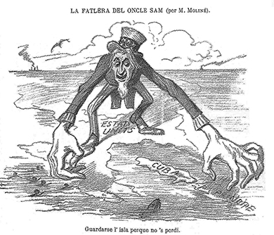
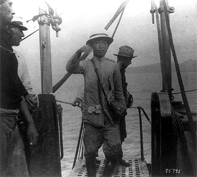

By the end of this section, you will be able to:
* Explain the origins and events of the Spanish-American War
* Analyze the different American opinions on empire at the conclusion of the Spanish-American War
* Describe how the Spanish-American War intersected with other American expansions to solidify the nation’s new position as an empire

The Spanish-American War was the first significant international military conflict for the United States since its war against Mexico in 1846; it came to represent a critical milestone in the country’s development as an empire. Ostensibly about the rights of Cuban rebels to fight for freedom from Spain, the war had, for the United States at least, a far greater importance in the country’s desire to expand its global reach.

The Spanish-American War was notable not only because the United States succeeded in seizing territory from another empire, but also because it caused the global community to recognize that the United States was a formidable military power. In what Secretary of State John Hay called “a splendid little war,” the United States significantly altered the balance of world power, just as the twentieth century began to unfold ([\[link\]](#CNX_History_22_02_Cuba)).

 {: #CNX_History_22_02_Cuba}

# THE CHALLENGE OF DECLARING WAR

Despite its name, the Spanish-American War had less to do with the foreign affairs between the United States and Spain than Spanish control over Cuba and its possessions in the Far East. Spain had dominated Central and South America since the late fifteenth century. But, by 1890, the only Spanish colonies that had not yet acquired their independence were Cuba and Puerto Rico. On several occasions prior to the war, Cuban independence fighters in the Cuba Libre movement had attempted unsuccessfully to end Spanish control of their lands. In 1895, a similar revolt for independence erupted in Cuba; again, Spanish forces under the command of General Valeriano Weyler repressed the insurrection. Particularly notorious was their policy of re-concentration in which Spanish troops forced rebels from the countryside into military-controlled camps in the cities, where many died from harsh conditions.

As with previous uprisings, Americans were largely sympathetic to the Cuban rebels’ cause, especially as the Spanish response was notably brutal. Evoking the same rhetoric of independence with which they fought the British during the American Revolution, several people quickly rallied to the Cuban fight for freedom. Shippers and other businessmen, particularly in the sugar industry, supported American intervention to safeguard their own interests in the region. Likewise, the “Cuba Libre” movement founded by **José Martí**{: data-type="term" .no-emphasis}, who quickly established offices in New York and Florida, further stirred American interest in the liberation cause. The difference in this uprising, however, was that supporters saw in the renewed U.S. Navy a force that could be a strong ally for Cuba. Additionally, the late 1890s saw the height of **yellow journalism**{: data-type="term"}, in which newspapers such as the *New York Journal*, led by William Randolph Hearst, and the *New York World*, published by Joseph Pulitzer, competed for readership with sensationalistic stories. These publishers, and many others who printed news stories for maximum drama and effect, knew that war would provide sensational copy.

However, even as sensationalist news stories fanned the public’s desire to try out their new navy while supporting freedom, one key figure remained unmoved. President William McKinley, despite commanding a new, powerful navy, also recognized that the new fleet—and soldiers—were untested. Preparing for a reelection bid in 1900, McKinley did not see a potential war with Spain, acknowledged to be the most powerful naval force in the world, as a good bet. McKinley did publicly admonish Spain for its actions against the rebels, and urged Spain to find a peaceful solution in Cuba, but he remained resistant to public pressure for American military intervention.

McKinley’s reticence to involve the United States changed in February 1898. He had ordered one of the newest navy battleships, the USS *Maine*, to drop anchor off the coast of Cuba in order to observe the situation, and to prepare to evacuate American citizens from Cuba if necessary. Just days after it arrived, on February 15, an explosion destroyed the *Maine*, killing over 250 American sailors ([\[link\]](#CNX_History_22_02_YellowJour)). Immediately, yellow journalists jumped on the headline that the explosion was the result of a Spanish attack, and that all Americans should rally to war. The newspaper battle cry quickly emerged, “Remember the Maine!” Recent examinations of the evidence of that time have led many historians to conclude that the explosion was likely an accident due to the storage of gun powder close to the very hot boilers. But in 1898, without ready evidence, the newspapers called for a war that would sell papers, and the American public rallied behind the cry.

 ![The front page of the New York Journal and Advertiser is shown. Various stories and images describe the destruction of the USS Maine. The central headline reads, &#x201C;Destruction of the War Ship Maine was the Work of an Enemy. Assistant Secretary Roosevelt Convinced the Explosion of the War Ship Was Not an Accident. The Journal Offers $50,000 Reward for the Conviction of the Criminals Who Sent 258 American Soldiers to their Death. Naval Officers Unanimous That the Ship Was Destroyed on Purpose.&#x201D;](../resources/CNX_History_22_02_YellowJour.jpg "Although later reports would suggest the explosion was due to loose gunpowder onboard the ship, the press treated the explosion of the USS Maine as high drama. Note the lower headline citing that the ship was destroyed by a mine, despite the lack of evidence."){: #CNX_History_22_02_YellowJour}

  
Visit U.S. History Scene to understand different perspectives on the [role of yellow journalism][1] in the Spanish-American War.

McKinley made one final effort to avoid war, when late in March, he called on Spain to end its policy of concentrating the native population in military camps in Cuba, and to formally declare Cuba’s independence. Spain refused, leaving McKinley little choice but to request a declaration of war from Congress. Congress received McKinley’s war message, and on April 19, 1898, they officially recognized Cuba’s independence and authorized McKinley to use military force to remove Spain from the island. Equally important, Congress passed the Teller Amendment to the resolution, which stated that the United States would not annex Cuba following the war.

# WAR: BRIEF AND DECISIVE

The Spanish-American War lasted approximately ten weeks, and the outcome was clear: The United States triumphed in its goal of helping liberate Cuba from Spanish control. Despite the positive result, the conflict did present significant challenges to the United States military. Although the new navy was powerful, the ships were, as McKinley feared, largely untested. Similarly untested were the American soldiers. The country had fewer than thirty thousand soldiers and sailors, many of whom were unprepared to do battle with a formidable opponent. But volunteers sought to make up the difference. Over one million American men—many lacking a uniform and coming equipped with their own guns—quickly answered McKinley’s call for able-bodied men. Nearly ten thousand African American men also volunteered for service, despite the segregated conditions and additional hardships they faced, including violent uprisings at a few American bases before they departed for Cuba. The government, although grateful for the volunteer effort, was still unprepared to feed and supply such a force, and many suffered malnutrition and malaria for their sacrifice.

To the surprise of the Spanish forces who saw the conflict as a clear war over Cuba, American military strategists prepared for it as a war for empire. More so than simply the liberation of Cuba and the protection of American interests in the Caribbean, military strategists sought to further Mahan’s vision of additional naval bases in the Pacific Ocean, reaching as far as mainland Asia. Such a strategy would also benefit American industrialists who sought to expand their markets into China. Just before leaving his post for volunteer service as a lieutenant colonel in the U.S. cavalry, Assistant Secretary of the Navy Theodore Roosevelt ordered navy ships to attack the Spanish fleet in the Philippines, another island chain under Spanish control. As a result, the first significant military confrontation took place not in Cuba but halfway around the world in the Philippines. Commodore George Dewey led the U.S. Navy in a decisive victory, sinking all of the Spanish ships while taking almost no American losses. Within a month, the U.S. Army landed a force to take the islands from Spain, which it succeeded in doing by mid-August 1899.

The victory in Cuba took a little longer. In June, seventeen thousand American troops landed in Cuba. Although they initially met with little Spanish resistance, by early July, fierce battles ensued near the Spanish stronghold in Santiago. Most famously, Theodore Roosevelt led his **Rough Riders**{: data-type="term"}, an all-volunteer cavalry unit made up of adventure-seeking college graduates, and veterans and cowboys from the Southwest, in a charge up Kettle Hill, next to San Juan Hill, which resulted in American forces surrounding Santiago. The victories of the Rough Riders are the best known part of the battles, but in fact, several African American regiments, made up of veteran soldiers, were instrumental to their success. The Spanish fleet made a last-ditch effort to escape to the sea but ran into an American naval blockade that resulted in total destruction, with every Spanish vessel sunk. Lacking any naval support, Spain quickly lost control of Puerto Rico as well, offering virtually no resistance to advancing American forces. By the end of July, the fighting had ended and the war was over. Despite its short duration and limited number of casualties—fewer than 350 soldiers died in combat, about 1,600 were wounded, while almost 3,000 men died from disease—the war carried enormous significance for Americans who celebrated the victory as a reconciliation between North and South.

“Smoked Yankees”: Black Soldiers in the Spanish-American War

The most popular image of the Spanish-American War is of Theodore Roosevelt and his Rough Riders, charging up San Juan Hill. But less well known is that the Rough Riders struggled mightily in several battles and would have sustained far more serious casualties, if not for the experienced black veterans—over twenty-five hundred of them—who joined them in battle ([\[link\]](#CNX_History_22_02_Soldiers)). These soldiers, who had been fighting the Indian wars on the American frontier for many years, were instrumental in the U.S. victory in Cuba.

"){: #CNX_History_22_02_Soldiers}

The choice to serve in the Spanish-American War was not a simple one. Within the black community, many spoke out both for and against involvement in the war. Many black Americans felt that because they were not offered the true rights of citizenship it was not their burden to volunteer for war. Others, in contrast, argued that participation in the war offered an opportunity for black Americans to prove themselves to the rest of the country. While their presence was welcomed by the military which desperately needed experienced soldiers, the black regiments suffered racism and harsh treatment while training in the southern states before shipping off to battle.

Once in Cuba, however, the “Smoked Yankees,” as the Cubans called the black American soldiers, fought side-by-side with Roosevelt’s Rough Riders, providing crucial tactical support to some of the most important battles of the war. After the Battle of San Juan, five black soldiers received the Medal of Honor and twenty-five others were awarded a certificate of merit. One reporter wrote that “if it had not been for the Negro cavalry, the Rough Riders would have been exterminated.” He went on to state that, having grown up in the South, he had never been fond of black people before witnessing the battle. For some of the soldiers, their recognition made the sacrifice worthwhile. Others, however, struggled with American oppression of Cubans and Puerto Ricans, feeling kinship with the black residents of these countries now under American rule.

# ESTABLISHING PEACE AND CREATING AN EMPIRE

As the war closed, Spanish and American diplomats made arrangements for a peace conference in Paris. They met in October 1898, with the Spanish government committed to regaining control of the Philippines, which they felt were unjustly taken in a war that was solely about Cuban independence. While the Teller Amendment ensured freedom for Cuba, President McKinley was reluctant to relinquish the strategically useful prize of the Philippines. He certainly did not want to give the islands back to Spain, nor did he want another European power to step in to seize them. Neither the Spanish nor the Americans considered giving the islands their independence, since, with the pervasive racism and cultural stereotyping of the day, they believed the Filipino people were not capable of governing themselves. William Howard Taft, the first American governor-general to oversee the administration of the new U.S. possession, accurately captured American sentiments with his frequent reference to Filipinos as “our little brown brothers.”

As the peace negotiations unfolded, Spain agreed to recognize Cuba’s independence, as well as recognize American control of Puerto Rico and Guam. McKinley insisted that the United States maintain control over the Philippines as an annexation, in return for a $20 million payment to Spain. Although Spain was reluctant, they were in no position militarily to deny the American demand. The two sides finalized the Treaty of Paris on December 10, 1898. With it came the international recognition that there was a new American empire that included the Philippines, Puerto Rico, and Guam. The American press quickly glorified the nation’s new reach, as expressed in the cartoon below, depicting the glory of the American eagle reaching from the Philippines to the Caribbean ([\[link\]](#CNX_History_22_02_Eagle)).

 ![A cartoon is captioned &#x201C;Ten thousand miles from tip to tip.&#x201D; A portion of a globe is shown, with the United States at the top and various islands, including &#x201C;Porto Rico,&#x201D; &#x201C;Manila,&#x201D; &#x201C;Carolinas,&#x201D; and &#x201C;Samoa Ids.&#x201D; labeled beneath. Above the globe, a giant bald eagle hovers, with the sun and a half-circle of stars behind it. In the lower corner, a tiny map with another eagle, labeled &#x201C;U.S. 1798,&#x201D; provides a contrast with the size and reach of the nation a century earlier.](../resources/CNX_History_22_02_Eagle.jpg "This cartoon from the Philadelphia Press, showed the reach of the new American empire, from Puerto Rico to the Philippines."){: #CNX_History_22_02_Eagle}

Domestically, the country was neither unified in their support of the treaty nor in the idea of the United States building an empire at all. Many prominent Americans, including Jane Addams, former President Grover Cleveland, Andrew Carnegie, Mark Twain, and Samuel Gompers, felt strongly that the country should not be pursuing an empire, and, in 1898, they formed the **Anti-Imperialist League**{: data-type="term"} to oppose this expansionism. The reasons for their opposition were varied: Some felt that empire building went against the principles of democracy and freedom upon which the country was founded, some worried about competition from foreign workers, and some held the xenophobic viewpoint that the assimilation of other races would hurt the country. Regardless of their reasons, the group, taken together, presented a formidable challenge. As foreign treaties require a two-thirds majority in the U.S. Senate to pass, the Anti-Imperialist League’s pressure led them to a clear split, with the possibility of defeat of the treaty seeming imminent. Less than a week before the scheduled vote, however, news of a Filipino uprising against American forces reached the United States. Undecided senators were convinced of the need to maintain an American presence in the region and preempt the intervention of another European power, and the Senate formally ratified the treaty on February 6, 1899.

The newly formed American empire was not immediately secure, as Filipino rebels, led by Emilio Aguinaldo ([\[link\]](#CNX_History_22_02_Agiunaldo)), fought back against American forces stationed there. The Filipinos’ war for independence lasted three years, with over four thousand American and twenty thousand Filipino combatant deaths; the civilian death toll is estimated as high as 250,000. Finally, in 1901, President McKinley appointed William Howard Taft as the civil governor of the Philippines in an effort to disengage the American military from direct confrontations with the Filipino people. Under Taft’s leadership, Americans built a new transportation infrastructure, hospitals, and schools, hoping to win over the local population. The rebels quickly lost influence, and Aguinaldo was captured by American forces and forced to swear allegiance to the United States. The Taft Commission, as it became known, continued to introduce reforms to modernize and improve daily life for the country despite pockets of resistance that continued to fight through the spring of 1902. Much of the commission’s rule centered on legislative reforms to local government structure and national agencies, with the commission offering appointments to resistance leaders in exchange for their support. The Philippines continued under American rule until they became self-governing in 1946.

{: #CNX_History_22_02_Agiunaldo}

After the conclusion of the Spanish-American War and the successful passage of the peace treaty with Spain, the United States continued to acquire other territories. Seeking an expanded international presence, as well as control of maritime routes and naval stations, the United States grew to include Hawaii, which was granted territorial status in 1900, and Alaska, which, although purchased from Russia decades earlier, only became a recognized territory in 1912. In both cases, their status as territories granted U.S. citizenship to their residents. The Foraker Act of 1900 established Puerto Rico as an American territory with its own civil government. It was not until 1917 that Puerto Ricans were granted American citizenship. Guam and Samoa, which had been taken as part of the war, remained under the control of the U.S. Navy. Cuba, which after the war was technically a free country, adopted a constitution based on the U.S. Constitution. While the Teller Amendment had prohibited the United States from annexing the country, a subsequent amendment, the Platt Amendment, secured the right of the United States to interfere in Cuban affairs if threats to a stable government emerged. The Platt Amendment also guaranteed the United States its own naval and coaling station on the island’s southern Guantanamo Bay and prohibited Cuba from making treaties with other countries that might eventually threaten their independence. While Cuba remained an independent nation on paper, in all practicality the United States governed Cuba’s foreign policy and economic agreements.

  
Explore the resources at U.S. History Scene to better understand the long and involved [history of Hawaii][2] with respect to its intersection with the United States.

# Section Summary

In the wake of the Civil War, American economic growth combined with the efforts of Evangelist missionaries to push for greater international influence and overseas presence. By confronting Spain over its imperial rule in Cuba, the United States took control of valuable territories in Central America and the Pacific. For the United States, the first step toward becoming an empire was a decisive military one. By engaging with Spain, the United States was able to gain valuable territories in Latin America and Asia, as well as send a message to other global powers. The untested U.S. Navy proved superior to the Spanish fleet, and the military strategists who planned the war in the broader context of empire caught the Spanish by surprise. The annexation of the former Spanish colonies of Guam, Puerto Rico, and the Philippines, combined with the acquisition of Hawaii, Samoa, and Wake Island, positioned the United States as the predominant world power in the South Pacific and the Caribbean. While some prominent figures in the United States vehemently disagreed with the idea of American empire building, their concerns were overruled by an American public—and a government—that understood American power overseas as a form of prestige, prosperity, and progress.

# Review Questions

Which is *not* one of the reasons the Anti-Imperial League gave for opposing the creation of an American empire?  fear of competition from foreign workers fear that the United States would suffer a foreign invasion concerns about the integration of other races concerns that empire building ran counter to American democratic principles 

B

What was the role of the Taft Commission?

The Taft Commission introduced reforms to modernize and improve daily life in the Philippines. Many of these reforms were legislative in nature, impacting the structure and composition of local governments. In exchange for the support of resistance leaders, for example, the commission offered them political appointments.

What challenges did the U.S. military have to overcome in the Spanish-American War? What accounted for the nation’s eventual victory?

The Spanish-American War posed a series of challenges to the United States’ military capacities. The new U.S. Navy, while impressive, was still untested, and no one was certain how the new ships would perform. Further, the country had a limited army, with fewer than thirty thousand soldier and sailors. While over one million men ultimately volunteered for service, they were untrained, and the army was ill-prepared to house, arm, and feed them all. Eventually, American naval strength, combined with the proximity of American supplies relative to the distance Spanish forces traveled, made the decisive difference. In a war upon the sea, the U.S. Navy proved superior in both the Philippines and the blockade of Cuba.

[1]: http://openstaxcollege.org/l/yellowjourn
[2]: http://openstaxcollege.org/l/createHawaii
