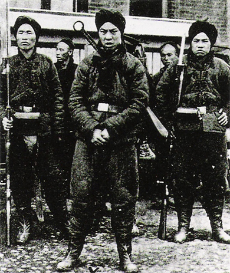

By the end of this section, you will be able to:
* Explain how economic power helped to expand America’s empire in China
* Describe how the foreign partitioning of China in the last decade of the nineteenth century influenced American policy

While American forays into empire building began with military action, the country concurrently grew its scope and influence through other methods as well. In particular, the United States used its economic and industrial capacity to add to its empire, as can be seen in a study of the China market and the “Open Door notes” discussed below.

### WHY CHINA?

Since the days of Christopher Columbus’s westward journey to seek a new route to the East Indies (essentially India and China, but loosely defined as all of Southeast Asia), many westerners have dreamt of the elusive “China Market.” With the defeat of the Spanish navy in the Atlantic and Pacific, and specifically with the addition of the Philippines as a base for American ports and coaling stations, the United States was ready to try and make the myth a reality. Although China originally accounted for only a small percentage of American foreign trade, captains of American industry dreamed of a vast market of Asian customers desperate for manufactured goods they could not yet produce in large quantities for themselves.

American businesses were not alone in seeing the opportunities. Other countries—including Japan, Russia, Great Britain, France, and Germany—also hoped to make inroads in China. Previous treaties between Great Britain and China in 1842 and 1844 during the Opium Wars, when the British Empire militarily coerced the Chinese empire to accept the import of Indian opium in exchange for its tea, had forced an “open door” policy on China, in which all foreign nations had free and equal access to Chinese ports. This was at a time when Great Britain maintained the strongest economic relationship with China; however, other western nations used the new arrangement to send Christian missionaries, who began to work across inland China. Following the Sino-Japanese War of 1894–1895 over China’s claims to Korea, western countries hoped to exercise even greater influence in the region. By 1897, Germany had obtained exclusive mining rights in northern coastal China as reparations for the murder of two German missionaries. In 1898, Russia obtained permission to build a railroad across northeastern Manchuria. One by one, each country carved out their own **sphere of influence**{: data-type="term"}, where they could control markets through tariffs and transportation, and thus ensure their share of the Chinese market.

Alarmed by the pace at which foreign powers further divided China into pseudo-territories, and worried that they had no significant piece for themselves, the United States government intervened. In contrast to European nations, however, American businesses wanted the whole market, not just a share of it. They wanted to do business in China with no artificially constructed spheres or boundaries to limit the extent of their trade, but without the territorial entanglements or legislative responsibilities that anti-imperialists opposed. With the blessing and assistance of Secretary of State John Hay, several American businessmen created the American Asiatic Association in 1896 to pursue greater trade opportunities in China.

### THE OPEN DOOR NOTES

In 1899, Secretary of State Hay made a bold move to acquire China’s vast markets for American access by introducing **Open Door notes**{: data-type="term"}, a series of circular notes that Hay himself drafted as an expression of U.S. interests in the region and sent to the other competing powers ([\[link\]](#CNX_History_22_03_Hay)). These notes, if agreed to by the other five nations maintaining spheres of influences in China, would erase all spheres and essentially open all doors to free trade, with no special tariffs or transportation controls that would give unfair advantages to one country over another. Specifically, the notes required that all countries agree to maintain free access to all treaty ports in China, to pay railroad charges and harbor fees (with no special access), and that only China would be permitted to collect any taxes on trade within its borders. While on paper, the Open Door notes would offer equal access to all, the reality was that it greatly favored the United States. Free trade in China would give American businesses the ultimate advantage, as American companies were producing higher-quality goods than other countries, and were doing so more efficiently and less expensively. The “open doors” would flood the Chinese market with American goods, virtually squeezing other countries out of the market.

 ![A cartoon captioned &#x201C;Putting His Foot Down&#x201D; shows Uncle Sam standing on a map of China, while Europe&#x2019;s imperialist nations (Germany, Spain, Great Britain, Russia, and France) try to cut out their &#x201C;sphere of influence&#x201D; using large scissors. Austria sharpens its own scissors in the background. Uncle Sam holds a document labeled &#x201C;Trade Treaty with China&#x201D; and says, &#x201C;Gentleman, you may cut up this map as much as you like, but remember, I\'m here to stay, and you can\'t divide Me up into spheres of influence.&#x201D;](../resources/CNX_History_22_03_Hay.jpg "This political cartoon shows Uncle Sam standing on a map of China, while Europe&#x2019;s imperialist nations (from left to right: Germany, Spain, Great Britain, Russia, and France) try to cut out their &#x201C;sphere of influence.&#x201D;"){: #CNX_History_22_03_Hay}

Although the foreign ministers of the other five nations sent half-hearted replies on behalf of their respective governments, with some outright denying the viability of the notes, Hay proclaimed them the new official policy on China, and American goods were unleashed throughout the nation. China was quite welcoming of the notes, as they also stressed the U.S. commitment to preserving the Chinese government and territorial integrity.

The notes were invoked barely a year later, when a group of Chinese insurgents, the Righteous and Harmonious Fists—also known as the Boxer Rebellion (1899)—fought to expel all western nations and their influences from China ([\[link\]](#CNX_History_22_03_Boxer)). The United States, along with Great Britain and Germany, sent over two thousand troops to withstand the rebellion. The troops signified American commitment to the territorial integrity of China, albeit one flooded with American products. Despite subsequent efforts, by Japan in particular, to undermine Chinese authority in 1915 and again during the Manchurian crisis of 1931, the United States remained resolute in defense of the open door principles through World War II. Only when China turned to communism in 1949 following an intense civil war did the principle become relatively meaningless. However, for nearly half a century, U.S. military involvement and a continued relationship with the Chinese government cemented their roles as preferred trading partners, illustrating how the country used economic power, as well as military might, to grow its empire.

{: #CNX_History_22_03_Boxer}

  
Browse the U.S. State Department’s [Milestones: 1899—1913][1] to learn more about Secretary of State John Hay and the strategy and thinking behind the Open Door notes.

### Section Summary

The United States shifted from isolationism to empire building with its involvement—and victory—in the Spanish-American War. But at the same time, the country sought to expand its reach through another powerful tool: its economic clout. The Industrial Revolution gave American businesses an edge in delivering high-quality products at lowered costs, and the pursuit of an “open door” policy with China opened new markets to American goods. This trade agreement allowed the United States to continue to build power through economic advantage.

### Review Questions

How did Hay’s suggestion of an open door policy in China benefit the United States over other nations?

1.  The United States produced goods of better quality and lower cost than other countries.
2.  The United States enjoyed a historically stronger relationship with the Chinese government.
3.  The United States was the only nation granted permission to collect taxes on the goods it traded within China’s borders.
4.  The United States controlled more foreign ports than other countries.
{: type="A"}

A

How did the Boxer Rebellion strengthen American ties with China?

1.  The United States supported the rebels and gained their support.
2.  The United States provided troops to fight the rebels.
3.  The United States sent arms and financial support to the Chinese government.
4.  The United States thwarted attempts by Great Britain and Germany to fortify the rebels.
{: type="A"}

B

How does the “Open Door notes” episode represent a new, nonmilitary tactic in the expansion of the American empire?

The Open Door notes and the American foray into China revealed the power of economic clout. Given the unprecedented technological advances of the industrial revolution, American goods were often less expensive and of better quality than those produced in other countries, and they were highly sought after in Asia. Therefore, when Hay derided the spheres of influence model, wherein each country had its own room to maneuver in China, he was able to flood Chinese markets with American trade. Through these maneuvers, the United States was able to augment its global standing considerably without the use of its military forces.

### Glossary
{: data-type="glossary-title"}

Open Door notes
: the circular notes sent by Secretary of State Hay claiming that there should be “open doors” in China, allowing all countries equal and total access to all markets, ports, and railroads without any special considerations from the Chinese authorities; while ostensibly leveling the playing field, this strategy greatly benefited the United States
^

sphere of influence
: the goal of foreign countries such as Japan, Russia, France, and Germany to carve out an area of the Chinese market that they could exploit through tariff and transportation agreements

[1]: http://openstaxcollege.org/l/haychina
