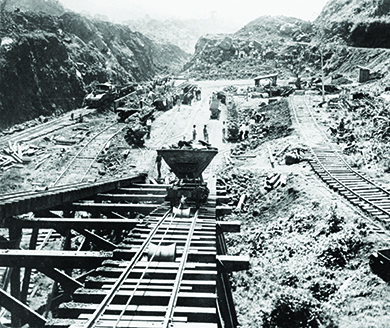
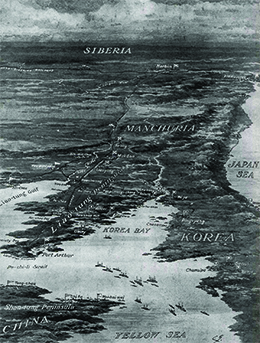

By the end of this section, you will be able to:
* Explain the meaning of “big stick” foreign policy
* Describe Theodore Roosevelt’s use of the “big stick” to construct the Panama Canal
* Explain the role of the United States in ending the Russo-Japanese War

While President McKinley ushered in the era of the American empire through military strength and economic coercion, his successor, Theodore Roosevelt, established a new foreign policy approach, allegedly based on a favorite African proverb, “speak softly, and carry a big stick, and you will go far” ([\[link\]](#CNX_History_22_04_BigStick)). At the crux of his foreign policy was a thinly veiled threat. Roosevelt believed that in light of the country’s recent military successes, it was unnecessary to *use* force to achieve foreign policy goals, so long as the military could *threaten* force. This rationale also rested on the young president’s philosophy, which he termed the “strenuous life,” and that prized challenges overseas as opportunities to instill American men with the resolve and vigor they allegedly had once acquired in the Trans-Mississippi West.

 {: #CNX_History_22_04_BigStick}

Roosevelt believed that while the coercive power wielded by the United States could be harmful in the wrong hands, the Western Hemisphere’s best interests were also the best interests of the United States. He felt, in short, that the United States had the right and the obligation to be the policeman of the hemisphere. This belief, and his strategy of “speaking softly and carrying a big stick,” shaped much of Roosevelt’s foreign policy.

# THE CONSTRUCTION OF THE PANAMA CANAL

As early as the mid-sixteenth century, interest in a canal across the Central American isthmus began to take root, primarily out of trade interests. The subsequent discovery of gold in California in 1848 further spurred interest in connecting the Atlantic and Pacific Oceans, and led to the construction of the Panama Railway, which began operations in 1855. Several attempts by France to construct a canal between 1881 and 1894 failed due to a combination of financial crises and health hazards, including **malaria**{: data-type="term" .no-emphasis} and **yellow fever**{: data-type="term" .no-emphasis}, which led to the deaths of thousands of French workers.

Upon becoming president in 1901, Roosevelt was determined to succeed where others had failed. Following the advice that Mahan set forth in his book *The Influence of Seapower upon History*, he sought to achieve the construction of a canal across Central America, primarily for military reasons associated with empire, but also for international trade considerations. The most strategic point for the construction was across the fifty-mile isthmus of Panama, which, at the turn of the century, was part of the nation of Colombia. Roosevelt negotiated with the government of Colombia, sometimes threatening to take the project away and build through Nicaragua, until Colombia agreed to a treaty that would grant the United States a lease on the land across Panama in exchange for a payment of $10 million and an additional $250,000 annual rental fee. The matter was far from settled, however. The Colombian people were outraged over the loss of their land to the United States, and saw the payment as far too low. Influenced by the public outcry, the Colombian Senate rejected the treaty and informed Roosevelt there would be no canal.

Undaunted, Roosevelt chose to now wield the “big stick.” In comments to journalists, he made it clear that the United States would strongly support the Panamanian people should they choose to revolt against Colombia and form their own nation. In November 1903, he even sent American battleships to the coast of Colombia, ostensibly for practice maneuvers, as the Panamanian revolution unfolded. The warships effectively blocked Colombia from moving additional troops into the region to quell the growing Panamanian uprising. Within a week, Roosevelt immediately recognized the new country of Panama, welcoming them to the world community and offering them the same terms—$10 million plus the annual $250,000 rental fee—he had previously offered Colombia. Following the successful revolution, Panama became an American protectorate, and remained so until 1939.

Once the Panamanian victory was secured, with American support, construction on the canal began in May 1904. For the first year of operations, the United States worked primarily to build adequate housing, cafeterias, warehouses, machine shops, and other elements of infrastructure that previous French efforts had failed to consider. Most importantly, the introduction of fumigation systems and mosquito nets following Dr. Walter Reed’s discovery of the role of mosquitoes in the spread of malaria and yellow fever reduced the death rate and restored the fledgling morale among workers and American-born supervisors. At the same time, a new wave of American engineers planned for the construction of the canal. Even though they decided to build a lock-system rather than a sea-level canal, workers still had to excavate over 170 million cubic yards of earth with the use of over one hundred new rail-mounted steam shovels ([\[link\]](#CNX_History_22_04_Canal)). Excited by the work, Roosevelt became the first sitting U.S. president to leave the country while in office. He traveled to Panama where he visited the construction site, taking a turn at the steam shovel and removing dirt. The canal opened in 1914, permanently changing world trade and military defense patterns.

 {: #CNX_History_22_04_Canal}

  
This [timeline of the Panama Canal][1] illustrates the efforts involved in both the French and U.S. canal projects.

# THE ROOSEVELT COROLLARY

With the construction of the canal now underway, Roosevelt next wanted to send a clear message to the rest of the world—and in particular to his European counterparts—that the colonization of the Western Hemisphere had now ended, and their interference in the countries there would no longer be tolerated. At the same time, he sent a message to his counterparts in Central and South America, should the United States see problems erupt in the region, that it would intervene in order to maintain peace and stability throughout the hemisphere.

Roosevelt articulated this seeming double standard in a 1904 address before Congress, in a speech that became known as the **Roosevelt Corollary**{: data-type="term"}. The Roosevelt Corollary was based on the original Monroe Doctrine of the early nineteenth century, which warned European nations of the consequences of their interference in the Caribbean. In this addition, Roosevelt states that the United States would use military force “as an international police power” to correct any “chronic wrongdoing” by any Latin American nation that might threaten stability in the region. Unlike the Monroe Doctrine, which proclaimed an American policy of noninterference with its neighbors’ affairs, the Roosevelt Corollary loudly proclaimed the right and obligation of the United States to involve itself whenever necessary.

Roosevelt immediately began to put the new corollary to work. He used it to establish protectorates over Cuba and Panama, as well as to direct the United States to manage the Dominican Republic’s custom service revenues. Despite growing resentment from neighboring countries over American intervention in their internal affairs, as well as European concerns from afar, knowledge of Roosevelt’s previous actions in Colombia concerning acquisition of land upon which to build the Panama Canal left many fearful of American reprisals should they resist. Eventually, Presidents Herbert Hoover and Franklin Roosevelt softened American rhetoric regarding U.S. domination of the Western Hemisphere, with the latter proclaiming a new “Good Neighbor Policy” that renounced American intervention in other nations’ affairs. However, subsequent presidents would continue to reference aspects of the Roosevelt Corollary to justify American involvement in Haiti, Nicaragua, and other nations throughout the twentieth century. The map below ([\[link\]](#CNX_History_22_04_StickMap)) shows the widespread effects of Roosevelt’s policies throughout Latin America.

 ![A map is titled &#x201C;U.S. Involvement in Latin America under Roosevelt.&#x201D; Labeled regions include Mexico, Guatemala, El Salvador, Costa Rica, Belize, Honduras, Nicaragua, Panama, Jamaica, Cuba, Haiti, the Dominican Republic, Puerto Rico, Ecuador, Colombia, and Venezuela. A label pointing to Panama reads &#x201C;Panama Canal Zone created (1903).&#x201D; A label pointing to Cuba reads &#x201C;Platt Amendment (1901); Cuban-American Treaty (1903).&#x201D; A label pointing to the Dominican Republic reads &#x201C;Financial crisis prompts first use of Roosevelt Corollary (1904&#x2013;1905).&#x201D; A label pointing to Puerto Rico reads &#x201C;Foraker Act (1900).&#x201D;](../resources/CNX_History_22_04_StickMap.jpg "From underwriting a revolution in Panama with the goal of building a canal to putting troops in Cuba, Roosevelt vastly increased the U.S. impact in Latin America."){: #CNX_History_22_04_StickMap}

The Roosevelt Corollary and Its Impact

In 1904, Roosevelt put the United States in the role of the “police power” of the Western Hemisphere and set a course for the U.S. relationship with Central and Latin America that played out over the next several decades. He did so with the Roosevelt Corollary, in which he stated:

\> It is not true that the United States feels any land hunger or entertains any projects as regards the other nations of the Western Hemisphere save as such are for their welfare. All that this country desires is to see the neighboring countries stable, orderly, and prosperous. Any country whose people conduct themselves well can count upon our hearty friendship. . . . Chronic wrongdoing, or an impotence which results in a general loosening of the ties of civilized society, may in America, as elsewhere, require intervention by some civilized nation, and in the Western Hemisphere the adherence of the United States to the Monroe Doctrine may force the United States, however, reluctantly, in flagrant cases of such wrongdoing or impotence, to the exercise of an international police power.”

In the twenty years after he made this statement, the United States would use military force in Latin America over a dozen times. The Roosevelt Corollary was used as a rationale for American involvement in the Dominican Republic, Nicaragua, Haiti, and other Latin American countries, straining relations between Central America and its dominant neighbor to the north throughout the twentieth century.

# AMERICAN INTERVENTION IN THE RUSSO-JAPANESE WAR

Although he supported the Open Door notes as an excellent economic policy in China, Roosevelt lamented the fact that the United States had no strong military presence in the region to enforce it. Clearly, without a military presence there, he could not as easily use his “big stick” threat credibly to achieve his foreign policy goals. As a result, when conflicts did arise on the other side of the Pacific, Roosevelt adopted a policy of maintaining a balance of power among the nations there. This was particularly evident when the Russo-Japanese War erupted in 1904.

In 1904, angered by the massing of Russian troops along the Manchurian border, and the threat it represented to the region, Japan launched a surprise naval attack upon the Russian fleet. Initially, Roosevelt supported the Japanese position. However, when the Japanese fleet quickly achieved victory after victory, Roosevelt grew concerned over the growth of Japanese influence in the region and the continued threat that it represented to China and American access to those markets ([\[link\]](#CNX_History_22_04_RussoJapan)). Wishing to maintain the aforementioned balance of power, in 1905, Roosevelt arranged for diplomats from both nations to attend a secret peace conference in Portsmouth, New Hampshire. The resultant negotiations secured peace in the region, with Japan gaining control over Korea, several former Russian bases in Manchuria, and the southern half of Sakhalin Island. These negotiations also garnered the Nobel Peace Prize for Roosevelt, the first American to receive the award.

 {: #CNX_History_22_04_RussoJapan}

When Japan later exercised its authority over its gains by forcing American business interests out of Manchuria in 1906–1907, Roosevelt felt he needed to invoke his “big stick” foreign policy, even though the distance was great. He did so by sending the U.S. Great White Fleet on maneuvers in the western Pacific Ocean as a show of force from December 1907 through February 1909. Publicly described as a goodwill tour, the message to the Japanese government regarding American interests was equally clear. Subsequent negotiations reinforced the Open Door policy throughout China and the rest of Asia. Roosevelt had, by both the judicious use of the “big stick” and his strategy of maintaining a balance of power, kept U.S. interests in Asia well protected.

  
Browse the [Smithsonian National Portrait Gallery][2] to follow Theodore Roosevelt from Rough Rider to president and beyond.

# Section Summary

When Roosevelt succeeded McKinley as president, he implemented a key strategy for building an American empire: the threat, rather than the outright use, of military force. McKinley had engaged the U.S. military in several successful skirmishes and then used the country’s superior industrial power to negotiate beneficial foreign trade agreements. Roosevelt, with his “big stick” policy, was able to keep the United States out of military conflicts by employing the legitimate threat of force. Nonetheless, as negotiations with Japan illustrated, the maintenance of an empire was fraught with complexity. Changing alliances, shifting economic needs, and power politics all meant that the United States would need to tread carefully to maintain its status as a world power.

# Review Questions

How did Colombia react to the United States’ proposal to construct a canal through Central America? 

They preferred to build such a canal themselves.

They preferred that no canal be built at all.

They agreed to sell land to the United States to build the canal, but in a less advantageous location than the Panamanians.

They felt that Roosevelt’s deal offered too little money.

D

With the Roosevelt Corollary, Roosevelt sought to establish \_\_\_\_\_\_\_\_. 

the consequences for any European nation that involved itself in Latin American affairs

the right of the United States to involve itself in Latin American affairs whenever necessary

the idea that Latin America was free and independent from foreign intervention

the need for further colonization efforts in the Western Hemisphere

B

Compare Roosevelt’s foreign policy in Latin America and Asia. Why did he employ these different methods?

Roosevelt’s strategy of “speaking softly and carrying a big stick” worked well in Latin America, where the United States had a strong military presence and could quickly and easily act on any threat of military action. Roosevelt’s threat of force was therefore credible in that region, and he was able to wield it effectively. In Asia, however, the United States had less of a military presence. Instead, Roosevelt sought to maintain a balance of power, wherein the various Asian countries kept each other in check and no single player grew too powerful. When the power balance tipped, Roosevelt acted to broker a peace deal between Russia and Japan as a means of restoring balance.

## Glossary
{: data-type="glossary-title"}

Roosevelt Corollary
: a statement by Theodore Roosevelt that the United States would use military force to act as an international police power and correct any chronic wrongdoing by any Latin American nation threatening the stability of the region
{: .definition}

[1]: http://openstaxcollege.org/l/Panama
[2]: http://openstaxcollege.org/l/RooseveltIcon
