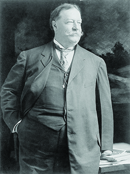

By the end of this section, you will be able to:
* Explain how William Howard Taft used American economic power to protect the nation’s interests in its new empire

When William Howard Taft became president in 1909, he chose to adapt Roosevelt’s foreign policy philosophy to one that reflected American economic power at the time. In what became known as “**dollar diplomacy**{: data-type="term"},” Taft announced his decision to “substitute dollars for bullets” in an effort to use foreign policy to secure markets and opportunities for American businessmen ([\[link\]](#CNX_History_22_04_Dollar)). Not unlike Roosevelt’s threat of force, Taft used the threat of American economic clout to coerce countries into agreements to benefit the United States.

 {: #CNX_History_22_04_Dollar}

Of key interest to Taft was the debt that several Central American nations still owed to various countries in Europe. Fearing that the debt holders might use the monies owed as leverage to use military intervention in the Western Hemisphere, Taft moved quickly to pay off these debts with U.S. dollars. Of course, this move made the Central American countries indebted to the United States, a situation that not all nations wanted. When a Central American nation resisted this arrangement, however, Taft responded with military force to achieve the objective. This occurred in Nicaragua when the country refused to accept American loans to pay off its debt to Great Britain. Taft sent a warship with marines to the region to pressure the government to agree. Similarly, when Mexico considered the idea of allowing a Japanese corporation to gain significant land and economic advantages in its country, Taft urged Congress to pass the Lodge Corollary, an addendum to the Roosevelt Corollary, stating that no foreign corporation—other than American ones—could obtain strategic lands in the Western Hemisphere.

In Asia, Taft’s policies also followed those of Theodore Roosevelt. He attempted to bolster China’s ability to withstand Japanese interference and thereby maintain a balance of power in the region. Initially, he experienced tremendous success in working with the Chinese government to further develop the railroad industry in that country through arranging international financing. However, efforts to expand the Open Door policy deeper into Manchuria met with resistance from Russia and Japan, exposing the limits of the American government’s influence and knowledge about the intricacies of diplomacy. As a result, he reorganized the U.S. State Department to create geographical divisions (such as the Far East Division, the Latin American Division, etc.) in order to develop greater foreign policy expertise in each area.

Taft’s policies, although not as based on military aggression as his predecessors, did create difficulties for the United States, both at the time and in the future. Central America’s indebtedness would create economic concerns for decades to come, as well as foster nationalist movements in countries resentful of American’s interference. In Asia, Taft’s efforts to mediate between China and Japan served only to heighten tensions between Japan and the United States. Furthermore, it did not succeed in creating a balance of power, as Japan’s reaction was to further consolidate its power and reach throughout the region.

As Taft’s presidency came to a close in early 1913, the United States was firmly entrenched on its path towards empire. The world perceived the United States as the predominant power of the Western Hemisphere—a perception that few nations would challenge until the Soviet Union during the Cold War era. Likewise, the United States had clearly marked its interests in Asia, although it was still searching for an adequate approach to guard and foster them. The development of an American empire had introduced with it several new approaches to American foreign policy, from military intervention to economic coercion to the mere threat of force.

The playing field would change one year later in 1914 when the United States witnessed the unfolding of World War I, or “the Great War.” A new president would attempt to adopt a new approach to diplomacy—one that was well-intentioned but at times impractical. Despite Woodrow Wilson’s best efforts to the contrary, the United States would be drawn into the conflict and subsequently attempt to reshape the world order as a result.

  
Read this [brief biography of President Taft][1] to understand his foreign policy in the context of his presidency.

# Section Summary

All around the globe, Taft sought to use U.S. economic might as a lever in foreign policy. He relied less on military action, or the threat of such action, than McKinley or Roosevelt before him; however, he both threatened and used military force when economic coercion proved unsuccessful, as it did in his bid to pay off Central America’s debts with U.S. dollars. In Asia, Taft tried to continue to support the balance of power, but his efforts backfired and alienated Japan. Increasing tensions between the United States and Japan would finally explode nearly thirty years later, with the outbreak of World War II.

# Review Questions

Why did some Central American nations object to Taft’s paying off their debt to Europe with U.S. dollars?  because American currency wasn’t worth as much as local currencies because they felt it gave the United States too much leverage because they were forced to give land grants to the United States in return because they wanted Asian countries to pay off their debts instead 

B

What two countries were engaged in a negotiation that the Lodge Corollary disallowed?  Mexico and Japan Nicaragua and France Colombia and Japan Mexico and Spain 

A

What problems did Taft’s foreign policy create for the United States?

Taft’s policies created some troubles that were immediate, and others that would not bear fruit until decades later. The tremendous debts in Central America created years of economic instability there and fostered nationalist movements driven by resentment of America’s interference in the region. In Asia, Taft’s efforts at China-Japan mediation heightened tensions between Japan and the United States—tensions that would explode, ultimately, with the outbreak of World War II—and spurred Japan to consolidate its power throughout the region.

# Critical Thinking Questions

Describe the United States’ movement from isolationism to expansion-mindedness in the final decades of the nineteenth century. What ideas and philosophies underpinned this transformation?

What specific forces or interests transformed the relationship between the United States and the rest of the world between 1865 and 1890?

How did Taft’s “dollar diplomacy” differ from Roosevelt’s “big stick” policy? Was one approach more or less successful than the other? How so?

What economic and political conditions had to exist for Taft’s “dollar diplomacy” to be effective?

What factors conspired to propel the United States to emerge as a military and economic powerhouse prior to World War II?

[1]: http://openstaxcollege.org/l/Taft
