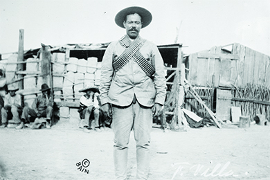

By the end of this section, you will be able to:
* Explain Woodrow Wilson’s foreign policy and the difficulties of maintaining American neutrality at the outset of World War I
* Identify the key factors that led to the U.S. declaration of war on Germany in April 1917

 ![A timeline shows important events of the era. In 1914, Archduke Franz Ferdinand is assassinated in Sarajevo, and World War I begins in Europe; a painting of Ferdinand&#x2019;s assassination is shown. In 1915, a German U-boat sinks the RMS Lusitania; an illustration of the Lusitania&#x2019;s destruction is shown. In 1916, Pancho Villa&#x2019;s forces attack Columbus, New Mexico; a photograph of Pancho Villa is shown. In 1917, Germany sends the secret Zimmermann telegram, Woodrow Wilson delivers the Peace without Victory speech, and the U.S. declares war on Germany; images of the decoded text of the Zimmermann telegram, and of President Woodrow Wilson asking Congress to declare war on Germany are shown. In 1918, U.S. soldiers engage Germans in the Argonne forest, and Wilson issues his Fourteen Points; an illustration of the 369th Infantry fighting in the forest is shown. In 1919, the Treaty of Versailles officially ends World War I.](../resources/CNX_History_23_01_Timeline.jpg){: #CNX_History_23_01_Timeline}

Unlike his immediate predecessors, President Woodrow Wilson had planned to shrink the role of the United States in foreign affairs. He believed that the nation needed to intervene in international events only when there was a moral imperative to do so. But as Europe’s political situation grew dire, it became increasingly difficult for Wilson to insist that the conflict growing overseas was not America’s responsibility. Germany’s war tactics struck most observers as morally reprehensible, while also putting American free trade with the Entente at risk. Despite campaign promises and diplomatic efforts, Wilson could only postpone American involvement in the war.

# WOODROW WILSON’S NEW FREEDOM   {#eip-idp14846240}

When Woodrow Wilson took over the White House in March 1913, he promised a less expansionist approach to American foreign policy than Theodore Roosevelt and William Howard Taft had pursued. Wilson did share the commonly held view that American values were superior to those of the rest of the world, that democracy was the best system to promote peace and stability, and that the United States should continue to actively pursue economic markets abroad. But he proposed an idealistic foreign policy based on morality, rather than American self-interest, and felt that American interference in another nation’s affairs should occur only when the circumstances rose to the level of a moral imperative.

Wilson appointed former presidential candidate William Jennings Bryan, a noted anti-imperialist and proponent of world peace, as his Secretary of State. Bryan undertook his new assignment with great vigor, encouraging nations around the world to sign “cooling off treaties,” under which they agreed to resolve international disputes through talks, not war, and to submit any grievances to an international commission. Bryan also negotiated friendly relations with Colombia, including a $25 million apology for Roosevelt’s actions during the Panamanian Revolution, and worked to establish effective self-government in the Philippines in preparation for the eventual American withdrawal. Even with Bryan’s support, however, Wilson found that it was much harder than he anticipated to keep the United States out of world affairs ([\[link\]](#CNX_History_23_01_Bronco)). In reality, the United States was interventionist in areas where its interests—direct or indirect—were threatened.

 {: #CNX_History_23_01_Bronco}

Wilson’s greatest break from his predecessors occurred in Asia, where he abandoned Taft’s “dollar diplomacy,” a foreign policy that essentially used the power of U.S. economic dominance as a threat to gain favorable terms. Instead, Wilson revived diplomatic efforts to keep Japanese interference there at a minimum. But as World War I, also known as the Great War, began to unfold, and European nations largely abandoned their imperialistic interests in order to marshal their forces for self-defense, Japan demanded that China succumb to a Japanese protectorate over their entire nation. In 1917, William Jennings Bryan’s successor as Secretary of State, Robert Lansing, signed the Lansing-Ishii Agreement, which recognized Japanese control over the Manchurian region of China in exchange for Japan’s promise not to exploit the war to gain a greater foothold in the rest of the country.

Furthering his goal of reducing overseas interventions, Wilson had promised not to rely on the Roosevelt Corollary, Theodore Roosevelt’s explicit policy that the United States could involve itself in Latin American politics whenever it felt that the countries in the Western Hemisphere needed policing. Once president, however, Wilson again found that it was more difficult to avoid American interventionism in practice than in rhetoric. Indeed, Wilson intervened more in Western Hemisphere affairs than either Taft or Roosevelt. In 1915, when a revolution in Haiti resulted in the murder of the Haitian president and threatened the safety of New York banking interests in the country, Wilson sent over three hundred U.S. Marines to establish order. Subsequently, the United States assumed control over the island’s foreign policy as well as its financial administration. One year later, in 1916, Wilson again sent marines to Hispaniola, this time to the Dominican Republic, to ensure prompt payment of a debt that nation owed. In 1917, Wilson sent troops to Cuba to protect American-owned sugar plantations from attacks by Cuban rebels; this time, the troops remained for four years.

Wilson’s most noted foreign policy foray prior to World War I focused on Mexico, where rebel general Victoriano Huerta had seized control from a previous rebel government just weeks before Wilson’s inauguration. Wilson refused to recognize Huerta’s government, instead choosing to make an example of Mexico by demanding that they hold democratic elections and establish laws based on the moral principles he espoused. Officially, Wilson supported Venustiano Carranza, who opposed Huerta’s military control of the country. When American intelligence learned of a German ship allegedly preparing to deliver weapons to Huerta’s forces, Wilson ordered the U.S. Navy to land forces at Veracruz to stop the shipment.

On April 22, 1914, a fight erupted between the U.S. Navy and Mexican troops, resulting in nearly 150 deaths, nineteen of them American. Although Carranza’s faction managed to overthrow Huerta in the summer of 1914, most Mexicans—including Carranza—had come to resent American intervention in their affairs. Carranza refused to work with Wilson and the U.S. government, and instead threatened to defend Mexico’s mineral rights against all American oil companies established there. Wilson then turned to support rebel forces who opposed Carranza, most notably **Pancho Villa**{: data-type="term" .no-emphasis} ([\[link\]](#CNX_History_23_01_Pancho)). However, Villa lacked the strength in number or weapons to overtake Carranza; in 1915, Wilson reluctantly authorized official U.S. recognition of Carranza’s government.

 {: #CNX_History_23_01_Pancho}

As a postscript, an irate Pancho Villa turned against Wilson, and on March 9, 1916, led a fifteen-hundred-man force across the border into New Mexico, where they attacked and burned the town of Columbus. Over one hundred people died in the attack, seventeen of them American. Wilson responded by sending General John Pershing into Mexico to capture Villa and return him to the United States for trial. With over eleven thousand troops at his disposal, Pershing marched three hundred miles into Mexico before an angry Carranza ordered U.S. troops to withdraw from the nation. Although reelected in 1916, Wilson reluctantly ordered the withdrawal of U.S. troops from Mexico in 1917, avoiding war with Mexico and enabling preparations for American intervention in Europe. Again, as in China, Wilson’s attempt to impose a moral foreign policy had failed in light of economic and political realities.

# WAR ERUPTS IN EUROPE   {#eip-idm12773264}

When a Serbian nationalist murdered the Archduke Franz Ferdinand of the Austro-Hungarian Empire on June 29, 1914, the underlying forces that led to World War I had already long been in motion and seemed, at first, to have little to do with the United States. At the time, the events that pushed Europe from ongoing tensions into war seemed very far away from U.S. interests. For nearly a century, nations had negotiated a series of mutual defense alliance treaties to secure themselves against their imperialistic rivals. Among the largest European powers, the Triple Entente included an alliance of France, Great Britain, and Russia. Opposite them, the Central powers, also known as the Triple Alliance, included Germany, Austria-Hungary, the Ottoman Empire, and initially Italy. A series of “side treaties” likewise entangled the larger European powers to protect several smaller ones should war break out.

At the same time that European nations committed each other to defense pacts, they jockeyed for power over empires overseas and invested heavily in large, modern militaries. Dreams of empire and military supremacy fueled an era of nationalism that was particularly pronounced in the newer nations of Germany and Italy, but also provoked separatist movements among Europeans. The Irish rose up in rebellion against British rule, for example. And in Bosnia’s capital of Sarajevo, Gavrilo Princip and his accomplices assassinated the Austro-Hungarian archduke in their fight for a pan-Slavic nation. Thus, when Serbia failed to accede to Austro-Hungarian demands in the wake of the archduke’s murder, Austria-Hungary declared war on Serbia with the confidence that it had the backing of Germany. This action, in turn, brought Russia into the conflict, due to a treaty in which they had agreed to defend Serbia. Germany followed suit by declaring war on Russia, fearing that Russia and France would seize this opportunity to move on Germany if it did not take the offensive. The eventual German invasion of Belgium drew Great Britain into the war, followed by the attack of the Ottoman Empire on Russia. By the end of August 1914, it seemed as if Europe had dragged the entire world into war.

The Great War was unlike any war that came before it. Whereas in previous European conflicts, troops typically faced each other on open battlefields, World War I saw new military technologies that turned war into a conflict of prolonged trench warfare. Both sides used new artillery, tanks, airplanes, machine guns, barbed wire, and, eventually, poison gas: weapons that strengthened defenses and turned each military offense into barbarous sacrifices of thousands of lives with minimal territorial advances in return. By the end of the war, the total military death toll was ten million, as well as another million civilian deaths attributed to military action, and another six million civilian deaths caused by famine, disease, or other related factors.

One terrifying new piece of technological warfare was the German *unterseeboot*—an “undersea boat” or U-boat. By early 1915, in an effort to break the British naval blockade of Germany and turn the tide of the war, the Germans dispatched a fleet of these submarines around Great Britain to attack both merchant and military ships. The U-boats acted in direct violation of international law, attacking without warning from beneath the water instead of surfacing and permitting the surrender of civilians or crew. By 1918, German U-boats had sunk nearly five thousand vessels. Of greatest historical note was the attack on the British passenger ship, RMS *Lusitania*, on its way from New York to Liverpool on May 7, 1915. The German Embassy in the United States had announced that this ship would be subject to attack for its cargo of ammunition: an allegation that later proved accurate. Nonetheless, almost 1,200 civilians died in the attack, including 128 Americans. The attack horrified the world, galvanizing support in England and beyond for the war ([\[link\]](#CNX_History_23_01_Remember)). This attack, more than any other event, would test President Wilson’s desire to stay out of what had been a largely European conflict.

 ![Drawing (a) depicts the destruction of the Lusitania. A British recruiting poster (b) reads &#x201C;REMEMBER THE LUSITANIA. THE JURY&#x2019;S VERDICT SAYS: &#x2018;We find that the said deceased died from their prolonged immersion and exhaustion in the sea eight miles south-southwest of the Old Head of Kinsale on Friday, May 7th, 1915, owing to the sinking of the R.M.S. &#x2018;Lusitania&#x2019; by a torpedo fired without warning from a German submarine. That this appalling crime was contrary to international law and the conventions of all civilized nations, and we therefore charge the officers of the said submarine and the Emperor and Government of Germany, under whose orders they acted, with the crime of wilful and wholesale murder before the tribunal of the civilized world.&#x2019; IT IS YOUR DUTY TO TAKE UP THE SWORD OF JUSTICE TO AVENGE THIS DEVIL\'S WORK. ENLIST TO-DAY.&#x201D;](../resources/CNX_History_23_01_Remember.jpg "The torpedoing and sinking of the Lusitania, depicted in the English drawing above (a), resulted in the death over twelve hundred civilians and was an international incident that shifted American sentiment as to their potential role in the war, as illustrated in a British recruiting poster (b)."){: #CNX_History_23_01_Remember}

# THE CHALLENGE OF NEUTRALITY   {#eip-idm3602832}

Despite the loss of American lives on the *Lusitania*, President Wilson stuck to his path of **neutrality**{: data-type="term"} in Europe’s escalating war: in part out of moral principle, in part as a matter of practical necessity, and in part for political reasons. Few Americans wished to participate in the devastating battles that ravaged Europe, and Wilson did not want to risk losing his reelection by ordering an unpopular military intervention. Wilson’s “neutrality” did not mean isolation from all warring factions, but rather open markets for the United States and continued commercial ties with all belligerents. For Wilson, the conflict did not reach the threshold of a moral imperative for U.S. involvement; it was largely a European affair involving numerous countries with whom the United States wished to maintain working relations. In his message to Congress in 1914, the president noted that “Every man who really loves America will act and speak in the true spirit of neutrality, which is the spirit of impartiality and fairness and friendliness to all concerned.”

Wilson understood that he was already looking at a difficult reelection bid. He had only won the 1912 election with 42 percent of the popular vote, and likely would not have been elected at all had Roosevelt not come back as a third-party candidate to run against his former protégée Taft. Wilson felt pressure from all different political constituents to take a position on the war, yet he knew that elections were seldom won with a campaign promise of “If elected, I will send your sons to war!” Facing pressure from some businessmen and other government officials who felt that the protection of America’s best interests required a stronger position in defense of the Allied forces, Wilson agreed to a “preparedness campaign” in the year prior to the election. This campaign included the passage of the National Defense Act of 1916, which more than doubled the size of the army to nearly 225,000, and the Naval Appropriations Act of 1916, which called for the expansion of the U.S. fleet, including battleships, destroyers, submarines, and other ships.

As the 1916 election approached, the Republican Party hoped to capitalize on the fact that Wilson was making promises that he would not be able to keep. They nominated Charles Evans Hughes, a former governor of New York and sitting U.S. Supreme Court justice at the time of his nomination. Hughes focused his campaign on what he considered Wilson’s foreign policy failures, but even as he did so, he himself tried to walk a fine line between neutrality and belligerence, depending on his audience. In contrast, Wilson and the Democrats capitalized on neutrality and campaigned under the slogan “Wilson—he kept us out of war.” The election itself remained too close to call on election night. Only when a tight race in California was decided two days later could Wilson claim victory in his reelection bid, again with less than 50 percent of the popular vote. Despite his victory based upon a policy of neutrality, Wilson would find true neutrality a difficult challenge. Several different factors pushed Wilson, however reluctantly, toward the inevitability of American involvement.

A key factor driving U.S. engagement was economics. Great Britain was the country’s most important trading partner, and the Allies as a whole relied heavily on American imports from the earliest days of the war forward. Specifically, the value of all exports to the Allies quadrupled from $750 million to $3 billion in the first two years of the war. At the same time, the British naval blockade meant that exports to Germany all but ended, dropping from $350 million to $30 million. Likewise, numerous private banks in the United States made extensive loans—in excess of $500 million—to England. J. P. Morgan’s banking interests were among the largest lenders, due to his family’s connection to the country.

Another key factor in the decision to go to war were the deep ethnic divisions between native-born Americans and more recent immigrants. For those of Anglo-Saxon descent, the nation’s historic and ongoing relationship with Great Britain was paramount, but many Irish-Americans resented British rule over their place of birth and opposed support for the world’s most expansive empire. Millions of Jewish immigrants had fled anti-Semitic pogroms in Tsarist Russia and would have supported any nation fighting that authoritarian state. German Americans saw their nation of origin as a victim of British and Russian aggression and a French desire to settle old scores, whereas emigrants from Austria-Hungary and the Ottoman Empire were mixed in their sympathies for the old monarchies or ethnic communities that these empires suppressed. For interventionists, this lack of support for Great Britain and its allies among recent immigrants only strengthened their conviction.

Germany’s use of submarine warfare also played a role in challenging U.S. neutrality. After the sinking of the *Lusitania*, and the subsequent August 30 sinking of another British liner, the *Arabic*, Germany had promised to restrict their use of submarine warfare. Specifically, they promised to surface and visually identify any ship before they fired, as well as permit civilians to evacuate targeted ships. Instead, in February 1917, Germany intensified their use of submarines in an effort to end the war quickly before Great Britain’s naval blockade starved them out of food and supplies.

The German high command wanted to continue unrestricted warfare on all Atlantic traffic, including unarmed American freighters, in order to cripple the British economy and secure a quick and decisive victory. Their goal: to bring an end to the war before the United States could intervene and tip the balance in this grueling war of attrition. In February 1917, a German U-boat sank the American merchant ship, the *Laconia*, killing two passengers, and, in late March, quickly sunk four more American ships. These attacks increased pressure on Wilson from all sides, as government officials, the general public, and both Democrats and Republicans urged him to declare war.

The final element that led to American involvement in World War I was the so-called **Zimmermann telegram**{: data-type="term"}. British intelligence intercepted and decoded a top-secret telegram from German foreign minister Arthur Zimmermann to the German ambassador to Mexico, instructing the latter to invite Mexico to join the war effort on the German side, should the United States declare war on Germany. It further went on to encourage Mexico to invade the United States if such a declaration came to pass, as Mexico’s invasion would create a diversion and permit Germany a clear path to victory. In exchange, Zimmermann offered to return to Mexico land that was previously lost to the United States in the Mexican-American War, including Arizona, New Mexico, and Texas ([\[link\]](#CNX_History_23_01_Zimmermann)).

 "){: #CNX_History_23_01_Zimmermann}

The likelihood that Mexico, weakened and torn by its own revolution and civil war, could wage war against the United States and recover territory lost in the Mexican-American war with Germany’s help was remote at best. But combined with Germany’s unrestricted use of submarine warfare and the sinking of American ships, the Zimmermann telegram made a powerful argument for a declaration of war. The outbreak of the Russian Revolution in February and abdication of Tsar Nicholas II in March raised the prospect of democracy in the Eurasian empire and removed an important moral objection to entering the war on the side of the Allies. On April 2, 1917, Wilson asked Congress to declare war on Germany. Congress debated for four days, and several senators and congressmen expressed their concerns that the war was being fought over U.S. economic interests more than strategic need or democratic ideals. When Congress voted on April 6, fifty-six voted against the resolution, including the first woman ever elected to Congress, Representative Jeannette Rankin. This was the largest “no” vote against a war resolution in American history.

Wilson’s Peace without Victory Speech

Wilson’s last-ditch effort to avoid bringing the United States into World War I is captured in a speech he gave before the U.S. Senate on January 22, 1917. This speech, known as the “Peace without Victory” speech, extolled the country to be patient, as the countries involved in the war were nearing a peace. Wilson stated:

\> It must be a peace without victory. It is not pleasant to say this. I beg that I may be permitted to put my own interpretation upon it and that it may be understood that no other interpretation was in my thought. I am seeking only to face realities and to face them without soft concealments. Victory would mean peace forced upon the loser, a victor’s terms imposed upon the vanquished. It would be accepted in humiliation, under duress, at an intolerable sacrifice, and would leave a sting, a resentment, a bitter memory upon which terms of peace would rest, not permanently, but only as upon quicksand. Only a peace between equals can last, only a peace the very principle of which is equality and a common participation in a common benefit.
{: #eip-idp212691920}

Not surprisingly, this speech was not well received by either side fighting the war. England resisted being put on the same moral ground as Germany, and France, whose country had been battered by years of warfare, had no desire to end the war without victory and its spoils. Still, the speech as a whole illustrates Wilson’s idealistic, if failed, attempt to create a more benign and high-minded foreign policy role for the United States. Unfortunately, the Zimmermann telegram and the sinking of the American merchant ships proved too provocative for Wilson to remain neutral. Little more than two months after this speech, he asked Congress to declare war on Germany.

  
Read the full transcript of the [Peace without Victory speech][1] that clearly shows Wilson’s desire to remain out of the war, even when it seemed inevitable.

# Section Summary   {#eip-idm2764416}

President Wilson had no desire to embroil the United States in the bloody and lengthy war that was devastating Europe. His foreign policy, through his first term and his campaign for reelection, focused on keeping the United States out of the war and involving the country in international affairs only when there was a moral imperative to do so. After his 1916 reelection, however, the free trade associated with neutrality proved impossible to secure against the total war strategies of the belligerents, particularly Germany’s submarine warfare. Ethnic ties to Europe meant that much of the general public was more than happy to remain neutral. Wilson’s reluctance to go to war was mirrored in Congress, where fifty-six voted against the war resolution. The measure still passed, however, and the United States went to war against the wishes of many of its citizens.

# Review Questions   {#eip-idp5343568}

In order to pursue his goal of using American influence overseas only when it was a moral imperative, Wilson put which man in the position of Secretary of State?

1.  Charles Hughes
2.  Theodore Roosevelt
3.  William Jennings Bryan
4.  John Pershing
{: data-number-style="upper-alpha"}

C

Why was the German use of the *unterseeboot* considered to defy international law?

1.  because other countries did not have similar technology
2.  because they refused to warn their targets before firing
3.  because they constituted cruel and unusual methods
4.  because no international consensus existed to employ submarine technology
{: data-number-style="upper-alpha"}

B

To what extent were Woodrow Wilson’s actual foreign policy decisions consistent with his foreign policy philosophy or vision?

Wilson’s foreign policy goal was to minimize American involvement abroad and use a less imperialistic approach than the presidents before him. Rather than being guided by America’s self-interest, he hoped to enact a policy based on moral decisions, acting only when it was morally imperative. In practice, however, Wilson found himself, especially in South and Central America, following the steps of other, more interventionist presidents. He sent troops into Haiti, the Dominican Republic, and Cuba, often to ensure that America’s interests were met. In Asia and Mexico, Wilson also found it difficult to remain outside of world affairs without jeopardizing America’s interests.

[1]: http://openstaxcollege.org/l/15WWilson
