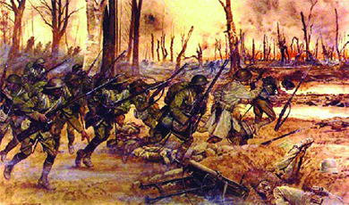
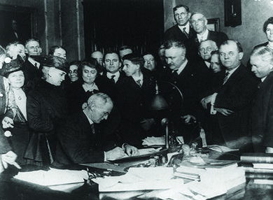

By the end of this section, you will be able to:
* Explain how the status of organized labor changed during the First World War
* Describe how the lives of women and African Americans changed as a result of American participation in World War I
* Explain how America’s participation in World War I allowed for the passage of prohibition and women’s suffrage

The lives of all Americans, whether they went abroad to fight or stayed on the home front, changed dramatically during the war. Restrictive laws censored dissent at home, and the armed forces demanded unconditional loyalty from millions of volunteers and conscripted soldiers. For organized labor, women, and African Americans in particular, the war brought changes to the prewar status quo. Some white women worked outside of the home for the first time, whereas others, like African American men, found that they were eligible for jobs that had previously been reserved for white men. African American women, too, were able to seek employment beyond the domestic servant jobs that had been their primary opportunity. These new options and freedoms were not easily erased after the war ended.

# NEW OPPORTUNITIES BORN FROM WAR

After decades of limited involvement in the challenges between management and organized labor, the need for peaceful and productive industrial relations prompted the federal government during wartime to invite organized labor to the negotiating table. Samuel Gompers, head of the American Federation of Labor (AFL), sought to capitalize on these circumstances to better organize workers and secure for them better wages and working conditions. His efforts also solidified his own base of power. The increase in production that the war required exposed severe labor shortages in many states, a condition that was further exacerbated by the draft, which pulled millions of young men from the active labor force.

Wilson only briefly investigated the longstanding animosity between labor and management before ordering the creation of the National Labor War Board in April 1918. Quick negotiations with Gompers and the AFL resulted in a promise: Organized labor would make a “no-strike pledge” for the duration of the war, in exchange for the U.S. government’s protection of workers’ rights to organize and bargain collectively. The federal government kept its promise and promoted the adoption of an eight-hour workday (which had first been adopted by government employees in 1868), a living wage for all workers, and union membership. As a result, union membership skyrocketed during the war, from 2.6 million members in 1916 to 4.1 million in 1919. In short, American workers received better working conditions and wages, as a result of the country’s participation in the war. However, their economic gains were limited. While prosperity overall went up during the war, it was enjoyed more by business owners and corporations than by the workers themselves. Even though wages increased, inflation offset most of the gains. Prices in the United States increased an average of 15–20 percent annually between 1917 and 1920. Individual purchasing power actually declined during the war due to the substantially higher cost of living. Business profits, in contrast, increased by nearly a third during the war.

## Women in Wartime

For women, the economic situation was complicated by the war, with the departure of wage-earning men and the higher cost of living pushing many toward less comfortable lives. At the same time, however, wartime presented new opportunities for women in the workplace. More than one million women entered the workforce for the first time as a result of the war, while more than eight million working women found higher paying jobs, often in industry. Many women also found employment in what were typically considered male occupations, such as on the railroads ([\[link\]](#CNX_History_23_03_Women)), where the number of women tripled, and on assembly lines. After the war ended and men returned home and searched for work, women were fired from their jobs, and expected to return home and care for their families. Furthermore, even when they were doing men’s jobs, women were typically paid lower wages than male workers, and unions were ambivalent at best—and hostile at worst—to women workers. Even under these circumstances, wartime employment familiarized women with an alternative to a life in domesticity and dependency, making a life of employment, even a career, plausible for women. When, a generation later, World War II arrived, this trend would increase dramatically.

 ![Poster (a) depicts three women dressed for farm work. The middle woman is mounted on horseback, carrying a large American flag, with a farm visible around her. Beside her walk two women carrying a large basket of produce between them. The text reads &#x201C;The Women&#x2019;s Land Army of America. Training School. University of Virginia. June 15 to September 15. Courses two weeks. Tuition free. Board $5.00 per week. Apply Woman&#x2019;s Land Army. U.S. Employment Service. 910 E. Main Street. Richmond, VA.&#x201D; Photograph (b) shows shows Eva Abbott, a female worker, oiling one of the Erie Railroad&#x2019;s locomotives.](../resources/CNX_History_23_03_Women.jpg "The war brought new opportunities to women, such as the training offered to those who joined the Land Army (a) or the opening up of traditionally male occupations. In 1918, Eva Abbott (b) was one of many new women workers on the Erie Railroad. However, once the war ended and veterans returned home, these opportunities largely disappeared. (credit b: modification of work by U.S. Department of Labor)"){: #CNX_History_23_03_Women}

One notable group of women who exploited these new opportunities was the Women’s Land Army of America. First during World War I, then again in World War II, these women stepped up to run farms and other agricultural enterprises, as men left for the armed forces ([\[link\]](#CNX_History_23_03_Women)). Known as **Farmerettes**{: data-type="term" .no-emphasis}, some twenty thousand women—mostly college educated and from larger urban areas—served in this capacity. Their reasons for joining were manifold. For some, it was a way to serve their country during a time of war. Others hoped to capitalize on the efforts to further the fight for women’s suffrage.

Also of special note were the approximately thirty thousand American women who served in the military, as well as a variety of humanitarian organizations, such as the Red Cross and YMCA, during the war. In addition to serving as military nurses (without rank), American women also served as telephone operators in France. Of this latter group, 230 of them, known as “Hello Girls,” were bilingual and stationed in combat areas. Over eighteen thousand American women served as Red Cross nurses, providing much of the medical support available to American troops in France. Close to three hundred nurses died during service. Many of those who returned home continued to work in hospitals and home healthcare, helping wounded veterans heal both emotionally and physically from the scars of war.

## African Americans in the Crusade for Democracy

African Americans also found that the war brought upheaval and opportunity. Blacks composed 13 percent of the enlisted military, with 350,000 men serving. Colonel Charles Young of the Tenth Cavalry division served as the highest-ranking African American officer. Blacks served in segregated units and suffered from widespread racism in the military hierarchy, often serving in menial or support roles. Some troops saw combat, however, and were commended for serving with valor. The 369th Infantry, for example, known as the **Harlem Hellfighters**{: data-type="term"}, served on the frontline of France for six months, longer than any other American unit. One hundred seventy-one men from that regiment received the Legion of Merit for meritorious service in combat. The regiment marched in a homecoming parade in New York City, was remembered in paintings ([\[link\]](#CNX_History_23_03_Hellfight)), and was celebrated for bravery and leadership. The accolades given to them, however, in no way extended to the bulk of African Americans fighting in the war.

 {: #CNX_History_23_03_Hellfight}

On the home front, African Americans, like American women, saw economic opportunities increase during the war. During the so-called Great Migration (discussed in a previous chapter), nearly 350,000 African Americans had fled the post-Civil War South for opportunities in northern urban areas. From 1910–1920, they moved north and found work in the steel, mining, shipbuilding, and automotive industries, among others. African American women also sought better employment opportunities beyond their traditional roles as domestic servants. By 1920, over 100,000 women had found work in diverse manufacturing industries, up from 70,000 in 1910. Despite such opportunities, racism continued to be a major force in both the North and South. Worried about the large influx of black Americans into their cities, several municipalities passed residential codes designed to prohibit African Americans from settling in certain neighborhoods. Race riots also increased in frequency: In 1917 alone, there were race riots in twenty-five cities, including East Saint Louis, where thirty-nine blacks were killed. In the South, white business and plantation owners feared that their cheap workforce was fleeing the region, and used violence to intimidate blacks into staying. According to NAACP statistics, recorded incidences of lynching increased from thirty-eight in 1917 to eighty-three in 1919. These numbers did not start to decrease until 1923, when the number of annual lynchings dropped below thirty-five for the first time since the Civil War.

  
Explore photographs and a written overview of [the African American experience][1] both at home and on the front line during World War I.

# THE LAST VESTIGES OF PROGRESSIVISM

Across the United States, the war intersected with the last lingering efforts of the Progressives who sought to use the war as motivation for their final push for change. It was in large part due to the war’s influence that Progressives were able to lobby for the passage of the Eighteenth and Nineteenth Amendments to the U.S. Constitution. The Eighteenth Amendment, prohibiting alcohol, and the Nineteenth Amendment, giving women the right to vote, received their final impetus due to the war effort.

**Prohibition**{: data-type="term"}, as the anti-alcohol movement became known, had been a goal of many Progressives for decades. Organizations such as the Women’s Christian Temperance Union and the Anti-Saloon League linked alcohol consumption with any number of societal problems, and they had worked tirelessly with municipalities and counties to limit or prohibit alcohol on a local scale. But with the war, prohibitionists saw an opportunity for federal action. One factor that helped their cause was the strong anti-German sentiment that gripped the country, which turned sympathy away from the largely German-descended immigrants who ran the breweries. Furthermore, the public cry to ration food and grain—the latter being a key ingredient in both beer and hard alcohol—made prohibition even more patriotic. Congress ratified the Eighteenth Amendment in January 1919, with provisions to take effect one year later. Specifically, the amendment prohibited the manufacture, sale, and transportation of intoxicating liquors. It did not prohibit the drinking of alcohol, as there was a widespread feeling that such language would be viewed as too intrusive on personal rights. However, by eliminating the manufacture, sale, and transport of such beverages, drinking was effectively outlawed. Shortly thereafter, Congress passed the Volstead Act, translating the Eighteenth Amendment into an enforceable ban on the consumption of alcoholic beverages, and regulating the scientific and industrial uses of alcohol. The act also specifically excluded from prohibition the use of alcohol for religious rituals ([\[link\]](#CNX_History_23_03_Dry)).

 {: #CNX_History_23_03_Dry}

Unfortunately for proponents of the amendment, the ban on alcohol did not take effect until one full year following the end of the war. Almost immediately following the war, the general public began to oppose—and clearly violate—the law, making it very difficult to enforce. Doctors and druggists, who could prescribe whisky for medicinal purposes, found themselves inundated with requests. In the 1920s, organized crime and gangsters like Al Capone would capitalize on the persistent demand for liquor, making fortunes in the illegal trade. A lack of enforcement, compounded by an overwhelming desire by the public to obtain alcohol at all costs, eventually resulted in the repeal of the law in 1933.

The First World War also provided the impetus for another longstanding goal of some reformers: universal suffrage. Supporters of equal rights for women pointed to Wilson’s rallying cry of a war “to make the world safe for democracy,” as hypocritical, saying he was sending American boys to die for such principles while simultaneously denying American women their democratic right to vote ([\[link\]](#CNX_History_23_03_Suffragist)). Carrie Chapman Catt, president of the National American Women Suffrage Movement, capitalized on the growing patriotic fervor to point out that every woman who gained the vote could exercise that right in a show of loyalty to the nation, thus offsetting the dangers of draft-dodgers or naturalized Germans who already had the right to vote.

Alice Paul, of the National Women’s Party, organized more radical tactics, bringing national attention to the issue of women’s suffrage by organizing protests outside the White House and, later, hunger strikes among arrested protesters. By the end of the war, the abusive treatment of suffragist hunger-strikers in prison, women’s important contribution to the war effort, and the arguments of his suffragist daughter Jessie Woodrow Wilson Sayre moved President Wilson to understand women’s right to vote as an ethical mandate for a true democracy. He began urging congressmen and senators to adopt the legislation. The amendment finally passed in June 1919, and the states ratified it by August 1920. Specifically, the Nineteenth Amendment prohibited all efforts to deny the right to vote on the basis of sex. It took effect in time for American women to vote in the presidential election of 1920.

 ![A photograph shows two suffragists standing in front of the White House gate, holding a large sign between them. The text of the sign reads as follows: &#x201C;President Wilson and Envoy Root are deceiving Russia. They say &#x2018;We are a democracy. Help us win a world war so that democracies may survive.&#x2019; We, the women of America tell you that America is not a democracy. Twenty million American Women are denied the right to vote. President Wilson is the chief opponent of their national enfranchisement. Help us make this nation really free. Tell our government that it must liberate its people before it can claim Russia as an ally.&#x201D;](../resources/CNX_History_23_03_Suffragist.jpg "Suffragists picketed the White House in 1917, leveraging the war and America&#x2019;s stance on democracy to urge Woodrow Wilson to support an amendment giving women the right to vote."){: #CNX_History_23_03_Suffragist}

# Section Summary

The First World War remade the world for all Americans, whether they served abroad or stayed at home. For some groups, such as women and blacks, the war provided opportunities for advancement. As soldiers went to war, women and African Americans took on jobs that had previously been reserved for white men. In return for a no-strike pledge, workers gained the right to organize. Many of these shifts were temporary, however, and the end of the war came with a cultural expectation that the old social order would be reinstated.

Some reform efforts also proved short-lived. President Wilson’s wartime agencies managed the wartime economy effectively but closed immediately with the end of the war (although they reappeared a short while later with the New Deal). While patriotic fervor allowed Progressives to pass prohibition, the strong demand for alcohol made the law unsustainable. Women’s suffrage, however, was a Progressive movement that came to fruition in part because of the circumstances of the war, and unlike prohibition, it remained.

# Review Questions

Why did the war not increase overall prosperity?

1.  because inflation made the cost of living higher
2.  because wages were lowered due to the war effort
3.  because workers had no bargaining power due to the “no-strike pledge”
4.  because women and African American men were paid less for the same work
{: data-number-style="upper-alpha"}

A

Which of the following did *not* influence the eventual passage of the Nineteenth Amendment?

1.  women’s contributions to the war effort
2.  the dramatic tactics and harsh treatment of radical suffragists
3.  the passage of the Volstead Act
4.  the arguments of President Wilson’s daughter
{: data-number-style="upper-alpha"}

C

Why was prohibition’s success short-lived?

The ban on alcohol did not take effect until one year after the war, when the public sentiments that had eased its passage began to wane. The law proved difficult to enforce, as ever-greater numbers of Americans began to defy it. Organized crime’s involvement in the illegal liquor trade made enforcement even more difficult and the procurement of alcohol more dangerous. All of these elements led to the law’s repeal in 1933.

## Glossary
{: data-type="glossary-title"}

Harlem Hellfighters
: a nickname for the decorated, all-black 369th Infantry, which served on the frontlines of France for six months, longer than any other American unit
{: .definition}

prohibition
: the campaign for a ban on the sale and manufacturing of alcoholic beverages, which came to fruition during the war, bolstered by anti-German sentiment and a call to preserve resources for the war effort
{: .definition}

[1]: http://openstaxcollege.org/l/15Africana
