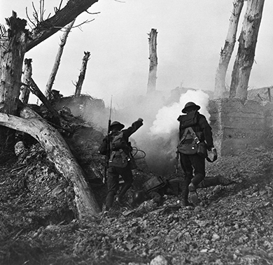
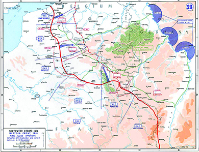
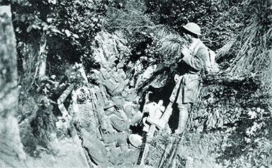

By the end of this section, you will be able to:
* Identify the role that the United States played at the end of World War I
* Describe Woodrow Wilson’s vision for the postwar world
* Explain why the United States never formally approved the Treaty of Versailles nor joined the League of Nations

The American role in World War I was brief but decisive. While millions of soldiers went overseas, and many thousands paid with their lives, the country’s involvement was limited to the very end of the war. In fact, the peace process, with the international conference and subsequent ratification process, took longer than the time U.S. soldiers were “in country” in France. For the Allies, American reinforcements came at a decisive moment in their defense of the western front, where a final offensive had exhausted German forces. For the United States, and for Wilson’s vision of a peaceful future, the fighting was faster and more successful than what was to follow.

# WINNING THE WAR

When the United States declared war on Germany in April 1917, the Allied forces were close to exhaustion. Great Britain and France had already indebted themselves heavily in the procurement of vital American military supplies. Now, facing near-certain defeat, a British delegation to Washington, DC, requested immediate troop reinforcements to boost Allied spirits and help crush German fighting morale, which was already weakened by short supplies on the frontlines and hunger on the home front. Wilson agreed and immediately sent 200,000 American troops in June 1917. These soldiers were placed in “quiet zones” while they trained and prepared for combat.

By March 1918, the Germans had won the war on the eastern front. The Russian Revolution of the previous year had not only toppled the hated regime of Tsar Nicholas II but also ushered in a civil war from which the Bolshevik faction of Communist revolutionaries under the leadership of Vladimir Lenin emerged victorious. Weakened by war and internal strife, and eager to build a new Soviet Union, Russian delegates agreed to a generous peace treaty with Germany. Thus emboldened, Germany quickly moved upon the Allied lines, causing both the French and British to ask Wilson to forestall extensive training to U.S. troops and instead commit them to the front immediately. Although wary of the move, Wilson complied, ordering the commander of the American Expeditionary Force, General John “Blackjack” Pershing, to offer U.S. troops as replacements for the Allied units in need of relief. By May 1918, Americans were fully engaged in the war ([\[link\]](#CNX_History_23_04_Soldiers)).

 {: #CNX_History_23_04_Soldiers}

In a series of battles along the front that took place from May 28 through August 6, 1918, including the battles of Cantigny, Chateau Thierry, Belleau Wood, and the Second Battle of the Marne, American forces alongside the British and French armies succeeded in repelling the German offensive. The Battle of Cantigny, on May 28, was the first American offensive in the war: In less than two hours that morning, American troops overran the German headquarters in the village, thus convincing the French commanders of their ability to fight against the German line advancing towards Paris. The subsequent battles of Chateau Thierry and Belleau Wood proved to be the bloodiest of the war for American troops. At the latter, faced with a German onslaught of mustard gas, artillery fire, and mortar fire, U.S. Marines attacked German units in the woods on six occasions—at times meeting them in hand-to-hand and bayonet combat—before finally repelling the advance. The U.S. forces suffered 10,000 casualties in the three-week battle, with almost 2,000 killed in total and 1,087 on a single day. Brutal as they were, they amounted to small losses compared to the casualties suffered by France and Great Britain. Still, these summer battles turned the tide of the war, with the Germans in full retreat by the end of July 1918 ([\[link\]](#CNX_History_23_04_WestFront)).

 {: #CNX_History_23_04_WestFront}

Sgt. Charles Leon Boucher: Life and Death in the Trenches of France

Wounded in his shoulder by enemy forces, George, a machine gunner posted on the right end of the American platoon, was taken prisoner at the Battle of Seicheprey in 1918. However, as darkness set in that evening, another American soldier, Charlie, heard a noise from a gully beside the trench in which he had hunkered down. “I figured it must be the enemy mop-up patrol,” Charlie later said.

\> I only had a couple of bullets left in the chamber of my forty-five. The noise stopped and a head popped into sight. When I was about to fire, I gave another look and a white and distorted face proved to be that of George, so I grabbed his shoulders and pulled him down into our trench beside me. He must have had about twenty bullet holes in him but not one of them was well placed enough to kill him. He made an effort to speak so I told him to keep quiet and conserve his energy. I had a few malted milk tablets left and, I forced them into his mouth. I also poured the last of the water I had left in my canteen into his mouth.

Following a harrowing night, they began to crawl along the road back to their platoon. As they crawled, George explained how he survived being captured. Charlie later told how George “was taken to an enemy First Aid Station where his wounds were dressed. Then the doctor motioned to have him taken to the rear of their lines. But, the Sergeant Major pushed him towards our side and ‘No Mans Land,’ pulled out his Luger Automatic and shot him down. Then, he began to crawl towards our lines little by little, being shot at consistently by the enemy snipers till, finally, he arrived in our position.”

The story of Charlie and George, related later in life by Sgt. Charles Leon Boucher to his grandson, was one replayed many times over in various forms during the American Expeditionary Force’s involvement in World War I. The industrial scale of death and destruction was as new to American soldiers as to their European counterparts, and the survivors brought home physical and psychological scars that influenced the United States long after the war was won ([\[link\]](#CNX_History_23_04_Argonne)).

{: #CNX_History_23_04_Argonne}

By the end of September 1918, over one million U.S. soldiers staged a full offensive into the Argonne Forest. By November—after nearly forty days of intense fighting—the German lines were broken, and their military command reported to German Emperor Kaiser Wilhelm II of the desperate need to end the war and enter into peace negotiations. Facing civil unrest from the German people in Berlin, as well as the loss of support from his military high command, Kaiser Wilhelm abdicated his throne on November 9, 1918, and immediately fled by train to the Netherlands. Two days later, on November 11, 1918, Germany and the Allies declared an immediate armistice, thus bring the fighting to a stop and signaling the beginning of the peace process.

When the armistice was declared, a total of 117,000 American soldiers had been killed and 206,000 wounded. The Allies as a whole suffered over 5.7 million military deaths, primarily Russian, British, and French men. The Central powers suffered four million military deaths, with half of them German soldiers. The total cost of the war to the United States alone was in excess of $32 billion, with interest expenses and veterans’ benefits eventually bringing the cost to well over $100 billion. Economically, emotionally, and geopolitically, the war had taken an enormous toll.

  
This [Smithsonian interactive exhibit][1] offers a fascinating perspective on World War I.

# THE BATTLE FOR PEACE

While Wilson had been loath to involve the United States in the war, he saw the country’s eventual participation as justification for America’s involvement in developing a moral foreign policy for the entire world. The “new world order” he wished to create from the outset of his presidency was now within his grasp. The United States emerged from the war as the predominant world power. Wilson sought to capitalize on that influence and impose his moral foreign policy on all the nations of the world.

## The Paris Peace Conference

As early as January 1918—a full five months before U.S. military forces fired their first shot in the war, and eleven months before the actual armistice—Wilson announced his postwar peace plan before a joint session of Congress. Referring to what became known as the **Fourteen Points**{: data-type="term"}, Wilson called for openness in all matters of diplomacy and trade, specifically, free trade, freedom of the seas, an end to secret treaties and negotiations, promotion of self-determination of all nations, and more. In addition, he called for the creation of a **League of Nations**{: data-type="term"} to promote the new world order and preserve territorial integrity through open discussions in place of intimidation and war.

As the war concluded, Wilson announced, to the surprise of many, that he would attend the Paris Peace Conference himself, rather than ceding to the tradition of sending professional diplomats to represent the country ([\[link\]](#CNX_History_23_04_BigFour)). His decision influenced other nations to follow suit, and the Paris conference became the largest meeting of world leaders to date in history. For six months, beginning in December 1918, Wilson remained in Paris to personally conduct peace negotiations. Although the French public greeted Wilson with overwhelming enthusiasm, other delegates at the conference had deep misgivings about the American president’s plans for a “peace without victory.” Specifically, Great Britain, France, and Italy sought to obtain some measure of revenge against Germany for drawing them into the war, to secure themselves against possible future aggressions from that nation, and also to maintain or even strengthen their own colonial possessions. Great Britain and France in particular sought substantial monetary reparations, as well as territorial gains, at Germany’s expense. Japan also desired concessions in Asia, whereas Italy sought new territory in Europe. Finally, the threat posed by a Bolshevik Russia under Vladimir Lenin, and more importantly, the danger of revolutions elsewhere, further spurred on these allies to use the treaty negotiations to expand their territories and secure their strategic interests, rather than strive towards world peace.

  Prime Minister David Lloyd George of Great Britain; Vittorio Emanuele Orlando, prime minister of Italy; Georges Clemenceau, prime minister of France; and President Woodrow Wilson discussing the terms of the peace."){: #CNX_History_23_04_BigFour}

In the end, the Treaty of Versailles that officially concluded World War I resembled little of Wilson’s original Fourteen Points. The Japanese, French, and British succeeded in carving up many of Germany’s colonial holdings in Africa and Asia. The dissolution of the Ottoman Empire created new nations under the quasi-colonial rule of France and Great Britain, such as Iraq and Palestine. France gained much of the disputed territory along their border with Germany, as well as passage of a “war guilt clause” that demanded Germany take public responsibility for starting and prosecuting the war that led to so much death and destruction. Great Britain led the charge that resulted in Germany agreeing to pay reparations in excess of $33 billion to the Allies. As for Bolshevik Russia, Wilson had agreed to send American troops to their northern region to protect Allied supplies and holdings there, while also participating in an economic blockade designed to undermine Lenin’s power. This move would ultimately have the opposite effect of galvanizing popular support for the Bolsheviks.

The sole piece of the original Fourteen Points that Wilson successfully fought to keep intact was the creation of a League of Nations. At a covenant agreed to at the conference, all member nations in the League would agree to defend all other member nations against military threats. Known as Article X, this agreement would basically render each nation equal in terms of power, as no member nation would be able to use its military might against a weaker member nation. Ironically, this article would prove to be the undoing of Wilson’s dream of a new world order.

## Ratification of the Treaty of Versailles

Although the other nations agreed to the final terms of the Treaty of Versailles, Wilson’s greatest battle lay in the ratification debate that awaited him upon his return. As with all treaties, this one would require two-thirds approval by the U.S. Senate for final ratification, something Wilson knew would be difficult to achieve. Even before Wilson’s return to Washington, Senator Henry Cabot Lodge, chairman of the Senate Foreign Relations Committee that oversaw ratification proceedings, issued a list of fourteen reservations he had regarding the treaty, most of which centered on the creation of a League of Nations. An isolationist in foreign policy issues, Cabot feared that Article X would require extensive American intervention, as more countries would seek her protection in all controversial affairs. But on the other side of the political spectrum, interventionists argued that Article X would impede the United States from using her rightfully attained military power to secure and protect America’s international interests.

Wilson’s greatest fight was with the Senate, where most Republicans opposed the treaty due to the clauses surrounding the creation of the League of Nations. Some Republicans, known as **Irreconcilables**{: data-type="term"}, opposed the treaty on all grounds, whereas others, called **Reservationists**{: data-type="term"}, would support the treaty if sufficient amendments were introduced that could eliminate Article X. In an effort to turn public support into a weapon against those in opposition, Wilson embarked on a cross-country railway speaking tour. He began travelling in September 1919, and the grueling pace, after the stress of the six months in Paris, proved too much. Wilson fainted following a public event on September 25, 1919, and immediately returned to Washington. There he suffered a debilitating stroke, leaving his second wife Edith Wilson in charge as de facto president for a period of about six months.

Frustrated that his dream of a new world order was slipping away—a frustration that was compounded by the fact that, now an invalid, he was unable to speak his own thoughts coherently—Wilson urged Democrats in the Senate to reject any effort to compromise on the treaty. As a result, Congress voted on, and defeated, the originally worded treaty in November. When the treaty was introduced with “reservations,” or amendments, in March 1920, it again fell short of the necessary margin for ratification. As a result, the United States never became an official signatory of the Treaty of Versailles. Nor did the country join the League of Nations, which shattered the international authority and significance of the organization. Although Wilson received the Nobel Peace Prize in October 1919 for his efforts to create a model of world peace, he remained personally embarrassed and angry at his country’s refusal to be a part of that model. As a result of its rejection of the treaty, the United States technically remained at war with Germany until July 21, 1921, when it formally came to a close with Congress’s quiet passage of the Knox-Porter Resolution.

  
Read about the [Treaty of Versailles][2] here, particularly how it sowed the seeds for Hitler’s rise to power and World War II.

# Section Summary

American involvement in World War I came late. Compared to the incredible carnage endured by Europe, the United States’ battles were brief and successful, although the appalling fighting conditions and significant casualties made it feel otherwise to Americans, both at war and at home. For Wilson, victory in the fields of France was not followed by triumphs in Versailles or Washington, DC, where his vision of a new world order was summarily rejected by his allied counterparts and then by the U.S. Congress. Wilson had hoped that America’s political influence could steer the world to a place of more open and tempered international negotiations. His influence did lead to the creation of the League of Nations, but concerns at home impeded the process so completely that the United States never signed the treaty that Wilson worked so hard to create.

# Review Questions

What was Article X in the Treaty of Versailles?

1.  the “war guilt clause” that France required
2.  the agreement that all nations in the League of Nations would be rendered equal
3.  the Allies’ division of Germany’s holdings in Asia
4.  the refusal to allow Bolshevik Russia membership in the League of Nations
{: data-number-style="upper-alpha"}

B

Which of the following was *not* included in the Treaty of Versailles?

1.  extensive German reparations to be paid to the Allies
2.  a curtailment of German immigration to Allied nations
3.  France’s acquisition of disputed territory along the French-German border
4.  a mandate for Germany to accept responsibility for the war publicly
{: data-number-style="upper-alpha"}

B

What barriers did Wilson face in his efforts to ratify the Treaty of Versailles? What objections did those opposed to the treaty voice?

In order to ratify the Treaty of Versailles, Wilson needed to ensure a two-thirds approval by the U.S. Senate, which meant overcoming the objections of a majority of Senate Republicans. Isolationists, most notably Henry Cabot Lodge, worried that the treaty’s Article X would oblige the United States to intervene extensively in international affairs. Interventionists, alternatively, argued that Article X would prevent the United States from using its military might to protect its interests abroad. Ultimately, Congress defeated both the originally worded treaty and a later version that included amendments. As a result, the United States never officially signed the treaty nor joined the League of Nations.

[1]: http://openstaxcollege.org/l/15PriceFree
[2]: http://openstaxcollege.org/l/15Versailles
