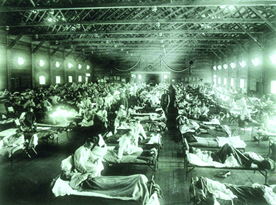

By the end of this section, you will be able to:
* Identify the challenges that the United States faced following the conclusion of World War I
* Explain Warren G. Harding’s landslide victory in the 1920 presidential election

As world leaders debated the terms of the peace, the American public faced its own challenges at the conclusion of the First World War. Several unrelated factors intersected to create a chaotic and difficult time, just as massive numbers of troops rapidly demobilized and came home. Racial tensions, a terrifying flu epidemic, anticommunist hysteria, and economic uncertainty all combined to leave many Americans wondering what, exactly, they had won in the war. Adding to these problems was the absence of President Wilson, who remained in Paris for six months, leaving the country leaderless. The result of these factors was that, rather than a celebratory transition from wartime to peace and prosperity, and ultimately the Jazz Age of the 1920s, 1919 was a tumultuous year that threatened to tear the country apart.

### DISORDER AND FEAR IN AMERICA

After the war ended, U.S. troops were demobilized and rapidly sent home. One unanticipated and unwanted effect of their return was the emergence of a new strain of influenza that medical professionals had never before encountered. Within months of the war’s end, over twenty million Americans fell ill from the flu ([\[link\]](#CNX_History_23_05_Flu)). Eventually, 675,000 Americans died before the disease mysteriously ran its course in the spring of 1919. Worldwide, recent estimates suggest that 500 million people suffered from this flu strain, with as many as fifty million people dying. Throughout the United States, from the fall of 1918 to the spring of 1919, fear of the flu gripped the country. Americans avoided public gatherings, children wore surgical masks to school, and undertakers ran out of coffins and burial plots in cemeteries. Hysteria grew as well, and instead of welcoming soldiers home with a postwar celebration, people hunkered down and hoped to avoid contagion.

 {: #CNX_History_23_05_Flu}

Another element that greatly influenced the challenges of immediate postwar life was economic upheaval. As discussed above, wartime production had led to steady inflation; the rising cost of living meant that few Americans could comfortably afford to live off their wages. When the government’s wartime control over the economy ended, businesses slowly recalibrated from the wartime production of guns and ships to the peacetime production of toasters and cars. Public demand quickly outpaced the slow production, leading to notable shortages of domestic goods. As a result, inflation skyrocketed in 1919. By the end of the year, the cost of living in the United States was nearly double what it had been in 1916. Workers, facing a shortage in wages to buy more expensive goods, and no longer bound by the no-strike pledge they made for the National War Labor Board, initiated a series of strikes for better hours and wages. In 1919 alone, more than four million workers participated in a total of nearly three thousand strikes: both records within all of American history.

In addition to labor clashes, race riots shattered the peace at the home front. The sporadic race riots that had begun during the Great Migration only grew in postwar America. White soldiers returned home to find black workers in their former jobs and neighborhoods, and were committed to restoring their position of white supremacy. Black soldiers returned home with a renewed sense of justice and strength, and were determined to assert their rights as men and as citizens. Meanwhile, southern lynchings continued to escalate, with white mobs burning African Americans at the stake. During the “**Red Summer**{: data-type="term"}” of 1919, northern cities recorded twenty-five bloody race riots that killed over 250 people. Among these was the Chicago Race Riot of 1919, where a white mob stoned a young black boy to death because he swam too close to the “white beach” on Lake Michigan. Police at the scene did not arrest the perpetrator who threw the rock. This crime prompted a week-long riot that left twenty-three blacks and fifteen whites dead, as well as millions of dollars’ worth of damage to the city ([\[link\]](#CNX_History_23_05_Chicago)). Riots in Tulsa, Oklahoma, in 1921, turned out even more deadly, with estimates of black fatalities ranging from fifty to three hundred. Americans thus entered the new decade with a profound sense of disillusionment over the prospects of peaceful race relations.

 , and many had to abandon their vandalized homes (b)."){: #CNX_History_23_05_Chicago}

  
Read a [Chicago newspaper report][1] of the race riot, as well as a commentary on how the different newspapers—those written for the black community as well as those written by the mainstream press—sought to sensationalize the story.

While illness, economic hardship, and racial tensions all came from within, another destabilizing factor arrived from overseas. As revolutionary rhetoric emanating from Bolshevik Russia intensified in 1918 and 1919, a **Red Scare**{: data-type="term"} erupted in the United States over fear that Communist infiltrators sought to overthrow the American government as part of an international revolution ([\[link\]](#CNX_History_23_05_Chaos)). When investigators uncovered a collection of thirty-six letter bombs at a New York City post office, with recipients that included several federal, state, and local public officials, as well as industrial leaders such as John D. Rockefeller, fears grew significantly. And when eight additional bombs actually exploded simultaneously on June 2, 1919, including one that destroyed the entrance to U.S. attorney general A. Mitchell Palmer’s house in Washington, the country was convinced that all radicals, no matter what ilk, were to blame. Socialists, Communists, members of the Industrial Workers of the World (Wobblies), and anarchists: They were all threats to be taken down.

 {: #CNX_History_23_05_Chaos}

Private citizens who considered themselves upstanding and loyal Americans, joined by discharged soldiers and sailors, raided radical meeting houses in many major cities, attacking any alleged radicals they found inside. By November 1919, Palmer’s new assistant in charge of the Bureau of Investigation, J. Edgar Hoover, organized nationwide raids on radical headquarters in twelve cities around the country. Subsequent “Palmer raids” resulted in the arrests of four thousand alleged American radicals who were detained for weeks in overcrowded cells. Almost 250 of those arrested were subsequently deported on board a ship dubbed “the Soviet Ark” ([\[link\]](#CNX_History_23_05_Deport)).

  immigrants."){: #CNX_History_23_05_Deport}

### A RETURN TO NORMALCY

By 1920, Americans had failed their great expectations to make the world safer and more democratic. The flu epidemic had demonstrated the limits of science and technology in making Americans less vulnerable. The Red Scare signified Americans’ fear of revolutionary politics and the persistence of violent capital-labor conflicts. And race riots made it clear that the nation was no closer to peaceful race relations either. After a long era of Progressive initiatives and new government agencies, followed by a costly war that did not end in a better world, most of the public sought to focus on economic progress and success in their private lives instead. As the presidential election of 1920 unfolded, the extent of just how tired Americans were of an interventionist government—whether in terms of Progressive reform or international involvement—became exceedingly clear. Republicans, anxious to return to the White House after eight years of Wilson idealism, capitalized on this growing American sentiment to find the candidate who would promise a return to normalcy.

The Republicans found their man in Senator Warren G. Harding from Ohio. Although not the most energetic candidate for the White House, Harding offered what party handlers desired—a candidate around whom they could mold their policies of low taxes, immigration restriction, and noninterference in world affairs. He also provided Americans with what they desired: a candidate who could look and act presidential, and yet leave them alone to live their lives as they wished.

  
Learn more about [President Harding’s campaign promise of a return to normalcy][2] by listening to an audio recording or reading the text of his promise.

Democratic leaders realized they had little chance at victory. Wilson remained adamant that the election be a referendum over his League of Nations, yet after his stroke, he was in no physical condition to run for a third term. Political in-fighting among his cabinet, most notably between A. Mitchell Palmer and William McAdoo, threatened to split the party convention until a compromise candidate could be found in Ohio governor James Cox. Cox chose, for his vice presidential running mate, the young Assistant Secretary of the Navy, Franklin Delano Roosevelt.

At a time when Americans wanted prosperity and normalcy, rather than continued interference in their lives, Harding won in an overwhelming landslide, with 404 votes to 127 in the Electoral College, and 60 percent of the popular vote. With the war, the flu epidemic, the Red Scare, and other issues behind them, American looked forward to Harding’s inauguration in 1921, and to an era of personal freedoms and hedonism that would come to be known as the Jazz Age.

### Section Summary

The end of a successful war did not bring the kind of celebration the country craved or anticipated. The flu pandemic, economic troubles, and racial and ideological tensions combined to make the immediate postwar experience in the United States one of anxiety and discontent. As the 1920 presidential election neared, Americans made it clear that they were seeking a break from the harsh realities that the country had been forced to face through the previous years of Progressive mandates and war. By voting in President Warren G. Harding in a landslide election, Americans indicated their desire for a government that would leave them alone, keep taxes low, and limit social Progressivism and international intervention.

### Review Questions

Which of the following was *not* a destabilizing factor immediately following the end of the war?

1.  a flu pandemic
2.  a women’s liberation movement
3.  high inflation and economic uncertainty
4.  political paranoia
{: type="A"}

B

What was the inciting event that led to the Chicago Race Riot of 1919?

1.  a strike at a local factory
2.  a protest march of black activists
3.  the murder of a black boy who swam too close to a white beach
4.  the assault of a white man on a streetcar by black youths
{: type="A"}

C

How did postwar conditions explain Warren Harding’s landslide victory in the 1920 presidential election?

By the time of the 1920 election, the United States was tired and traumatized by the events of the past year. The nation had fought a brutal war, with veterans bringing home their own scars and troubles, and it had suffered domestically as well. Economic uncertainty and shortages, violent racial conflicts, fear of a Communist takeover, and a deadly flu pandemic had left Americans overwhelmed and unhappy. They did not seek new Progressive ideals, they did not want to be the world’s policeman, and they did not want to destabilize what already felt unsteady. By choosing a reassuring-looking candidate who promised to bring things “back to normal,” Americans squarely voted to hunker down, nurse their wounds, and try to enjoy themselves.

### Critical Thinking Questions

Why was preparation crucial to ensuring U.S. victory in World War I?

Why was the peace process at the war’s end so lengthy? What complications did Wilson encounter in his attempts to promote the process and realize his postwar vision?

What changes did the war bring to the everyday lives of Americans? How lasting were these changes?

What role did propaganda play in World War I? How might the absence of propaganda have changed the circumstances or the outcome of the war?

What new opportunities did the war present for women and African Americans? What limitations did these groups continue to face in spite of these opportunities?

### Glossary
{: data-type="glossary-title"}

Red Scare
: the term used to describe the fear that Americans felt about the possibility of a Bolshevik revolution in the United States; fear over Communist infiltrators led Americans to restrict and discriminate against any forms of radical dissent, whether Communist or not
^

Red Summer
: the summer of 1919, when numerous northern cities experienced bloody race riots that killed over 250 persons, including the Chicago race riot of 1919

[1]: http://historymatters.gmu.edu/d/4976
[2]: http://openstax.org/l/15Readjustment
