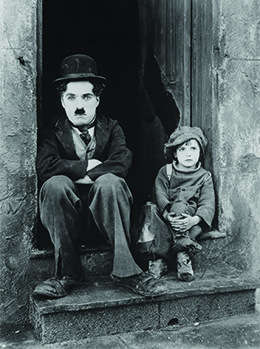
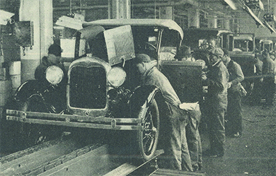

By the end of this section, you will be able to:
* Discuss the role of movies in the evolution of American culture
* Explain the rise of sports as a dominant social force
* Analyze the ways in which the automobile, especially the Model T, transformed American life

 ![A timeline shows important events of the era. In 1920, Warren G. Harding is elected president with a landslide popular vote; a photograph of Harding is shown. In 1923, the Teapot Dome scandal rocks the Harding presidency; a photograph of the Senate committee during the Teapot Dome hearings is shown. In 1924, Henry Ford sells Model Ts for $300, and Congress enacts the National Origins Act, establishing quotas for immigration. In 1925, John Scopes is found guilty of teaching evolution in Tennessee; a photograph of Scopes is shown. In 1927, Charles Lindbergh flies solo across the Atlantic Ocean, and Nicola Sacco and Bartolomeo Vanzetti are executed in Massachusetts; a photograph of Lindbergh standing in front of a plane is shown. In 1928, Herbert Hoover is elected president; a photograph of Hoover is shown.](../resources/CNX_History_24_01_Timeline.jpg){: #Figure_24_01_Timeline}

In the 1920s, prosperity manifested itself in many forms, most notably in advancements in entertainment and technology that led to new patterns of leisure and consumption. Movies and sports became increasingly popular and buying on credit or “carrying” the debt allowed for the sale of more consumer goods and put automobiles within reach of average Americans. Advertising became a central institution in this new consumer economy, and commercial radio and magazines turned athletes and actors into national icons.

# MOVIES

The increased prosperity of the 1920s gave many Americans more disposable income to spend on entertainment. As the popularity of “moving pictures” grew in the early part of the decade, “movie palaces,” capable of seating thousands, sprang up in major cities. A ticket for a double feature and a live show cost twenty-five cents; for a quarter, Americans could escape from their problems and lose themselves in another era or world. People of all ages attended the movies with far more regularity than today, often going more than once per week. By the end of the decade, weekly movie attendance swelled to ninety million people.

The silent movies of the early 1920s gave rise to the first generation of movie stars. Rudolph Valentino, the lothario with the bedroom eyes, and Clara Bow, the “It Girl” with sex appeal, filled the imagination of millions of American moviegoers. However, no star captured the attention of the American viewing public more than Charlie Chaplin. This sad-eyed tramp with a moustache, baggy pants, and a cane was the top box office attraction of his time ([\[link\]](#Figure_24_01_Chaplin)).

 {: #Figure_24_01_Chaplin}

In 1927, the world of the silent movie began to wane with the New York release of the first “talkie”: *The Jazz Singer*. The plot of this film, which starred Al Jolson, told a distinctively American story of the 1920s. It follows the life of a Jewish man from his boyhood days of being groomed to be the cantor at the local synagogue to his life as a famous and “Americanized” jazz singer. Both the story and the new sound technology used to present it were popular with audiences around the country. It quickly became a huge hit for Warner Brothers, one of the “big five” motion picture studios in Hollywood along with Twentieth Century Fox, RKO Pictures, Paramount Pictures, and Metro-Goldwyn-Mayer.

Southern California in the 1920s, however, had only recently become the center of the American film industry. Film production was originally based in and around New York, where Thomas Edison first debuted the kinetoscope in 1893. But in the 1910s, as major filmmakers like D. W. Griffith looked to escape the cost of Edison’s patents on camera equipment, this began to change. When Griffith filmed *In Old California* (1910), the first movie ever shot in **Hollywood**{: data-type="term"}, California, the small town north of Los Angeles was little more than a village. As moviemakers flocked to southern California, not least because of its favorable climate and predictable sunshine, Hollywood swelled with moviemaking activity. By the 1920s, the once-sleepy village was home to a majorly profitable innovative industry in the United States.

# AUTOMOBILES AND AIRPLANES: AMERICANS ON THE MOVE

Cinema was not the only major industry to make great technological strides in this decade. The 1920s opened up new possibilities of mobility for a large percentage of the U.S. population, as automobile manufacturers began to mass produce what had once been a luxury item, and daring aviators both demonstrated and drove advancements in aircraft technology. The most significant innovation of this era was Henry Ford’s **Model T**{: data-type="term"} Ford, which made car ownership available to the average American.

Ford did not invent the automobile—the Duryea brothers in Massachusetts as well as Gottlieb W. Daimler and Karl Friedrich Benz in Germany were early pioneers. By the early twentieth century, hundreds of car manufacturers existed. However, they all made products that were too expensive for most Americans. Ford’s innovation lay in his focus on using mass production to manufacture automobiles; he revolutionized industrial work by perfecting the assembly line, which enabled him to lower the Model T’s price from $850 in 1908 to $300 in 1924, making car ownership a real possibility for a large share of the population ([\[link\]](#Figure_24_01_ModelTAd)). As prices dropped, more and more people could afford to own a car. Soon, people could buy used Model Ts for as little as five dollars, allowing students and others with low incomes to enjoy the freedom and mobility of car ownership. By 1929, there were over twenty-three million automobiles on American roads.

 {: #Figure_24_01_ModelTAd}

The assembly line helped Ford reduce labor costs within the production process by moving the product from one team of workers to the next, each of them completing a step so simple they had to be, in Ford’s words, “no smarter than an ox” ([\[link\]](#Figure_24_01_Assembly)). Ford’s reliance on the **moving assembly line**{: data-type="term"}, scientific management, and time-motion studies added to his emphasis on efficiency over craftsmanship.

 {: #Figure_24_01_Assembly}

Ford’s emphasis on cheap mass production brought both benefits and disadvantages to its workers. Ford would not allow his workers to unionize, and the boring, repetitive nature of the assembly line work generated a high turnover rate. However, he doubled workers’ pay to five dollars a day and standardized the workday to eight hours (a reduction from the norm). Ford’s assembly line also offered greater equality than most opportunities of the time, as he paid white and black workers equally. Seeking these wages, many African Americans from the South moved to Detroit and other large northern cities to work in factories.

Ford even bought a plot of land in the Amazonian jungle twice the size of Delaware to build a factory town he called **Fordlandia**{: data-type="term" .no-emphasis}. Workers there rejected his midwestern Puritanism even more than his factory discipline, and the project ended in an epic failure. In the United States, however, Ford shaped the nation’s mode of industrialism—one that relied on paying decent wages so that workers could afford to be the consumers of their own products.

The automobile changed the face of America, both economically and socially. Industries like glass, steel, and rubber processing expanded to keep up with auto production. The oil industry in California, Oklahoma, and Texas expanded, as Americans’ reliance on oil increased and the nation transitioned from a coal-based economy to one driven by petroleum. The need for public roadways required local and state governments to fund a dramatic expansion of infrastructure, which permitted motels and restaurants to spring up and offer new services to millions of newly mobile Americans with cash to spend. With this new infrastructure, new shopping and living patterns emerged, and streetcar suburbs gave way to automobile suburbs as private automobile traffic on public roads began to replace mass transit on trains and trolleys.

The 1920s not only witnessed a transformation in ground transportation but also major changes in air travel. By the mid-1920s, men—as well as some pioneering women like the African American stunt pilot Bessie Coleman ([\[link\]](#Figure_24_01_Pilots))—had been flying for two decades. But there remained doubts about the suitability of airplanes for long-distance travel. Orville Wright, one of the pioneers of airplane technology in the United States, once famously declared, “No flying machine will ever fly from New York to Paris \[because\] no known motor can run at the requisite speed for four days without stopping.” However, in 1927, this skepticism was finally put to rest when Charles Lindbergh became the first person to fly solo across the Atlantic Ocean, flying from New York to Paris in thirty-three hours ([\[link\]](#Figure_24_01_Pilots)).

, the plane in which he flew from New York to Paris, France, in 1927. Because American flight schools barred black students, stunt pilot Bessie Coleman (b), the daughter of Texas sharecroppers, taught herself French to earn her pilot&#x2019;s license overseas."){: #Figure_24_01_Pilots}

Lindbergh’s flight made him an international hero: the best-known American in the world. On his return, Americans greeted him with a ticker-tape parade—a celebration in which shredded paper thrown from surrounding buildings creates a festive, flurry effect. His flight, which he completed in the monoplane *Spirit of St. Louis*, seemed like a triumph of individualism in modern mass society and exemplified Americans’ ability to conquer the air with new technology. Following his success, the small airline industry began to blossom, fully coming into its own in the 1930s, as companies like Boeing and Ford developed airplanes designed specifically for passenger air transport. As technologies in engine and passenger compartment design improved, air travel became more popular. In 1934, the number of U.S. domestic air passengers was just over 450,000 annually. By the end of the decade, that number had increased to nearly two million.

Technological innovation influenced more than just transportation. As access to electricity became more common and the electric motor was made more efficient, inventors began to churn out new and more complex household appliances. Newly developed innovations like radios, phonographs, vacuum cleaners, washing machines, and refrigerators emerged on the market during this period. While expensive, new consumer-purchasing innovations like store credit and installment plans made them available to a larger segment of the population. Many of these devices promised to give women—who continued to have primary responsibility for housework—more opportunities to step out of the home and expand their horizons. Ironically, however, these labor-saving devices tended to increase the workload for women by raising the standards of domestic work. With the aid of these tools, women ended up cleaning more frequently, washing more often, and cooking more elaborate meals rather than gaining spare time.

Despite the fact that the promise of more leisure time went largely unfulfilled, the lure of technology as the gateway to a more relaxed lifestyle endured. This enduring dream was a testament to the influence of another growing industry: advertising. The mass consumption of cars, household appliances, ready-to-wear clothing, and processed foods depended heavily on the work of advertisers. Magazines like *Ladies’ Home Journal* and *The Saturday Evening Post* became vehicles to connect advertisers with middle-class consumers. Colorful and occasionally provocative print advertisements decorated the pages of these publications and became a staple in American popular culture ([\[link\]](#Figure_24_01_Palmolive)).

 {: #Figure_24_01_Palmolive}

The form of the advertisements, however, was not new. These colorful print ads were merely the modern incarnations of an advertising strategy that went back to the nineteenth century. The new medium for advertisers in the 1920s, the one that would reach out to consumers in radically new and innovative ways, was radio.

# THE POWER OF RADIO AND THE WORLD OF SPORTS

After being introduced during World War I, radios became a common feature in American homes of the 1920s. Hundreds of radio stations popped up over the decade. These stations developed and broadcasted news, serial stories, and political speeches. Much like print media, advertising space was interspersed with entertainment. Yet, unlike magazines and newspapers, advertisers did not have to depend on the active participation of consumers: Advertisers could reach out to anyone within listening distance of the radio. On the other hand, their broader audience meant that they had to be more conservative and careful not to offend anyone.

  
Listen to a recording of a [broadcast][1] of the “WLS Showboat: “The Floating Palace of Wonder,” a variety show from WLS Chicago, a radio station run by Sears Roebuck and Co. What does the clip tell you about the entertainment of the 1920s?

The power of radio further sped up the processes of nationalization and homogenization that were previously begun with the wide distribution of newspapers made possible by railroads and telegraphs. Far more effectively than these print media, however, radio created and pumped out American culture onto the airwaves and into the homes of families around the country. Syndicated radio programs like *Amos ‘n’ Andy*, which began in the late 1920s, entertained listeners around the country—in the case of the popular *Amos ‘n’ Andy*, it did so with racial stereotypes about African Americans familiar from minstrel shows of the previous century. No longer were small corners of the country separated by their access to information. With the radio, Americans from coast to coast could listen to exactly the same programming. This had the effect of smoothing out regional differences in dialect, language, music, and even consumer taste.

Radio also transformed how Americans enjoyed sports. The introduction of play-by-play descriptions of sporting events broadcast over the radio brought sports entertainment right into the homes of millions. Radio also helped to popularize sports figures and their accomplishments. Jim Thorpe, who grew up in the Sac and Fox Nation in Oklahoma, was known as one of the best athletes in the world: He medaled in the 1912 Olympic Games, played Major League Baseball, and was one of the founding members of the National Football League. Other sports superstars were soon household names. In 1926, Gertrude Ederle became the first woman to swim the English Channel. Helen Wills dominated women’s tennis, winning Wimbledon eight times in the late 1920s ([\[link\]](#Figure_24_01_Sports)), whereas “Big Bill” Tilden won the national singles title every year from 1920 to 1925. In football, Harold “Red” Grange played for the University of Illinois, averaging over ten yards per carry during his college career. The biggest star of all was the “Sultan of Swat,” Babe Ruth, who became America’s first baseball hero ([\[link\]](#Figure_24_01_Sports)). He changed the game of baseball from a low-scoring one dominated by pitchers to one where his hitting became famous. By 1923, most pitchers intentionally walked him. In 1924, he hit sixty homeruns.

  led the New York Yankees to four World Series championships. In this 1921 photograph, he stands outside of the New York Yankees dugout. Helen Wills (b) won a total of thirty-one Grand Slam titles in her career, including eight singles titles at Wimbledon from 1927 to 1938. (credit a: modification of work by Library of Congress)"){: #Figure_24_01_Sports}

# section-summary

For many middle-class Americans, the 1920s was a decade of unprecedented prosperity. Rising earnings generated more disposable income for the consumption of entertainment, leisure, and consumer goods. This new wealth coincided with and fueled technological innovations, resulting in the booming popularity of entertainments like movies, sports, and radio programs. Henry Ford’s advances in assembly-line efficiency created a truly affordable automobile, making car ownership a possibility for many Americans. Advertising became as big an industry as the manufactured goods that advertisers represented, and many families relied on new forms of credit to increase their consumption levels and strive for a new American standard of living.

# Review Questions

Which of the following films released in 1927 was the first successful talking motion picture?

1.  *The Clansman*
2.  *The Great Gatsby*
3.  *The Jazz Singer*
4.  *The Birth of a Nation*
{: data-number-style="upper-alpha"}

C

The popularization of \_\_\_\_\_\_\_\_ expanded the communications and sports industries.

1.  radios
2.  talkies
3.  the Model T
4.  airplanes
{: data-number-style="upper-alpha"}

A

Who was the first person to fly solo across the Atlantic Ocean?

1.  Orville Wright
2.  Jim Thorpe
3.  Charlie Chaplin
4.  Charles Lindbergh
{: data-number-style="upper-alpha"}

D

How did Henry Ford transform the automobile industry?

Henry Ford revolutionized the automobile industry by making the car affordable to the average person. In order to accomplish this, he refused to allow workers to unionize, instituted an eight-hour workday, raised workers’ wages, promoted equal pay for black and white workers and for women; and used assembly lines to facilitate production. The automobile thus became a symbol of middle-class life, rather than a luxury good available only to the wealthy.

[1]: http://openstaxcollege.org/l/15Showboat
