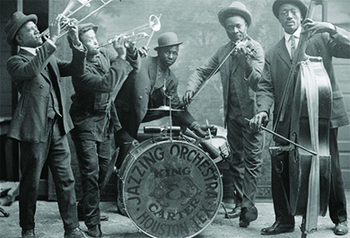
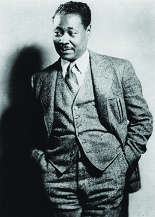
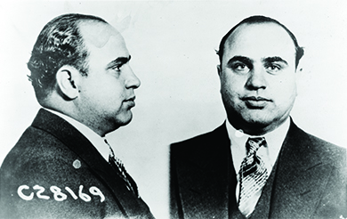
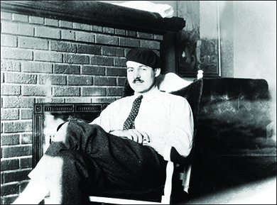

By the end of this section, you will be able to:
* Explain the factors that shaped the new morality and the changing role of women in the United States during the 1920s
* Describe the “new Negro” and the influence of the Harlem Renaissance
* Analyze the effects of prohibition on American society and culture
* Describe the character and main authors of the Lost Generation

The 1920s was a time of dramatic change in the United States. Many young people, especially those living in big cities, embraced a new morality that was much more permissive than that of previous generations. They listened to jazz music, especially in the nightclubs of Harlem. Although prohibition outlawed alcohol, criminal bootlegging and importing businesses thrived. The decade was not a pleasure cruise for everyone, however; in the wake of the Great War, many were left awaiting the promise of a new generation.

# A NEW MORALITY

Many Americans were disillusioned in the post-World War I era, and their reactions took many forms. Rebellious American youth, in particular, adjusted to the changes by embracing a **new morality**{: data-type="term"} that was far more permissive than the social mores of their parents. Many young women of the era shed their mother’s morality and adopted the dress and mannerisms of a **flapper**{: data-type="term"}, the Jazz Age female stereotype, seeking the endless party. Flappers wore shorter skirts, shorter hair, and more makeup, and they drank and smoked with the boys ([\[link\]](#Figure_24_03_Flapper)). Flappers’ dresses emphasized straight lines from the shoulders to the knees, minimizing breasts and curves while highlighting legs and ankles. The male equivalent of a flapper was a “**sheik**,” although that term has not remained as strong in the American vernacular. At the time, however, many of these fads became a type of conformity, especially among college-aged youths, with the signature bob haircut of the flapper becoming almost universal—in both the United States and overseas.

 {: #Figure_24_03_Flapper}

As men and women pushed social and cultural boundaries in the Jazz Age, sexual mores changed and social customs grew more permissive. “Petting parties” or “necking parties” became the rage on college campuses. Psychologist Sigmund Freud and British “sexologist” Havelock Ellis emphasized that sex was a natural and pleasurable part of the human experience. Margaret Sanger, the founder of Planned Parenthood, launched an information campaign on birth control to give women a choice in the realm in which suffrage had changed little—the family. The popularization of contraception and the private space that the automobile offered to teenagers and unwed couples also contributed to changes in sexual behavior.

Flappers and sheiks also took their cues from the high-flying romances they saw on movie screens and confessions in movie magazines of immorality on movie sets. Movie posters promised: “Brilliant men, beautiful jazz babies, champagne baths, midnight revels, petting parties in the purple dawn, all ending in one terrific smashing climax that makes you gasp.” And “neckers, petters, white kisses, red kisses, pleasure-mad daughters, sensation-craving mothers . . . the truth: bold, naked, sensational.”

  
Could you go “on a toot” with flappers and sheiks? Improve your chances with this [collection][1] of Jazz Age slang.

New dances and new music—especially jazz—also characterized the Jazz Age. Born out of the African American community, jazz was a uniquely American music. The innovative sound emerged from a number of different communities and from a number of different musical traditions such as blues and ragtime. By the 1920s, jazz had spread from African American clubs in New Orleans and Chicago to reach greater popularity in New York and abroad. One New York jazz establishment, the Cotton Club, became particularly famous and attracted large audiences of hip, young, and white flappers and sheiks to see black entertainers play jazz ([\[link\]](#Figure_24_03_JazzBand)).

 {: #Figure_24_03_JazzBand}

# THE “NEW WOMAN”

The Jazz Age and the proliferation of the flapper lifestyle of the 1920s should not be seen merely as the product of postwar disillusionment and newfound prosperity. Rather, the search for new styles of dress and new forms of entertainment like jazz was part of a larger women’s rights movement. The early 1920s, especially with the ratification of the Nineteenth Amendment guaranteeing full voting rights to women, was a period that witnessed the expansion of women’s political power. The public flaunting of social and sexual norms by flappers represented an attempt to match gains in political equality with gains in the social sphere. Women were increasingly leaving the Victorian era norms of the previous generation behind, as they broadened the concept of women’s liberation to include new forms of social expression such as dance, fashion, women’s clubs, and forays into college and the professions.

Nor did the struggle for women’s rights through the promotion and passage of legislation cease in the 1920s. In 1921, Congress passed the Promotion of the Welfare and Hygiene of Maternity and Infancy Act, also known as the Sheppard-Towner Act, which earmarked $1.25 million for well-baby clinics and educational programs, as well as nursing. This funding dramatically reduced the rate of infant mortality. Two years later, in 1923, Alice Paul drafted and promoted an Equal Rights Amendment (ERA) that promised to end all sex discrimination by guaranteeing that “Men and women shall have equal rights throughout the United States and every place subject to its jurisdiction.”

Yet, ironically, at precisely the time when the Progressive movement was achieving its long-sought-after goals, the movement itself was losing steam and the Progressive Era was coming to a close. As the heat of Progressive politics grew less intense, voter participation from both sexes declined over the course of the 1920s. After the passage of the Nineteenth Amendment, many women believed that they had accomplished their goals and dropped out of the movement. As a result, the proposed ERA stalled (the ERA eventually passed Congress almost fifty years later in 1972, but then failed to win ratification by a sufficient number of states), and, by the end of the 1920s, Congress even allowed funding for the Sheppard-Towner Act to lapse.

The growing lethargy toward women’s rights was happening at a time when an increasing number of women were working for wages in the U.S. economy—not only in domestic service, but in retail, healthcare and education, offices, and manufacturing. Beginning in the 1920s, women’s participation in the labor force increased steadily. However, most were paid less than men for the same type of work based on the rationale that they did not have to support a family. While the employment of single and unmarried women had largely won social acceptance, married women often suffered the stigma that they were working for pin money—frivolous additional discretionary income.

# THE HARLEM RENAISSANCE AND THE NEW NEGRO

It wasn’t only women who found new forms of expression in the 1920s. African Americans were also expanding their horizons and embracing the concept of the “new Negro.” The decade witnessed the continued Great Migration of African Americans to the North, with over half a million fleeing the strict Jim Crow laws of the South. Life in the northern states, as many African Americans discovered, was hardly free of discrimination and segregation. Even without Jim Crow, businesses, property owners, employers, and private citizens typically practiced *de facto* segregation, which could be quite stifling and oppressive. Nonetheless, many southern blacks continued to move north into segregated neighborhoods that were already bursting at the seams, because the North, at the very least, offered two tickets toward black progress: schools and the vote. The black population of New York City doubled during the decade. As a result, Harlem, a neighborhood at the northern end of Manhattan, became a center for Afro-centric art, music, poetry, and politics. Political expression in the Harlem of the 1920s ran the gamut, as some leaders advocated a return to Africa, while others fought for inclusion and integration.

Revived by the wartime migration and fired up by the white violence of the postwar riots, urban blacks developed a strong cultural expression in the 1920s that came to be known as the Harlem Renaissance. In this rediscovery of black culture, African American artists and writers formulated an independent black culture and encouraged racial pride, rejecting any emulation of white American culture. Claude McKay’s poem “If We Must Die” called on African Americans to start fighting back in the wake of the Red Summer riots of 1919 (discussed in a previous chapter, [\[link\]](#Figure_24_03_Harlem)). Langston Hughes, often nicknamed the “poet laureate” of the movement, invoked sacrifice and the just cause of civil rights in “The Colored Soldier,” while another author of the movement, Zora Neale Hurston, celebrated the life and dialect of rural blacks in a fictional, all-black town in Florida. Hurston’s <em>Their Eyes Were Watching God </em>was only published posthumously in 1937.

 {: #Figure_24_03_Harlem}

The new Negro found political expression in a political ideology that celebrated African Americans distinct national identity. This **Negro nationalism**{: data-type="term"}, as some referred to it, proposed that African Americans had a distinct and separate national heritage that should inspire pride and a sense of community. An early proponent of such nationalism was W. E. B. Du Bois. One of the founders of the NAACP, a brilliant writer and scholar, and the first African American to earn a Ph.D. from Harvard, Du Bois openly rejected assumptions of white supremacy. His conception of Negro nationalism encouraged Africans to work together in support of their own interests, promoted the elevation of black literature and cultural expression, and, most famously, embraced the African continent as the true homeland of all ethnic Africans—a concept known as Pan-Africanism.

Taking Negro nationalism to a new level was Marcus Garvey. Like many black Americans, the Jamaican immigrant had become utterly disillusioned with the prospect of overcoming white racism in the United States in the wake of the postwar riots and promoted a “Back to Africa” movement. To return African Americans to a presumably more welcoming home in Africa, Garvey founded the **Black Star Steamship Line**. He also started the United Negro Improvement Association (UNIA), which attracted thousands of primarily lower-income working people. UNIA members wore colorful uniforms and promoted the doctrine of a “negritude” that reversed the color hierarchy of white supremacy, prizing blackness and identifying light skin as a mark of inferiority. Intellectual leaders like Du Bois, whose lighter skin put him low on Garvey’s social order, considered the UNIA leader a charlatan. Garvey was eventually imprisoned for mail fraud and then deported, but his legacy set the stage for Malcolm X and the Black Power movement of the 1960s.

# PROHIBITION

At precisely the same time that African Americans and women were experimenting with new forms of social expression, the country as a whole was undergoing a process of austere and dramatic social reform in the form of alcohol prohibition. After decades of organizing to reduce or end the consumption of alcohol in the United States, temperance groups and the Anti-Saloon League finally succeeded in pushing through the Eighteenth Amendment in 1919, which banned the manufacture, sale, and transportation of intoxicating liquors ([\[link\]](#Figure_24_03_Prohibit)). The law proved difficult to enforce, as illegal alcohol soon poured in from Canada and the Caribbean, and rural Americans resorted to home-brewed “moonshine.” The result was an eroding of respect for law and order, as many people continued to drink illegal liquor. Rather than bringing about an age of sobriety, as Progressive reformers had hoped, it gave rise to a new subculture that included illegal importers, interstate smuggling (or **bootlegging**{: data-type="term"}), clandestine saloons referred to as “speakeasies,” hipflasks, cocktail parties, and the organized crime of trafficking liquor.

 , consumers found ingenious ways of hiding liquor during prohibition, such as this cane that served as a flask (b)."){: #Figure_24_03_Prohibit}

Prohibition also revealed deep political divisions in the nation. The Democratic Party found itself deeply divided between urban, northern “wets” who hated the idea of abstinence, and rural, southern “dries” who favored the amendment. This divided the party and opened the door for the Republican Party to gain ascendancy in the 1920s. All politicians, including Woodrow Wilson, Herbert Hoover, Robert La Follette, and Franklin D. Roosevelt, equivocated in their support for the law. Publicly, they catered to the Anti-Saloon League; however, they failed to provide funding for enforcement.

Prohibition sparked a rise in organized crime. “Scarface” Al Capone ([\[link\]](#Figure_24_03_Capone)) ran an extensive bootlegging and criminal operation known as the Chicago Outfit or Chicago mafia. By 1927, Capone’s organization included a number of illegal activities including bootlegging, prostitution, gambling, loan sharking, and even murder. His operation was earning him more than $100 million annually, and many local police were on his payroll. Although he did not have a monopoly on crime, his organizational structure was better than many other criminals of his era. His liquor trafficking business and his Chicago soup kitchens during the Great Depression led some Americans to liken Capone to a modern-day Robin Hood. Still, Capone was eventually imprisoned for eleven years for tax evasion, including a stint in California’s notorious Alcatraz prison.

 {: #Figure_24_03_Capone}

# THE LOST GENERATION

As the country struggled with the effects and side-effects of prohibition, many young intellectuals endeavored to come to grips with a lingering sense of disillusionment. World War I, fundamentalism, and the Red Scare—a pervasive American fear of Communist infiltrators prompted by the success of the Bolshevik Revolution—all left their mark on these intellectuals. Known as the **Lost Generation**{: data-type="term"}, writers like F. Scott Fitzgerald, Ernest Hemingway, Sinclair Lewis, Edith Wharton, and John Dos Passos expressed their hopelessness and despair by skewering the middle class in their work. They felt alienated from society, so they tried to escape (some literally) to criticize it. Many lived an **expatriate**{: data-type="term"} life in Paris for the decade, although others went to Rome or Berlin.

The Lost Generation writer that best exemplifies the mood of the 1920s was F. Scott Fitzgerald, now considered one of the most influential writers of the twentieth century. His debut novel, *This Side of Paradise*, describes a generation of youth “grown up to find all gods dead, all wars fought, all faith in man shaken.” *The Great Gatsby*, published in 1925, exposed the doom that always follows the fun, fast-lived life. Fitzgerald depicted the modern millionaire Jay Gatsby living a profligate life: unscrupulous, coarse, and in love with another man’s wife. Both Fitzgerald and his wife Zelda lived this life as well, squandering the money he made from his writing.

F. Scott Fitzgerald on the 1920s

In the 1920s, Fitzgerald was one of the most celebrated authors of his day, publishing *This Side of Paradise*, *The Beautiful and Damned*, and <em>The Great Gatsby </em>in quick succession. However, his profligate lifestyle with his wife Zelda sapped their funds, and Fitzgerald had to struggle to maintain their lavish lifestyle. Below is an excerpt from “The Crack-Up,” a personal essay by Fitzgerald originally published in *Esquire* in which he describes his “good life” during the 1920s.

\> It seemed a romantic business to be a successful literary man—you were not ever going to be as famous as a movie star but what note you had was probably longer-lived; you were never going to have the power of a man of strong political or religious convictions but you were certainly more independent. Of course within the practice of your trade you were forever unsatisfied—but I, for one, would not have chosen any other.
> * * *
> {: data-type="newline"}
> 
> As the Twenties passed, with my own twenties marching a little ahead of them, my two juvenile regrets—at not being big enough (or good enough) to play football in college, and at not getting overseas during the war—resolved themselves into childish waking dreams of imaginary heroism that were good enough to go to sleep on in restless nights. The big problems of life seemed to solve themselves, and if the business of fixing them was difficult, it made one too tired to think of more general problems.
> * * *
> {: data-type="newline"}
> 
> —F. Scott Fitzgerald, “The Crack-Up,” 1936

How does Fitzgerald describe his life in the 1920s? How did his interpretation reflect the reality of the decade?

Equally idiosyncratic and disillusioned was writer Ernest Hemingway ([\[link\]](#Figure_24_03_Hemingway)). He lived a peripatetic and adventurous lifestyle in Europe, Cuba, and Africa, working as an ambulance driver in Italy during World War I and traveling to Spain in the 1930s to cover the civil war there. His experiences of war and tragedy stuck with him, emerging in colorful scenes in his novels *The Sun Also Rises* (1926), *A Farewell to Arms* (1929), and *For Whom the Bell Tolls* (1940). In 1952, his novella, *The* *Old Man and the Sea*, won the Pulitzer Prize. Two years later, he won the Nobel Prize in Literature for this book and his overall influence on contemporary style.

 {: #Figure_24_03_Hemingway}

  
Listen to an [audio][2] of Hemingway’s Nobel Prize acceptance speech.

Not all Lost Generation writers were like Fitzgerald or Hemingway. The writing of Sinclair Lewis, rather than expressing a defined disillusionment, was more influenced by the Progressivism of the previous generation. In *Babbitt* (1922), he examined the “sheep following the herd” mentality that conformity promoted. He satirized American middle-class life as pleasure seeking and mindless. Similarly, writer Edith Wharton celebrated life in old New York, a vanished society, in *The Age of Innocence*, in 1920. Wharton came from a very wealthy, socialite family in New York, where she was educated by tutors and never attended college. She lived for many years in Europe; during the Great War, she worked in Paris helping women establish businesses.

# Section Summary

Different groups reacted to the upheavals of the 1920s in different ways. Some people, especially young urbanites, embraced the new amusements and social venues of the decade. Women found new opportunities for professional and political advancement, as well as new models of sexual liberation; however, the women’s rights movement began to wane with the passage of the Nineteenth Amendment. For black artists of the Harlem Renaissance, the decade was marked less by leisure and consumption than by creativity and purpose. African American leaders like Marcus Garvey and W. E. B. Du Bois responded to the retrenched racism of the time with different campaigns for civil rights and black empowerment. Others, like the writers of the Lost Generation, reveled in exposing the hypocrisies and shallowness of mainstream middle-class culture. Meanwhile, the passage of prohibition served to increase the illegal production of alcohol and led to a rise in organized crime.

# Review Questions

The popularization of which psychologist’s ideas encouraged the new morality of the 1920s?

1.  Sigmund Freud
2.  Alice Paul
3.  W. E. B. Du Bois
4.  Margaret Sanger
{: data-number-style="upper-alpha"}

A

Which amendment did Alice Paul promote to end gender discrimination?

1.  Prohibition Amendment
2.  Equal Rights Amendment
3.  Sheppard-Towner Amendment
4.  Free Exercise Amendment
{: data-number-style="upper-alpha"}

B

Which novel of the era satirized the conformity of the American middle class?

1.  *This Side of Paradise*
2.  *The Sun Also Rises*
3.  *A Farewell to Arms*
4.  *Babbitt*
{: data-number-style="upper-alpha"}

D

Why did the prohibition amendment fail after its adoption in 1919?

The prohibition amendment failed due to its infeasibility. It lacked both public support and funds for its enforcement. It also lessened Americans’ respect for law and order, and sparked a rise in unlawful activities, such as illegal alcohol production and organized crime.

What was the Harlem Renaissance, and who were some of the most famous participants?

The Harlem Renaissance was a rediscovery and celebration of black culture and race pride. Within this context, black literature and art flourished. Writers such as Claude McKay, Langston Hughes, and Zora Neale Hurston created fiction and poetry that spoke directly to the experiences of black Americans. Meanwhile, black scholars and political leaders, such as W. E. B. Du Bois and Marcus Garvey, created new social and political ideologies and defined a distinct national identity for African Americans.

## Glossary
{: data-type="glossary-title"}

bootlegging
: a nineteenth-century term for the illegal transport of alcoholic beverages that became popular during prohibition
{: .definition}

expatriate
: someone who lives outside of their home country
{: .definition}

flapper
: a young, modern woman who embraced the new morality and fashions of the Jazz Age
{: .definition}

Lost Generation
: a group of writers who came of age during World War I and expressed their disillusionment with the era
{: .definition}

Negro nationalism
: the notion that African Americans had a distinct and separate national heritage that should inspire pride and a sense of community
{: .definition}

new morality
: the more permissive mores adopted my many young people in the 1920s
{: .definition}

[1]: http://openstaxcollege.org/l/15JazzSlang
[2]: http://openstaxcollege.org/l/15Hemingway
