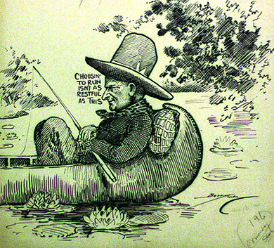

By the end of this section, you will be able to:
* Discuss Warren G. Harding’s strengths and weaknesses as president
* Explain how Calvin Coolidge was able to defeat the Democratic Party
* Explain what Calvin Coolidge meant by “the business of America is business”

The election of 1920 saw the weakening of the Democratic Party. The death of Theodore Roosevelt and Woodrow Wilson’s ill health meant the passing of a generation of Progressive leaders. The waning of the Red Scare took with it the last vestiges of Progressive zeal, and Wilson’s support of the League of Nations turned Irish and German immigrants against the Democrats. Americans were tired of reform, tired of witch hunts, and were more than ready for a return to “normalcy.”

Above all, the 1920s signaled a return to a pro-business government—almost a return to the laissez-faire politics of the Gilded Age of the late nineteenth century. Calvin Coolidge’s statement that “the chief business of the American people is business,” often rendered as “the business of America is business” became the dominant attitude.

# WARREN HARDING AND THE RETURN TO NORMALCY

In the election of 1920, professional Republicans were eager to nominate a man whom they could manage and control. Warren G. Harding, a senator from Ohio, represented just such a man ([\[link\]](#Figure_24_04_HardCool)). Before his nomination, Harding stated, “America’s present need is not heroics but healing; not nostrums but normalcy; not revolution but restoration.” Harding was genial and affable, but not everyone appreciated his speeches; Democratic presidential-hopeful William Gibbs McAdoo described Harding’s speeches as “an army of pompous phrases moving across the landscape in search of an idea.” H. L. Mencken, the great social critic of the 1920s, wrote of Harding’s speaking, “It drags itself out of the dark abysm of pish, and crawls insanely up to the top-most pinnacle of posh. It is rumble and bumble. It is flap and doodle. It is balder and dash.”

Harding was known for enjoying golf, alcohol, and poker (not necessarily in that order). Although his critics depicted him as weak, lazy, or incompetent, he was actually quite shrewd and politically astute. Together with his running mate, Calvin Coolidge, the governor of Massachusetts, they attracted the votes of many Americans who sought Harding’s promised **return to normalcy**{: data-type="term"}. In the election, Harding defeated Governor James Cox of Ohio by the greatest majority in the history of two-party politics: 61 percent of the popular vote.

  poses on the campaign trail in 1920. His running mate, Calvin Coolidge (b), would go on to become president in 1923, when Harding died suddenly while touring the United States."){: #Figure_24_04_HardCool}

Harding’s cabinet reflected his pro-business agenda. Herbert Hoover, a millionaire mechanical engineer and miner, became his Secretary of Commerce. Hoover had served as head of the relief effort for Belgium during World War I and helped to feed those in Russia and Germany after the war ended. He was a very effective administrator, seeking to limit inefficiency in the government and promoting partnerships between government and businesses. Harding’s Secretary of the Treasury, Andrew Mellon, was also a pro-business multimillionaire with a fortune built in banking and aluminum. Even more so than Hoover, Mellon entered public service with a strong sense that government should run as efficiently as any business, famously writing that “the Government is just a business, and can and should be run on business principles.”

Consistent with his principles of running government with business-like efficiency, Harding proposed and signed into law tax rate cuts as well as the country’s first formal budgeting process, which created a presidential budget director and required that the president submit an annual budget to Congress. These policies helped to reduce the debt that the United States had incurred during World War I. However, as Europe began to recover, U.S. exports to the continent dwindled. In an effort to protect U.S. agriculture and other businesses threatened by lower-priced imports, Harding pushed through the Emergency Tariff of 1921. This defensive tariff had the effect of increasing American purchasing power, although it also inflated the prices of many goods.

In the area of foreign policy, Harding worked to preserve the peace through international cooperation and the reduction of armaments around the world. Despite the refusal of the U.S. Senate to ratify the Treaty of Versailles, Harding was able to work with Germany and Austria to secure a formal peace. He convened a conference in Washington that brought world leaders together to agree on reducing the threat of future wars by reducing armaments. Out of these negotiations came a number of treaties designed to foster cooperation in the Far East, reduce the size of navies around the world, and establish guidelines for submarine usage. These agreements ultimately fell apart in the 1930s, as the world descended into war again. But, at the time, they were seen as a promising path to maintaining the peace.

Despite these developments, the Harding administration has gone down in history as one that was especially ridden with scandal. While Harding was personally honest, he surrounded himself with politicians who weren’t. Harding made the mistake of often turning to unscrupulous advisors or even his “Ohio Gang” of drinking and poker buddies for advice and guidance. And, as he himself recognized, this group tended to cause him grief. “I have no trouble with my enemies,” he once commented. “I can take care of my enemies in a fight. But my friends, my goddamned friends, they’re the ones who keep me walking the floor at nights!”

The scandals mounted quickly. From 1920 to 1923, Secretary of the Interior Albert B. Fall was involved in a scam that became known as the **Teapot Dome scandal**{: data-type="term"}. Fall had leased navy reserves in Teapot Dome, Wyoming, and two other sites in California to private oil companies without opening the bidding to other companies. In exchange, the companies gave him $300,000 in cash and bonds, as well as a herd of cattle for his ranch. Fall was convicted of accepting bribes from the oil companies; he was fined $100,000 and sentenced to a year in prison. It was the first time that a cabinet official had received such a sentence.

In 1923, Harding also learned that the head of the Veterans’ Bureau, Colonel Charles Forbes, had absconded with most of the $250 million set aside for extravagant bureau functions. Harding allowed Forbes to resign and leave the country; however, after the president died, Forbes returned and was tried, convicted, and sentenced to two years in Leavenworth prison.

Although the Harding presidency had a number of large successes and variety of dark scandals, it ended before the first term was up. In July 1923, while traveling in Seattle, the president suffered a heart attack. On August 2, in his weakened condition, he suffered a stroke and died in San Francisco, leaving the presidency to his vice president, Calvin Coolidge. As for Harding, few presidents were so deeply mourned by the populace. His kindly nature and ability to poke fun at himself endeared him to the public.

  
Listen to some of [Harding’s speeches][1] at The University of Virginia’s Miller Center’s website.

# A MAN OF FEW WORDS

Coolidge ended the scandals, but did little beyond that. Walter Lippman wrote in 1926 that “Mr. Coolidge’s genius for inactivity is developed to a very high point. It is a grim, determined, alert inactivity, which keeps Mr. Coolidge occupied constantly.”

Coolidge had a strong belief in the Puritan work ethic: Work hard, save your money, keep your mouth shut and listen, and good things will happen to you. Known as “Silent Cal,” his clean image seemed capable of cleaning up scandals left by Harding. Republicans—and the nation—now had a president who combined a preference for normalcy with the respectability and honesty that was absent from the Harding administration.

Coolidge’s first term was devoted to eliminating the taint of scandal that Harding had brought to the White House. Domestically, Coolidge adhered to the creed: “The business of America is business.” He stood in awe of Andrew Mellon and followed his fiscal policies, which made him the only president to turn a legitimate profit in the White House. Coolidge believed the rich were worthy of their property and that poverty was the wage of sin. Most importantly, Coolidge believed that since only the rich best understood their own interests, the government should let businessmen handle their own affairs with as little federal intervention as possible. Coolidge was quoted as saying, “The man who builds a factory builds a temple. The man who works there worships there.”

Thus, silence and inactivity became the dominant characteristics of the Coolidge presidency. Coolidge’s legendary reserve was famous in Washington society. Contemporaries told a possibly apocryphal story of how, at a dinner party at the White House, a woman bet her friends that she could get Coolidge to say more than three words. He looked at her and said, “you lose.”

The 1924 election saw Coolidge win easily over the divided Democrats, who fought over their nomination. Southerners wanted to nominate pro-prohibition, pro-Klan, anti-immigrant candidate William G. McAdoo. The eastern establishment wanted Alfred E. Smith, a Catholic, urban, and anti-prohibition candidate. After many battles, they compromised on corporation lawyer John W. Davis. Midwesterner Robert M. La Follette, promoted by farmers, socialists, and labor unions, attempted to resurrect the Progressive Party. Coolidge easily beat both candidates.

# THE ELECTION OF 1928

This cultural battle between the forces of reaction and rebellion appeared to culminate with the election of 1928, the height of Republican ascendancy. On August 2, 1927, Coolidge announced that he would not be participating in the 1928 election; “I choose not to run,” was his comment ([\[link\]](#Figure_24_04_IChooseNot)). Republicans promoted the heir apparent, Secretary of Commerce Herbert Hoover. The Democrats nominated Governor Alfred E. Smith of New York. Smith represented everything that small-town, rural America hated: He was Irish, Catholic, anti-prohibition, and a big-city politician. He was very flamboyant and outspoken, which also did not go over well with many Americans.

 {: #Figure_24_04_IChooseNot}

Republican prosperity carried the day once again, and Hoover won easily with twenty-one million votes over Al Smith’s fifteen million. The stock market continued to rise, and prosperity was the watchword of the day. Many Americans who had not done so before invested in the market, believing that the prosperous times would continue.

As Hoover came into office, Americans had every reason to believe that prosperity would continue forever. In less than a year, however, the bubble would burst, and a harsh reality would take its place.

# Section Summary

After World War I, Americans were ready for “a return to normalcy,” and Republican Warren Harding offered them just that. Under the guidance of his big-business backers, Harding’s policies supported businesses at home and isolation from foreign affairs. His administration was wracked by scandals, and after he died in 1923, Calvin Coolidge continued his policy legacy in much the same vein. Herbert Hoover, elected as Coolidge’s heir apparent, planned for more of the same until the stock market crash ended a decade of Republican ascendancy.

# Review Questions

Who was the Republican presidential nominee for the 1920 election?

1.  Calvin Coolidge
2.  Woodrow Wilson
3.  Warren Harding
4.  James Cox
{: data-number-style="upper-alpha"}

C

In 1929, Albert Fall was convicted of bribery while holding the position of \_\_\_\_\_\_\_\_.

1.  Secretary of the Interior
2.  head of the Veterans’ Bureau
3.  Secretary of the Treasury
4.  Secretary of Commerce
{: data-number-style="upper-alpha"}

A

Coolidge’s presidency was characterized by \_\_\_\_\_\_\_\_.

1.  scandal and dishonesty
2.  silence and inactivity
3.  flamboyancy and extravagance
4.  ambition and greed
{: data-number-style="upper-alpha"}

B

What was the economic outlook of the average American when Herbert Hoover took office in 1929?

Most Americans believed that their prosperity would continue. The stock market continued to flourish, prompting many Americans—including those who had never done so before—to invest their savings and hope for the best.

# Critical Thinking Questions

Explain how the 1920s was a decade of contradictions. What does the relationship between mass immigration and the rise of the Second Ku Klux Klan tell us about American attitudes? How might we reconcile the decade as the period of both the flapper and prohibition?

What new opportunities did the 1920s provide for women and African Americans? What new limitations did this era impose?

Discuss what the concept of “modernity” meant in the 1920s. How did art and innovation in the decade reflect the new mood of the postwar era?

Explain how technology took American culture in new and different directions. What role did motion pictures and radio play in shaping cultural attitudes in the United States?

Discuss how politics of the 1920s reflected the new postwar mood of the country. What did the Harding administration’s policies attempt to achieve, and how?

[1]: http://openstaxcollege.org/l/15Harding
