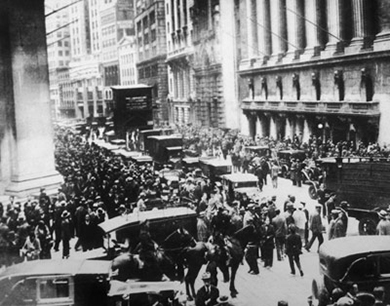
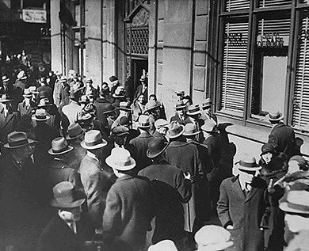
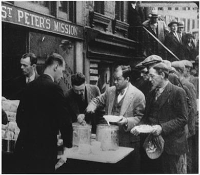
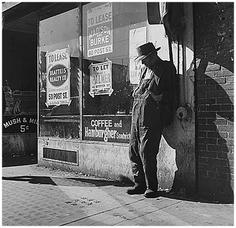

By the end of this section, you will be able to:
* Identify the causes of the stock market crash of 1929
* Assess the underlying weaknesses in the economy that resulted in America’s spiraling from prosperity to depression so quickly
* Explain how a stock market crash might contribute to a nationwide economic disaster

 ![A timeline shows important events of the era. In 1929, Hoover is inaugurated as president, the stock market crashes, and the Great Depression begins; photographs of Hoover (top) and the crowds on Wall Street on Black Tuesday (bottom) are shown. In 1930, the Dust Bowl results from severe drought conditions and poor farming practices; a photograph of several Great Plains houses is shown, with a massive dust cloud overhead. In 1931, the Scottsboro Boys trial begins in Alabama; a photo of one of the defendants, Haywood Patterson, is shown alongside a photo of the Jackson County Courthouse. In 1932, Hoover forms the Reconstruction Finance Corporation, the Bonus Army riot breaks out in Washington, and Roosevelt is elected president; photographs of the burning Bonus Army encampments (top) and Roosevelt (bottom) are shown.](../resources/CNX_History_25_01_Timeline.jpg "(credit &quot;courthouse&quot;: modification of work by National Oceanic and Atmospheric Administration)"){: #CNX_History_25_01_Timeline}

Herbert **Hoover**{: data-type="term" .no-emphasis} became president at a time of ongoing prosperity in the country. Americans hoped he would continue to lead the country through still more economic growth, and neither he nor the country was ready for the unraveling that followed. But Hoover’s moderate policies, based upon a strongly held belief in the spirit of American individualism, were not enough to stem the ever-growing problems, and the economy slipped further and further into the Great Depression.

While it is misleading to view the stock market crash of 1929 as the sole cause of the Great Depression, the dramatic events of that October did play a role in the downward spiral of the American economy. The crash, which took place less than a year after Hoover was inaugurated, was the most extreme sign of the economy’s weakness. Multiple factors contributed to the crash, which in turn caused a consumer panic that drove the economy even further downhill, in ways that neither Hoover nor the financial industry was able to restrain. Hoover, like many others at the time, thought and hoped that the country would right itself with limited government intervention. This was not the case, however, and millions of Americans sank into grinding poverty.

# THE EARLY DAYS OF HOOVER’S PRESIDENCY

Upon his inauguration, President Hoover set forth an agenda that he hoped would continue the “Coolidge prosperity” of the previous administration. While accepting the Republican Party’s presidential nomination in 1928, Hoover commented, “Given the chance to go forward with the policies of the last eight years, we shall soon with the help of God be in sight of the day when poverty will be banished from this nation forever.” In the spirit of normalcy that defined the Republican ascendancy of the 1920s, Hoover planned to immediately overhaul federal regulations with the intention of allowing the nation’s economy to grow unfettered by any controls. The role of the government, he contended, should be to create a partnership with the American people, in which the latter would rise (or fall) on their own merits and abilities. He felt the less government intervention in their lives, the better.

Yet, to listen to Hoover’s later reflections on Franklin Roosevelt’s first term in office, one could easily mistake his vision for America for the one held by his successor. Speaking in 1936 before an audience in Denver, Colorado, he acknowledged that it was always his intent as president to ensure “a nation built of home owners and farm owners. We want to see more and more of them insured against death and accident, unemployment and old age,” he declared. “We want them all secure.” [1](#footnote1){: data-type="footnote-number" name="footnote-ref1"} Such humanitarianism was not uncommon to Hoover. Throughout his early career in public service, he was committed to relief for people around the world. In 1900, he coordinated relief efforts for foreign nationals trapped in China during the Boxer Rebellion. At the outset of World War I, he led the food relief effort in Europe, specifically helping millions of Belgians who faced German forces. President Woodrow Wilson subsequently appointed him head of the U.S. Food Administration to coordinate rationing efforts in America as well as to secure essential food items for the Allied forces and citizens in Europe.

Hoover’s first months in office hinted at the reformist, humanitarian spirit that he had displayed throughout his career. He continued the civil service reform of the early twentieth century by expanding opportunities for employment throughout the federal government. In response to the Teapot Dome Affair, which had occurred during the Harding administration, he invalidated several private oil leases on public lands. He directed the Department of Justice, through its Bureau of Investigation, to crack down on organized crime, resulting in the arrest and imprisonment of Al Capone. By the summer of 1929, he had signed into law the creation of a Federal Farm Board to help farmers with government price supports, expanded tax cuts across all income classes, and set aside federal funds to clean up slums in major American cities. To directly assist several overlooked populations, he created the Veterans Administration and expanded veterans’ hospitals, established the Federal Bureau of Prisons to oversee incarceration conditions nationwide, and reorganized the Bureau of Indian Affairs to further protect Native Americans. Just prior to the stock market crash, he even proposed the creation of an old-age pension program, promising fifty dollars monthly to all Americans over the age of sixty-five—a proposal remarkably similar to the social security benefit that would become a hallmark of Roosevelt’s subsequent New Deal programs. As the summer of 1929 came to a close, Hoover remained a popular successor to Calvin “Silent Cal” Coolidge, and all signs pointed to a highly successful administration.

# THE GREAT CRASH

The promise of the Hoover administration was cut short when the stock market lost almost one-half its value in the fall of 1929, plunging many Americans into financial ruin. However, as a singular event, the stock market crash itself did not cause the Great Depression that followed. In fact, only approximately 10 percent of American households held stock investments and speculated in the market; yet nearly a third would lose their lifelong savings and jobs in the ensuing depression. The connection between the crash and the subsequent decade of hardship was complex, involving underlying weaknesses in the economy that many policymakers had long ignored.

## What Was the Crash?

To understand the crash, it is useful to address the decade that preceded it. The prosperous 1920s ushered in a feeling of euphoria among middle-class and wealthy Americans, and people began to speculate on wilder investments. The government was a willing partner in this endeavor: The Federal Reserve followed a brief postwar recession in 1920–1921 with a policy of setting interest rates artificially low, as well as easing the reserve requirements on the nation’s largest banks. As a result, the money supply in the U.S. increased by nearly 60 percent, which convinced even more Americans of the safety of investing in questionable schemes. They felt that prosperity was boundless and that extreme risks were likely tickets to wealth. Named for Charles Ponzi, the original “Ponzi schemes” emerged early in the 1920s to encourage novice investors to divert funds to unfounded ventures, which in reality simply used new investors’ funds to pay off older investors as the schemes grew in size. **Speculation**{: data-type="term"}, where investors purchased into high-risk schemes that they hoped would pay off quickly, became the norm. Several banks, including deposit institutions that originally avoided investment loans, began to offer easy credit, allowing people to invest, even when they lacked the money to do so. An example of this mindset was the **Florida land boom**{: data-type="term" .no-emphasis} of the 1920s: Real estate developers touted Florida as a tropical paradise and investors went all in, buying land they had never seen with money they didn’t have and selling it for even higher prices.

Selling Optimism and Risk

Advertising offers a useful window into the popular perceptions and beliefs of an era. By seeing how businesses were presenting their goods to consumers, it is possible to sense the hopes and aspirations of people at that moment in history. Maybe companies are selling patriotism or pride in technological advances. Maybe they are pushing idealized views of parenthood or safety. In the 1920s, advertisers were selling opportunity and euphoria, further feeding the notions of many Americans that prosperity would never end.

In the decade before the Great Depression, the optimism of the American public was seemingly boundless. Advertisements from that era show large new cars, timesaving labor devices, and, of course, land. This advertisement for California real estate illustrates how realtors in the West, much like the ongoing Florida land boom, used a combination of the hard sell and easy credit ([\[link\]](#CNX_History_25_01_LosAngelesAd)). “Buy now!!” the ad shouts. “You are sure to make money on these.” In great numbers, people did. With easy access to credit and hard-pushing advertisements like this one, many felt that they could not afford to miss out on such an opportunity. Unfortunately, overspeculation in California and hurricanes along the Gulf Coast and in Florida conspired to burst this land bubble, and would-be millionaires were left with nothing but the ads that once pulled them in.

"){: #CNX_History_25_01_LosAngelesAd}

The Florida land boom went bust in 1925–1926. A combination of negative press about the speculative nature of the boom, IRS investigations into the questionable financial practices of several land brokers, and a railroad embargo that limited the delivery of construction supplies into the region significantly hampered investor interest. The subsequent Great Miami Hurricane of 1926 drove most land developers into outright bankruptcy. However, speculation continued throughout the decade, this time in the stock market. Buyers purchased stock “on margin”—buying for a small down payment with borrowed money, with the intention of quickly selling at a much higher price before the remaining payment came due—which worked well as long as prices continued to rise. Speculators were aided by retail stock brokerage firms, which catered to average investors anxious to play the market but lacking direct ties to investment banking houses or larger brokerage firms. When prices began to fluctuate in the summer of 1929, investors sought excuses to continue their speculation. When fluctuations turned to outright and steady losses, everyone started to sell. As September began to unfold, the Dow Jones Industrial Average peaked at a value of 381 points, or roughly ten times the stock market’s value, at the start of the 1920s.

Several warning signs portended the impending crash but went unheeded by Americans still giddy over the potential fortunes that speculation might promise. A brief downturn in the market on September 18, 1929, raised questions among more-seasoned investment bankers, leading some to predict an end to high stock values, but did little to stem the tide of investment. Even the collapse of the London Stock Exchange on September 20 failed to fully curtail the optimism of American investors. However, when the New York Stock Exchange lost 11 percent of its value on October 24—often referred to as “Black Thursday”—key American investors sat up and took notice. In an effort to forestall a much-feared panic, leading banks, including Chase National, National City, J.P. Morgan, and others, conspired to purchase large amounts of blue chip stocks (including U.S. Steel) in order to keep the prices artificially high. Even that effort failed in the growing wave of stock sales. Nevertheless, Hoover delivered a radio address on Friday in which he assured the American people, “The fundamental business of the country . . . is on a sound and prosperous basis.”

As newspapers across the country began to cover the story in earnest, investors anxiously awaited the start of the following week. When the Dow Jones Industrial Average lost another 13 percent of its value on Monday morning, many knew the end of stock market speculation was near. The evening before the infamous crash was ominous. Jonathan Leonard, a newspaper reporter who regularly covered the stock market beat, wrote of how Wall Street “lit up like a Christmas tree.” Brokers and businessmen who feared the worst the next day crowded into restaurants and speakeasies (a place where alcoholic beverages were illegally sold). After a night of heavy drinking, they retreated to nearby hotels or flop-houses (cheap boarding houses), all of which were overbooked, and awaited sunrise. Children from nearby slums and tenement districts played stickball in the streets of the financial district, using wads of ticker tape for balls. Although they all awoke to newspapers filled with predictions of a financial turnaround, as well as technical reasons why the decline might be short-lived, the crash on Tuesday morning, October 29, caught few by surprise.

No one even heard the opening bell on Wall Street that day, as shouts of “Sell! Sell!” drowned it out. In the first three minutes alone, nearly three million shares of stock, accounting for $2 million of wealth, changed hands. The volume of Western Union telegrams tripled, and telephone lines could not meet the demand, as investors sought any means available to dump their stock immediately. Rumors spread of investors jumping from their office windows. Fistfights broke out on the trading floor, where one broker fainted from physical exhaustion. Stock trades happened at such a furious pace that runners had nowhere to store the trade slips, and so they resorted to stuffing them into trash cans. Although the stock exchange’s board of governors briefly considered closing the exchange early, they subsequently chose to let the market run its course, lest the American public panic even further at the thought of closure. When the final bell rang, errand boys spent hours sweeping up tons of paper, tickertape, and sales slips. Among the more curious finds in the rubbish were torn suit coats, crumpled eyeglasses, and one broker’s artificial leg. Outside a nearby brokerage house, a policeman allegedly found a discarded birdcage with a live parrot squawking, “More margin! More margin!”

On **Black Tuesday**{: data-type="term"}, October 29, stock holders traded over sixteen million shares and lost over $14 billion in wealth in a single day. To put this in context, a trading day of three million shares was considered a busy day on the stock market. People unloaded their stock as quickly as they could, never minding the loss. Banks, facing debt and seeking to protect their own assets, demanded payment for the loans they had provided to individual investors. Those individuals who could not afford to pay found their stocks sold immediately and their life savings wiped out in minutes, yet their debt to the bank still remained ([\[link\]](#CNX_History_25_01_StockCrash)).

{: #CNX_History_25_01_StockCrash}

The financial outcome of the crash was devastating. Between September 1 and November 30, 1929, the stock market lost over one-half its value, dropping from $64 billion to approximately $30 billion. Any effort to stem the tide was, as one historian noted, tantamount to bailing Niagara Falls with a bucket. The crash affected many more than the relatively few Americans who invested in the stock market. While only 10 percent of households had investments, over 90 percent of all banks had invested in the stock market. Many banks failed due to their dwindling cash reserves. This was in part due to the Federal Reserve lowering the limits of cash reserves that banks were traditionally required to hold in their vaults, as well as the fact that many banks invested in the stock market themselves. Eventually, thousands of banks closed their doors after losing all of their assets, leaving their customers penniless. While a few savvy investors got out at the right time and eventually made fortunes buying up discarded stock, those success stories were rare. Housewives who speculated with grocery money, bookkeepers who embezzled company funds hoping to strike it rich and pay the funds back before getting caught, and bankers who used customer deposits to follow speculative trends all lost. While the stock market crash was the trigger, the lack of appropriate economic and banking safeguards, along with a public psyche that pursued wealth and prosperity at all costs, allowed this event to spiral downward into a depression.

  
The[ National Humanities Center][1] has brought together a selection of newspaper commentary from the 1920s, from before the crash to its aftermath. Read through to see what journalists and financial analysts thought of the situation at the time.

## Causes of the Crash

The crash of 1929 did not occur in a vacuum, nor did it cause the Great Depression. Rather, it was a tipping point where the underlying weaknesses in the economy, specifically in the nation’s banking system, came to the fore. It also represented both the end of an era characterized by blind faith in American exceptionalism and the beginning of one in which citizens began increasingly to question some long-held American values. A number of factors played a role in bringing the stock market to this point and contributed to the downward trend in the market, which continued well into the 1930s. In addition to the Federal Reserve’s questionable policies and misguided banking practices, three primary reasons for the collapse of the stock market were international economic woes, poor income distribution, and the psychology of public confidence.

After World War I, both America’s allies and the defeated nations of Germany and Austria contended with disastrous economies. The Allies owed large amounts of money to U.S. banks, which had advanced them money during the war effort. Unable to repay these debts, the Allies looked to reparations from Germany and Austria to help. The economies of those countries, however, were struggling badly, and they could not pay their reparations, despite the loans that the U.S. provided to assist with their payments. The U.S. government refused to forgive these loans, and American banks were in the position of extending additional private loans to foreign governments, who used them to repay their debts to the U.S. government, essentially shifting their obligations to private banks. When other countries began to default on this second wave of private bank loans, still more strain was placed on U.S. banks, which soon sought to liquidate these loans at the first sign of a stock market crisis.

Poor income distribution among Americans compounded the problem. A strong stock market relies on today’s buyers becoming tomorrow’s sellers, and therefore it must always have an influx of new buyers. In the 1920s, this was not the case. Eighty percent of American families had virtually no savings, and only one-half to 1 percent of Americans controlled over a third of the wealth. This scenario meant that there were no new buyers coming into the marketplace, and nowhere for sellers to unload their stock as the speculation came to a close. In addition, the vast majority of Americans with limited savings lost their accounts as local banks closed, and likewise lost their jobs as investment in business and industry came to a screeching halt.

Finally, one of the most important factors in the crash was the contagion effect of panic. For much of the 1920s, the public felt confident that prosperity would continue forever, and therefore, in a self-fulfilling cycle, the market continued to grow. But once the panic began, it spread quickly and with the same cyclical results; people were worried that the market was going down, they sold their stock, and the market continued to drop. This was partly due to Americans’ inability to weather market volatility, given the limited cash surpluses they had on hand, as well as their psychological concern that economic recovery might never happen.

# IN THE AFTERMATH OF THE CRASH

After the crash, Hoover announced that the economy was “fundamentally sound.” On the last day of trading in 1929, the New York Stock Exchange held its annual wild and lavish party, complete with confetti, musicians, and illegal alcohol. The U.S. Department of Labor predicted that 1930 would be “a splendid employment year.” These sentiments were not as baseless as it may seem in hindsight. Historically, markets cycled up and down, and periods of growth were often followed by downturns that corrected themselves. But this time, there was no market correction; rather, the abrupt shock of the crash was followed by an even more devastating depression. Investors, along with the general public, withdrew their money from banks by the thousands, fearing the banks would go under. The more people pulled out their money in **bank runs**{: data-type="term"}, the closer the banks came to insolvency ([\[link\]](#CNX_History_25_01_BankRun)).

 {: #CNX_History_25_01_BankRun}

The contagion effect of the crash grew quickly. With investors losing billions of dollars, they invested very little in new or expanded businesses. At this time, two industries had the greatest impact on the country’s economic future in terms of investment, potential growth, and employment: automotive and construction. After the crash, both were hit hard. In November 1929, fewer cars were built than in any other month since November 1919. Even before the crash, widespread saturation of the market meant that few Americans bought them, leading to a slowdown. Afterward, very few could afford them. By 1933, Stutz, Locomobile, Durant, Franklin, Deusenberg, and Pierce-Arrow automobiles, all luxury models, were largely unavailable; production had ground to a halt. They would not be made again until 1949. In construction, the drop-off was even more dramatic. It would be another thirty years before a new hotel or theater was built in New York City. The Empire State Building itself stood half empty for years after being completed in 1931.

The damage to major industries led to, and reflected, limited purchasing by both consumers and businesses. Even those Americans who continued to make a modest income during the Great Depression lost the drive for conspicuous consumption that they exhibited in the 1920s. People with less money to buy goods could not help businesses grow; in turn, businesses with no market for their products could not hire workers or purchase raw materials. Employers began to lay off workers. The country’s gross national product declined by over 25 percent within a year, and wages and salaries declined by $4 billion. Unemployment tripled, from 1.5 million at the end of 1929 to 4.5 million by the end of 1930. By mid-1930, the slide into economic chaos had begun but was nowhere near complete.

# THE NEW REALITY FOR AMERICANS

For most Americans, the crash affected daily life in myriad ways. In the immediate aftermath, there was a run on the banks, where citizens took their money out, if they could get it, and hid their savings under mattresses, in bookshelves, or anywhere else they felt was safe. Some went so far as to exchange their dollars for gold and ship it out of the country. A number of banks failed outright, and others, in their attempts to stay solvent, called in loans that people could not afford to repay. Working-class Americans saw their wages drop: Even Henry Ford, the champion of a high minimum wage, began lowering wages by as much as a dollar a day. Southern cotton planters paid workers only twenty cents for every one hundred pounds of cotton picked, meaning that the *strongest* picker might earn sixty cents for a fourteen-hour day of work. Cities struggled to collect property taxes and subsequently laid off teachers and police.

The new hardships that people faced were not always immediately apparent; many communities felt the changes but could not necessarily look out their windows and see anything different. Men who lost their jobs didn’t stand on street corners begging; they disappeared. They might be found keeping warm by a trashcan bonfire or picking through garbage at dawn, but mostly, they stayed out of public view. As the effects of the crash continued, however, the results became more evident. Those living in cities grew accustomed to seeing long breadlines of unemployed men waiting for a meal ([\[link\]](#CNX_History_25_01_Breadline)). Companies fired workers and tore down employee housing to avoid paying property taxes. The landscape of the country had changed.

 {: #CNX_History_25_01_Breadline}

The hardships of the Great Depression threw family life into disarray. Both marriage and birth rates declined in the decade after the crash. The most vulnerable members of society—children, women, minorities, and the working class—struggled the most. Parents often sent children out to beg for food at restaurants and stores to save themselves from the disgrace of begging. Many children dropped out of school, and even fewer went to college. Childhood, as it had existed in the prosperous twenties, was over. And yet, for many children living in rural areas where the affluence of the previous decade was not fully developed, the Depression was not viewed as a great challenge. School continued. Play was simple and enjoyed. Families adapted by growing more in gardens, canning, and preserving, wasting little food if any. Home-sewn clothing became the norm as the decade progressed, as did creative methods of shoe repair with cardboard soles. Yet, one always knew of stories of the “other” families who suffered more, including those living in cardboard boxes or caves. By one estimate, as many as 200,000 children moved about the country as vagrants due to familial disintegration.

Women’s lives, too, were profoundly affected. Some wives and mothers sought employment to make ends meet, an undertaking that was often met with strong resistance from husbands and potential employers. Many men derided and criticized women who worked, feeling that jobs should go to unemployed men. Some campaigned to keep companies from hiring married women, and an increasing number of school districts expanded the long-held practice of banning the hiring of married female teachers. Despite the pushback, women entered the workforce in increasing numbers, from ten million at the start of the Depression to nearly thirteen million by the end of the 1930s. This increase took place in spite of the twenty-six states that passed a variety of laws to prohibit the employment of married women. Several women found employment in the emerging **pink collar**{: data-type="term" .no-emphasis} occupations, viewed as traditional women’s work, including jobs as telephone operators, social workers, and secretaries. Others took jobs as maids and housecleaners, working for those fortunate few who had maintained their wealth.

White women’s forays into domestic service came at the expense of minority women, who had even fewer employment options. Unsurprisingly, African American men and women experienced unemployment, and the grinding poverty that followed, at double and triple the rates of their white counterparts. By 1932, unemployment among African Americans reached near 50 percent. In rural areas, where large numbers of African Americans continued to live despite the Great Migration of 1910–1930, depression-era life represented an intensified version of the poverty that they traditionally experienced. Subsistence farming allowed many African Americans who lost either their land or jobs working for white landholders to survive, but their hardships increased. Life for African Americans in urban settings was equally trying, with blacks and working-class whites living in close proximity and competing for scarce jobs and resources.

Life for all rural Americans was difficult. Farmers largely did not experience the widespread prosperity of the 1920s. Although continued advancements in farming techniques and agricultural machinery led to increased agricultural production, decreasing demand (particularly in the previous markets created by World War I) steadily drove down commodity prices. As a result, farmers could barely pay the debt they owed on machinery and land mortgages, and even then could do so only as a result of generous lines of credit from banks. While factory workers may have lost their jobs and savings in the crash, many farmers also lost their homes, due to the thousands of farm foreclosures sought by desperate bankers. Between 1930 and 1935, nearly 750,000 family farms disappeared through foreclosure or bankruptcy. Even for those who managed to keep their farms, there was little market for their crops. Unemployed workers had less money to spend on food, and when they did purchase goods, the market excess had driven prices so low that farmers could barely piece together a living. A now-famous example of the farmer’s plight is that, when the price of coal began to exceed that of corn, farmers would simply burn corn to stay warm in the winter.

As the effects of the Great Depression worsened, wealthier Americans had particular concern for “the deserving poor”—those who had lost all of their money due to no fault of their own. This concept gained greater attention beginning in the Progressive Era of the late nineteenth and early twentieth centuries, when early social reformers sought to improve the quality of life for all Americans by addressing the poverty that was becoming more prevalent, particularly in emerging urban areas. By the time of the Great Depression, social reformers and humanitarian agencies had determined that the “deserving poor” belonged to a different category from those who had speculated and lost. However, the sheer volume of Americans who fell into this group meant that charitable assistance could not begin to reach them all. Some fifteen million “deserving poor,” or a full one-third of the labor force, were struggling by 1932. The country had no mechanism or system in place to help so many; however, Hoover remained adamant that such relief should rest in the hands of private agencies, not with the federal government ([\[link\]](#CNX_History_25_01_Mission)).

 {: #CNX_History_25_01_Mission}

Unable to receive aid from the government, Americans thus turned to private charities; churches, synagogues, and other religious organizations; and state aid. But these organizations were not prepared to deal with the scope of the problem. Private aid organizations showed declining assets as well during the Depression, with fewer Americans possessing the ability to donate to such charities. Likewise, state governments were particularly ill-equipped. Governor Franklin D. Roosevelt was the first to institute a Department of Welfare in New York in 1929. City governments had equally little to offer. In New York City in 1932, family allowances were $2.39 per week, and only one-half of the families who qualified actually received them. In Detroit, allowances fell to fifteen cents a day per person, and eventually ran out completely. In most cases, relief was only in the form of food and fuel; organizations provided nothing in the way of rent, shelter, medical care, clothing, or other necessities. There was no infrastructure to support the elderly, who were the most vulnerable, and this population largely depended on their adult children to support them, adding to families’ burdens ([\[link\]](#CNX_History_25_01_Elderly)).

 {: #CNX_History_25_01_Elderly}

During this time, local community groups, such as police and teachers, worked to help the neediest. New York City police, for example, began contributing 1 percent of their salaries to start a food fund that was geared to help those found starving on the streets. In 1932, New York City schoolteachers also joined forces to try to help; they contributed as much as $250,000 per month from their own salaries to help needy children. Chicago teachers did the same, feeding some eleven thousand students out of their own pockets in 1931, despite the fact that many of them had not been paid a salary in months. These noble efforts, however, failed to fully address the level of desperation that the American public was facing.

# Section Summary

The prosperous decade leading up to the stock market crash of 1929, with easy access to credit and a culture that encouraged speculation and risk-taking, put into place the conditions for the country’s fall. The stock market, which had been growing for years, began to decline in the summer and early fall of 1929, precipitating a panic that led to a massive stock sell-off in late October. In one month, the market lost close to 40 percent of its value. Although only a small percentage of Americans had invested in the stock market, the crash affected everyone. Banks lost millions and, in response, foreclosed on business and personal loans, which in turn pressured customers to pay back their loans, whether or not they had the cash. As the pressure mounted on individuals, the effects of the crash continued to spread. The state of the international economy, the inequitable income distribution in the United States, and, perhaps most importantly, the contagion effect of panic all played roles in the continued downward spiral of the economy.

In the immediate aftermath of the crash, the government was confident that the economy would rebound. But several factors led it to worsen instead. One significant issue was the integral role of automobiles and construction in American industry. With the crash, there was no money for either auto purchases or major construction projects; these industries therefore suffered, laying off workers, cutting wages, and reducing benefits. Affluent Americans considered the deserving poor—those who lost their money due to no fault of their own—to be especially in need of help. But at the outset of the Great Depression, there were few social safety nets in place to provide them with the necessary relief. While some families retained their wealth and middle-class lifestyle, many more were plunged quite suddenly into poverty and often homelessness. Children dropped out of school, mothers and wives went into domestic service, and the fabric of American society changed inexorably.

# Review Questions

Which of the following is a cause of the stock market crash of 1929?

too many people invested in the market

investors made risky investments with borrowed money

the federal government invested heavily in business stock

World War I created optimal conditions for an eventual crash

B

Which of the following groups would not be considered “the deserving poor” by social welfare groups and humanitarians in the 1930s?

vagrant children

unemployed workers

stock speculators

single mothers

C

What were Hoover’s plans when he first entered office, and how were these reflective of the years that preceded the Great Depression?

At the outset of his presidency, Hoover planned to establish an agenda that would promote continued economic prosperity and eradicate poverty. He planned to eliminate federal regulations of the economy, which he believed would allow for maximum growth. For Americans themselves, he advocated a spirit of rugged individualism: Americans could bring about their own success or failure in partnership with the government, but remain unhindered by unnecessary government intervention in their everyday lives. These philosophies and policies reflected both the prosperity and optimism of the previous decade and a continuation of the postwar “return to normalcy” championed by Hoover’s Republican predecessors.

## Footnotes
{: data-type="footnote-title"}

1.  [1](#footnote-ref1){: data-type="footnote-ref" name="footnote1"} Herbert Hoover, address delivered in Denver, Colorado, 30 October 1936, compiled in Hoover, *Addresses Upon the American Road, 1933-1938* (New York, 1938), p. 216. This particular quotation is frequently misidentified as part of Hoover’s inaugural address in 1932.

## Glossary
{: data-type="glossary-title"}

bank run
: the withdrawal by a large number of individuals or investors of money from a bank due to fears of the bank’s instability, with the ironic effect of increasing the bank’s vulnerability to failure
{: .definition}

Black Tuesday
: October 29, 1929, when a mass panic caused a crash in the stock market and stockholders divested over sixteen million shares, causing the overall value of the stock market to drop precipitously
{: .definition}

speculation
: the practice of investing in risky financial opportunities in the hopes of a fast payout due to market fluctuations
{: .definition}

[1]: http://openstaxcollege.org/l/crash
