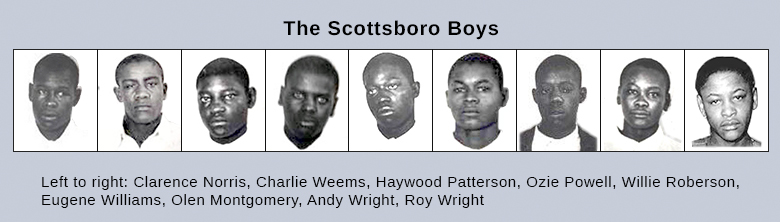

By the end of this section, you will be able to:
* Identify the challenges that everyday Americans faced as a result of the Great Depression and analyze the government’s initial unwillingness to provide assistance
* Explain the particular challenges that African Americans faced during the crisis
* Identify the unique challenges that farmers in the Great Plains faced during this period

From industrial strongholds to the rural Great Plains, from factory workers to farmers, the Great Depression affected millions. In cities, as industry slowed, then sometimes stopped altogether, workers lost jobs and joined breadlines, or sought out other charitable efforts. With limited government relief efforts, private charities tried to help, but they were unable to match the pace of demand. In rural areas, farmers suffered still more. In some parts of the country, prices for crops dropped so precipitously that farmers could not earn enough to pay their mortgages, losing their farms to foreclosure. In the Great Plains, one of the worst droughts in history left the land barren and unfit for growing even minimal food to live on.

The country’s most vulnerable populations, such as children, the elderly, and those subject to discrimination, like African Americans, were the hardest hit. Most white Americans felt entitled to what few jobs were available, leaving African Americans unable to find work, even in the jobs once considered their domain. In all, the economic misery was unprecedented in the country’s history.

# STARVING TO DEATH

By the end of 1932, the Great Depression had affected some sixty million people, most of whom wealthier Americans perceived as the “deserving poor.” Yet, at the time, federal efforts to help those in need were extremely limited, and national charities had neither the capacity nor the will to elicit the large-scale response required to address the problem. The American Red Cross did exist, but Chairman John Barton Payne contended that unemployment was not an “Act of God” but rather an “Act of Man,” and therefore refused to get involved in widespread direct relief efforts. Clubs like the Elks tried to provide food, as did small groups of individually organized college students. Religious organizations remained on the front lines, offering food and shelter. In larger cities, breadlines and soup lines became a common sight. At one count in 1932, there were as many as eighty-two breadlines in New York City.

Despite these efforts, however, people were destitute and ultimately starving. Families would first run through any savings, if they were lucky enough to have any. Then, the few who had insurance would cash out their policies. Cash surrender payments of individual insurance policies tripled in the first three years of the Great Depression, with insurance companies issuing total payments in excess of $1.2 billion in 1932 alone. When those funds were depleted, people would borrow from family and friends, and when they could get no more, they would simply stop paying rent or mortgage payments. When evicted, they would move in with relatives, whose own situation was likely only a step or two behind. The added burden of additional people would speed along that family’s demise, and the cycle would continue. This situation spiraled downward, and did so quickly. Even as late as 1939, over 60 percent of rural households, and 82 percent of farm families, were classified as “impoverished.” In larger urban areas, unemployment levels exceeded the national average, with over half a million unemployed workers in Chicago, and nearly a million in New York City. Breadlines and soup kitchens were packed, serving as many as eighty-five thousand meals daily in New York City alone. Over fifty thousand New York citizens were homeless by the end of 1932.

Children, in particular, felt the brunt of poverty. Many in coastal cities would roam the docks in search of spoiled vegetables to bring home. Elsewhere, children begged at the doors of more well-off neighbors, hoping for stale bread, table scraps, or raw potato peelings. Said one childhood survivor of the Great Depression, “You get used to hunger. After the first few days it doesn’t even hurt; you just get weak.” In 1931 alone, there were at least twenty documented cases of starvation; in 1934, that number grew to 110. In rural areas where such documentation was lacking, the number was likely far higher. And while the middle class did not suffer from starvation, they experienced hunger as well.

By the time Hoover left office in 1933, the poor survived not on relief efforts, but because they had learned to be poor. A family with little food would stay in bed to save fuel and avoid burning calories. People began eating parts of animals that had normally been considered waste. They scavenged for scrap wood to burn in the furnace, and when electricity was turned off, it was not uncommon to try and tap into a neighbor’s wire. Family members swapped clothes; sisters might take turns going to church in the one dress they owned. As one girl in a mountain town told her teacher, who had said to go home and get food, “I can’t. It’s my sister’s turn to eat.”

  
For his book on the Great Depression, *Hard Times*, author Studs Terkel interviewed hundreds of Americans from across the country. He subsequently selected over seventy interviews to air on a radio show that was based in Chicago. Visit [Studs Terkel: Conversations with America][1] to listen to those interviews, during which participants reflect on their personal hardships as well as on national events during the Great Depression.

# BLACK AND POOR: AFRICAN AMERICANS AND THE GREAT DEPRESSION

Most African Americans did not participate in the land boom and stock market speculation that preceded the crash, but that did not stop the effects of the Great Depression from hitting them particularly hard. Subject to continuing racial discrimination, blacks nationwide fared even worse than their hard-hit white counterparts. As the prices for cotton and other agricultural products plummeted, farm owners paid workers less or simply laid them off. Landlords evicted sharecroppers, and even those who owned their land outright had to abandon it when there was no way to earn any income.

In cities, African Americans fared no better. Unemployment was rampant, and many whites felt that any available jobs belonged to whites first. In some Northern cities, whites would conspire to have African American workers fired to allow white workers access to their jobs. Even jobs traditionally held by black workers, such as household servants or janitors, were now going to whites. By 1932, approximately one-half of all black Americans were unemployed. Racial violence also began to rise. In the South, lynching became more common again, with twenty-eight documented lynchings in 1933, compared to eight in 1932. Since communities were preoccupied with their own hardships, and organizing civil rights efforts was a long, difficult process, many resigned themselves to, or even ignored, this culture of racism and violence. Occasionally, however, an incident was notorious enough to gain national attention.

One such incident was the case of the **Scottsboro Boys**{: data-type="term"} ([\[link\]](#CNX_History_25_03_Scottsboro)). In 1931, nine black boys, who had been riding the rails, were arrested for vagrancy and disorderly conduct after an altercation with some white travelers on the train. Two young white women, who had been dressed as boys and traveling with a group of white boys, came forward and said that the black boys had raped them. The case, which was tried in Scottsboro, Alabama, reignited decades of racial hatred and illustrated the injustice of the court system. Despite significant evidence that the women had not been raped at all, along with one of the women subsequently recanting her testimony, the all-white jury quickly convicted the boys and sentenced all but one of them to death. The verdict broke through the veil of indifference toward the plight of African Americans, and protests erupted among newspaper editors, academics, and social reformers in the North. The Communist Party of the United States offered to handle the case and sought retrial; the NAACP later joined in this effort. In all, the case was tried three separate times. The series of trials and retrials, appeals, and overturned convictions shone a spotlight on a system that provided poor legal counsel and relied on all-white juries. In October 1932, the U.S. Supreme Court agreed with the Communist Party’s defense attorneys that the defendants had been denied adequate legal representation at the original trial, and that due process as provided by the Fourteenth Amendment had been denied as a result of the exclusion of any potential black jurors. Eventually, most of the accused received lengthy prison terms and subsequent parole, but avoided the death penalty. The Scottsboro case ultimately laid some of the early groundwork for the modern American civil rights movement. Alabama granted posthumous pardons to all defendants in 2013.

 {: #CNX_History_25_03_Scottsboro}

  
Read [Voices from Scottsboro][2] for the perspectives of both participants and spectators in the Scottsboro case, from the initial trial to the moment, in 1976, when one of the women sued for slander.

# ENVIRONMENTAL CATASTROPHE MEETS ECONOMIC HARDSHIP: THE DUST BOWL

Despite the widely held belief that rural Americans suffered less in the Great Depression due to their ability to at least grow their own food, this was not the case. Farmers, ranchers, and their families suffered more than any group other than African Americans during the Depression.

From the turn of the century through much of World War I, farmers in the Great Plains experienced prosperity due to unusually good growing conditions, high commodity prices, and generous government farming policies that led to a rush for land. As the federal government continued to purchase all excess produce for the war effort, farmers and ranchers fell into several bad practices, including mortgaging their farms and borrowing money against future production in order to expand. However, after the war, prosperity rapidly dwindled, particularly during the recession of 1921. Seeking to recoup their losses through economies of scale in which they would expand their production even further to take full advantage of their available land and machinery, farmers plowed under native grasses to plant acre after acre of wheat, with little regard for the long-term repercussions to the soil. Regardless of these misguided efforts, commodity prices continued to drop, finally plummeting in 1929, when the price of wheat dropped from two dollars to forty cents per bushel.

Exacerbating the problem was a massive drought that began in 1931 and lasted for eight terrible years. Dust storms roiled through the Great Plains, creating huge, choking clouds that piled up in doorways and filtered into homes through closed windows. Even more quickly than it had boomed, the land of agricultural opportunity went bust, due to widespread overproduction and overuse of the land, as well as to the harsh weather conditions that followed, resulting in the creation of the **Dust Bowl**{: data-type="term"} ([\[link\]](#CNX_History_25_03_DustBowl)).

"){: #CNX_History_25_03_DustBowl}

Livestock died, or had to be sold, as there was no money for feed. Crops intended to feed the family withered and died in the drought. Terrifying dust storms became more and more frequent, as “black blizzards” of dirt blew across the landscape and created a new illness known as “dust pneumonia.” In 1935 alone, over 850 million tons of topsoil blew away. To put this number in perspective, geologists estimate that it takes the earth five hundred years to naturally regenerate one inch of topsoil; yet, just one significant dust storm could destroy a similar amount. In their desperation to get more from the land, farmers had stripped it of the delicate balance that kept it healthy. Unaware of the consequences, they had moved away from such traditional practices as crop rotation and allowing land to regain its strength by permitting it to lie fallow between plantings, working the land to death.

For farmers, the results were catastrophic. Unlike most factory workers in the cities, in most cases, farmers lost their homes when they lost their livelihood. Most farms and ranches were originally mortgaged to small country banks that understood the dynamics of farming, but as these banks failed, they often sold rural mortgages to larger eastern banks that were less concerned with the specifics of farm life. With the effects of the drought and low commodity prices, farmers could not pay their local banks, which in turn lacked funds to pay the large urban banks. Ultimately, the large banks foreclosed on the farms, often swallowing up the small country banks in the process. It is worth noting that of the five thousand banks that closed between 1930 and 1932, over 75 percent were country banks in locations with populations under 2,500. Given this dynamic, it is easy to see why farmers in the Great Plains remained wary of big city bankers.

For farmers who survived the initial crash, the situation worsened, particularly in the Great Plains where years of overproduction and rapidly declining commodity prices took their toll. Prices continued to decline, and as farmers tried to stay afloat, they produced still more crops, which drove prices even lower. Farms failed at an astounding rate, and farmers sold out at rock-bottom prices. One farm in Shelby, Nebraska was mortgaged at $4,100 and sold for $49.50. One-fourth of the entire state of Mississippi was auctioned off *in a single day* at a foreclosure auction in April 1932.

Not all farmers tried to keep their land. Many, especially those who had arrived only recently, in an attempt to capitalize on the earlier prosperity, simply walked away ([\[link\]](#CNX_History_25_03_Farm)). In hard-hit Oklahoma, thousands of farmers packed up what they could and walked or drove away from the land they thought would be their future. They, along with other displaced farmers from throughout the Great Plains, became known as **Okies**{: data-type="term" .no-emphasis}. Okies were an emblem of the failure of the American breadbasket to deliver on its promise, and their story was made famous in John Steinbeck’s novel, *The Grapes of Wrath*.

 "){: #CNX_History_25_03_Farm}

  
Experience the [Interactive Dust Bowl][3] to see how decisions compounded to create peoples’ destiny. Click through to see what choices you would make and where that would take you.

Caroline Henderson on the Dust Bowl

\> Now we are facing a fourth year of failure. There can be no wheat for us in 1935 in spite of all our careful and expensive work in preparing ground, sowing and re-sowing our allocated acreage. Native grass pastures are permanently damaged, in many cases hopelessly ruined, smothered under by drifted sand. Fences are buried under banks of thistles and hard packed earth or undermined by the eroding action of the wind and lying flat on the ground. Less traveled roads are impassable, covered deep under by sand or the finer silt-like loam. Orchards, groves and hedge-rows cultivated for many years with patient care are dead or dying . . . Impossible it seems not to grieve that the work of hands should prove so perishable. —Caroline Henderson, Shelton, Oklahoma, 1935

Much like other farm families whose livelihoods were destroyed by the Dust Bowl, Caroline Henderson describes a level of hardship that many Americans living in Depression-ravaged cities could never understand. Despite their hard work, millions of Americans were losing both their produce and their homes, sometimes in as little as forty-eight hours, to environmental catastrophes. Lacking any other explanation, many began to question what they had done to incur God’s wrath. Note in particular Henderson’s references to “dead,” “dying,” and “perishable,” and contrast those terms with her depiction of the “careful and expensive work” undertaken by their own hands. Many simply could not understand how such a catastrophe could have occurred.

# CHANGING VALUES, CHANGING CULTURE

In the decades before the Great Depression, and particularly in the 1920s, American culture largely reflected the values of individualism, self-reliance, and material success through competition. Novels like F. Scott Fitzgerald’s *The Great Gatsby* and Sinclair Lewis’s *Babbit* portrayed wealth and the self-made man in America, albeit in a critical fashion. In film, many silent movies, such as Charlie Chaplin’s *The Gold Rush*, depicted the rags-to-riches fable that Americans so loved. With the shift in U.S. fortunes, however, came a shift in values, and with it, a new cultural reflection. The arts revealed a new emphasis on the welfare of the whole and the importance of community in preserving family life. While box office sales briefly declined at the beginning of the Depression, they quickly rebounded. Movies offered a way for Americans to think of better times, and people were willing to pay twenty-five cents for a chance to escape, at least for a few hours.

Even more than escapism, other films at the close of the decade reflected on the sense of community and family values that Americans struggled to maintain throughout the entire Depression. John Ford’s screen version of Steinbeck’s *The Grapes of Wrath* came out in 1940, portraying the haunting story of the Joad family’s exodus from their Oklahoma farm to California in search of a better life. Their journey leads them to realize that they need to join a larger social movement—communism—dedicated to bettering the lives of all people. Tom Joad says, “Well, maybe it\'s like Casy says, a fella ain’t got a soul of his own, but on’y a piece of a soul—the one big soul that belongs to ever’body.” The greater lesson learned was one of the strength of community in the face of individual adversity.

Another trope was that of the hard-working everyman against greedy banks and corporations. This was perhaps best portrayed in the movies of Frank Capra, whose *Mr. Smith Goes to Washington* was emblematic of his work. In this 1939 film, Jimmy Stewart plays a legislator sent to Washington to finish out the term of a deceased senator. While there, he fights corruption to ensure the construction of a boy’s camp in his hometown rather than a dam project that would only serve to line the pockets of a few. He ultimately engages in a two-day filibuster, standing up to the power players to do what’s right. The Depression era was a favorite of Capra’s to depict in his films, including *It’s a Wonderful Life*, released in 1946. In this film, Jimmy Stewart runs a family-owned savings and loan, which at one point faces a bank run similar to those seen in 1929–1930. In the end, community support helps Stewart retain his business and home against the unscrupulous actions of a wealthy banker who sought to bring ruin to his family.

“Brother, Can You Spare a Dime?”

\> They used to tell me I was building a dream, and so I followed the mob
> * * *
> {: data-type="newline"}
> 
> When there was earth to plow or guns to bear, I was always there, right on the job
> * * *
> {: data-type="newline"}
> 
> They used to tell me I was building a dream, with peace and glory ahead
> * * *
> {: data-type="newline"}
> 
> Why should I be standing in line, just waiting for bread?
> * * *
> {: data-type="newline"}
> 
> Once I built a railroad, I made it run, made it race against time
> * * *
> {: data-type="newline"}
> 
> Once I built a railroad, now it’s done, Brother, can you spare a dime?
> * * *
> {: data-type="newline"}
> 
> Once I built a tower up to the sun, brick and rivet and lime
> * * *
> {: data-type="newline"}
> 
> Once I built a tower, now it’s done, Brother, can you spare a dime?
> * * *
> {: data-type="newline"}
> 
> —Jay Gorney and “Yip” Harburg

“Brother, Can You Spare a Dime?” first appeared in 1932, written for the Broadway musical *New Americana* by Jay Gorney, a composer who based the song’s music on a Russian lullaby, and Edgar Yipsel “Yip” Harburg, a lyricist who would go on to win an Academy Award for the song “Over the Rainbow” from *The Wizard of Oz* (1939).

With its lyrics speaking to the plight of the common man during the Great Depression and the refrain appealing to the same sense of community later found in the films of Frank Capra, “Brother, Can You Spare a Dime?” quickly became the *de facto* anthem of the Great Depression. Recordings by Bing Crosby, Al Jolson, and Rudy Vallee all enjoyed tremendous popularity in the 1930s.

  
For more on “Brother Can You Spare a Dime?” and the Great Depression, visit [ArtsEdge][4] to explore the Kennedy Center’s digital resources and learn the “Story Behind the Song.”

Finally, there was a great deal of pure escapism in the popular culture of the Depression. Even the songs found in films reminded many viewers of the bygone days of prosperity and happiness, from Al Dubin and Henry Warren’s hit “We’re in the Money” to the popular “Happy Days are Here Again.” The latter eventually became the theme song of Franklin Roosevelt’s 1932 presidential campaign. People wanted to forget their worries and enjoy the madcap antics of the Marx Brothers, the youthful charm of Shirley Temple, the dazzling dances of Fred Astaire and Ginger Rogers ([\[link\]](#CNX_History_25_03_Astaire)), or the comforting morals of the *Andy Hardy* series. The Hardy series—nine films in all, produced by MGM from 1936 to 1940—starred Judy Garland and Mickey Rooney, and all followed the adventures of a small-town judge and his son. No matter what the challenge, it was never so big that it could not be solved with a musical production put on by the neighborhood kids, bringing together friends and family members in a warm display of community values.

 was the first motion picture to feature the immensely popular dance duo of Fred Astaire and Ginger Rogers. The pair would go on to star in nine more Hollywood musicals throughout the 1930s and 1940s."){: #CNX_History_25_03_Astaire}

All of these movies reinforced traditional American values, which suffered during these hard times, in part due to declining marriage and birth rates, and increased domestic violence. At the same time, however, they reflected an increased interest in sex and sexuality. While the birth rate was dropping, surveys in *Fortune* magazine in 1936–1937 found that two-thirds of college students favored birth control, and that 50 percent of men and 25 percent of women admitted to premarital sex, continuing a trend among younger Americans that had begun to emerge in the 1920s. Contraceptive sales soared during the decade, and again, culture reflected this shift. Blonde bombshell Mae West was famous for her sexual innuendoes, and her flirtatious persona was hugely popular, although it got her banned on radio broadcasts throughout the Midwest. Whether West or Garland, Chaplin or Stewart, American film continued to be a barometer of American values, and their challenges, through the decade.

# Section Summary

The Great Depression affected huge segments of the American population—sixty million people by one estimate. But certain groups were hit harder than the rest. African Americans faced discrimination in finding employment, as white workers sought even low-wage jobs like housecleaning. Southern blacks moved away from their farms as crop prices failed, migrating en masse to Northern cities, which had little to offer them. Rural Americans were also badly hit. The eight-year drought that began shortly after the stock market crash exacerbated farmers’ and ranchers’ problems. The cultivation of greater amounts of acreage in the preceding decades meant that land was badly overworked, and the drought led to massive and terrible dust storms, creating the region’s nickname, the Dust Bowl. Some farmers tried to remain and buy up more land as neighbors went broke; others simply fled their failed farms and moved away, often to the large-scale migrant farms found in California, to search for a better life that few ever found. Maltreated by Californians who wished to avoid the unwanted competition for jobs that these “Okies” represented, many of the Dust Bowl farmers were left wandering as a result.

There was very little in the way of public assistance to help the poor. While private charities did what they could, the scale of the problem was too large for them to have any lasting effects. People learned to survive as best they could by sending their children out to beg, sharing clothing, and scrounging wood to feed the furnace. Those who could afford it turned to motion pictures for escape. Movies and books during the Great Depression reflected the shift in American cultural norms, away from rugged individualism toward a more community-based lifestyle.

# Review Questions

Which of the following hardships did African Americans *not* typically face during the Great Depression? lower farm wages in the South the belief that white workers needed jobs more than their black counterparts white workers taking historically “black” jobs, such as maids and janitors widespread race riots in large urban centers 

D

Which of the following was *not* a key factor in the conditions that led to the Dust Bowl? previous overcultivation of farmland decreasing American demand for farm produce unfavorable weather conditions poor farming techniques regarding proper irrigation and acreage rotation 

B

What did the popular movies of the Depression reveal about American values at that time? How did these values contrast with the values Americans held before the Depression?

American films in the 1930s served to both assuage the fears and frustrations of many Americans suffering through the Depression and reinforce the idea that communal efforts—town and friends working together—would help to address the hardships. Previous emphasis upon competition and individualism slowly gave way to notions of “neighbor helping neighbor” and seeking group solutions to common problems. The *Andy Hardy* series, in particular, combined entertainment with the concept of family coming together to solve shared problems. The themes of greed, competition, and capitalist-driven market decisions no longer commanded a large audience among American moviegoers.

[1]: http://openstaxcollege.org/l/hardtimes
[2]: http://openstaxcollege.org/l/scottsboro
[3]: http://openstaxcollege.org/l/dustbowl1
[4]: http://openstaxcollege.org/l/sparedime
