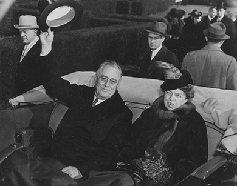
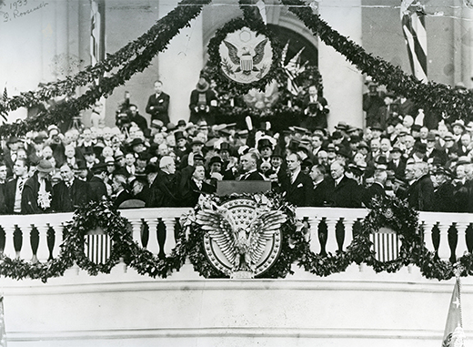

By the end of this section, you should be able to:
* Describe the events of the 1932 presidential election and identify the characteristics that made Franklin Roosevelt a desirable candidate
* Explain why Congress amended the U.S. Constitution to reduce the period of time between presidential elections and inaugurations

 ![A timeline shows important events of the era. In 1932, Roosevelt is elected president; a photograph of Roosevelt&#x2019;s inauguration is shown. In 1933, the First New Deal legislation passes; a photograph of New Deal workers is shown. In 1934, the Southern Tenant Farmers Union organizes; a photograph of six Dust Bowl refugees is shown. In 1935, the Supreme Court strikes down key elements of the New Deal, and the Second New Deal begins. In 1936, Roosevelt is re-elected in a landslide; a photograph of Roosevelt is shown. In 1938, the U.S. encounters a recession when government spending is curtailed, and the Fair Labor Standards Act passes.](../resources/CNX_History_26_01_Timeline.jpg){: #CNX_History_26_01_Timeline}

Franklin Roosevelt was part of the political establishment and the wealthy elite, but in the 1932 presidential campaign, he did not want to be perceived that way. Roosevelt felt that the country needed sweeping change, and he ran a campaign intended to convince the American people that he could deliver that change. It was not the specifics of his campaign promises that were different; in fact, he gave very few details and likely did not yet have a clear idea of how he would raise the country out of the Great Depression. But he campaigned tirelessly, talking to thousands of people, appearing at his party’s national convention, and striving to show the public that he was a different breed of politician. As Hoover grew more morose and physically unwell in the face of the campaign, Roosevelt thrived. He was elected in a landslide by a country ready for the change he had promised.

# THE ELECTION OF FRANKLIN ROOSEVELT

By the 1932 presidential election, Hoover’s popularity was at an all-time low. Despite his efforts to address the hardships that many Americans faced, his ineffectual response to the Great Depression left Americans angry and ready for change. Franklin Roosevelt, though born to wealth and educated at the best schools, offered the change people sought. His experience in politics had previously included a seat in the New York State legislature, a vice-presidential nomination, and a stint as governor of New York. During the latter, he introduced many state-level reforms that later formed the basis of his **New Deal**{: data-type="term" .no-emphasis} as well as worked with several advisors who later formed the **Brains Trust**{: data-type="term"} that advised his federal agenda.

Roosevelt exuded confidence, which the American public desperately wished to see in their leader ([\[link\]](#CNX_History_26_01_FDRElea)). And, despite his affluence, Americans felt that he could relate to their suffering due to his own physical hardships; he had been struck with polio a decade earlier and was essentially paralyzed from the waist down for the remainder of his life. Roosevelt understood that the public sympathized with his ailment; he likewise developed a genuine empathy for public suffering as a result of his illness. However, he never wanted to be photographed in his wheelchair or appear infirm in any way, for fear that the public’s sympathy would transform into concern over his physical ability to discharge the duties of the Oval Office.

 {: #CNX_History_26_01_FDRElea}

Roosevelt also recognized the need to convey to the voting public that he was not simply another member of the political aristocracy. At a time when the country not only faced its most severe economic challenges to date, but Americans began to question some of the fundamental principles of capitalism and democracy, Roosevelt sought to show that he was different—that he could defy expectations—and through his actions could find creative solutions to address the nation’s problems while restoring public confidence in fundamental American values. As a result, he not only was the first presidential candidate to appear in person at a national political convention to accept his party’s nomination but also flew there through terrible weather from New York to Chicago in order to do so—a risky venture in what was still the early stages of flight as public transportation. At the Democratic National Convention in 1932, he coined the famous phrase: “I pledge myself to a new deal for the American people.” The New Deal did not yet exist, but to the American people, any positive and optimistic response to the Great Depression was a welcome one.

Hoover assumed at first that Roosevelt would be easy to defeat, confident that he could never carry the eastern states and the business vote. He was sorely mistaken. Everywhere he went, Hoover was met with antagonism; anti-Hoover signs and protests were the norm. Hoover’s public persona declined rapidly. Many news accounts reported that he seemed physically unwell, with an ashen face and shaking hands. Often, he seemed as though he would faint, and an aide constantly remained nearby with a chair in case he fell. In contrast, Roosevelt thrived on the campaign. He commented, “I have looked into the faces of thousands of Americans, and they have the frightened look of lost children.”

The election results that November were never really in question: With three million more people voting than in 1928, Roosevelt won by a popular count of twenty-three million to fifteen million. He carried all but six states while winning over 57 percent of the popular vote. Whether they voted due to animosity towards Hoover for his relative inactivity, or out of hope for what Roosevelt would accomplish, the American public committed themselves to a new vision. Historians identify this election as the beginning of a new Democratic coalition, bringing together African Americans, other ethnic minorities, and organized labor as a voting bloc upon whom the party would rely for many of its electoral victories over the next fifty years. Unlike some European nations where similar challenges caused democratic constitutions to crumble and give way to radical ideologies and authoritarian governments, the Roosevelt administration changed the nation’s economic fortunes with reforms, preserved the constitution, and expanded rather than limited the reach of democratic principles into the market economy. As a result, radical alternatives, such as the Fascist movement or Communist Party, remained on the margins of the nation’s political culture.

# THE INTERREGNUM

After the landslide election, the country—and Hoover—had to endure the **interregnum**{: data-type="term"}, the difficult four months between the election and President Roosevelt’s inauguration in March 1933. Congress did not pass a single significant piece of legislation during this period, although Hoover spent much of the time trying to get Roosevelt to commit publicly to a legislative agenda of Hoover’s choosing. Roosevelt remained gracious but refused to begin his administration as the incumbent’s advisor without any legal authority necessary to change policy. Unwilling to tie himself to Hoover’s legacy of failed policies, Roosevelt kept quiet when Hoover supported the passage of a national sales tax. Meanwhile, the country suffered from Hoover’s inability to further drive a legislative agenda through Congress. It was the worst winter since the beginning of the Great Depression, and the banking sector once again suffered another round of panics. While Roosevelt kept his distance from the final tremors of the Hoover administration, the country continued to suffer in wait. In part as a response to the challenges of this time, the U.S. Constitution was subsequently amended to reduce the period from election to inauguration to the now-commonplace two months.

Any ideas that Roosevelt held almost did not come to fruition, thanks to a would-be assassin’s bullet. On February 15, 1933, after delivering a speech from his open car in Miami’s Bayfront Park, local Italian bricklayer **Giuseppe Zangara**{: data-type="term" .no-emphasis} emerged from a crowd of well-wishers to fire six shots from his revolver. Although Roosevelt emerged from the assassination attempt unscathed, Zangara wounded five individuals that day, including Chicago Mayor Tony Cermak, who attended the speech in the hopes of resolving any long-standing differences with the president-elect. Roosevelt and his driver immediately rushed Cermak to the hospital where he died three days later. Roosevelt’s calm and collected response to the event reassured many Americans of his ability to lead the nation through the challenges they faced. All that awaited was Roosevelt’s inauguration before his ideas would unfold to the expectant public.

So what was Roosevelt’s plan? Before he took office, it seems likely that he was not entirely sure. Certain elements were known: He believed in positive government action to solve the Depression; he believed in federal relief, public works, social security, and unemployment insurance; he wanted to restore public confidence in banks; he wanted stronger government regulation of the economy; and he wanted to directly help farmers. But how to take action on these beliefs was more in question. A month before his inauguration, he said to his advisors, “Let’s concentrate upon one thing: Save the people and the nation, and if we have to change our minds twice every day to accomplish that end, we should do it.”

Unlike Hoover, who professed an ideology of “American individualism,” an adherence that rendered him largely incapable of widespread action, Roosevelt remained pragmatic and open-minded to possible solutions. To assist in formulating a variety of relief and recovery programs, Roosevelt turned to a group of men who had previously orchestrated his election campaign and victory. Collectively known as the “Brains Trust” (a phrase coined by a *New York Times* reporter to describe the multiple “brains” on Roosevelt’s advisory team), the group most notably included Rexford Tugwell, Raymond Moley, and Adolph Berle. Moley, credited with bringing the group into existence, was a government professor who advocated for a new national tax policy to help the nation recover from its economic woes. Tugwell, who eventually focused his energy on the country’s agricultural problems, saw an increased role for the federal government in setting wages and prices across the economy. Berle was a mediating influence, who often advised against a centrally controlled economy, but did see the role that the federal government could play in mediating the stark cycles of prosperity and depression that, if left unchecked, could result in the very situation in which the country presently found itself. Together, these men, along with others, advised Roosevelt through the earliest days of the New Deal and helped to craft significant legislative programs for congressional review and approval.

# INAUGURATION DAY: A NEW BEGINNING

March 4, 1933, dawned gray and rainy. Roosevelt rode in an open car along with outgoing president Hoover, facing the public, as he made his way to the U.S. Capitol. Hoover’s mood was somber, still personally angry over his defeat in the general election the previous November; he refused to crack a smile at all during the ride among the crowd, despite Roosevelt’s urging to the contrary. At the ceremony, Roosevelt rose with the aid of leg braces equipped under his specially tailored trousers and placed his hand on a Dutch family Bible as he took his solemn oath. At that very moment, the rain stopped and the sun began to shine directly on the platform, and those present would later claim that it was as though God himself was shining down on Roosevelt and the American people in that moment ([\[link\]](#CNX_History_26_01_Inaug)).

 {: #CNX_History_26_01_Inaug}

Bathed in the sunlight, Roosevelt delivered one of the most famous and oft-quoted inaugural addresses in history. He encouraged Americans to work with him to find solutions to the nation’s problems and not to be paralyzed by fear into inaction. Borrowing a wartime analogy provided by Moley, who served as his speechwriter at the time, Roosevelt called upon all Americans to assemble and fight an essential battle against the forces of economic depression. He famously stated, “The only thing we have to fear is fear itself.” Upon hearing his inaugural address, one observer in the crowd later commented, “Any man who can talk like that in times like these is worth every ounce of support a true American has.” To borrow the popular song title of the day, “happy days were here again.” Foregoing the traditional inaugural parties, the new president immediately returned to the White House to begin his work to save the nation.

  
Visit the [American Presidency Project][1] to listen to Roosevelt’s first inaugural speech and identify ways he conveyed optimism and a spirit of community to his listeners.

# Section Summary

Franklin Roosevelt was a wealthy, well-educated, and popular politician whose history of polio made him a more sympathetic figure to the public. He did not share any specifics of his plan to bring the country out of the Great Depression, but his attitude of optimism and possibility contrasted strongly with Hoover’s defeated misery. The 1932 election was never really in question, and Roosevelt won in a landslide. During the four-month interregnum, however, Americans continued to endure President Hoover’s failed policies, which led the winter of 1932–1933 to be the worst of the Depression, with unemployment rising to record levels.

When Roosevelt took office in March 1933, he infused the country with a sense of optimism. He still did not have a formal plan but rather invited the American people to join him in the spirit of experimentation. Roosevelt did bring certain beliefs to office: the belief in an active government that would take direct action on federal relief, public works, social services, and direct aid to farmers. But as much as his policies, Roosevelt’s own personality and engaging manner helped the country feel that they were going to get back on track.

# Review Questions

Which of the following best describes Roosevelt’s attempts to push his political agenda in the last months of Hoover’s presidency? 

Roosevelt spoke publicly on the issue of direct relief.

Roosevelt met privately with Hoover to convince him to institute certain policy shifts before his presidency ended.

Roosevelt awaited his inauguration before introducing any plans.

Roosevelt met secretly with members of Congress to attempt to win their favor.

C

Which of the following policies did Roosevelt *not* include among his early ideas for a New Deal? 

public works

government regulation of the economy

elimination of the gold standard

aid to farmers

D

What was the purpose of Roosevelt’s “Brains Trust?”

Roosevelt recruited his “Brains Trust” to advise him in his inception of a variety of relief and recovery programs. Among other things, the members of this group pushed for a new national tax policy; addressed the nation’s agricultural problems; advocated an increased role for the federal government in setting wages and prices; and believed that the federal government could temper the boom-and-bust cycles that rendered the economy unstable. These advisors helped to craft the legislative programs that Roosevelt presented to Congress.

## Glossary
{: data-type="glossary-title"}

Brains Trust
: an unofficial advisory cabinet to President Franklin Roosevelt, originally gathered while he was governor of New York, to present possible solutions to the nations’ problems; among its prominent members were Rexford Tugwell, Raymond Moley, and Adolph Berle
{: .definition}

interregnum
: the period between the election and the inauguration of a new president; when economic conditions worsened significantly during the four-month lag between Roosevelt’s win and his move into the Oval Office, Congress amended the Constitution to limit this period to two months
{: .definition}

[1]: http://openstaxcollege.org/l/fdraug
