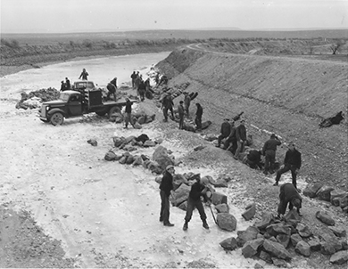
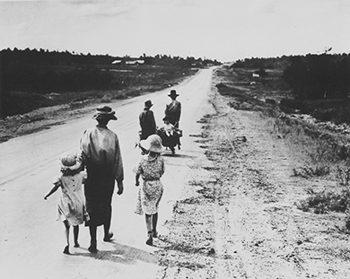

By the end of this section, you should be able to:
* Identify the key pieces of legislation included in Roosevelt’s “First New Deal”
* Assess the strengths, weaknesses, and general effectiveness of the First New Deal
* Explain Roosevelt’s overall vision for addressing the structural problems in the U.S. economy

Much like a surgeon assessing the condition of an emergency room patient, Roosevelt began his administration with a broad, if not specific, strategy in mind: a combination of relief and recovery programs designed to first save the patient (in this case, the American people), and then to find a long-term cure (reform through federal regulation of the economy). What later became known as the “First New Deal” ushered in a wave of legislative activity seldom before seen in the history of the country. By the close of 1933, in an effort to stem the crisis, Congress had passed over fifteen significant pieces of legislation—many of the circulated bills allegedly still wet with ink from the printing presses as members voted upon them. Most bills could be grouped around issues of relief, recovery, and reform. At the outset of the First New Deal, specific goals included 1) bank reform; 2) job creation; 3) economic regulation; and 4) regional planning.

# REFORM: THE BANKING CRISIS

When Roosevelt took office, he faced one of the worst moments in the country’s banking history. States were in disarray. New York and Illinois had ordered the closure of their banks in the hopes of avoiding further “bank runs,” which occurred when hundreds (if not thousands) of individuals ran to their banks to withdraw all of their savings. In all, over five thousand banks had been shuttered. Within forty-eight hours of his inauguration, Roosevelt proclaimed an official bank holiday and called Congress into a special session to address the crisis. The resulting **Emergency Banking Act**{: data-type="term" .no-emphasis} of 1933 was signed into law on March 9, 1933, a scant eight hours after Congress first saw it. The law officially took the country off the gold standard, a restrictive practice that, although conservative and traditionally viewed as safe, severely limited the circulation of paper money. Those who held gold were told to sell it to the U.S. Treasury for a discounted rate of a little over twenty dollars per ounce. Furthermore, dollar bills were no longer redeemable in gold. The law also gave the comptroller of currency the power to reorganize all national banks faced with insolvency, a level of federal oversight seldom seen prior to the Great Depression. Between March 11 and March 14, auditors from the Reconstruction Finance Corporation, the Treasury Department, and other federal agencies swept through the country, examining each bank. By March 15, 70 percent of the banks were declared solvent and allowed to reopen.

On March 12, the day before the banks were set to reopen, Roosevelt held his first “**fireside chat**{: data-type="term" .no-emphasis}” ([\[link\]](#CNX_History_26_02_Fireside)). In this initial radio address to the American people, he explained what the bank examiners had been doing over the previous week. He assured people that any bank open the next day had the federal government’s stamp of approval. The combination of his reassuring manner and the promise that the government was addressing the problems worked wonders in changing the popular mindset. Just as the culture of panic had contributed to the country’s downward spiral after the crash, so did this confidence-inducing move help to build it back up. Consumer confidence returned, and within weeks, close to $1 billion in cash and gold had been brought out from under mattresses and hidden bookshelves, and re-deposited in the nation’s banks. The immediate crisis had been quelled, and the public was ready to believe in their new president.

 "){: #CNX_History_26_02_Fireside}

The Power of Hearth and Home

Fireside chats—Roosevelt’s weekly radio addresses—underscored Roosevelt’s savvy in understanding how best to reach people. Using simple terms and a reassuring tone, he invoked a family patriarch sitting by the fire, explaining to those who trusted him how he was working to help them. It is worth noting how he explained complex financial concepts quite simply, but at the same time, complimented the American people on their “intelligent support.” One of his fireside chats is provided below:

\> I recognize that the many proclamations from State capitols and from Washington, the legislation, the Treasury regulations, etc., couched for the most part in banking and legal terms, should be explained for the benefit of the average citizen. I owe this in particular because of the fortitude and good temper with which everybody has accepted the inconvenience and hardships of the banking holiday. I know that when you understand what we in Washington have been about I shall continue to have your cooperation as fully as I have had your sympathy and help during the past week. . . .

 > The success of our whole great national program depends, of course, upon the cooperation of the public—on its intelligent support and use of a reliable system. . . . After all, there is an element in the readjustment of our financial system more important than currency, more important than gold, and that is the confidence of the people. Confidence and courage are the essentials of success in carrying out our plan. You people must have faith; you must not be stampeded by rumors or guesses. Let us unite in banishing fear. We have provided the machinery to restore our financial system; it is up to you to support and make it work. It is your problem no less than it is mine. Together we cannot fail.

\> —Franklin D. Roosevelt, March 12, 1933

A huge part of Roosevelt’s success in turning around the country can be seen in his addresses like these: He built support and galvanized the public. Ironically, Roosevelt, the man who famously said we have nothing to fear but fear itself, had a significant fear: fire. Being paralyzed with polio, he was very afraid of being left near a fireplace. But he knew the power of the hearth and home, and drew on this mental image to help the public view him the way that he hoped to be seen.

  
Visit the [American Presidency Project][1] to listen to one of Roosevelt’s fireside chats. What kind of feeling does his language and demeanor evoke?

In June 1933, Roosevelt replaced the Emergency Banking Act with the more permanent **Glass-Steagall Banking Act**{: data-type="term" .no-emphasis}. This law prohibited commercial banks from engaging in investment banking, therefore stopping the practice of banks speculating in the stock market with deposits. This law also created the Federal Deposit Insurance Corporation, or FDIC, which insured personal bank deposits up to $2,500. Other measures designed to boost confidence in the overall economy beyond the banking system included passage of the Economy Act, which fulfilled Roosevelt’s campaign pledge to reduce government spending by reducing salaries, including his own and those of the Congress. He also signed into law the Securities Act, which required full disclosure to the federal government from all corporations and investment banks that wanted to market stocks and bonds. Roosevelt also sought new revenue through the Beer Tax. As the Twenty-First Amendment, which would repeal the Eighteenth Amendment establishing Prohibition, moved towards ratification, this law authorized the manufacture of 3.2 percent beer and levied a tax on it.

# THE FIRST HUNDRED DAYS

In his first hundred days in office, the new president pushed forward an unprecedented number of new bills, all geared towards stabilizing the economy, providing relief to individuals, creating jobs, and helping businesses. A sympathetic Democrat-controlled Congress helped propel his agenda forward.

## Relief: Employment for the Masses

Even as he worked to rebuild the economy, Roosevelt recognized that the unemployed millions required jobs more quickly than the economy could provide. In a push to create new jobs, Roosevelt signed the Wagner-Peyser Act, creating the United States Employment Service, which promised states matching funds if they created local employment opportunities. He also authorized $500 million in direct grants through the Federal Emergency Relief Act (FERA). This money went directly to states to infuse relief agencies with the much-needed resources to help the nearly fifteen million unemployed. These two bills illustrate Roosevelt’s dual purposes of providing short-term emergency help and building employment opportunities that would strengthen the economy in the long term.

Roosevelt was aware of the need for immediate help, but he mostly wanted to create more jobs. FERA overseer Harry Hopkins, who later was in charge of the **Civil Works Administration**{: data-type="term" .no-emphasis} (CWA), shared this sentiment. With Hopkins at its helm, the CWA, founded in early 1933, went on to put millions of men and women to work. At its peak, there were some four million Americans repairing bridges, building roads and airports, and undertaking other public projects. Another work program was the **Civilian Conservation Corps**{: data-type="term"} Relief Act (CCC). The CCC provided government jobs for young men aged fourteen to twenty-four who came from relief families. They would earn thirty dollars per month planting trees, fighting forest fires, and refurbishing historic sites and parks, building an infrastructure that families would continue to enjoy for generations to come. Within the first two months, the CCC employed its first 250,000 men and eventually established about twenty-five hundred camps ([\[link\]](#CNX_History_26_02_CCC)).

 {: #CNX_History_26_02_CCC}

The various programs that made up the First New Deal are listed in the table below ([\[link\]](#Table_26_01_NewDeal1)).

<table id="Table_26_01_NewDeal1" summary="A table composed of three columns and fifteen rows describes the key programs from the First New Deal. The first row is the title row, and from left to right reads: New Deal Legislation, Years Enacted, and Brief Description. Rows two through fifteen contain the information corresponding to those three headings, respectively. Row two reads Agricultural Adjustment Administration, 1933&#x2013;1935, and Farm program designed to raise process by curtailing production. Row three reads Civil Works Administration, 1933&#x2013;1934, and Temporary job relief program. Row four reads Civilian Conservation Corps, 1933&#x2013;1942, and Employed young men to work in rural areas. Row five reads Farm Credit Administration, 1933&#x2013;today, and Low interest mortgages for farm owners. Row six reads Federal Deposit Insurance Corporation, 1933&#x2013;today, and Insure private bank deposits. Row seven reads Federal Emergency Relief Act, 1933, and Direct monetary relief to poor unemployed Americans. Row eight reads Glass-Steagall Act, 1933, and Regulate investment banking. Row nine reads Homeowners Loan Corporation, 1933&#x2013;1951, and Government mortgages that allowed people to keep their homes. Row ten reads Indian Reorganization Act, 1933, and Abandoned federal policy of assimilation. Row eleven reads National Recovery Administration, 1933&#x2013;1935, and Industries agree to codes of fair practice to set price, wage, production levels. Row twelve reads Public Works Administration, 1933&#x2013;1938, and Large public works projects. Row thirteen reads Resettlement Administration, 1933&#x2013;1935, and Resettles poor tenant farmers. Row fourteen reads Securities Act of 1933, 1933&#x2013;today, and Created SEC; regulates stock transactions. Row fifteen reads Tennessee Valley Authority, 1933&#x2013;today, and Regional development program; brought electrification to the valley."><caption>Key Programs from the First New Deal</caption><thead>
<tr>
<th>New Deal Legislation</th>
<th>Years Enacted</th>
<th>Brief Description</th>
</tr>
</thead><tbody>
<tr>
<td>Agricultural Adjustment Administration</td>
<td>1933–1935</td>
<td>Farm program designed to raise process by curtailing production</td>
</tr>

<tr>
<td>Civil Works Administration</td>
<td>1933–1934</td>
<td>Temporary job relief program</td>
</tr>

<tr>
<td>Civilian Conservation Corps</td>
<td>1933–1942</td>
<td>Employed young men to work in rural areas</td>
</tr>

<tr>
<td>Farm Credit Administration</td>
<td>1933-today</td>
<td>Low interest mortgages for farm owners</td>
</tr>

<tr>
<td>Federal Deposit Insurance Corporation</td>
<td>1933–today</td>
<td>Insure private bank deposits</td>
</tr>

<tr>
<td>Federal Emergency Relief Act</td>
<td>1933</td>
<td>Direct monetary relief to poor unemployed Americans</td>
</tr>

<tr>
<td>Glass-Steagall Act</td>
<td>1933</td>
<td>Regulate investment banking</td>
</tr>

<tr>
<td>Homeowners Loan Corporation</td>
<td>1933–1951</td>
<td>Government mortgages that allowed people to keep their homes</td>
</tr>

<tr>
<td>Indian Reorganization Act</td>
<td>1933</td>
<td>Abandoned federal policy of assimilation</td>
</tr>

<tr>
<td>National Recovery Administration</td>
<td>1933–1935</td>
<td>Industries agree to codes of fair practice to set price, wage, production levels</td>
</tr>

<tr>
<td>Public Works Administration</td>
<td>1933–1938</td>
<td>Large public works projects</td>
</tr>

<tr>
<td>Resettlement Administration</td>
<td>1933–1935</td>
<td>Resettles poor tenant farmers</td>
</tr>

<tr>
<td>Securities Act of 1933</td>
<td>1933–today</td>
<td>Created SEC; regulates stock transactions</td>
</tr>

<tr>
<td>Tennessee Valley Authority</td>
<td>1933–today</td>
<td>Regional development program; brought electrification to the valley</td>
</tr>
</tbody></table>

The final element of Roosevelt’s efforts to provide relief to those in desperate straits was the Home Owners’ Refinancing Act. Created by the Home Owners’ Loan Corporation (HOLC), the program rescued homeowners from foreclosure by refinancing their mortgages. Not only did this save the homes of countless homeowners, but it also saved many of the small banks who owned the original mortgages by relieving them of that responsibility. Later New Deal legislation created the Federal Housing Authority, which eventually standardized the thirty-year mortgage and promoted the housing boom of the post-World War II era. A similar program, created through the Emergency Farm Mortgage Act and Farm Credit Act, provided the same service for farm mortgages.

  
In this [American Experience][2] interview, Neil Maher, author of *Nature’s New Deal: The Civilian Conservation Corps and Roots of the Modern Environmental Movement*, provides a comprehensive look into what the CCC offered the country—and the president—on issues as diverse as economics, race, and recreation.

## Rescuing Farms and Factories

While much of the legislation of the first hundred days focused on immediate relief and job creation through federal programs, Roosevelt was committed to addressing the underlying problems inherent in the American economy. In his efforts to do so, he created two of the most significant pieces of New Deal legislation: the Agricultural Adjustment Act (AAA) and the National Industry Recovery Act (NIRA).

Farms around the country were suffering, but from different causes. In the Great Plains, drought conditions meant that little was growing at all, while in the South, bumper crops and low prices meant that farmers could not sell their goods at prices that could sustain them. The AAA offered some direct relief: Farmers received $4.5 million through relief payments. But the larger part of the program paid southern farmers to reduce their production: Wheat, cotton, corn, hogs, tobacco, rice, and milk farmers were all eligible. Passed into law on May 12, 1933, it was designed to boost prices to a level that would alleviate rural poverty and restore profitability to American agriculture. These price increases would be achieved by encouraging farmers to limit production in order to increase demand while receiving cash payments in return. Corn producers would receive thirty cents per bushel for corn they did not grow. Hog farmers would get five dollars per head for hogs not raised. The program would be financed by a tax on processing plants, passed on to consumers in the form of higher prices.

This was a bold attempt to help farmers address the systemic problems of overproduction and lower commodity prices. Despite previous efforts to regulate farming through subsidies, never before had the federal government intervened on this scale; the notion of paying farmers *not* to produce crops was unheard of. One significant problem, however, was that, in some cases, there was already an excess of crops, in particular, cotton and hogs, which clogged the marketplace. A bumper crop in 1933, combined with the slow implementation of the AAA, led the government to order the plowing under of ten million acres of cotton, and the butchering of six million baby pigs and 200,000 sows. Although it worked to some degree—the price of cotton increased from six to twelve cents per pound—this move was deeply problematic. Critics saw it as the ultimate example of corrupt capitalism: a government destroying food, while its citizens were starving, in order to drive up prices.

Another problem plaguing this relief effort was the disparity between large commercial farms, which received the largest payments and set the quotas, and the small family farms that felt no relief. Large farms often cut production by laying off sharecroppers or evicting tenant farmers, making the program even worse for them than for small farm owners. Their frustration led to the creation of the **Southern Tenant Farmers Union**{: data-type="term" .no-emphasis} (STFU), an interracial organization that sought to gain government relief for these most disenfranchised of farmers. The STFU organized, protested, and won its members some wage increases through the mid-1930s, but the overall plight of these workers remained dismal. As a result, many of them followed the thousands of Dust Bowl refugees to California ([\[link\]](#CNX_History_26_02_TenantFarm)).

 {: #CNX_History_26_02_TenantFarm}

Labor Songs and the Southern Tenant Farmers Union

\> And if the growers get in the way, we’re gonna roll right over them
> * * *
> {: data-type="newline"}
> 
> We’re gonna roll right over them, we’re gonna roll right over them
> * * *
> {: data-type="newline"}
> 
> And if the growers get in the way, we’re gonna roll right over them
> * * *
> {: data-type="newline"}
> 
> We’re gonna roll this union on
> * * *
> {: data-type="newline"}
> 
> —John Handcox, “Roll the Union On”

“Mean Things Happening in This Land,” “Roll the Union On,” and “Strike in Arkansas” are just a few of the folk songs written by John Handcox. A union organizer and STFU member, Handcox became the voice of the worker’s struggle, writing dozens of songs that have continued to be sung by labor activists and folk singers over the years. Handcox joined the STFU in 1935, and used his songs to rally others, stating, “I found out singing was more inspiring than talking . . . to get the attention of the people.”

Racially integrated and with active women members, the STFU was ahead of its time. Although criticized by other union leaders for its relationship with the Communist Party in creating the “Popular Front” for labor activism in 1934, the STFU succeeded in organizing strikes and bringing national attention to the issues that tenant farmers faced. While the programs Roosevelt put in place did not do enough to help these farmers, the STFU—and Handcox’s music—remains a relevant part of the country’s labor movement.

The AAA did succeed on some fronts. By the spring of 1934, farmers had formed over four thousand local committees, with more than three million farmers agreeing to participate. They signed individual contracts agreeing to take land out of production in return for government payments, and checks began to arrive by the end of 1934. For some farmers, especially those with large farms, the program spelled relief.

While Roosevelt hoped the AAA would help farms and farmers, he also sought aid for the beleaguered manufacturing sector. The Emergency Railroad Transportation Act created a national railroad office to encourage cooperation among different railroad companies, hoping to shore up an industry essential to the stability of the manufacturing sector, but one that had been devastated by mismanagement. More importantly, the NIRA suspended antitrust laws and allowed businesses and industries to work together in order to establish codes of fair competition, including issues of price setting and minimum wages. New Deal officials believed that allowing these collaborations would help industries stabilize prices and production levels in the face of competitive overproduction and declining profits; however, at the same time, many felt it important to protect workers from potentially unfair agreements.

A new government agency, the **National Recovery Administration**{: data-type="term" .no-emphasis} (NRA), was central to this plan, and mandated that businesses accept a code that included minimum wages and maximum work hours. In order to protect workers from potentially unfair agreements among factory owners, every industry had its own “code of fair practice” that included workers’ rights to organize and use collective bargaining to ensure that wages rose with prices ([\[link\]](#CNX_History_26_02_NRAEagle)). Headed by General Hugh S. Johnson, the NRA worked to create over five hundred different codes for different industries. The administration of such a complex plan naturally created its own problems. While codes for key industries such as automotive and steel made sense, Johnson pushed to create similar codes for dog food manufacturers, those who made shoulder pads for women’s clothing, and even burlesque shows (regulating the number of strippers in any one show).

 , the logo signifying compliance with the new NRA regulations. With talons gripping a gear, representing industry, and lightning bolts, representing power, the eagle (b) was intended to be a symbol of economic recovery."){: #CNX_History_26_02_NRAEagle}

The NIRA also created the Public Works Administration (PWA). The PWA set aside $3.3 billion to build public projects such as highways, federal buildings, and military bases. Although this program suffered from political squabbles over appropriations for projects in various congressional districts, as well as significant underfunding of public housing projects, it ultimately offered some of the most lasting benefits of the NIRA. Secretary of the Interior Harold Ickes ran the program, which completed over thirty-four thousand projects, including the Golden Gate Bridge in San Francisco and the Queens-Midtown Tunnel in New York. Between 1933 and 1939, the PWA accounted for the construction of over one-third of all new hospitals and 70 percent of all new public schools in the country.

Another challenge faced by the NRA was that the provision granting workers the right to organize appeared to others as a mandate to do so. In previously unorganized industries, such as oil and gas, rubber, and service occupations, workers now sought groups that would assist in their organization, bolstered by the encouragement they now felt from the government. The Communist Party took advantage of the opportunity to assist in the hope of creating widespread protests against the American industrial structure. The number of strikes nationwide doubled between 1932 and 1934, with over 1.5 million workers going on strike in 1934 alone, often in protests that culminated in bloodshed. A strike at the Auto-Lite plant in Toledo, Ohio, that summer resulted in ten thousand workers from other factories joining in sympathy with their fellow workers to attack potential strike-breakers with stones and bricks. Simultaneously in Minneapolis, a teamsters strike resulted in frequent, bloody confrontations between workers and police, leading the governor to contemplate declaring martial law before the companies agreed to negotiate better wages and conditions for the workers. Finally, a San Francisco strike among 14,000 longshoremen closed the city’s waterfront and eventually led to a city-wide general strike of over 130,000 workers, essentially paralyzing the city. Clashes between workers, and police and National Guardsmen left many strikers bloodied, and at least two dead.

Although Roosevelt’s relief efforts provided jobs to many and benefitted communities with the construction of several essential building projects, the violence that erupted amid clashes between organized labor and factories backed by police and the authorities exposed a fundamental flaw in the president’s approach. Immediate relief did not address long-existing, inherent class inequities that left workers exposed to poor working conditions, low wages, long hours, and little protection. For many workers, life on the job was not much better than life as an unemployed American. Employment programs may have put men back to work and provided much needed relief, but the fundamental flaws in the system required additional attention—attention that Roosevelt was unable to pay in the early days of the New Deal. Critics were plentiful, and the president would be forced to address them in the years ahead.

## Regional Planning

Regionally, Roosevelt’s work was most famously seen in the **Tennessee Valley Authority**{: data-type="term"} (TVA) ([\[link\]](#CNX_History_26_02_TVA)), a federal agency tasked with the job of planning and developing the area through flood control, reforestation, and hydroelectric power. Employing several thousand Americans on a project that Roosevelt envisioned as a template for future regional redevelopment, the TVA revitalized a river valley that landowners had badly over-farmed, leaving behind eroded soil that lacked essential nutrients for future farming. Under the direction of David Lilienthal, beginning in 1933, the TVA workers erected a series of dams to harness the Tennessee River in the creation of much-needed **hydroelectric power**{: data-type="term" .no-emphasis}. The arrival of both electric lighting and machinery to the region eased the lives of the people who lived there, as well as encouraged industrial growth. The TVA also included an educational component, teaching farmers important lessons about crop rotation, soil replenishment, fertilizing, and reforestation.

 "){: #CNX_History_26_02_TVA}

The TVA was not without its critics, however, most notably among the fifteen thousand families who were displaced due to the massive construction projects. Although eventually the project benefited farmers with the introduction of new farming and fertilizing techniques, as well as the added benefit of electric power, many local citizens were initially mistrustful of the TVA and the federal government’s agenda. Likewise, as with several other New Deal programs, women did not directly benefit from these employment opportunities, as they were explicitly excluded for the benefit of men who most Americans still considered the family’s primary breadwinner. However, with the arrival of electricity came new industrial ventures, including several textile mills up and down the valley, several of which offered employment to women. Throughout his presidency, Roosevelt frequently pointed to the TVA as one of the glowing accomplishments of the New Deal and its ability to bring together the machinery of the federal government along with private interests to revitalize a regional economy. Just months before his death in 1945, he continued to speak of the possibility of creating other regional authorities throughout the country.

# ASSESSING THE FIRST NEW DEAL

While many were pleased with the president’s bold plans, there were numerous critics of the New Deal, discussed in the following section. The New Deal was far from perfect, but Roosevelt’s quickly implemented policies reversed the economy’s long slide. It put new capital into ailing banks. It rescued homeowners and farmers from foreclosure and helped people keep their homes. It offered some direct relief to the unemployed poor. It gave new incentives to farmers and industry alike, and put people back to work in an effort to both create jobs and boost consumer spending. The total number of working Americans rose from twenty-four to twenty-seven million between 1933 and 1935, in contrast to the seven-million-worker decline during the Hoover administration. Perhaps most importantly, the First New Deal changed the pervasive pessimism that had held the country in its grip since the end of 1929. For the first time in years, people had hope.

It was the hard work of Roosevelt’s advisors—the “Brains Trust” of scholars and thinkers from leading universities—as well as Congress and the American public who helped the New Deal succeed as well as it did. Ironically, it was the American people’s volunteer spirit, so extolled by Hoover, that Roosevelt was able to harness. The first hundred days of his administration was not a master plan that Roosevelt dreamed up and executed on his own. In fact, it was not a master plan at all, but rather a series of, at times, disjointed efforts made from different assumptions. But after taking office and analyzing the crisis, Roosevelt and his advisors did feel that they had a larger sense of what had caused the Great Depression and thus attempted a variety of solutions to fix it. They believed that it was caused by abuses on the part of a small group of bankers and businessmen, aided by Republican policies that built wealth for a few at the expense of many. The answer, they felt, was to root out these abuses through banking reform, as well as adjust production and consumption of both farm and industrial goods. This adjustment would come about by increasing the purchasing power of everyday people, as well as through regulatory policies like the NRA and AAA. While it may seem counterintuitive to raise crop prices and set prices on industrial goods, Roosevelt’s advisors sought to halt the deflationary spiral and economic uncertainty that had prevented businesses from committing to investments and consumers from parting with their money.

# Section Summary

After assuming the presidency, Roosevelt lost no time in taking bold steps to fight back against the poverty and unemployment plaguing the country. He immediately created a bank holiday and used the time to bring before Congress legislation known as the Emergency Banking Act, which allowed federal agencies to examine all banks before they reopened, thus restoring consumer confidence. He then went on, in his historic first hundred days, to sign numerous other significant pieces of legislation that were geared towards creating jobs, shoring up industry and agriculture, and providing relief to individuals through both refinancing options and direct handouts. Not all of his programs were effective, and many generated significant criticism. Overall, however, these programs helped to stabilize the economy, restore confidence, and change the pessimistic mindset that had overrun the country.

# Review Questions

Which of the following was *not* a policy undertaken by the NIRA? 

agreement among industries to set prices

agreement among industries to reinvest profits into their firms

agreement among industries to set production levels

recognition of the right of workers to form unions

B

What type of help did the CWA provide? 

direct relief

farm refinancing

bank reform

employment opportunities

D

In what ways did the New Deal both provide direct relief and create new jobs? Which programs served each of these goals?

The most prominent of Roosevelt’s job-creation programs included the Civilian Conservation Corps and the Public Works Administration (the latter under the auspices of the National Industrial Recovery Act). Both employed millions of Americans to work on thousands of projects. While programs such as the Tennessee Valley Authority were not incepted solely for the purpose of generating jobs, they nevertheless created thousands of employment opportunities in service of their greater goals. Direct relief came primarily in the form of the Federal Emergency Relief Administration, which lent over $3 billion to states to operate direct relief programs from 1933 to 1935, as well as undertook several employment projects.

How did the NRA seek to protect workers? What difficulties did this agency face?

The National Recovery Administration (NRA) established a “code of fair practice” for every industry. Business owners were made to accept a set minimum wage and maximum number of work hours, as well as to recognize workers’ rights to organize and use collective bargaining. While the NRA established over five hundred different codes, it proved difficult to adapt this plan successfully for diverse industries with very different characteristics and practices.

## Glossary
{: data-type="glossary-title"}

Civilian Conservation Corps
: a public program for unemployed young men from relief families who were put to work on conservation and land management projects around the country
{: .definition}

Tennessee Valley Authority
: a federal agency tasked with the job of planning and developing the area through flood control, reforestation, and hydroelectric power projects
{: .definition}

[1]: http://openstaxcollege.org/l/fireside
[2]: http://openstaxcollege.org/l/Maher
