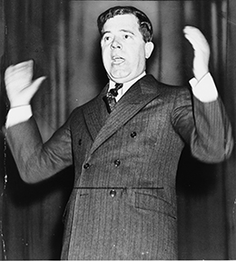

By the end of this section, you should be able to:
* Identify key pieces of legislation from the Second New Deal
* Assess the entire New Deal, especially in terms of its impact on women, African Americans, and Native Americans

Roosevelt won his second term in a landslide, but that did not mean he was immune to criticism. His critics came from both the left and the right, with conservatives deeply concerned over his expansion of government spending and power, and liberals angered that he had not done more to help those still struggling. Adding to Roosevelt’s challenges, the Supreme Court struck down several key elements of the First New Deal, angering Roosevelt and spurring him to try and stack the courts in his second term. Still, he entered his new term with the unequivocal support of the voting public, and he wasted no time beginning the second phase of his economic plan. While the First New Deal focused largely on stemming the immediate suffering of the American people, the Second New Deal put in place legislation that changed America’s social safety net for good.

# CHALLENGES FROM CRITICS ON ALL SIDES

While many people supported Roosevelt, especially in the first few years of his presidency, the New Deal did receive significant criticism, both from conservatives who felt that it was a radical agenda to ruin the country’s model of free enterprise, and from liberals who felt that it did not provide enough help to those who needed it most ([\[link\]](#CNX_History_26_03_FDRCartoon)).

 {: #CNX_History_26_03_FDRCartoon}

Industrialists and wealthy Americans led the conservative criticism against the president. Whether attacking his character or simply stating that he was moving away from American values toward fascism and socialism, they sought to undermine his power and popularity. Most notably, the American Liberty League—comprised largely of conservative Democrats who lamented the excesses of several of Roosevelt’s New Deal programs—labeled the AAA as fascist and proclaimed later New Deal programs to be key threats to the very nature of democracy. Additional criticism came from the National Association of Manufacturers, which urged businessmen to outright ignore portions of the NRA that promoted collective bargaining, as well as subsequent labor protection legislation. In 1935, the U.S. Supreme Court dealt the most crushing blow to Roosevelt’s vision, striking down several key pieces of the New Deal as unconstitutional. They found that both the AAA and the NIRA overreached federal authority. The negation of some of his most ambitious economic recovery efforts frustrated Roosevelt greatly, but he was powerless to stop it at this juncture.

Meanwhile, others felt that Roosevelt had not done enough. Dr. Francis E. Townsend of California was one who felt that Roosevelt had failed to adequately address the country’s tremendous problems. Townsend, who was a retired dentist, proposed an expansive pension plan for the elderly. The Townsend Plan, as it was known, gained a great deal of popularity: It recommended paying every citizen over sixty who retired from work the sum of $200 per month, provided they spend it in thirty days. Another figure who gained national attention was Father Charles Coughlin. He was a “radio priest” from Michigan who, although he initially supported the New Deal, subsequently argued that Roosevelt stopped far too short in his defense of labor, monetary reform, and the nationalization of key industries. The president’s plan, he proclaimed, was inadequate. He created the National Union for Social Justice and used his weekly radio show to gain followers.

A more direct political threat to Roosevelt came from muckraker Upton Sinclair, who pursued the California governorship in 1934 through a campaign based upon criticism of the New Deal’s shortcomings. In his “End Poverty in California” program, Sinclair called for a progressive income tax, a pension program for the elderly, and state seizure of factories and farms where property taxes remained unpaid. The state would then offer jobs to the unemployed to work those farms and factories in a cooperative mode. Although Sinclair lost the election to his Republican opponent, he did draw local and national attention to several of his ideas.

The biggest threat to the president, however, came from corrupt but beloved Louisiana senator **Huey “Kingfish” Long**{: data-type="term" .no-emphasis} ([\[link\]](#CNX_History_26_03_HueyLong)). His disapproval of Roosevelt came in part from his own ambitions for higher office; Long stated that the president was not doing enough to help people and proposed his own Share Our Wealth program. Under this plan, Long recommended the liquidation of all large personal fortunes in order to fund direct payments to less fortunate Americans. He foresaw giving $5,000 to every family, $2,500 to every worker, as well as a series of elderly pensions and education funds. Despite his questionable math, which numerous economists quickly pointed out rendered his program unworkable, by 1935, Long had a significant following of over four million people. If he had not been assassinated by the son-in-law of a local political rival, he may well have been a contender against Roosevelt for the 1936 presidential nomination.

 {: #CNX_History_26_03_HueyLong}

# ANSWERING THE CHALLENGE

Roosevelt recognized that some of the criticisms of the New Deal were valid. Although he was still reeling from the Supreme Court’s invalidation of key statutes, he decided to face his re-election bid in 1936 by unveiling another wave of legislation that he dubbed the Second New Deal. In the first week of June 1935, Roosevelt called congressional leaders into the White House and gave them a list of “must-pass” legislation that he wanted before they adjourned for the summer. Whereas the policies of the first hundred days may have shored up public confidence and stopped the most drastic of the problems, the second hundred days changed the face of America for the next sixty years.

The **Banking Act of 1935**{: data-type="term" .no-emphasis} was the most far-reaching revision of banking laws since the creation of the Federal Reserve System in 1914. Previously, regional reserve banks, particularly the New York Reserve Bank—controlled by the powerful Morgan and Rockefeller families—had dominated policy-making at the Federal Reserve. Under the new system, there would be a seven-member board of governors to oversee regional banks. They would have control over reserve requirements, discount rates, board member selection, and more. Not surprisingly, this new board kept initial interest rates quite low, allowing the federal government to borrow billions of dollars of additional cash to fund major relief and recovery programs.

In 1935, Congress also passed the Emergency Relief Appropriation Act, which authorized the single largest expenditure at that time in the country’s history: $4.8 billion. Almost one-third of those funds were invested in a new relief agency, the **Works Progress Administration**{: data-type="term"} (WPA). Harry Hopkins, formerly head of the CWA, took on the WPA and ran it until 1943. In that time, the program provided employment relief to over eight million Americans, or approximately 20 percent of the country’s workforce. The WPA funded the construction of more than 2,500 hospitals, 5,900 schools, 570,000 miles of road, and more. The WPA also created the Federal One Project, which employed approximately forty thousand artists in theater, art, music, and writing. They produced state murals, guidebooks, concerts, and drama performances all around the country ([\[link\]](#CNX_History_26_03_WPAMural2)). Additionally, the project funded the collection of oral histories, including those of former slaves, which provided a valuable addition to the nation’s understanding of slave life. Finally, the WPA also included the National Youth Administration (NYA), which provided work-study jobs to over 500,000 college students and four million high school students.

 "){: #CNX_History_26_03_WPAMural2}

  
Browse the *Born in Slavery* [collection][1] to examine personal accounts of former slaves, recorded between 1936 and 1938, as part of the Federal Writers\' Project of the WPA.

With the implementation of the Second New Deal, Roosevelt also created the country’s present-day social safety net. The **Social Security**{: data-type="term"} Act established programs intended to help the most vulnerable: the elderly, the unemployed, the disabled, and the young. It included a pension fund for all retired people—except domestic workers and farmers, which therefore left many women and African Americans beyond the scope of its benefits—over the age of sixty-five, to be paid through a payroll tax on both employee and employer. Related to this act, Congress also passed a law on unemployment insurance, to be funded by a tax on employers, and programs for unwed mothers, as well as for those who were blind, deaf, or disabled. It is worth noting that some elements of these reforms were pulled from Roosevelt detractors Coughlin and Townsend; the popularity of their movements gave the president more leverage to push forward this type of legislation.

To the benefit of industrial workers, Roosevelt signed into law the Wagner Act, also known as the National Labor Relations Act. The protections previously afforded to workers under the NIRA were inadvertently lost when the Supreme Court struck down the original law due to larger regulatory concerns, leaving workers vulnerable. Roosevelt sought to salvage this important piece of labor legislation, doing so with the Wagner Act. The act created the **National Labor Relations Board**{: data-type="term" .no-emphasis} (NLRB) to once again protect American workers’ right to unionize and bargain collectively, as well as to provide a federal vehicle for labor grievances to be heard. Although roundly criticized by the Republican Party and factory owners, the Wagner Act withstood several challenges and eventually received constitutional sanction by the U.S. Supreme Court in 1937. The law received the strong support of John L. Lewis and the Congress of Industrial Organizations who had long sought government protection of industrial unionism, from the time they split from the American Federation of Labor in 1935 over disputes on whether to organize workers along craft or industrial lines. Following passage of the law, Lewis began a widespread publicity campaign urging industrial workers to join “the president’s union.” The relationship was mutually beneficial to Roosevelt, who subsequently received the endorsement of Lewis’s United Mine Workers union in the 1936 presidential election, along with a sizeable $500,000 campaign contribution. The Wagner Act permanently established government-secured workers’ rights and protections from their employers, and it marked the beginning of labor’s political support for the Democratic Party.

The various programs that made up the Second New Deal are listed in the table below ([\[link\]](#Table_26_02_NewDeal2)).

<table id="Table_26_02_NewDeal2" summary="A table composed of three columns and ten rows describes the key programs from the Second New Deal. The first row is the title row, and from left to right reads: New Deal Legislation, Years Enacted, and Brief Description. Rows two through ten contain the information corresponding to those three headings, respectively. Row two reads Fair Labor Standards Act, 1938&#x2013;today, and Established minimum wage and forty-hour workweek. Row three reads Farm Security Administration, 1935&#x2013;today, and Provides poor farmers with education and economic support programs. Row four reads Federal Crop Insurance Corporation, 1938&#x2013;today, and Insures crops and livestock against loss of revenue. Row five reads National Labor Relations Act, 1935&#x2013;today, and Recognized right of workers to unionize and collectively bargain. Row six reads National Youth Administration, 1935&#x2013;1939 (part of WPA), and Part-time employment for college and high school students. Row seven reads Rural Electrification Administration, 1935&#x2013;today, and Provides public utilities to rural areas. Row eight reads Social Security Act, 1935&#x2013;today, and Aid to retirees, unemployed, disabled. Row nine reads Surplus Commodities Program, 1936&#x2013;today, and Provides food to the poor (still exists in Food Stamps program). Row ten reads Works Progress Administration, 1935&#x2013;1943, and Jobs program (including artists and youth)."><caption>Key Programs from the Second New Deal</caption><thead>
<tr>
<th>New Deal Legislation</th>
<th>Years Enacted</th>
<th>Brief Description</th>
</tr>
</thead><tbody>
<tr>
<td>Fair Labor Standards Act</td>
<td>1938–today</td>
<td>Established minimum wage and forty-hour workweek</td>
</tr>

<tr>
<td>Farm Security Administration</td>
<td>1935–today</td>
<td>Provides poor farmers with education and economic support programs</td>
</tr>

<tr>
<td>Federal Crop Insurance Corporation</td>
<td>1938–today</td>
<td>Insures crops and livestock against loss of revenue</td>
</tr>

<tr>
<td>National Labor Relations Act</td>
<td>1935–today</td>
<td>Recognized right of workers to unionize &amp; collectively bargain</td>
</tr>

<tr>
<td>National Youth Administration</td>
<td>1935–1939 (part of WPA)</td>
<td>Part-time employment for college and high school students</td>
</tr>

<tr>
<td>Rural Electrification Administration</td>
<td>1935–today</td>
<td>Provides public utilities to rural areas</td>
</tr>

<tr>
<td>Social Security Act</td>
<td>1935–today</td>
<td>Aid to retirees, unemployed, disabled</td>
</tr>

<tr>
<td>Surplus Commodities Program</td>
<td>1936–today</td>
<td>Provides food to the poor (still exists in Food Stamps program)</td>
</tr>

<tr>
<td>Works Progress Administration</td>
<td>1935–1943</td>
<td>Jobs program (including artists and youth)</td>
</tr>
</tbody></table>

# THE FINAL PIECES

Roosevelt entered the 1936 presidential election on a wave of popularity, and he beat Republican opponent Alf Landon by a nearly unanimous Electoral College vote of 523 to 8. Believing it to be his moment of strongest public support, Roosevelt chose to exact a measure of revenge against the U.S. Supreme Court for challenging his programs and to pressure them against challenging his more recent Second New Deal provisions. To this end, Roosevelt created the informally named “**Supreme Court Packing Plan**{: data-type="term"}” and tried to pack the court in his favor by expanding the number of justices and adding new ones who supported his views. His plan was to add one justice for every current justice over the age of seventy who refused to step down. This would have allowed him to add six more justices, expanding the bench from nine to fifteen. Opposition was quick and thorough from both the Supreme Court and Congress, as well as from his own party. The subsequent retirement of Justice Van Devanter from the court, as well as the sudden death of Senator Joe T. Robinson, who championed Roosevelt’s plan before the Senate, all but signaled Roosevelt’s defeat. However, although he never received the support to make these changes, Roosevelt appeared to succeed in politically intimidating the current justices into supporting his newer programs, and they upheld both the Wagner Act and the Social Security Act. Never again during his presidency would the Supreme Court strike down any significant elements of his New Deal.

Roosevelt was not as successful in addressing the nation’s growing deficit. When he entered the presidency in 1933, Roosevelt did so with traditionally held fiscal beliefs, including the importance of a balanced budget in order to maintain public confidence in federal government operations. However, the severe economic conditions of the depression quickly convinced the president of the importance of government spending to create jobs and relief for the American people. As he commented to a crowd in Pittsburgh in 1936, “To balance our budget in 1933 or 1934 or 1935 would have been a crime against the American people. To do so . . . we should have had to set our face against human suffering with callous indifference. When Americans suffered, we refused to pass by on the other side. Humanity came first.” However, after his successful re-election, Roosevelt anticipated that the economy would recover enough by late 1936 that he could curtail spending by 1937. This reduction in spending, he hoped, would curb the deficit. As the early months of 1937 unfolded, Roosevelt’s hopes seemed supported by the most recent economic snapshot of the country. Production, wages, and profits had all returned to pre-1929 levels, while unemployment was at its lowest rate in the decade, down from 25 percent to 14 percent. But no sooner did Roosevelt cut spending when a recession hit. Two million Americans were newly out of work as unemployment quickly rose by 5 percent and industrial production declined by a third. Breadlines began to build again, while banks prepared to close.

Historians continue to debate the causes of this recession within a depression. Some believe the fear of increased taxes forced factory owners to curtail planned expansion; others blame the Federal Reserve for tightening the nation’s money supply. Roosevelt, however, blamed the downturn on his decision to significantly curtail federal government spending in job relief programs such as the WPA. Several of his closest advisors, including Harry Hopkins, Henry Wallace, and others, urged him to adopt the new economic theory espoused by British economic John Maynard Keynes, who argued that deficit spending was necessary in advanced capitalist economies in order to maintain employment and stimulate consumer spending. Convinced of the necessity of such an approach, Roosevelt asked Congress in the spring of 1938 for additional emergency relief spending. Congress immediately authorized $33 billion for PWA and WPA work projects. Although World War II would provide the final impetus for lasting economic recovery, Roosevelt’s willingness to adapt in 1938 avoided another disaster.

Roosevelt signed the last substantial piece of New Deal legislation in the summer of 1938. The Fair Labor Standards Act established a federal minimum wage—at the time, forty cents per hour—a maximum workweek of forty hours (with an opportunity for four additional hours of work at overtime wages), and prohibited child labor for those under age sixteen. Roosevelt was unaware that the war would soon dominate his legacy, but this proved to be his last major piece of economic legislation in a presidency that changed the fabric of the country forever.

# IN THE FINAL ANALYSIS

The legacy of the New Deal is in part seen in the vast increase in national power: The federal government accepted responsibility for the nation’s economic stability and prosperity. In retrospect, the majority of historians and economists judge it to have been a tremendous success. The New Deal not only established minimum standards for wages, working conditions, and overall welfare, it also allowed millions of Americans to hold onto their homes, farms, and savings. It laid the groundwork for an agenda of expanded federal government influence over the economy that continued through President Harry Truman’s “Fair Deal” in the 1950s and President Lyndon Johnson’s call for a “Great Society” in the 1960s. The New Deal state that embraced its responsibility for the citizens’ welfare and proved willing to use its power and resources to spread the nation’s prosperity lasted well into the 1980s, and many of its tenets persist today. Many would also agree that the postwar economic stability of the 1950s found its roots in the stabilizing influences introduced by social security, the job stability that union contracts provided, and federal housing mortgage programs introduced in the New Deal. The environment of the American West in particular, benefited from New Deal projects such as the Soil Conservation program.

Still, Roosevelt’s programs also had their critics. Following the conservative rise initiated by presidential candidate Barry Goldwater in 1964, and most often associated with the Ronald Reagan era of the 1980s, critics of the welfare state pointed to Roosevelt’s presidency as the start of a slippery slope towards entitlement and the destruction of the individualist spirit upon which the United States had presumably developed in the nineteenth and early twentieth centuries. Although the growth of the GDP between 1934 and 1940 approached an average of 7.5 percent—higher than in any other peacetime period in U.S. history, critics of the New Deal point out that unemployment still hovered around 15 percent in 1940. While the New Deal resulted in some environmental improvements, it also inaugurated a number of massive infrastructural projects, such as the Grand Coulee Dam on the Columbia River, that came with grave environmental consequences. And other shortcomings of the New Deal were obvious and deliberate at the time.

## African Americans under the New Deal

Critics point out that not all Americans benefited from the New Deal. African Americans in particular were left out, with overt discrimination in hiring practices within the federal job programs, such as the CCC, CWA, and WPA. The NRA was oftentimes criticized as the “Negro Run Around” or “Negroes Ruined Again” program. As well, the AAA left tenant farmers and sharecroppers, many of whom were black, with no support. Even Social Security originally excluded domestic workers, a primary source of employment for African American women. Facing such criticism early in his administration, Roosevelt undertook some efforts to ensure a measure of equality in hiring practices for the relief agencies, and opportunities began to present themselves by 1935. The WPA eventually employed 350,000 African Americans annually, accounting for nearly 15 percent of its workforce. By the close of the CCC in 1938, this program had employed over 300,000 African Americans, increasing the black percentage of its workforce from 3 percent at the outset to nearly 11 percent at its close. Likewise, in 1934, the PWA began to require that all government projects under its purview hire African Americans using a quota that reflected their percentage of the local population being served. Additionally, among several important WPA projects, the Federal One Project included a literacy program that eventually reached over one million African American children, helping them learn how to read and write.

On the issue of race relations themselves, Roosevelt has a mixed legacy. Within his White House, Roosevelt had a number of African American appointees, although most were in minor positions. Unofficially, Roosevelt relied upon advice from the Federal Council on Negro Affairs, also known as his “**Black Cabinet**{: data-type="term" .no-emphasis}.” This group included a young Harvard economist, Dr. Robert Weaver, who subsequently became the nation’s first black cabinet secretary in 1966, as President Lyndon Johnson’s Secretary of Housing and Urban Development. Aubrey Williams, the director of the NYA, hired more black administrators than any other federal agency, and appointed them to oversee projects throughout the country. One key figure in the NYA was **Mary McLeod Bethune**{: data-type="term" .no-emphasis} ([\[link\]](#CNX_History_26_03_Bethune)), a prominent African American educator tapped by Roosevelt to act as the director of the NYA’s Division of Negro Affairs. Bethune had been a spokesperson and an educator for years; with this role, she became one of the president’s foremost African American advisors. During his presidency, Roosevelt became the first to appoint a black federal judge, as well as the first commander-in-chief to promote an African American to brigadier general. Most notably, he became the first president to publicly speak against lynching as a “vile form of collective murder.”

  was taken at the opening of Midway Hall, a federal building to house female African American government workers. Bethune was sometimes criticized for working with those in power, but her willingness to build alliances contributed to success in raising money and support for her causes."){: #CNX_History_26_03_Bethune}

Mary McLeod Bethune on Racial Justice

\> Democracy is for me, and for twelve million black Americans, a goal towards which our nation is marching. It is a dream and an ideal in whose ultimate realization we have a deep and abiding faith. For me, it is based on Christianity, in which we confidently entrust our destiny as a people. Under God’s guidance in this great democracy, we are rising out of the darkness of slavery into the light of freedom. Here my race has been afforded \[the\] opportunity to advance from a people 80 percent illiterate to a people 80 percent literate; from abject poverty to the ownership and operation of a million farms and 750,000 homes; from total disfranchisement to participation in government; from the status of chattels to recognized contributors to the American culture.

When Mary McLeod Bethune spoke these words, she spoke on behalf of a race of American citizens for whom the Great Depression was much more than economic hardship. For African Americans, the Depression once again exposed the racism and inequality that gripped the nation economically, socially, and politically. Her work as a member of President Franklin Roosevelt’s unofficial “Black Cabinet” as well as the Director of the Division of Negro Affairs for the NYA, presented her an opportunity to advance African American causes on all fronts—but especially in the area of black literacy. As part of the larger WPA, she also influenced employment programs in the arts and public work sectors, and routinely had the president’s ear on matters related to racial justice.

  
Listen to this [audio clip][2] of Eleanor Roosevelt interviewing Mary McLeod Bethune. By listening to her talking to Bethune and offering up her support, it becomes clear how compelling the immensely popular first lady was when speaking about programs of close personal interest to her. How do you think this would have been received by Roosevelt’s supporters?

However, despite these efforts, Roosevelt also understood the precariousness of his political position. In order to maintain a coalition of Democrats to support his larger relief and recovery efforts, Roosevelt could not afford to alienate Southern Democrats who might easily bolt should he openly advocate for civil rights. While he spoke about the importance of anti-lynching legislation, he never formally pushed Congress to propose such a law. He did publicly support the abolition of the poll tax, which Congress eventually accomplished in 1941. Likewise, although agency directors adopted changes to ensure job opportunities for African Americans at the federal level, at the local level, few advancements were made, and African Americans remained at the back of the employment lines. Despite such failures, however, Roosevelt deserves credit for acknowledging the importance of race relations and civil rights. At the federal level, more than any of his predecessors since the Civil War, Roosevelt remained aware of the role that the federal government can play in initiating important discussions about civil rights, as well as encouraging the development of a new cadre of civil rights leaders.

Although unable to bring about sweeping civil rights reforms for African Americans in the early stages of his administration, Roosevelt was able to work with Congress to significantly improve the lives of Indians. In 1934, he signed into law the Indian Reorganization Act (sometimes referred to as the “Indian New Deal”). This law formally abandoned the assimilationist policies set forth in the Dawes Severalty Act of 1887. Rather than forcing Indians to adapt to American culture, the new program encouraged them to develop forms of local self-government, as well as to preserve their artifacts and heritage. John Collier, the Commissioner on Indian Bureau Affairs from 1933 to 1945, championed this legislation and saw it as an opportunity to correct past injustices that land allotment and assimilation had wrought upon Indians. Although the re-establishment of communal tribal lands would prove to be difficult, Collier used this law to convince federal officials to return nearly two million acres of government-held land to various tribes in order to move the process along. Although subsequent legislation later circumscribed the degree to which tribes were allowed to self-govern on reservations, Collier’s work is still viewed as a significant step in improving race relations with Indians and preserving their heritage.

## Women and the New Deal

For women, Roosevelt’s policies and practices had a similarly mixed effect. Wage discrimination in federal jobs programs was rampant, and relief policies encouraged women to remain home and leave jobs open for men. This belief was well in line with the gender norms of the day. Several federal relief programs specifically forbade husbands and wives’ both drawing jobs or relief from the same agency. The WPA became the first specific New Deal agency to openly hire women—specifically widows, single women, and the wives of disabled husbands. While they did not take part in construction projects, these women did undertake sewing projects to provide blankets and clothing to hospitals and relief agencies. Likewise, several women took part in the various Federal One art projects. Despite the obvious gender limitations, many women strongly supported Roosevelt’s New Deal, as much for its direct relief handouts for women as for its employment opportunities for men. One such woman was Mary (Molly) Dewson. A longtime activist in the women’s suffrage movement, Dewson worked for women’s rights and ultimately rose to be the Director of the Women’s Division of the Democratic Party. Dewson and Mary McLeod Bethune, the national champion of African American education and literacy who rose to the level of Director of the Division of Negro Affairs for the NYA, understood the limitations of the New Deal, but also the opportunities for advancement it presented during very trying times. Rather than lamenting what Roosevelt could not or would not do, they felt, and perhaps rightly so, that Roosevelt would do more than most to help women and African Americans achieve a piece of the new America he was building.

Among the few, but notable, women who directly impacted Roosevelt’s policies was Frances Perkins, who as Secretary of Labor was the first female member of any presidential cabinet, and First Lady Eleanor Roosevelt, who was a strong and public advocate for social causes. Perkins, one of only two original Cabinet members to stay with Roosevelt for his entire presidency, was directly involved in the administration of the CCC, PWA, NRA, and the Social Security Act. Among several important measures, she took greatest pleasure in championing minimum wage statutes as well as the penultimate piece of New Deal legislation, the Fair Labor Standards Act. Roosevelt came to trust Perkins’ advice with few questions or concerns, and steadfastly supported her work through the end of his life (Figure 26\\\_03\\\_Perkins).

  later accepted an appointment to the Social Security Board, working with fellow board members Arthur J. Altmeyer and George E. Bigge, shown here in 1937. Another influential advisor to President Franklin Roosevelt was Frances Perkins (b), who, as U.S. Secretary of Labor, graced the cover of Time magazine on August 14, 1933."){: #CNX_History_26_03_Perkins}

Molly Dewson and Women Democrats

In her effort to get President Roosevelt re-elected in 1936, Dewson commented, “We don’t make the old-fashioned plea to the women that our nominee is charming, and all that. We appeal to the intelligence of the country’s women. Ours were economic issues and we found the women ready to listen.”

As head of the Women’s Division of the Democratic National Committee (DNC) in 1932, Molly Dewson proved to be an influential supporter of President Franklin Roosevelt and one of his key advisors regarding issues pertaining to women’s rights. Agreeing with First Lady Eleanor Roosevelt that “Women must learn to play the games as men do,” Dewson worked diligently in her position with the DNC to ensure that women could serve as delegates and alternates to the national conventions. Her approach, and her realization that women were intelligent enough to make rational choices, greatly appealed to Roosevelt. Her methods were perhaps not too different from his own, as he spoke to the public through his fireside chats. Dewson’s impressive organizational skills on behalf of the party earned her the nickname “the little general” from President Roosevelt.

However, Eleanor Roosevelt, more so than any other individual, came to represent the strongest influence upon the president; and she used her unique position to champion several causes for women, African Americans, and the rural poor ([\[link\]](#CNX_History_26_03_Eleanor)). She married Franklin Roosevelt, who was her fifth cousin, in 1905 and subsequently had six children, one of whom died at only seven months old. A strong supporter of her husband’s political ambitions, Eleanor campaigned by his side through the failed vice-presidential bid in 1920 and on his behalf after he was diagnosed with polio in 1921. When she discovered letters of her husband’s affair with her social secretary, Lucy Mercer, the marriage became less one of romance and more one of a political partnership that would continue—strained at times—until the president’s death in 1945.

 "){: #CNX_History_26_03_Eleanor}

Historians agree that the first lady used her presence in the White House, in addition to the leverage of her failed marriage and knowledge of her husband’s infidelities, to her advantage. She promoted several causes that the president himself would have had difficulty championing at the time. From newspaper and magazine articles she authored, to a busy travel schedule that saw her regularly cross the country, the first lady sought to remind Americans that their plight was foremost on the minds of all working in the White House. Eleanor was so active in her public appearances that, by 1940, she began holding regular press conferences to answer reporters’ questions. Among her first substantial projects was the creation of Arthurdale—a resettlement community for displaced coal miners in West Virginia. Although the planned community became less of an administration priority as the years progressed (eventually folding in 1940), for seven years, Eleanor remained committed to its success as a model of assistance for the rural poor.

Exposed to issues of racial segregation in the Arthurdale experiment, Eleanor subsequently supported many civil rights causes through the remainder of the Roosevelt presidency. When it further became clear that racial discrimination was rampant in the administration of virtually all New Deal job programs—especially in the southern states—she continued to pressure her husband for remedies. In 1934, she openly lobbied for passage of the federal anti-lynching bill that the president privately supported but could not politically endorse. Despite the subsequent failure of the Senate to pass such legislation, Eleanor succeeded in arranging a meeting between her husband and then-NAACP president Walter White to discuss anti-lynching and other pertinent calls for civil rights legislation.

White was only one of Eleanor’s African American guests to the White House. Breaking with precedent, and much to the disdain of many White House officials, the first lady routinely invited prominent African Americans to dine with her and the president. Most notably, when the Daughters of the American Revolution (DAR) refused to permit internationally renowned black opera contralto Marian Anderson to sing in Constitution Hall, Eleanor resigned her membership in the DAR and arranged for Anderson to sing at a public concert on the steps of the Lincoln Memorial, followed by her appearance at a state dinner at the White House in honor of the king and queen of England. With regard to race relations in particular, Eleanor Roosevelt was able to accomplish what her husband—for delicate political reasons—could not: become the administration’s face for civil rights.

# Section Summary

Despite his popularity, Roosevelt had significant critics at the end of the First New Deal. Some on the right felt that he had moved the country in a dangerous direction towards socialism and fascism, whereas others on the left felt that he had not gone far enough to help the still-struggling American people. Reeling after the Supreme Court struck down two key pieces of New Deal legislation, the AAA and NIRA, Roosevelt pushed Congress to pass a new wave of bills to provide jobs, banking reforms, and a social safety net. The laws that emerged—the Banking Act, the Emergency Relief Appropriation Act, and the Social Security Act—still define our country today.

Roosevelt won his second term in a landslide and continued to push for legislation that would help the economy. The jobs programs employed over eight million people and, while systematic discrimination hurt both women and African American workers, these programs were still successful in getting people back to work. The last major piece of New Deal legislation that Roosevelt passed was the Fair Labor Standards Act, which set a minimum wage, established a maximum-hour workweek, and forbade child labor. This law, as well as Social Security, still provides much of the social safety net in the United States today.

While critics and historians continue to debate whether the New Deal ushered in a permanent change to the political culture of the country, from one of individualism to the creation of a welfare state, none deny the fact that Roosevelt’s presidency expanded the role of the federal government in all people’s lives, generally for the better. Even if the most conservative of presidential successors would question this commitment, the notion of some level of government involvement in economic regulation and social welfare had largely been settled by 1941. Future debates would be about the extent and degree of that involvement.

# Review Questions

Which of the following statements accurately describes Mary McLeod Bethune? 

She was a prominent supporter of the Townsend Plan.

She was a key figure in the NYA.

She was Eleanor Roosevelt’s personal secretary.

She was a labor organizer.

B

The Social Security Act borrowed some ideas from which of the following? 

the Townsend Plan

the Division of Negro Affairs

the Education Trust

the NIRA

A

What was the first New Deal agency to hire women openly? 

the NRA

the WPA

the AAA

the TVA

B

What were the major goals and accomplishments of the Indian New Deal?

The Indian Reorganization Act, or Indian New Deal, of 1934 put an end to the policies set forth in the Dawes Severalty Act of 1887. Rather than encouraging assimilation, the new act promoted Indians’ development of local self-government and the preservation of Indian artifacts and heritage. John Collier, the Commissioner on Indian Bureau Affairs, was able to use the law to push for federal officials’ return of nearly two million acres of government-held land to various tribes.

# Critical Thinking Questions

To what extent was Franklin Roosevelt’s overwhelming victory in the 1932 presidential election a reflection of his own ideas for change? To what extent did it represent public discontent with Herbert Hoover’s lack of answers?

Whom did the New Deal help the least? What hardships did these individuals continue to suffer? Why were Roosevelt’s programs unsuccessful in the alleviation of their adversities?

Was Franklin Roosevelt successful at combatting the Great Depression? How did the New Deal affect future generations of Americans?

What were the key differences between the First New Deal and the Second New Deal? On the whole, what did each New Deal set out to accomplish?

What challenges did Roosevelt face in his work on behalf of African Americans? What impact did the New Deal have ultimately on race relations?

## Glossary
{: data-type="glossary-title"}

Social Security
: a series of programs designed to help the population’s most vulnerable—the unemployed, those over age sixty-five, unwed mothers, and the disabled—through various pension, insurance, and aid programs
{: .definition}

Supreme Court Packing Plan
: Roosevelt’s plan, after being reelected, to pack the Supreme Court with an additional six justices, one for every justice over seventy who refused to step down
{: .definition}

Works Progress Administration
: a program run by Harry Hopkins that provided jobs for over eight million Americans from its inception to its closure in 1943
{: .definition}

[1]: http://openstaxcollege.org/l/slavery
[2]: http://openstaxcollege.org/l/bethune
