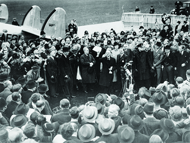
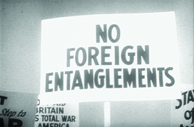
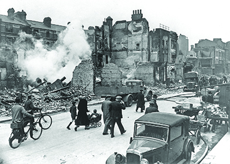
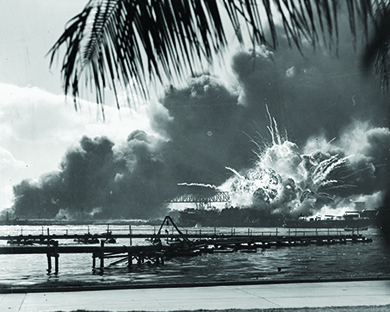

By the end of this section, you will be able to:
* Explain the factors in Europe that gave rise to Fascism and Nazism
* Discuss the events in Europe and Asia that led to the start of the war
* Identify the early steps taken by President Franklin D. Roosevelt to increase American aid to nations fighting totalitarianism while maintaining neutrality

 ![A timeline shows important events of the era. In 1941, Lend Lease begins, and Japanese planes bomb the U.S. naval base at Pearl Harbor, Hawaii; a photograph of the explosion of the USS Shaw after the Pearl Harbor attack is shown. In 1942, the Fair Employment Practices Committee is instituted, the U.S. Navy defeats Japan at Midway, and the United States begins internment of Japanese Americans; a photograph of Japanese Americans lining up in front of posters detailing their internment orders is shown. In 1943, Winston Churchill, Franklin Roosevelt, and Joseph Stalin meet in Tehran, and U.S. troops invade Italy; a photograph of U.S. troops in Sicily is shown. In 1944, Allied forces land in France for the D-day invasion; a photograph of U.S. troops approaching the beach at Normandy in a military landing craft is shown. In 1945, the Battles of Iwo Jima and Okinawa are fought, Churchill, Roosevelt, and Stalin meet at Yalta, the United States drops atomic bombs on Japan, and World War II ends; photographs of an atomic bomb&#x2019;s mushroom cloud and Churchill, Roosevelt, and Stalin at Yalta are shown.](../resources/CNX_History_27_01_Timeline.jpg){: #CNX_History_27_01_Timeline}

The years between the First and Second World Wars were politically and economically tumultuous for the United States and especially for the world. The Russian Revolution of 1917, Germany’s defeat in World War I, and the subsequent Treaty of Versailles had broken up the Austro-Hungarian, German, and Russian empires and significantly redrew the map of Europe. President Woodrow Wilson had wished to make World War I the “war to end all wars” and hoped that his new paradigm of “collective security” in international relations, as actualized through the League of Nations, would limit power struggles among the nations of the world. However, during the next two decades, America’s attention turned away from global politics and toward its own needs. At the same time, much of the world was dealing with economic and political crises, and different types of totalitarian regimes began to take hold in Europe. In Asia, an ascendant Japan began to expand its borders. Although the United States remained focused on the economic challenges of the Great Depression as World War II approached, ultimately it became clear that American involvement in the fight against Nazi Germany and Japan was in the nation’s interest.

### ISOLATION

While during the 1920s and 1930s there were Americans who favored active engagement in Europe, most Americans, including many prominent politicians, were leery of getting too involved in European affairs or accepting commitments to other nations that might restrict America’s ability to act independently, keeping with the isolationist tradition. Although the United States continued to intervene in the affairs of countries in the Western Hemisphere during this period, the general mood in America was to avoid becoming involved in any crises that might lead the nation into another global conflict.

Despite its largely noninterventionist foreign policy, the United States did nevertheless take steps to try to lessen the chances of war and cut its defense spending at the same time. President Warren G. Harding’s administration participated in the Washington Naval Conference of 1921–1922, which reduced the size of the navies of the nine signatory nations. In addition, the Four Power Treaty, signed by the United States, Great Britain, France, and Japan in 1921, committed the signatories to eschewing any territorial expansion in Asia. In 1928, the United States and fourteen other nations signed the **Kellogg-Briand Pact**{: data-type="term" .no-emphasis}, declaring war an international crime. Despite hopes that such agreements would lead to a more peaceful world—far more nations signed on to the agreement in later years—they failed because none of them committed any of the nations to take action in the event of treaty violations.

### THE MARCH TOWARD WAR

While the United States focused on domestic issues, economic depression and political instability were growing in Europe. During the 1920s, the international financial system was propped up largely by American loans to foreign countries. The crash of 1929, when the U.S. stock market plummeted and American capital dried up, set in motion a series of financial chain reactions that contributed significantly to a global downward economic spiral. Around the world, industrialized economies faced significant problems of economic depression and worker unemployment.

#### Totalitarianism in Europe

Many European countries had been suffering even before the Great Depression began. A postwar recession and the continuation of wartime inflation had hurt many economies, as did a decrease in agricultural prices, which made it harder for farmers to buy manufactured goods or pay off loans to banks. In such an unstable environment, Benito Mussolini capitalized on the frustrations of the Italian people who felt betrayed by the Versailles Treaty. In 1919, Mussolini created the *Fasci Italiani di Combattimento* (Italian Combat Squadron). The organization’s main tenets of **Fascism**{: data-type="term"} called for a totalitarian form of government and a heightened focus on national unity, militarism, social Darwinism, and loyalty to the state. With the support of major Italian industrialists and the king, who saw Fascism as a bulwark against growing Socialist and Communist movements, Mussolini became prime minister in 1922. Between 1925 and 1927, Mussolini transformed the nation into a single party state and removed all restraints on his power.

In Germany, a similar pattern led to the rise of the totalitarian National Socialist Party. Political fragmentation through the 1920s accentuated the severe economic problems facing the country. As a result, the German Communist Party began to grow in strength, frightening many wealthy and middle-class Germans. In addition, the terms of the Treaty of Versailles had given rise to a deep-seated resentment of the victorious Allies. It was in such an environment that Adolf Hitler’s anti-Communist National Socialist Party—the Nazis—was born.

The Nazis gained numerous followers during the Great Depression, which hurt Germany tremendously, plunging it further into economic crisis. By 1932, nearly 30 percent of the German labor force was unemployed. Not surprisingly, the political mood was angry and sullen. Hitler, a World War I veteran, promised to return Germany to greatness. By the beginning of 1933, the Nazis had become the largest party in the German legislature. Germany’s president, Paul von Hindenburg, at the urging of large industrialists who feared a Communist uprising, appointed Hitler to the position of chancellor in January 1933. In the elections that took place in early March 1933, the Nazis gained the political power to pass the Enabling Act later that same month, which gave Hitler the power to make all laws for the next four years. Hitler thus effectively became the dictator of Germany and remained so long after the four-year term passed. Like Italy, Germany had become a one-party totalitarian state ([\[link\]](#CNX_History_27_01_Fascism)). Nazi Germany was an anti-Semitic nation, and in 1935, the Nuremberg Laws deprived Jews, whom Hitler blamed for Germany’s downfall, of German citizenship and the rights thereof.

 and German National Socialist Party leader and dictator Adolf Hitler (b) systematically dismantled democratic institutions and pushed military buildups, racial supremacy, and an aggressive nationalism in the 1920s and early 1930s."){: #CNX_History_27_01_Fascism}

Once in power, Hitler began to rebuild German military might. He commenced his program by withdrawing Germany from the League of Nations in October 1933. In 1936, in accordance with his promise to restore German greatness, Hitler dispatched military units into the Rhineland, on the border with France, which was an act contrary to the provisions of the Versailles Treaty. In March 1938, claiming that he sought only to reunite ethnic Germans within the borders of one country, Hitler invaded Austria. At a conference in Munich later that year, Great Britain’s prime minister, Neville Chamberlain, and France’s prime minister, Édouard Daladier, agreed to the partial dismemberment of Czechoslovakia and the occupation of the Sudetenland (a region with a sizable German population) by German troops ([\[link\]](#CNX_History_27_01_Munich)). This Munich Pact offered a policy of **appeasement**{: data-type="term"}, in the hope that German expansionist appetites could be satisfied without war. But not long after the agreement, Germany occupied the rest of Czechoslovakia as well.

 {: #CNX_History_27_01_Munich}

In the Soviet Union, Premier Joseph Stalin, observing Hitler’s actions and listening to his public pronouncements, realized that Poland, part of which had once belonged to Germany and was home to people of German ancestry, was most likely next. Although fiercely opposed to Hitler, Stalin, sobered by the French and British betrayal of Czechoslovakia and unprepared for a major war, decided the best way to protect the Soviet Union, and gain additional territory, was to come to some accommodation with the German dictator. In August 1939, Germany and the Soviet Union essentially agreed to divide Poland between them and not make war upon one another.

#### Japan

Militaristic politicians also took control of Japan in the 1930s. The Japanese had worked assiduously for decades to modernize, build their strength, and become a prosperous, respected nation. The sentiment in Japan was decidedly pro-capitalist, and the Japanese militarists were fiercely supportive of a capitalist economy. They viewed with great concern the rise of Communism in the Soviet Union and in particular China, where the issue was fueling a civil war, and feared that the Soviet Union would make inroads in Asia by assisting China’s Communists. The Japanese militarists thus found a common ideological enemy with Fascism and National Socialism, which had based their rise to power on anti-Communist sentiments. In 1936, Japan and Germany signed the Anti-Comintern Pact, pledging mutual assistance in defending themselves against the Comintern, the international agency created by the Soviet Union to promote worldwide Communist revolution. In 1937, Italy joined the pact, essentially creating the foundation of what became the military alliance of the Axis powers.

Like its European allies, Japan was intent upon creating an empire for itself. In 1931, it created a new nation, a puppet state called Manchukuo, which had been cobbled together from the three northernmost provinces of China. Although the League of Nations formally protested Japan’s seizure of Chinese territory in 1931 and 1932, it did nothing else. In 1937, a clash between Japanese and Chinese troops, known as the Marco Polo Bridge Incident, led to a full-scale invasion of China by the Japanese. By the end of the year, the Chinese had suffered some serious defeats. In Nanjing, then called Nanking by Westerners, Japanese soldiers systematically raped Chinese women and massacred hundreds of thousands of civilians, leading to international outcry. Public sentiment against Japan in the United States reached new heights. Members of Protestant churches that were involved in missionary work in China were particularly outraged, as were Chinese Americans. A troop of Chinese American Boy Scouts in New York City’s Chinatown defied Boy Scout policy and marched in protest against Japanese aggression.

### FROM NEUTRALITY TO ENGAGEMENT

President Franklin Roosevelt was aware of the challenges facing the targets of Nazi aggression in Europe and Japanese aggression in Asia. Although he hoped to offer U.S. support, Congress’s commitment to nonintervention was difficult to overcome. Such a policy in regards to Europe was strongly encouraged by Senator Gerald P. Nye of North Dakota. Nye claimed that the United States had been tricked into participating in World War I by a group of industrialists and bankers who sought to gain from the country’s participation in the war. The United States, Nye urged, should not be drawn again into an international dispute over matters that did not concern it. His sentiments were shared by other noninterventionists in Congress ([\[link\]](#CNX_History_27_01_Isolation)).

 {: #CNX_History_27_01_Isolation}

Roosevelt’s willingness to accede to the demands of the noninterventionists led him even to refuse assistance to those fleeing Nazi Germany. Although Roosevelt was aware of Nazi persecution of the Jews, he did little to aid them. In a symbolic act of support, he withdrew the American ambassador to Germany in 1938. He did not press for a relaxation of immigration quotas that would have allowed more refugees to enter the country, however. In 1939, he refused to support a bill that would have admitted twenty thousand Jewish refugee children to the United States. Again in 1939, when German refugees aboard the SS *St. Louis*, most of them Jews, were refused permission to land in Cuba and turned to the United States for help, the U.S. State Department informed them that immigration quotas for Germany had already been filled. Once again, Roosevelt did not intervene, because he feared that nativists in Congress might smear him as a friend of Jews.

To ensure that the United States did not get drawn into another war, Congress passed a series of Neutrality Acts in the second half of the 1930s. The Neutrality Act of 1935 banned the sale of armaments to warring nations. The following year, another Neutrality Act prohibited loaning money to belligerent countries. The last piece of legislation, the Neutrality Act of 1937, forbade the transportation of weapons or passengers to belligerent nations on board American ships and also prohibited American citizens from traveling on board the ships of nations at war.

Once all-out war began between Japan and China in 1937, Roosevelt sought ways to help the Chinese that did not violate U.S. law. Since Japan did not formally declare war on China, a state of belligerency did not technically exist. Therefore, under the terms of the Neutrality Acts, America was not prevented from transporting goods to China. In 1940, the president of China, Chiang Kai-shek, was able to prevail upon Roosevelt to ship to China one hundred P-40 fighter planes and to allow American volunteers, who technically became members of the Chinese Air Force, to fly them.

#### War Begins in Europe

In 1938, the agreement reached at the Munich Conference failed to satisfy Hitler—in fact, the refusal of Britain and France to go to war over the issue infuriated the German dictator. In May of the next year, Germany and Italy formalized their military alliance with the “Pact of Steel.” On September 1, 1939, Hitler unleashed his Blitzkrieg, or “lightning war,” against Poland, using swift, surprise attacks combining infantry, tanks, and aircraft to quickly overwhelm the enemy. Britain and France had already learned from Munich that Hitler could not be trusted and that his territorial demands were insatiable. On September 3, 1939, they declared war on Germany, and the European phase of World War II began. Responding to the German invasion of Poland, Roosevelt worked with Congress to alter the Neutrality Laws to permit a policy of “Cash and Carry” in munitions for Britain and France. The legislation, passed and signed by Roosevelt in November 1939, permitted belligerents to purchase war **materiel**{: data-type="term"} if they could pay cash for it and arrange for its transportation on board their own ships.

When the Germans commenced their spring offensive in 1940, they defeated France in six weeks with a highly mobile and quick invasion of France, Belgium, Luxembourg, and the Netherlands. In the Far East, Japan took advantage of France’s surrender to Germany to occupy French Indochina. In response, beginning with the Export Control Act in July 1940, the United States began to embargo the shipment of various materials to Japan, starting first with aviation gasoline and machine tools, and proceeding to scrap iron and steel.

#### The Atlantic Charter

Following the surrender of France, the Battle of Britain began, as Germany proceeded to try to bomb England into submission. As the battle raged in the skies over Great Britain throughout the summer and autumn of 1940 ([\[link\]](#CNX_History_27_01_Britain)), Roosevelt became increasingly concerned over England’s ability to hold out against the German juggernaut. In June 1941, Hitler broke the nonaggression pact with the Soviet Union that had given him the backing to ravage Poland and marched his armies deep into Soviet territory, where they would kill Red Army regulars and civilians by the millions until their advances were stalled and ultimately reversed by the devastating battle of Stalingrad, which took place from August 23, 1942 until February 2, 1943 when, surrounded and out of ammunition, the German 6th army surrendered.

  
Listen to the BBC’s [archived reports][1] of the Battle of Britain, including Winston Churchill’s “Finest Hour” speech.

In August 1941, Roosevelt met with the British prime minister, Winston Churchill, off the coast of Newfoundland, Canada. At this meeting, the two leaders drafted the Atlantic Charter, the blueprint of Anglo-American cooperation during World War II. The charter stated that the United States and Britain sought no territory from the conflict. It proclaimed that citizens of all countries should be given the right of self-determination, self-government should be restored in places where it had been eliminated, and trade barriers should be lowered. Further, the charter mandated freedom of the seas, renounced the use of force to settle international disputes, and called for postwar disarmament.

 {: #CNX_History_27_01_Britain}

In March 1941, concerns over Britain’s ability to defend itself also influenced Congress to authorize a policy of Lend Lease, a practice by which the United States could sell, lease, or transfer armaments to any nation deemed important to the defense of the United States. Lend Lease effectively ended the policy of nonintervention and dissolved America’s pretense of being a neutral nation. The program ran from 1941 to 1945, and distributed some $45 billion worth of weaponry and supplies to Britain, the Soviet Union, China, and other allies.

#### A Date Which Will Live in Infamy

By the second half of 1941, Japan was feeling the pressure of the American embargo. As it could no longer buy strategic material from the United States, the Japanese were determined to obtain a sufficient supply of oil by taking control of the Dutch East Indies. However, they realized that such an action might increase the possibility of American intervention, since the Philippines, a U.S. territory, lay on the direct route that oil tankers would have to take to reach Japan from Indonesia. Japanese leaders thus attempted to secure a diplomatic solution by negotiating with the United States while also authorizing the navy to plan for war. The Japanese government also decided that if no peaceful resolution could be reached by the end of November 1941, then the nation would have to go to war against the United States.

The American final counterproposal to various offers by Japan was for the Japanese to completely withdraw, without any conditions, from China and enter into nonaggression pacts with all the Pacific powers. Japan found that proposal unacceptable but delayed its rejection for as long as possible. Then, at 7:48 a.m. on Sunday, December 7, the Japanese attacked the U.S. Pacific fleet at anchor in Pearl Harbor, Hawaii ([\[link\]](#CNX_History_27_01_PearlHarb)). They launched two waves of attacks from six aircraft carriers that had snuck into the central Pacific without being detected. The attacks brought some 353 fighters, bombers, and torpedo bombers down on the unprepared fleet. The Japanese hit all eight battleships in the harbor and sank four of them. They also damaged several cruisers and destroyers. On the ground, nearly two hundred aircraft were destroyed, and twenty-four hundred servicemen were killed. Another eleven hundred were wounded. Japanese losses were minimal. The strike was part of a more concerted campaign by the Japanese to gain territory. They subsequently attacked Hong Kong, Malaysia, Singapore, Guam, Wake Island, and the Philippines.

 {: #CNX_History_27_01_PearlHarb}

Whatever reluctance to engage in conflict the American people had had before December 7, 1941, quickly evaporated. Americans’ incredulity that Japan would take such a radical step quickly turned to a fiery anger, especially as the attack took place while Japanese diplomats in Washington were still negotiating a possible settlement. President Roosevelt, referring to the day of the attack as “a date which will live in infamy,” asked Congress for a declaration of war, which it delivered to Japan on December 8. On December 11, Germany and Italy declared war on the United States in accordance with their alliance with Japan. Against its wishes, the United States had become part of the European conflict.

  
You can listen to [Franklin Roosevelt’s speech to Congress][2] seeking a Declaration of War at this archive of presidential recordings.

### Section Summary

America sought, at the end of the First World War, to create new international relationships that would make such wars impossible in the future. But as the Great Depression hit Europe, several new leaders rose to power under the new political ideologies of Fascism and Nazism. Mussolini in Italy and Hitler in Germany were both proponents of Fascism, using dictatorial rule to achieve national unity. Still, the United States remained focused on the economic challenges of its own Great Depression. Hence, there was little interest in getting involved in Europe’s problems or even the China-Japan conflict.

It soon became clear, however, that Germany and Italy’s alliance was putting democratic countries at risk. Roosevelt first sought to support Great Britain and China by providing economic support without intervening directly. However, when Japan, an ally of Germany and Italy, attacked Pearl Harbor, catching the military base unaware and claiming thousands of lives, America’s feelings toward war shifted, and the country was quickly pulled into the global conflict.

### Review Questions

The United States Senator who led the noninterventionists in Congress and called for neutrality legislation in the 1930s was \_\_\_\_\_\_\_\_.

1.  Gerald P. Nye
2.  Robert Wagner
3.  George C. Marshall
4.  Neville Chamberlain
{: type="A"}

A

Describe Franklin Roosevelt’s efforts on behalf of German Jews in the 1930s. How was he able to help, and in what ways did his actions come up short?

Roosevelt recalled the American ambassador from Germany. However, he made no move to relax national immigration quotas, which would have allowed persecuted German Jews to take refuge in the United States. He failed to support legislation that would have enabled Jewish children to enter the country. He also refused to intervene when a ship carrying German refugees, most of whom were Jewish, was turned away from Cuba and looked to the United States for help.

### Glossary
{: data-type="glossary-title"}

appeasement
: the policy of giving in to threats and aggression in the hopes that the aggressor will be satisfied and make no more demands
^

Fascism
: a political ideology that places a heightened focus on national unity, through dictatorial rule, and militarism
^

materiel
: equipment and supplies used by the military

[1]: http://openstax.org/l/15BattleBrit
[2]: http://openstax.org/l/15FDRWar
