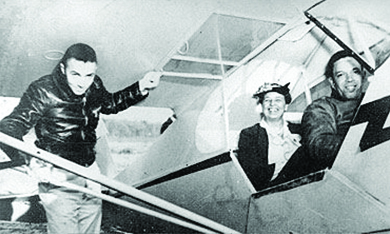
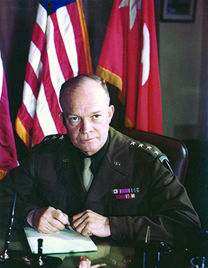
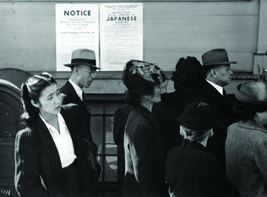

By the end of this section, you will be able to:
* Describe the steps taken by the United States to prepare for war
* Describe how the war changed employment patterns in the United States
* Discuss the contributions of civilians on the home front, especially women, to the war effort
* Analyze how the war affected race relations in the United States

The impact of the war on the United States was nowhere near as devastating as it was in Europe and the Pacific, where the battles were waged, but it still profoundly changed everyday life for all Americans. On the positive side, the war effort finally and definitively ended the economic depression that had been plaguing the country since 1929. It also called upon Americans to unite behind the war effort and give of their money, their time, and their effort, as they sacrificed at home to assure success abroad. The upheaval caused by white men leaving for war meant that for many disenfranchised groups, such as women and African Americans, there were new opportunities in employment and wage earning. Still, fear and racism drove cracks in the nation’s unified facade.

### MOBILIZING A NATION

Although the United States had sought to avoid armed conflict, the country was not entirely unprepared for war. Production of armaments had increased since 1939, when, as a result of Congress’s authorization of the Cash and Carry policy, contracts for weapons had begun to trickle into American factories. War production increased further following the passage of Lend Lease in 1941. However, when the United States entered the war, the majority of American factories were still engaged in civilian production, and many doubted that American businesses would be sufficiently motivated to convert their factories to wartime production.

Just a few years earlier, Roosevelt had been frustrated and impatient with business leaders when they failed to fully support the New Deal, but enlisting industrialists in the nation’s crusade was necessary if the United States was to produce enough armaments to win the war. To encourage cooperation, the government agreed to assume all costs of development and production, and also guarantee a profit on the sale of what was produced. This arrangement resulted in 233 to 350 percent increases in profits over what the same businesses had been able to achieve from 1937 to 1940. In terms of dollars earned, corporate profits rose from $6.4 billion in 1940 to nearly $11 billion in 1944. As the country switched to wartime production, the top one hundred U.S. corporations received approximately 70 percent of government contracts; big businesses prospered.

In addition to gearing up industry to fight the war, the country also needed to build an army. A peacetime draft, the first in American history, had been established in September 1940, but the initial draftees were to serve for only one year, a length of time that was later extended. Furthermore, Congress had specified that no more than 900,000 men could receive military training at any one time. By December 1941, the United States had only one division completely ready to be deployed. Military planners estimated that it might take nine million men to secure victory. A massive draft program was required to expand the nation’s military forces. Over the course of the war, approximately fifty million men registered for the draft; ten million were subsequently inducted into the service.

Approximately 2.5 million African Americans registered for the draft, and 1 million of them subsequently served. Initially, African American soldiers, who served in segregated units, had been used as support troops and not been sent into combat. By the end of the war, however, manpower needs resulted in African American recruits serving in the infantry and flying planes. The **Tuskegee Institute**{: data-type="term" .no-emphasis} in Alabama had instituted a civilian pilot training program for aspiring African American pilots. When the war began, the Department of War absorbed the program and adapted it to train combat pilots. First Lady Eleanor Roosevelt demonstrated both her commitment to African Americans and the war effort by visiting Tuskegee in 1941, shortly after the unit had been organized. To encourage the military to give the airmen a chance to serve in actual combat, she insisted on taking a ride in a plane flown by an African American pilot to demonstrate the Tuskegee Airmen’s skill ([\[link\]](#CNX_History_27_01_Eleanor)). When the Tuskegee Airmen did get their opportunity to serve in combat, they did so with distinction.

 {: #CNX_History_27_01_Eleanor}

In addition, forty-four thousand Native Americans served in all theaters of the war. In some of the Pacific campaigns, Native Americans made distinct and unique contributions to Allied victories. Navajo marines served in communications units, exchanging information over radios using codes based on their native language, which the Japanese were unable to comprehend or to crack. They became known as code talkers and participated in the battles of Guadalcanal, Iwo Jima, Peleliu, and Tarawa. A smaller number of Comanche code talkers performed a similar function in the European theater.

While millions of Americans heeded the rallying cry for patriotism and service, there were those who, for various reasons, did not accept the call. Before the war began, American Peace Mobilization had campaigned against American involvement in the European conflict as had the noninterventionist America First organization. Both groups ended their opposition, however, at the time of the German invasion of the Soviet Union and the Japanese attack on Pearl Harbor, respectively. Nevertheless, during the war, some seventy-two thousand men registered as **conscientious objectors**{: data-type="term"} (COs), and fifty-two thousand were granted that status. Of that fifty-two thousand, some accepted noncombat roles in the military, whereas others accepted unpaid work in civilian work camps. Many belonged to pacifist religious sects such as the Quakers or Mennonites. They were willing to serve their country, but they refused to kill. COs suffered public condemnation for disloyalty, and family members often turned against them. Strangers assaulted them. A portion of the town of Plymouth, NH, was destroyed by fire because the residents did not want to call upon the services of the COs trained as firemen at a nearby camp. Only a very small number of men evaded the draft completely.

Most Americans, however, were willing to serve, and they required a competent officer corps. The very same day that Germany invaded Poland in 1939, President Roosevelt promoted George C. Marshall, a veteran of World War I and an expert at training officers, from a one-star general to a four-star general, and gave him the responsibility of serving as Army Chief of Staff. The desire to create a command staff that could win the army’s confidence no doubt contributed to the rather meteoric rise of Dwight D. Eisenhower ([\[link\]](#CNX_History_27_01_Eisenhower)). During World War I, Eisenhower had been assigned to organize America’s new tank corps, and, although he never saw combat during the war, he demonstrated excellent organizational skills. When the United States entered World War II, Eisenhower was appointed commander of the General European Theater of Operations in June 1942.

 {: #CNX_History_27_01_Eisenhower}

General Eisenhower on Winning a War

Promoted to the level of one-star general just before the attack on Pearl Harbor, Dwight D. Eisenhower had never held an active command position above the level of a battalion and was not considered a potential commander of major military operations. However, after he was assigned to the General Staff in Washington, DC, he quickly rose through the ranks and, by late 1942, was appointed commander of the North African campaign.

Excerpts from General Eisenhower’s diary reveal his dedication to the war effort. He continued to work despite suffering a great personal loss.

<q>March 9, 1942* * *
{: data-type="newline"}

 General McNaughton (commanding Canadians in Britain) came to see me. He believes in attacking in Europe (thank God). He’s over here in an effort to speed up landing craft production and cargo ships. Has some d\\\_\\\_\\\_ good ideas. Sent him to see Somervell and Admiral Land. How I hope he can do something on landing craft.* * *
{: data-type="newline"}

 March 10, 1942* * *
{: data-type="newline"}

 Father dies this morning. Nothing I can do but send a wire.* * *
{: data-type="newline"}

 One thing that might help win this war is to get someone to shoot \[Admiral\] King. He’s the antithesis of cooperation, a deliberately rude person, which means he’s a mental bully. He became Commander in Chief of the fleet some time ago. Today he takes over, also Stark’s job as chief of naval operations. It’s a good thing to get rid of the double head in the navy, and of course Stark was just a nice old lady, but this fellow is going to cause a blow-up sooner or later, I’ll bet a cookie.* * *
{: data-type="newline"}

 Gradually some of the people with whom I have to deal are coming to agree with me that there are just three “musts” for the Allies this year: hold open the line to England and support her as necessary, keep Russia in the war as an active participant; hold the India-Middle East buttress between Japs and Germans. All this assumes the safety from major attack of North America, Hawaii, and Caribbean area.* * *
{: data-type="newline"}

 We lost eight cargo ships yesterday. That we must stop, because any effort we make depends upon sea communication.* * *
{: data-type="newline"}

 March 11, 1942* * *
{: data-type="newline"}

 I have felt terribly. I should like so much to be with my Mother these few days. But we’re at war. And war is not soft, it has no time to indulge even the deepest and most sacred emotions. I loved my Dad. I think my Mother the finest person I’ve ever known. She has been the inspiration for Dad’s life and a true helpmeet in every sense of the word.* * *
{: data-type="newline"}

 I’m quitting work now, 7:30 p.m. I haven’t the heart to go on tonight.* * *
{: data-type="newline"}

 —Dwight D. Eisenhower, *The Eisenhower Diaries*</q>

What does Eisenhower identify as the most important steps to take to win the war?

### EMPLOYMENT AND MIGRATION PATTERNS IN THE UNITED STATES

Even before the official beginning of the war, the country started to prepare. In August 1940, Congress created the Defense Plant Corporation, which had built 344 plants in the West by 1945, and had funneled over $1.8 billion into the economies of western states. After Pearl Harbor, as American military strategists began to plan counterattacks and campaigns against the Axis powers, California became a training ground. Troops trained there for tank warfare and amphibious assaults as well as desert campaigns—since the first assault against the Axis powers was planned for North Africa.

As thousands of Americans swarmed to the West Coast to take jobs in defense plants and shipyards, cities like Richmond, California, and nearby Oakland, expanded quickly. Richmond grew from a city of 20,000 people to 100,000 in only three years. Almost overnight, the population of California skyrocketed. African Americans moved out of the rural South into northern or West Coast cities to provide the muscle and skill to build the machines of war. Building on earlier waves of African American migration after the Civil War and during World War I, the demographics of the nation changed with the growing urbanization of the African American population. Women also relocated to either follow their husbands to military bases or take jobs in the defense industry, as the total mobilization of the national economy began to tap into previously underemployed populations.

Roosevelt and his administration already had experience in establishing government controls and taking the initiative in economic matters during the Depression. In April 1941, Roosevelt created the Office of Price Administration (OPA), and, once the United States entered the war, the OPA regulated prices and attempted to combat inflation. The OPA ultimately had the power to set ceiling prices for all goods, except agricultural commodities, and to ration a long list of items. During the war, major labor unions pledged not to strike in order to prevent disruptions in production; in return, the government encouraged businesses to recognize unions and promised to help workers bargain for better wages.

As in World War I, the government turned to bond drives to finance the war. Millions of Americans purchased more than $185 billion worth of war bonds. Children purchased **Victory Stamps**{: data-type="term" .no-emphasis} and exchanged full stamp booklets for bonds. The federal government also instituted the current tax-withholding system to ensure collection of taxes. Finally, the government once again urged Americans to plant victory gardens, using marketing campaigns and celebrities to promote the idea ([\[link\]](#CNX_History_27_02_VictoryGar)). Americans responded eagerly, planting gardens in their backyards and vacant lots.

 {: #CNX_History_27_02_VictoryGar}

The federal government also instituted rationing to ensure that America’s fighting men were well fed. Civilians were issued ration booklets, books of coupons that enabled them to buy limited amounts of meat, coffee, butter, sugar, and other foods. Wartime cookbooks were produced, such as the Betty Crocker cookbook *Your Share*, telling housewives how to prepare tasty meals without scarce food items. Other items were rationed as well, including shoes, liquor, cigarettes, and gasoline. With a few exceptions, such as doctors, Americans were allowed to drive their automobiles only on certain days of the week. Most Americans complied with these regulations, but some illegally bought and sold rationed goods on the black market.

  
View an excerpt from a [PBS documentary on rationing][1] during World War II.

Civilians on the home front also recycled, conserved, and participated in scrap drives to collect items needed for the production of war materiel. Housewives saved cooking fats, needed to produce explosives. Children collected scrap metal, paper, rubber, silk, nylon, and old rags. Some children sacrificed beloved metal toys in order to “win the war.” Civilian volunteers, trained to recognize enemy aircraft, watched the skies along the coasts and on the borders.

### WOMEN IN THE WAR: ROSIE THE RIVETER AND BEYOND

As in the previous war, the gap in the labor force created by departing soldiers meant opportunities for women. In particular, World War II led many to take jobs in defense plants and factories around the country. For many women, these jobs provided unprecedented opportunities to move into occupations previously thought of as exclusive to men, especially the aircraft industry, where a majority of workers were composed of women by 1943. Most women in the labor force did not work in the defense industry, however. The majority took over other factory jobs that had been held by men. Many took positions in offices as well. As white women, many of whom had been in the workforce before the war, moved into these more highly paid positions, African American women, most of whom had previously been limited to domestic service, took over white women’s lower-paying positions in factories; some were also hired by defense plants, however. Although women often earned more money than ever before, it was still far less than men received for doing the same jobs. Nevertheless, many achieved a degree of financial self-reliance that was enticing. By 1944, as many as 33 percent of the women working in the defense industries were mothers and worked “double-day” shifts—one at the plant and one at home.

Still, there was some resistance to women going to work in such a male-dominated environment. In order to recruit women for factory jobs, the government created a propaganda campaign centered on a now-iconic figure known as **Rosie the Riveter**{: data-type="term"} ([\[link\]](#CNX_History_27_02_Riveter)). Rosie, who was a composite based on several real women, was most famously depicted by American illustrator Norman Rockwell. Rosie was tough yet feminine. To reassure men that the demands of war would not make women too masculine, some factories gave female employees lessons in how to apply makeup, and cosmetics were never rationed during the war. Elizabeth Arden even created a special red lipstick for use by women reservists in the Marine Corps.

 , and Anna Bland, a worker at the Richmond Shipyards (b)."){: #CNX_History_27_02_Riveter}

Although many saw the entry of women into the workforce as a positive thing, they also acknowledged that working women, especially mothers, faced great challenges. To try to address the dual role of women as workers and mothers, Eleanor Roosevelt urged her husband to approve the first U.S. government childcare facilities under the Community Facilities Act of 1942. Eventually, seven centers, servicing 105,000 children, were built. The First Lady also urged industry leaders like Henry Kaiser to build model childcare facilities for their workers. Still, these efforts did not meet the full need for childcare for working mothers.

The lack of childcare facilities meant that many children had to fend for themselves after school, and some had to assume responsibility for housework and the care of younger siblings. Some mothers took younger children to work with them and left them locked in their cars during the workday. Police and social workers also reported an increase in juvenile delinquency during the war. New York City saw its average number of juvenile cases balloon from 9,500 in the prewar years to 11,200 during the war. In San Diego, delinquency rates for girls, including sexual misbehavior, shot up by 355 percent. It is unclear whether more juveniles were actually engaging in delinquent behavior; the police may simply have become more vigilant during wartime and arrested youngsters for activities that would have gone overlooked before the war. In any event, law enforcement and juvenile courts attributed the perceived increase to a lack of supervision by working mothers.

Tens of thousands of women served in the war effort more directly. Approximately 350,000 joined the military. They worked as nurses, drove trucks, repaired airplanes, and performed clerical work to free up men for combat. Those who joined the Women’s Airforce Service Pilots (WASPs) flew planes from the factories to military bases. Some of these women were killed in combat and captured as prisoners of war. Over sixteen hundred of the women nurses received various decorations for courage under fire. Many women also flocked to work in a variety of civil service jobs. Others worked as chemists and engineers, developing weapons for the war. This included thousands of women who were recruited to work on the Manhattan Project, developing the atomic bomb.

### THE CULTURE OF WAR: ENTERTAINERS AND THE WAR EFFORT

During the Great Depression, movies had served as a welcome diversion from the difficulties of everyday life, and during the war, this held still truer. By 1941, there were more movie theaters than banks in the United States. In the 1930s, newsreels, which were shown in movie theaters before feature films, had informed the American public of what was happening elsewhere in the world. This interest grew once American armies began to engage the enemy. Many informational documentaries about the war were also shown in movie theaters. The most famous were those in the *Why We Fight* series, filmed by Hollywood director Frank Capra. During the war, Americans flocked to the movies not only to learn what was happening to the troops overseas but also to be distracted from the fears and hardships of wartime by cartoons, dramas, and comedies. By 1945, movie attendance had reached an all-time high.

  
This link shows [newsreel footage of a raid][2] on Tarawa Island. This footage was shown in movie theaters around the country.

Many feature films were patriotic stories that showed the day’s biggest stars as soldiers fighting the nefarious German and Japanese enemy. During the war years, there was a consistent supply of patriotic movies, with actors glorifying and inspiring America’s fighting men. John Wayne, who had become a star in the 1930s, appeared in many war-themed movies, including *The Fighting Seabees* and *Back to Bataan*.

Besides appearing in patriotic movies, many male entertainers temporarily gave up their careers to serve in the armed forces ([\[link\]](#CNX_History_27_02_Medals)). Jimmy Stewart served in the Army Air Force and appeared in a short film entitled *Winning Your Wings* that encouraged young men to enlist. Tyrone Power joined the U.S. Marines. Female entertainers did their part as well. Rita Hayworth and Marlene Dietrich entertained the troops. African American singer and dancer Josephine Baker entertained Allied troops in North Africa and also carried secret messages for the French Resistance. Actress Carole Lombard was killed in a plane crash while returning home from a rally where she had sold war bonds.

 , in recognition of the important contribution that Capra&#x2019;s films made to the war effort. Jimmy Stewart was awarded numerous commendations for his military service, including the French Croix de Guerre (b)."){: #CNX_History_27_02_Medals}

The Meaning of Democracy

E. B. White was one of the most famous writers of the twentieth century. During the 1940s, he was known for the articles that he contributed to *The New Yorker* and the column that he wrote for *Harper’s Magazine*. Today, he is remembered for his children’s books *Stuart Little* and *Charlotte’s Web*, and for his collaboration with William Strunk, Jr., *The Elements of Style*, a guide to writing. In 1943, he wrote a definition of democracy as an example of what Americans hoped that they were fighting for.

<q>We received a letter from the Writer’s War Board the other day asking for a statement on ‘The Meaning of Democracy.’ It presumably is our duty to comply with such a request, and it is certainly our pleasure. Surely the Board knows what democracy is. It is the line that forms on the right. It is the ‘don’t’ in don’t shove. It is the hole in the stuffed shirt through which the sawdust slowly trickles; it is the dent in the high hat. Democracy is the recurrent suspicion that more than half of the people are right more than half of the time. It is the feeling of privacy in the voting booths, the feeling of communion in the libraries, the feeling of vitality everywhere. Democracy is a letter to the editor. Democracy is the score at the beginning of the ninth. It is an idea that hasn’t been disproved yet, a song the words of which have not gone bad. It is the mustard on the hot dog and the cream in the rationed coffee. Democracy is a request from a War Board, in the middle of the morning in the middle of a war, wanting to know what democracy is.</q>

Do you agree with this definition of democracy? Would you change anything to make it more contemporary?

### SOCIAL TENSIONS ON THE HOME FRONT

The need for Americans to come together, whether in Hollywood, the defense industries, or the military, to support the war effort encouraged feelings of unity among the American population. However, the desire for unity did not always mean that Americans of color were treated as equals or even tolerated, despite their proclamations of patriotism and their willingness to join in the effort to defeat America’s enemies in Europe and Asia. For African Americans, Mexican Americans, and especially for Japanese Americans, feelings of patriotism and willingness to serve one’s country both at home and abroad was not enough to guarantee equal treatment by white Americans or to prevent the U.S. government from regarding them as the enemy.

#### African Americans and Double V

The African American community had, at the outset of the war, forged some promising relationships with the Roosevelt administration through civil rights activist Mary McLeod Bethune and Roosevelt’s “Black Cabinet” of African American advisors. Through the intervention of Eleanor Roosevelt, Bethune was appointed to the advisory council set up by the War Department Women’s Interest Section. In this position, Bethune was able to organize the first officer candidate school for women and enable African American women to become officers in the Women’s Auxiliary Corps.

As the U.S. economy revived as a result of government defense contracts, African Americans wanted to ensure that their service to the country earned them better opportunities and more equal treatment. Accordingly, in 1942, after African American labor leader A. Philip Randolph pressured Roosevelt with a threatened “March on Washington,” the president created, by Executive Order 8802, the Fair Employment Practices Committee. The purpose of this committee was to see that there was no discrimination in the defense industries. While they were effective in forcing defense contractors, such as the DuPont Corporation, to hire African Americans, they were not able to force corporations to place African Americans in well-paid positions. For example, at DuPont’s plutonium production plant in Hanford, Washington, African Americans were hired as low-paid construction workers but not as laboratory technicians.

During the war, the Congress of Racial Equality (CORE), founded by James Farmer in 1942, used peaceful civil disobedience in the form of sit-ins to desegregate certain public spaces in Washington, DC, and elsewhere, as its contribution to the war effort. Members of CORE sought support for their movement by stating that one of their goals was to deprive the enemy of the ability to generate anti-American propaganda by accusing the United States of racism. After all, they argued, if the United States were going to denounce Germany and Japan for abusing human rights, the country should itself be as exemplary as possible. Indeed, CORE’s actions were in keeping with the goals of the **Double V campaign**{: data-type="term"} that was begun in 1942 by the *Pittsburgh Courier*, the largest African American newspaper at the time ([\[link\]](#CNX_History_27_02_DoubleV)). The campaign called upon African Americans to accomplish the two “Vs”: victory over America’s foreign enemies and victory over racism in the United States.

 ![A photograph shows five black men and a black woman participating in the Double V campaign. A young man sits at a typewriter, and the woman hands a man a pamphlet, the cover of which reads &#x201C;This is a \[Double V insignia\] Home.&#x201D; All wear armbands.](../resources/CNX_History_27_02_DoubleV.jpg "During World War II, African Americans volunteered for government work just as white Americans did. These Washington, DC, residents have become civil defense workers as part of the Double V campaign that called for victory at home and abroad."){: #CNX_History_27_02_DoubleV}

Despite the willingness of African Americans to fight for the United States, racial tensions often erupted in violence, as the geographic relocation necessitated by the war brought African Americans into closer contact with whites. There were race riots in Detroit, Harlem, and Beaumont, Texas, in which white residents responded with sometimes deadly violence to their new black coworkers or neighbors. There were also racial incidents at or near several military bases in the South. Incidents of African American soldiers being harassed or assaulted occurred at Fort Benning, Georgia; Fort Jackson, South Carolina; Alexandria, Louisiana; Fayetteville, Arkansas; and Tampa, Florida. African American leaders such as James Farmer and Walter White, the executive secretary of the NAACP since 1931, were asked by General Eisenhower to investigate complaints of the mistreatment of African American servicemen while on active duty. They prepared a fourteen-point memorandum on how to improve conditions for African Americans in the service, sowing some of the seeds of the postwar civil rights movement during the war years.

#### The Zoot Suit Riots

Mexican Americans also encountered racial prejudice. The Mexican American population in Southern California grew during World War II due to the increased use of Mexican agricultural workers in the fields to replace the white workers who had left for better paying jobs in the defense industries. The United States and Mexican governments instituted the “bracero” program on August 4, 1942, which sought to address the needs of California growers for manual labor to increase food production during wartime. The result was the immigration of thousands of impoverished Mexicans into the United States to work as *braceros*, or manual laborers.

Forced by racial discrimination to live in the barrios of East Los Angeles, many Mexican American youths sought to create their own identity and began to adopt a distinctive style of dress known as **zoot suits**{: data-type="term"}, which were also popular among many young African American men. The zoot suits, which required large amounts of cloth to produce, violated wartime regulations that restricted the amount of cloth that could be used in civilian garments. Among the charges leveled at young Mexican Americans was that they were un-American and unpatriotic; wearing zoot suits was seen as evidence of this. Many native-born Americans also denounced Mexican American men for being unwilling to serve in the military, even though some 350,000 Mexican Americans either volunteered to serve or were drafted into the armed services. In the summer of 1943, “zoot-suit riots” occurred in Los Angeles when carloads of white sailors, encouraged by other white civilians, stripped and beat a group of young men wearing the distinctive form of dress. In retaliation, young Mexican American men attacked and beat up sailors. The response was swift and severe, as sailors and civilians went on a spree attacking young Mexican Americans on the streets, in bars, and in movie theaters. More than one hundred people were injured.

#### Internment

Japanese Americans also suffered from discrimination. The Japanese attack on Pearl Harbor unleashed a cascade of racist assumptions about Japanese immigrants and Japanese Americans in the United States that culminated in the relocation and **internment**{: data-type="term"} of 120,000 people of Japanese ancestry, 66 percent of whom had been born in the United States. **Executive Order 9066**{: data-type="term"}, signed by Roosevelt on February 19, 1942, gave the army power to remove people from “military areas” to prevent sabotage or espionage. The army then used this authority to relocate people of Japanese ancestry living along the Pacific coast of Washington, Oregon, and California, as well as in parts of Arizona, to internment camps in the American interior. Although a study commissioned earlier by Roosevelt indicated that there was little danger of disloyalty on the part of West Coast Japanese, fears of sabotage, perhaps spurred by the attempted rescue of a Japanese airman shot down at Pearl Harbor by Japanese living in Hawaii, and racist sentiments led Roosevelt to act. Ironically, Japanese in Hawaii were not interned. Although characterized afterwards as America’s worst wartime mistake by Eugene V. Rostow in the September 1945 edition of *Harper’s Magazine*, the government’s actions were in keeping with decades of anti-Asian sentiment on the West Coast.

After the order went into effect, Lt. General John L. DeWitt, in charge of the Western Defense command, ordered approximately 127,000 Japanese and Japanese Americans—roughly 90 percent of those of Japanese ethnicity living in the United States—to assembly centers where they were transferred to hastily prepared camps in the interior of California, Arizona, Colorado, Utah, Idaho, Wyoming, and Arkansas ([\[link\]](#CNX_History_27_02_Relocation)). Those who were sent to the camps reported that the experience was deeply traumatic. Families were sometimes separated. People could only bring a few of their belongings and had to abandon the rest of their possessions. The camps themselves were dismal and overcrowded. Despite the hardships, the Japanese attempted to build communities in the camps and resume “normal” life. Adults participated in camp government and worked at a variety of jobs. Children attended school, played basketball against local teams, and organized Boy Scout units. Nevertheless, they were imprisoned, and minor infractions, such as wandering too near the camp gate or barbed wire fences while on an evening stroll, could meet with severe consequences. Some sixteen thousand Germans, including some from Latin America, and German Americans were also placed in internment camps, as were 2,373 persons of Italian ancestry. However, unlike the case with Japanese Americans, they represented only a tiny percentage of the members of these ethnic groups living in the country. Most of these people were innocent of any wrongdoing, but some Germans were members of the Nazi party. No interned Japanese Americans were found guilty of sabotage or espionage.

 {: #CNX_History_27_02_Relocation}

Despite being singled out for special treatment, many Japanese Americans sought to enlist, but draft boards commonly classified them as 4-C: undesirable aliens. However, as the war ground on, some were reclassified as eligible for service. In total, nearly thirty-three thousand Japanese Americans served in the military during the war. Of particular note was the 442nd Regimental Combat Team, nicknamed the “Go For Broke,” which finished the war as the most decorated unit in U.S. military history given its size and length of service. While their successes, and the successes of the African American pilots, were lauded, the country and the military still struggled to contend with its own racial tensions, even as the soldiers in Europe faced the brutality of Nazi Germany.

  
This U.S. government [propaganda film][2] attempts to explain why the Japanese were interned.

### Section Summary

The brunt of the war’s damage occurred far from United States soil, but Americans at home were still greatly affected by the war. Women struggled to care for children with scarce resources at their disposal and sometimes while working full time. Economically, the country surged forward, but strict rationing for the war effort meant that Americans still went without. New employment opportunities opened up for women and ethnic minorities, as white men enlisted or were drafted. These new opportunities were positive for those who benefited from them, but they also created new anxieties among white men about racial and gender equality. Race riots took place across the country, and Americans of Japanese ancestry were relocated to internment camps. Still, there was an overwhelming sense of patriotism in the country, which was reflected in the culture of the day.

### Review Questions

During World War II, unionized workers agreed \_\_\_\_\_\_\_\_.

1.  to work without pay
2.  to go without vacations or days off
3.  to live near the factories to save time commuting
4.  to keep production going by not striking
{: type="A"}

D

The program to recruit Mexican agricultural workers during World War II was the \_\_\_\_\_\_\_\_.

1.  bracero program
2.  maquiladora program
3.  brazzos program
4.  campesino program
{: type="A"}

A

What were American women’s contributions to the war effort?

Many American women joined the armed forces, where they served as nurses, repaired and piloted airplanes, drove trucks, and performed clerical duties. Women in civilian life assumed occupations, often in the defense industries, that would have gone to men in times of peace. Women who did not take on wartime employment also contributed by recycling scarce materials, buying war bonds, planning meals using rationed foods, and generally making do with less.

### Glossary
{: data-type="glossary-title"}

conscientious objectors
: those who, for religious or philosophical reasons, refuse to serve in the armed forces
^

Double Vcampaign
: a campaign by African Americans to win victory over the enemy overseas and victory over racism at home
^

Executive Order 9066
: the order given by President Roosevelt to relocate and detain people of Japanese ancestry, including those who were American citizens
^

internment
: the forced incarceration of the West Coast Japanese and Japanese American population into ten relocation centers for the greater part of World War II
^

Rosie the Riveter
: a symbol of female workers in the defense industries
^

zoot suit
: a flamboyant outfit favored by young African American and Mexican American men

[1]: http://openstaxcollege.org/l/15Rationing
[2]: http://openstaxcollege.org/l/15Tarawa
