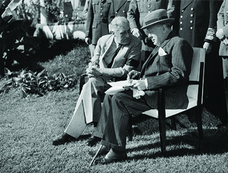

By the end of this section, you will be able to:
* Identify the major battles of the European theater
* Analyze the goals and results of the major wartime summit meetings

Despite the fact that a Japanese attack in the Pacific was the tripwire for America’s entrance into the war, Roosevelt had been concerned about Great Britain since the beginning of the Battle of Britain. Roosevelt viewed Germany as the greater threat to freedom. Hence, he leaned towards a “Europe First” strategy, even before the United States became an active belligerent. That meant that the United States would concentrate the majority of its resources and energies in achieving a victory over Germany first and then focus on defeating Japan. Within Europe, Churchill and Roosevelt were committed to saving Britain and acted with this goal in mind, often ignoring the needs of the Soviet Union. As Roosevelt imagined an “empire-free” postwar world, in keeping with the goals of the Atlantic Charter, he could also envision the United States becoming the preeminent world power economically, politically, and militarily.

### WARTIME DIPLOMACY

Franklin Roosevelt entered World War II with an eye toward a new postwar world, one where the United States would succeed Britain as the leader of Western capitalist democracies, replacing the old British imperial system with one based on free trade and decolonization. The goals of the Atlantic Charter had explicitly included self-determination, self-government, and free trade. In 1941, although Roosevelt had yet to meet Soviet premier Joseph Stalin, he had confidence that he could forge a positive relationship with him, a confidence that Churchill believed was born of naiveté. These allied leaders, known as the **Big Three**{: data-type="term"}, thrown together by the necessity to defeat common enemies, took steps towards working in concert despite their differences.

Through a series of wartime conferences, Roosevelt and the other global leaders sought to come up with a strategy to both defeat the Germans and bolster relationships among allies. In January 1943, at Casablanca, Morocco, Churchill convinced Roosevelt to delay an invasion of France in favor of an invasion of Sicily ([\[link\]](#CNX_History_27_03_Morocco)). It was also at this conference that Roosevelt enunciated the doctrine of “unconditional surrender.” Roosevelt agreed to demand an unconditional surrender from Germany and Japan to assure the Soviet Union that the United States would not negotiate a separate peace and prepare the former belligerents for a thorough and permanent transformation after the war. Roosevelt thought that announcing this as a specific war aim would discourage any nation or leader from seeking any negotiated armistice that would hinder efforts to reform and transform the defeated nations. Stalin, who was not at the conference, affirmed the concept of unconditional surrender when asked to do so. However, he was dismayed over the delay in establishing a “second front” along which the Americans and British would directly engage German forces in western Europe. A western front, brought about through an invasion across the English Channel, which Stalin had been demanding since 1941, offered the best means of drawing Germany away from the east. At a meeting in Tehran, Iran, also in November 1943, Churchill, Roosevelt, and Stalin met to finalize plans for a cross-channel invasion.

 {: #CNX_History_27_03_Morocco}

### THE INVASION OF EUROPE

Preparing to engage the Nazis in Europe, the United States landed in North Africa in 1942. The Axis campaigns in North Africa had begun when Italy declared war on England in June 1940, and British forces had invaded the Italian colony of Libya. The Italians had responded with a counteroffensive that penetrated into Egypt, only to be defeated by the British again. In response, Hitler dispatched the Afrika Korps under General Erwin Rommel, and the outcome of the situation was in doubt until shortly before American forces joined the British.

Although the Allied campaign secured control of the southern Mediterranean and preserved Egypt and the Suez Canal for the British, Stalin and the Soviets were still engaging hundreds of German divisions in bitter struggles at Stalingrad and Leningrad. The invasion of North Africa did nothing to draw German troops away from the Soviet Union. An invasion of Europe by way of Italy, which is what the British and American campaign in North Africa laid the ground for, pulled a few German divisions away from their Russian targets. But while Stalin urged his allies to invade France, British and American troops pursued the defeat of Mussolini’s Italy. This choice greatly frustrated Stalin, who felt that British interests were taking precedence over the agony that the Soviet Union was enduring at the hands of the invading German army. However, Churchill saw Italy as the vulnerable underbelly of Europe and believed that Italian support for Mussolini was waning, suggesting that victory there might be relatively easy. Moreover, Churchill pointed out that if Italy were taken out of the war, then the Allies would control the Mediterranean, offering the Allies easier shipping access to both the Soviet Union and the British Far Eastern colonies.

#### D-Day

A direct assault on Nazi Germany’s “Fortress Europe” was still necessary for final victory. On June 6, 1944, the second front became a reality when Allied forces stormed the beaches of northern France on **D-day**{: data-type="term"}. Beginning at 6:30 a.m., some twenty-four thousand British, Canadian, and American troops waded ashore along a fifty-mile piece of the Normandy coast ([\[link\]](#CNX_History_27_03_DDay)). Well over a million troops would follow their lead. German forces on the hills and cliffs above shot at them, and once they reached the beach, they encountered barbed wire and land mines. More than ten thousand Allied soldiers were wounded or killed during the assault. Following the establishment of beachheads at Normandy, it took months of difficult fighting before Paris was liberated on August 20, 1944. The invasion did succeed in diverting German forces from the eastern front to the western front, relieving some of the pressure on Stalin’s troops. By that time, however, Russian forces had already defeated the German army at Stalingrad, an event that many consider the turning point of the war in Europe, and begun to push the Germans out of the Soviet Union.

 {: #CNX_History_27_03_DDay}

Nazi Germany was not ready to surrender, however. On December 16, in a surprise move, the Germans threw nearly a quarter-million men at the Western Allies in an attempt to divide their armies and encircle major elements of the American forces. The struggle, known as the Battle of the Bulge, raged until the end of January. Some ninety thousand Americans were killed, wounded, or lost in action. Nevertheless, the Germans were turned back, and Hitler’s forces were so spent that they could never again mount offensive operations.

#### Confronting the Holocaust

The Holocaust, Hitler’s plan to kill the Jews of Europe, had begun as early as 1933, with the construction of Dachau, the first of more than forty thousand camps for incarcerating Jews, submitting them to forced labor, or exterminating them. Eventually, six extermination camps were established between 1941 and 1945 in Polish territory. Jewish men, women, and children from throughout Europe were transported to these camps in Germany and other areas under Nazi control. Although the majority of the people in the camps were Jews, the Nazis sent Roma (gypsies), gays and lesbians, Jehovah’s Witnesses, and political opponents to the camps as well. Some prisoners were put to work at hard labor; many of them subsequently died of disease or starvation. Most of those sent to the extermination camps were killed upon arrival with poisoned gas. Ultimately, some eleven million people died in the camps. As Soviet troops began to advance from the east and U.S. forces from the west, camp guards attempted to hide the evidence of their crimes by destroying records and camp buildings, and marching surviving prisoners away from the sites ([\[link\]](#CNX_History_27_03_Buchenwald)).

 {: #CNX_History_27_03_Buchenwald}

Felix L. Sparks on the Liberation of Dachau

The horrors of the concentration camps remained with the soldiers who liberated them long after the war had ended. Below is an excerpt of the recollection of one soldier.

<q>Our first experience with the camp came as a traumatic shock. The first evidence of the horrors to come was a string of forty railway cars on a railway spur leading into the camp. Each car was filled with emaciated human corpses, both men and women. A hasty search by the stunned infantry soldiers revealed no signs of life among the hundreds of still bodies, over two thousand in all.* * *
{: data-type="newline"}

 It was in this atmosphere of human depravity, degradation and death that the soldiers of my battalion then entered the camp itself. Almost all of the SS command guarding the camp had fled before our arrival, leaving behind about two hundred lower ranking members of the command. There was some sporadic firing of weapons. As we approached the confinement area, the scene numbed my senses. Dante’s Inferno seemed pale compared to the real hell of Dachau. A row of small cement structures near the prison entrance contained a coal-fired crematorium, a gas chamber, and rooms piled high with naked and emaciated corpses. As I turned to look over the prison yard with un-believing eyes, I saw a large number of dead inmates lying where they has fallen in the last few hours or days before our arrival. Since all of the bodies were in various stages of decomposition, the stench of death was overpowering. The men of the 45th Infantry Division were hardened combat veterans. We had been in combat almost two years at that point. While we were accustomed to death, we were not able to comprehend the type of death that we encountered at Dachau.* * *
{: data-type="newline"}

 —Felix L. Sparks, remarks at the U.S. Holocaust Museum, May 8, 1995</q>

  
Listen to the [accounts of Holocaust survivors][1] by clicking on “Listen Now” below the name of the person whose story you wish to hear.

### YALTA AND PREPARING FOR VICTORY

The last time the Big Three met was in early February 1945 at Yalta in the Soviet Union. Roosevelt was sick, and Stalin’s armies were pushing the German army back towards Berlin from the east. Churchill and Roosevelt thus had to accept a number of compromises that strengthened Stalin’s position in eastern Europe. In particular, they agreed to allow the Communist government installed by the Soviet Union in Poland to remain in power until free elections took place. For his part, Stalin reaffirmed his commitment, first voiced at Tehran, to enter the war against Japan following the surrender of Germany ([\[link\]](#CNX_History_27_03_Yalta)). He also agreed that the Soviet Union would participate in the United Nations, a new peacekeeping body intended to replace the League of Nations. The Big Three left Yalta with many details remaining unclear, planning to finalize plans for the treatment of Germany and the shape of postwar Europe at a later conference. However, Roosevelt did not live to attend the next meeting. He died on April 12, 1945, and Harry S. Truman became president.

 {: #CNX_History_27_03_Yalta}

By April 1945, Soviet forces had reached Berlin, and both the U.S. and British Allies were pushing up against Germany’s last defenses in the western part of the nation. Hitler committed suicide on April 30, 1945. On May 8, 1945, Germany surrendered. The war in Europe was over, and the Allies and liberated regions celebrated the end of the long ordeal. Germany was thoroughly defeated; its industries and cities were badly damaged.

The victorious Allies set about determining what to do to rebuild Europe at the Potsdam Summit Conference in July 1945. Attending the conference were Stalin, Truman, and Churchill, now the outgoing prime minister, as well as the new British prime minister, Clement Atlee. Plans to divide Germany and Austria, and their capital cities, into four zones—to be occupied by the British, French, Americans, and Soviets—a subject discussed at Yalta, were finalized. In addition, the Allies agreed to dismantle Germany’s heavy industry in order to make it impossible for the country to produce more armaments.

### Section Summary

Upon entering the war, President Roosevelt believed that the greatest threat to the long-term survival of democracy and freedom would be a German victory. Hence, he entered into an alliance with British prime minister Winston Churchill and Soviet premier Joseph Stalin to defeat the common enemy while also seeking to lay the foundation for a peaceful postwar world in which the United States would play a major and permanent role. Appeasement and nonintervention had been proven to be shortsighted and tragic policies that failed to provide security and peace either for the United States or for the world.

With the aid of the British, the United States invaded North Africa and from there invaded Europe by way of Italy. However, the cross-channel invasion of Europe through France that Stalin had long called for did not come until 1944, by which time the Soviets had turned the tide of battle in eastern Europe. The liberation of Hitler’s concentration camps forced Allied nations to confront the grisly horrors that had been taking place as the war unfolded. The Big Three met for one last time in February 1945, at Yalta, where Churchill and Roosevelt agreed to several conditions that strengthened Stalin’s position. They planned to finalize their plans at a later conference, but Roosevelt died two months later.

### Review Questions

Which of the following demands did the Soviet Union make of Britain and the United States?

1.  the right to try all Nazi war criminals in the Soviet Union
2.  the invasion of North Africa to help the Soviet Union’s ally Iraq
3.  the invasion of western Europe to draw German forces away from the Soviet Union
4.  the right to place Communist Party leaders in charge of the German government
{: type="A"}

C

What did Roosevelt mean to achieve with his demand for Germany and Japan’s unconditional surrender?

Roosevelt believed that his demand for an unconditional surrender from Germany and Japan would serve several purposes: It would provide reassurance to the Soviet Union of the nation’s loyalty, prepare the Axis nations for a complete postwar transformation, and prevent any other nations from engaging in negotiations that would undermine the Big Three’s plans for the defeated belligerents.

What were the phases of the Holocaust?

The first prison camps for Jews and other “enemies” of the Nazis were built in Germany in 1933. Following the invasion of eastern Europe, more camps, including extermination camps, were built in areas conquered by the Nazis. People, primarily Jews, were shipped to these camps from throughout Nazi-controlled Europe.

### Glossary
{: data-type="glossary-title"}

Big Three
: the nickname given to the leaders of the three major Allied nations: Winston Churchill, Franklin Roosevelt, and Joseph Stalin
^

D-day
: June 6, 1944, the date of the invasion of Normandy, France, by British, Canadian, and American forces, which opened a second front in Europe

[1]: http://openstax.org/l/15Holocaust
