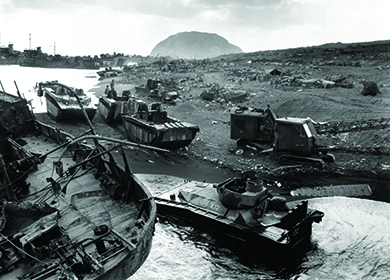

By the end of this section, you will be able to:
* Discuss the strategy employed against the Japanese and some of the significant battles of the Pacific campaign
* Describe the effects of the atomic bombs on Hiroshima and Nagasaki
* Analyze the decision to drop atomic bombs on Japan

Japanese forces won a series of early victories against Allied forces from December 1941 to May 1942. They seized Guam and Wake Island from the United States, and streamed through Malaysia and Thailand into the Philippines and through the Dutch East Indies. By February 1942, they were threatening Australia. The Allies turned the tide in May and June 1942, at the Battle of Coral Sea and the Battle of Midway. The Battle of Midway witnessed the first Japanese naval defeat since the nineteenth century. Shortly after the American victory, U.S. forces invaded Guadalcanal and New Guinea. Slowly, throughout 1943, the United States engaged in a campaign of “island hopping,” gradually moving across the Pacific to Japan. In 1944, the United States, seized Saipan and won the Battle of the Philippine Sea. Progressively, American forces drew closer to the strategically important targets of Iwo Jima and Okinawa.

### THE PACIFIC CAMPAIGN

During the 1930s, Americans had caught glimpses of Japanese armies in action and grew increasingly sympathetic towards war-torn China. Stories of Japanese atrocities bordering on genocide and the shock of the attack on Pearl Harbor intensified racial animosity toward the Japanese. Wartime propaganda portrayed Japanese soldiers as uncivilized and barbaric, sometimes even inhuman ([\[link\]](#CNX_History_27_04_JapanProp)), unlike America’s German foes. Admiral William Halsey spoke for many Americans when he urged them to “Kill Japs! Kill Japs! Kill more Japs!” Stories of the dispiriting defeats at Bataan and the Japanese capture of the Philippines at Corregidor in 1942 revealed the Japanese cruelty and mistreatment of Americans. The “Bataan Death March,” during which as many as 650 American and 10,000 Filipino prisoners of war died, intensified anti-Japanese feelings. **Kamikaze**{: data-type="term" .no-emphasis} attacks that took place towards the end of the war were regarded as proof of the irrationality of Japanese martial values and mindless loyalty to Emperor Hirohito.

 ![Poster (a) depicts a mouse, heavily caricatured to appear Japanese, crawling toward a mousetrap that sits atop a land mass shaped like Alaska. The trap is labeled &#x201C;Army / Civilian / Navy,&#x201D; and the text beneath reads &#x201C;Alaska / Death-Trap for the Jap.&#x201D; Poster (b) depicts a heavily caricatured Japanese military official with a nude white woman thrown helplessly over one shoulder; a massive fire rages in the background, where hanging bodies are also visible. The text reads &#x201C;This is the Enemy.&#x201D;](../resources/CNX_History_27_04_JapanProp.jpg "Anti-Japanese propaganda often portrayed the Japanese as inhuman (a). In addition to emphasizing the supposed apish features of the Japanese (b), this poster depicts the victim as a white woman, undoubtedly to increase American horror even more."){: #CNX_History_27_04_JapanProp}

Despite the Allies’ Europe First strategy, American forces took the resources that they could assemble and swung into action as quickly as they could to blunt the Japanese advance. Infuriated by stories of defeat at the hands of the allegedly racially inferior Japanese, many high-ranking American military leaders demanded that greater attention be paid to the Pacific campaign. Rather than simply wait for the invasion of France to begin, naval and army officers such as General Douglas MacArthur argued that American resources should be deployed in the Pacific to reclaim territory seized by Japan.

In the Pacific, MacArthur and the Allied forces pursued an island hopping strategy that bypassed certain island strongholds held by the Japanese that were of little or no strategic value. By seizing locations from which Japanese communications and transportation routes could be disrupted or destroyed, the Allies advanced towards Japan without engaging the thousands of Japanese stationed on garrisoned islands. The goal was to advance American air strength close enough to Japan proper to achieve air superiority over the home islands; the nation could then be bombed into submission or at least weakened in preparation for an amphibious assault. By February 1945, American forces had reached the island of Iwo Jima ([\[link\]](#CNX_History_27_04_IwoJima)). Iwo Jima was originally meant to serve as a forward air base for fighter planes, providing cover for long-distance bombing raids on Japan. Two months later, an even larger engagement, the hardest fought and bloodiest battle of the Pacific theater, took place as American forces invaded Okinawa. The battle raged from April 1945 well into July 1945; the island was finally secured at the cost of seventeen thousand American soldiers killed and thirty-six thousand wounded. Japanese forces lost over 100,000 troops. Perhaps as many as 150,000 civilians perished as well.

 {: #CNX_History_27_04_IwoJima}

### DROPPING THE ATOMIC BOMB

All belligerents in World War II sought to develop powerful and devastating weaponry. As early as 1939, German scientists had discovered how to split uranium atoms, the technology that would ultimately allow for the creation of the atomic bomb. Albert Einstein, who had emigrated to the United States in 1933 to escape the Nazis, urged President Roosevelt to launch an American atomic research project, and Roosevelt agreed to do so, with reservations. In late 1941, the program received its code name: the **Manhattan Project**{: data-type="term"}. Located at Los Alamos, New Mexico, the Manhattan Project ultimately employed 150,000 people and cost some $2 billion. In July 1945, the project’s scientists successfully tested the first atomic bomb.

In the spring of 1945, the military began to prepare for the possible use of an atomic bomb by choosing appropriate targets. Suspecting that the immediate bomb blast would extend over one mile and secondary effects would include fire damage, a compact city of significant military value with densely built frame buildings seemed to be the best target. Eventually, the city of Hiroshima, the headquarters of the Japanese Second Army, and the communications and supply hub for all of southern Japan, was chosen. The city of Kokura was chosen as the primary target of the second bomb, and Nagasaki, an industrial center producing war materiel and the largest seaport in southern Japan, was selected as a secondary target.

The ***Enola Gay***{: data-type="term"}, a B-29 bomber named after its pilot’s mother, dropped an atomic bomb known as “Little Boy” on Hiroshima at 8:15 a.m. Monday morning, August 6, 1945. A huge mushroom cloud rose above the city. Survivors sitting down for breakfast or preparing to go to school recalled seeing a bright light and then being blown across the room. The immense heat of the blast melted stone and metal, and ignited fires throughout the city. One man later recalled watching his mother and brother burn to death as fire consumed their home. A female survivor, a child at the time of the attack, remembered finding the body of her mother, which had been reduced to ashes and fell apart as she touched it. Two-thirds of the buildings in Hiroshima were destroyed. Within an hour after the bombing, radioactive “black rain” began to fall. Approximately seventy thousand people died in the original blast. The same number would later die of radiation poisoning. When Japan refused to surrender, a second atomic bomb, named Fat Man, was dropped on Nagasaki on August 9, 1945. At least sixty thousand people were killed at Nagasaki. Kokura, the primary target, had been shrouded in clouds on that morning and thus had escaped destruction. It is impossible to say with certainty how many died in the two attacks; the heat of the bomb blasts incinerated or vaporized many of the victims ([\[link\]](#CNX_History_27_04_Bomb)).

 together killed anywhere from 125,000 to over 250,000 people. The so-called Genbaku (A-Bomb) Dome, now the Hiroshima Peace Memorial, was the only building left standing near the Hiroshima bomb&#x2019;s hypocenter (b)."){: #CNX_History_27_04_Bomb}

  
Visit the [Atomic Bomb Museum site][1] to read the accounts of survivors Hiroshi Morishita and Shizuko Nishimoto.

The decision to use nuclear weapons is widely debated. Why exactly did the United States deploy an atomic bomb? The fierce resistance that the Japanese forces mounted during their early campaigns led American planners to believe that any invasion of the Japanese home islands would be exceedingly bloody. According to some estimates, as many as 250,000 Americans might die in securing a final victory. Such considerations undoubtedly influenced President Truman’s decision. Truman, who had not known about the Manhattan Project until Roosevelt’s death, also may not have realized how truly destructive it was. Indeed, some of the scientists who had built the bomb were surprised by its power. One question that has not been fully answered is why the United States dropped the second bomb on Nagasaki. As some scholars have noted, if Truman’s intention was to eliminate the need for a home island invasion, he could have given Japan more time to respond after bombing Hiroshima. He did not, however. The second bombing may have been intended to send a message to Stalin, who was becoming intransigent regarding postwar Europe. If it is indeed true that Truman had political motivations for using the bombs, then the destruction of Nagasaki might have been the first salvo of the Cold War with the Soviet Union. And yet, other historians have pointed out that the war had unleashed such massive atrocities against civilians by all belligerents—the United States included—that by the summer of 1945, the president no longer needed any particular reason to use his entire nuclear arsenal.

### THE WAR ENDS

Whatever the true reasons for their use, the bombs had the desired effect of getting Japan to surrender. Even before the atomic attacks, the conventional bombings of Japan, the defeat of its forces in the field, and the entry of the Soviet Union into the war had convinced the Imperial Council that they had to end the war. They had hoped to negotiate the terms of the peace, but Emperor Hirohito intervened after the destruction of Nagasaki and accepted unconditional surrender. Although many Japanese shuddered at the humiliation of defeat, most were relieved that the war was over. Japan’s industries and cities had been thoroughly destroyed, and the immediate future looked bleak as they awaited their fate at the hands of the American occupation forces.

The victors had yet another nation to rebuild and reform, but the war was finally over. Following the surrender, the Japanese colony of Korea was divided along the thirty-eighth parallel; the Soviet Union was given control of the northern half and the United States was given control of the southern portion. In Europe, as had been agreed upon at a meeting of the Allies in Potsdam in the summer of 1945, Germany was divided into four occupation zones that would be controlled by Britain, France, the Soviet Union, and the United States, respectively. The city of Berlin was similarly split into four. Plans were made to prosecute war criminals in both Japan and Germany. In October 1945, the United Nations was created. People around the world celebrated the end of the conflict, but America’s use of atomic bombs and disagreements between the United States and the Soviet Union at Yalta and Potsdam would contribute to ongoing instability in the postwar world.

### Section Summary

The way in which the United States fought the war in the Pacific was fueled by fear of Japanese imperialistic aggression, as well as anger over Japan’s attack on Pearl Harbor and its mistreatment of its enemies. It was also influenced by a long history of American racism towards Asians that dated back to the nineteenth century. From hostile anti-Japanese propaganda to the use of two atomic bombs on Japanese cities, America’s actions during the Pacific campaign were far more aggressive than they were in the European theater. Using the strategy of island hopping, the United States was able to get within striking distance of Japan. Only once they adopted this strategy were the Allied troops able to turn the tide against what had been a series of challenging Japanese victories. The war ended with Japan’s surrender.

The combined Allied forces had successfully waged a crusade against Nazi Germany, Italy, and Japan. The United States, forced to abandon a policy of nonintervention outside the Western Hemisphere, had been able to mobilize itself and produce the weapons and the warriors necessary to defeat its enemies. Following World War II, America would never again retreat from the global stage, and its early mastery of nuclear weapons would make it the dominant force in the postwar world.

### Review Questions

Which of the following islands had to be captured in order to provide a staging area for U.S. bombing raids against Japan?

1.  Sakhalin
2.  Iwo Jima
3.  Molokai
4.  Reunion
{: type="A"}

B

What purpose did the Allied strategy of island hopping serve?

Allied forces intentionally avoided Japanese-held island strongholds that did not serve them strategically, instead securing locations that allowed them to interfere with Japanese communications and transportation routes. In this way, the Allies made their way towards Japan with limited military engagement. The goal was to get close enough to the Japanese home islands to achieve air superiority, paving the way for Allied assaults by air or water.

Why might President Truman have made the decision to drop the second atomic bomb on Nagasaki?

Truman wanted to end the war quickly and save lives by avoiding an invasion of the Japanese home islands. However, he might have achieved this by waiting for a definitive response from Japan following the bombing of Hiroshima. Truman may also have wanted to demonstrate America’s power to the Soviet Union and hoped that the unleashing of his nuclear arsenal would send a strong message to Stalin.

### Critical Thinking Questions

Given that the Japanese war against China began in 1937 and German aggression began in Europe in 1936, why was it not until 1941 that the United States joined the war against the Axis powers? Was the decision to stay out of the war until 1941 a wise one on the part of the United States?

Should the United States have done more to help European Jews during the 1930s? What could it have done?

In what ways did World War II improve the status of women and African Americans in the United States?

Should the U.S. government have ordered the internment of Japanese Americans? Does the fear of espionage or sabotage justify depriving American citizens of their rights?

Did the United States make the right decision to drop atomic bombs on Japan?

### Glossary
{: data-type="glossary-title"}

*Enola Gay*
: the plane that dropped the atomic bomb on Hiroshima
^

Manhattan Project
: the code name given to the research project that developed the atomic bomb

[1]: http://openstaxcollege.org/l/15ABomb
